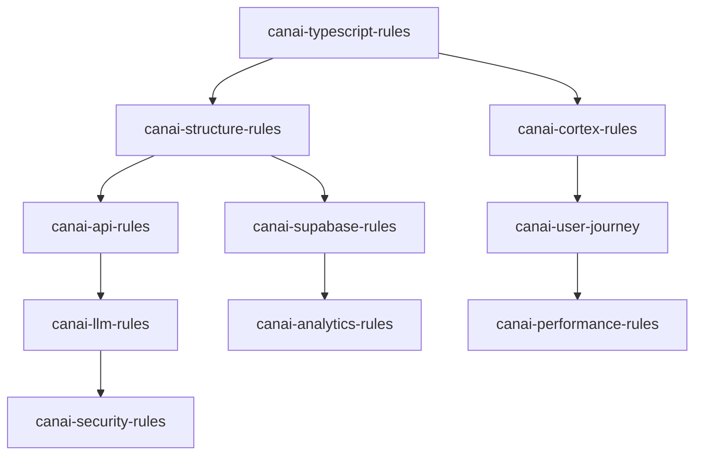

# CanAI Cursor Rules - Complete Development Framework

This directory contains the **comprehensive development framework** for the **CanAI Emotional Sovereignty Platform**, designed to ensure consistent, PRD-aligned development across the complete 9-stage user journey (F1-F9) with optimal Cursor AI performance.

## 🎯 Framework Overview

The CanAI Cursor Rules represent a **holistic development ecosystem** that transforms complex emotional AI requirements into actionable, type-safe, performant code. Each rule file is interconnected and optimized for Cursor AI's contextual understanding, ensuring every generated line of code aligns with business objectives, technical standards, and user experience goals.

### Core Philosophy
- **Emotional Sovereignty First**: Every rule prioritizes user emotional well-being and trust-building
- **PRD-Driven Development**: All implementations must align with specific PRD sections and success metrics
- **Performance by Design**: <2s response times, 99.9% uptime, and scalability targets built into every rule
- **Type Safety Excellence**: Comprehensive TypeScript coverage with strict mode enforcement
- **Contextual Consistency**: Cortex-based memory management ensures Cursor AI maintains project context

## 📋 Complete Rules Catalog

### 🏗️ **Foundation Rules** (Implement First)

#### 1. **canai-typescript-rules.mdc** - Type Safety Foundation
- **Purpose**: Establishes strict TypeScript standards for type-safe emotional AI development
- **Key Features**: 
  - Strict mode enforcement (`exactOptionalPropertyTypes`, `noUncheckedIndexedAccess`)
  - CanAI-specific type definitions (`JourneyStage`, `EmotionalResonance`, `TrustDeltaScore`)
  - Performance-optimized React Server Components (RSC) for <2s targets
  - AI service integration types with error handling patterns
- **Critical For**: All development work - provides type safety foundation
- **Cursor Optimization**: Enables intelligent code completion and error prevention
- **File Impact**: `frontend/src/types/`, `backend/types/`, all `.ts/.tsx` files

#### 2. **canai-structure-rules.mdc** - Project Architecture
- **Purpose**: Defines consistent file organization and architectural patterns
- **Key Features**:
  - 9-stage journey organization (`frontend/src/pages/F1-F9/`)
  - Domain-driven backend structure (`backend/routes/`, `backend/services/`)
  - Component naming conventions and file size limits
  - Import/export patterns and dependency management
- **Critical For**: Maintaining scalable, navigable codebase
- **Cursor Optimization**: Enables accurate file path suggestions and component discovery
- **File Impact**: All project files, directory structure, import statements

#### 3. **canai-cortex-rules.mdc** - Project Memory Management
- **Purpose**: Centralizes milestone tracking and contextual consistency for Cursor AI
- **Key Features**:
  - Structured milestone format with PRD alignment
  - 9-stage journey progress tracking
  - TaskMaster integration for complete traceability
  - Business impact measurement and validation
- **Critical For**: Cursor AI context retention and consistent development direction
- **Cursor Optimization**: Provides comprehensive project state for intelligent suggestions
- **File Impact**: `.cursor/rules/cortex.md`, all development decisions

### 🚀 **Core Development Rules** (Implement Second)

#### 4. **canai-api-rules.mdc** - Backend API Standards
- **Purpose**: Defines 25+ REST API endpoints with developer-friendly, emotionally intelligent responses
- **Key Features**:
  - Complete F1-F9 journey API coverage
  - Performance targets (<200ms critical, <2s generation)
  - Stripe integration, Memberstack authentication
  - Empathetic error messages and idempotency patterns
- **Critical For**: Backend development, API contract compliance
- **Cursor Optimization**: Provides complete API specifications for accurate implementation
- **File Impact**: `backend/routes/`, `backend/middleware/`, `backend/services/`

#### 5. **canai-supabase-rules.mdc** - Database Integration
- **Purpose**: Governs type-safe Supabase integration with Row-Level Security (RLS)
- **Key Features**:
  - RLS policies for user data protection
  - Performance-optimized queries and indexing
  - Real-time subscriptions for user journey tracking
  - Migration patterns and schema evolution
- **Critical For**: Database operations, data security, performance
- **Cursor Optimization**: Enables accurate database query generation
- **File Impact**: `databases/`, `backend/services/supabase.js`, migration files

#### 6. **canai-user-journey.mdc** - 9-Stage Journey Implementation
- **Purpose**: Defines comprehensive user experience across F1-F9 stages
- **Key Features**:
  - Stage-specific requirements and success metrics
  - Emotional resonance tracking throughout journey
  - Conversion optimization and trust-building patterns
  - User state management and progress persistence
- **Critical For**: Frontend development, user experience optimization
- **Cursor Optimization**: Provides complete journey context for component development
- **File Impact**: `frontend/src/pages/`, `frontend/src/components/`, user flow logic

### 🔧 **Integration & Service Rules** (Implement Third)

#### 7. **canai-llm-rules.mdc** - AI Service Integration
- **Purpose**: Governs GPT-4o and Hume AI integration for emotional resonance
- **Key Features**:
  - Multi-provider LLM architecture
  - Emotional resonance validation (>0.7 threshold)
  - Circuit breaker patterns and fallback strategies
  - Token optimization and cost management
- **Critical For**: AI service reliability, emotional intelligence features
- **Cursor Optimization**: Provides AI integration patterns and best practices
- **File Impact**: `backend/services/gpt4o.js`, `backend/services/hume.js`

#### 8. **canai-llm-prompting.mdc** - Prompt Engineering Standards
- **Purpose**: Defines consistent, effective prompt templates for AI services
- **Key Features**:
  - Structured prompt templates for each journey stage
  - Emotional context injection patterns
  - Quality validation and consistency checks
  - Performance optimization for token efficiency
- **Critical For**: AI output quality, emotional resonance achievement
- **Cursor Optimization**: Provides prompt templates for consistent AI interactions
- **File Impact**: `backend/prompts/`, AI service integration code

#### 9. **canai-make-automation.mdc** - Workflow Automation
- **Purpose**: Integrates Make.com scenarios for business process automation
- **Key Features**:
  - Webhook handling for project creation and user onboarding
  - Automated email sequences and support escalation
  - HMAC validation and security patterns
  - Error handling and retry logic
- **Critical For**: Business process automation, user communication
- **Cursor Optimization**: Provides automation patterns and webhook implementations
- **File Impact**: `backend/webhooks/make_scenarios/`, automation workflows

#### 10. **canai-memberstack-sync.mdc** - Authentication Integration
- **Purpose**: Manages user authentication and profile synchronization
- **Key Features**:
  - JWT validation and user session management
  - Profile synchronization between Memberstack and Supabase
  - Role-based access control (RBAC) implementation
  - User lifecycle management
- **Critical For**: User authentication, data security, access control
- **Cursor Optimization**: Provides authentication patterns and user management
- **File Impact**: `backend/middleware/auth.js`, user management logic

### 📊 **Analytics & Monitoring Rules** (Implement Fourth)

#### 11. **canai-analytics-rules.mdc** - Comprehensive Event Tracking
- **Purpose**: Implements privacy-compliant analytics with actionable insights
- **Key Features**:
  - Complete F1-F9 journey event tracking
  - TrustDelta and emotional resonance monitoring
  - PostHog integration with PII protection
  - Real-time success metric dashboards
- **Critical For**: Business intelligence, user behavior analysis, optimization
- **Cursor Optimization**: Provides complete event taxonomy and tracking patterns
- **File Impact**: `backend/services/posthog.js`, analytics middleware

#### 12. **canai-observability-rules.mdc** - System Monitoring
- **Purpose**: Ensures comprehensive system health and performance monitoring
- **Key Features**:
  - Sentry error tracking and performance monitoring
  - Real-time alerting for system issues
  - Health check endpoints and uptime monitoring
  - Performance metrics and SLA tracking
- **Critical For**: System reliability, performance optimization, incident response
- **Cursor Optimization**: Provides monitoring patterns and health check implementations
- **File Impact**: `backend/services/sentry.js`, monitoring middleware

#### 13. **canai-performance-rules.mdc** - Performance Optimization
- **Purpose**: Ensures <2s response times and 99.9% uptime across all services
- **Key Features**:
  - Caching strategies and performance budgets
  - Load testing with 10k concurrent users
  - Database optimization and query performance
  - Frontend optimization and asset management
- **Critical For**: User experience, system scalability, cost optimization
- **Cursor Optimization**: Provides performance patterns and optimization techniques
- **File Impact**: `backend/services/cache.js`, performance middleware

### 🔒 **Security & Compliance Rules** (Implement Fifth)

#### 14. **canai-security-rules.mdc** - Comprehensive Security Standards
- **Purpose**: Implements OWASP-compliant security with threat mitigation
- **Key Features**:
  - Input sanitization and validation patterns
  - Rate limiting and DDoS protection
  - Secure authentication and authorization
  - Vulnerability scanning and incident response
- **Critical For**: Data protection, regulatory compliance, risk mitigation
- **Cursor Optimization**: Provides security patterns and best practices
- **File Impact**: `backend/middleware/security.js`, validation logic

#### 15. **canai-data-lifecycle-rules.mdc** - Data Privacy & Compliance
- **Purpose**: Manages complete data lifecycle with GDPR/CCPA compliance
- **Key Features**:
  - 24-month retention with automated purging
  - Consent management and user rights implementation
  - Data anonymization and encryption patterns
  - Cross-border data transfer compliance
- **Critical For**: Legal compliance, user privacy, data governance
- **Cursor Optimization**: Provides data handling patterns and compliance workflows
- **File Impact**: `databases/cron/purge.sql`, privacy middleware

### 🧪 **Quality Assurance Rules** (Implement Sixth)

#### 16. **canai-testing-rules.mdc** - Comprehensive Testing Strategy
- **Purpose**: Ensures >80% test coverage with PRD-aligned validation
- **Key Features**:
  - Unit, integration, and end-to-end testing patterns
  - Accessibility testing with WCAG 2.2 AA compliance
  - Load testing and performance validation
  - AI model testing and emotional resonance validation
- **Critical For**: Code quality, bug prevention, user experience validation
- **Cursor Optimization**: Provides testing patterns and validation frameworks
- **File Impact**: `backend/tests/`, `frontend/tests/`, CI/CD pipelines

#### 17. **canai-error-handling-rules.mdc** - Robust Error Management
- **Purpose**: Implements empathetic error handling with graceful degradation
- **Key Features**:
  - Empathetic error messages per PRD Table 17
  - Circuit breaker patterns for external services
  - Graceful degradation and fallback strategies
  - Comprehensive error logging and recovery
- **Critical For**: User experience, system reliability, debugging
- **Cursor Optimization**: Provides error handling patterns and recovery strategies
- **File Impact**: `backend/middleware/error.js`, error handling logic

### 🚀 **Deployment & Operations Rules** (Implement Seventh)

#### 18. **canai-ci-cd-rules.mdc** - Deployment Pipeline
- **Purpose**: Defines secure, efficient deployments with <15min cycles
- **Key Features**:
  - GitHub Actions workflows with quality gates
  - Automated testing and security scanning
  - Environment promotion and rollback strategies
  - Performance validation and monitoring
- **Critical For**: Deployment reliability, development velocity, quality assurance
- **Cursor Optimization**: Provides CI/CD patterns and deployment workflows
- **File Impact**: `.github/workflows/`, deployment scripts

#### 19. **canai-github-rules.mdc** - Version Control Standards
- **Purpose**: Establishes consistent Git workflows and code review processes
- **Key Features**:
  - Branching strategies and commit conventions
  - Pull request templates and review requirements
  - Issue tracking and project management
  - Release management and versioning
- **Critical For**: Code quality, collaboration, project management
- **Cursor Optimization**: Provides Git workflow patterns and best practices
- **File Impact**: `.github/`, commit messages, PR workflows

### 🎛️ **Advanced Features Rules** (Implement Eighth)

#### 20. **canai-feature-flags-rules.mdc** - Feature Management
- **Purpose**: Enables safe feature rollouts with A/B testing capabilities
- **Key Features**:
  - Feature flag implementation and management
  - A/B testing for conversion optimization
  - Gradual rollout strategies and rollback capabilities
  - User segmentation and targeting
- **Critical For**: Feature experimentation, risk mitigation, user experience optimization
- **Cursor Optimization**: Provides feature flag patterns and testing frameworks
- **File Impact**: Feature flag middleware, A/B testing logic

#### 21. **canai-taskmaster-rules.mdc** - Task Management Integration
- **Purpose**: Integrates development tasks with project management systems
- **Key Features**:
  - Task breakdown and dependency tracking
  - Progress monitoring and milestone validation
  - Resource allocation and timeline management
  - Stakeholder communication and reporting
- **Critical For**: Project coordination, progress tracking, resource management
- **Cursor Optimization**: Provides task management patterns and integration workflows
- **File Impact**: Task tracking systems, project management integration

#### 22. **canai-docs-rules.mdc** - Documentation Standards
- **Purpose**: Ensures comprehensive, maintainable documentation
- **Key Features**:
  - API documentation with OpenAPI/Swagger
  - Component documentation and usage examples
  - Architecture decision records (ADRs)
  - User guides and developer onboarding
- **Critical For**: Developer productivity, knowledge sharing, maintainability
- **Cursor Optimization**: Provides documentation patterns and templates
- **File Impact**: `docs/`, API documentation, README files

## 🔄 Rule Interdependencies & Relationships

### Primary Dependencies

### Secondary Dependencies
- **Analytics** ↔ **Performance**: Shared monitoring and optimization
- **Security** ↔ **Data Lifecycle**: Compliance and privacy integration
- **Testing** ↔ **CI/CD**: Quality assurance and deployment validation
- **Error Handling** ↔ **Observability**: Incident response and monitoring

## 🎯 Implementation Strategy

### Phase 1: Foundation (Week 1)
1. **canai-typescript-rules.mdc** - Type safety foundation
2. **canai-structure-rules.mdc** - Project architecture
3. **canai-cortex-rules.mdc** - Context management
4. **canai-security-rules.mdc** - Security baseline

### Phase 2: Core Development (Week 2-3)
1. **canai-api-rules.mdc** - Backend API implementation
2. **canai-supabase-rules.mdc** - Database integration
3. **canai-user-journey.mdc** - Frontend journey implementation
4. **canai-llm-rules.mdc** - AI service integration

### Phase 3: Integration & Quality (Week 4-5)
1. **canai-analytics-rules.mdc** - Event tracking
2. **canai-performance-rules.mdc** - Optimization
3. **canai-testing-rules.mdc** - Quality assurance
4. **canai-error-handling-rules.mdc** - Robust error management

### Phase 4: Operations & Advanced Features (Week 6+)
1. **canai-ci-cd-rules.mdc** - Deployment pipeline
2. **canai-observability-rules.mdc** - Monitoring
3. **canai-feature-flags-rules.mdc** - Feature management
4. **canai-docs-rules.mdc** - Documentation

## 🎛️ Cursor AI Optimization Features

### Context Injection Patterns
Each rule file includes specific patterns for Cursor AI optimization:
- **Explicit File Paths**: Direct references to implementation files
- **Code Examples**: Complete, runnable code snippets
- **Type Definitions**: Comprehensive TypeScript interfaces
- **Validation Patterns**: Automated testing and quality checks

### Intelligent Code Generation
- **Template Patterns**: Reusable code templates for common patterns
- **Error Prevention**: Type-safe patterns that prevent common mistakes
- **Performance Optimization**: Built-in performance considerations
- **Business Logic Integration**: Automatic PRD alignment validation

### Contextual Consistency
- **Cortex Integration**: Centralized project memory management
- **Cross-Rule Validation**: Consistency checks across all rules
- **Milestone Tracking**: Progress validation against business objectives
- **Dependency Management**: Automatic dependency resolution

## 📊 Success Metrics & Validation

### Technical Metrics
- **Type Safety**: 100% TypeScript strict mode compliance
- **Performance**: <2s response times, 99.9% uptime
- **Test Coverage**: >80% across all components
- **Security**: Zero critical vulnerabilities

### Business Metrics
- **TrustDelta**: ≥4.2 average score
- **Emotional Resonance**: >0.7 threshold achievement
- **User Satisfaction**: >70% positive feedback
- **Conversion Rates**: >90% checkout completion

### Development Metrics
- **Code Quality**: Consistent architecture and patterns
- **Development Velocity**: Faster feature delivery
- **Bug Reduction**: Fewer production issues
- **Developer Experience**: Improved onboarding and productivity

## 🔧 Usage Guidelines

### For Cursor AI Development
1. **Always Reference Cortex**: Check `.cursor/rules/cortex.md` for current project state
2. **Follow Type Patterns**: Use established TypeScript patterns from rules
3. **Validate Against PRD**: Ensure all implementations align with PRD requirements
4. **Track Milestones**: Update cortex.md for significant changes
5. **Test Comprehensively**: Follow testing rules for quality assurance

### For Team Development
1. **Rule Prioritization**: Implement foundation rules first
2. **Cross-Rule Validation**: Check consistency across related rules
3. **Performance Monitoring**: Continuously validate against performance targets
4. **Security Compliance**: Regular security audits and vulnerability assessments
5. **Documentation Updates**: Keep rules updated with project evolution

### For Project Management
1. **Milestone Tracking**: Use cortex rules for progress validation
2. **Resource Planning**: Reference implementation phases for scheduling
3. **Risk Management**: Follow security and error handling rules
4. **Quality Assurance**: Implement comprehensive testing strategies

## 🔄 Maintenance & Evolution

### Regular Updates
- **Monthly Reviews**: Rule effectiveness and PRD alignment
- **Quarterly Audits**: Comprehensive coverage analysis
- **Version Control**: Semantic versioning for rule changes
- **Impact Assessment**: Business and technical impact evaluation

### Continuous Improvement
- **Performance Optimization**: Regular performance tuning
- **Security Updates**: Ongoing security enhancements
- **Feature Evolution**: New feature integration patterns
- **Developer Feedback**: Team input for rule improvements

## 📚 Quick Reference

### Critical Files
- **Primary Context**: `.cursor/rules/cortex.md`
- **Type Definitions**: `frontend/src/types/`, `backend/types/`
- **API Implementation**: `backend/routes/`, `backend/services/`
- **User Journey**: `frontend/src/pages/F1-F9/`
- **Testing**: `backend/tests/`, `frontend/tests/`

### Key Commands
- **Type Check**: `npm run type-check`
- **Test Suite**: `npm run test`
- **Performance**: `npm run test:performance`
- **Security**: `npm run test:security`
- **Build**: `npm run build`

### Essential Patterns
- **Error Handling**: Always use try/catch with empathetic messages
- **Type Safety**: Strict TypeScript with runtime validation
- **Performance**: <2s targets with caching and optimization
- **Security**: Input sanitization and authentication
- **Testing**: >80% coverage with comprehensive validation

## 🚨 Critical Success Factors

### Rule Performance Optimization
To achieve maximum Cursor AI performance, ensure these critical factors are implemented:

1. **Context Loading Priority**
   - Always load `canai-cortex-rules.mdc` first for project state
   - Reference `canai-typescript-rules.mdc` for type safety patterns
   - Check `canai-user-journey.mdc` for stage-specific requirements
   - Validate against `canai-performance-rules.mdc` for targets

2. **Cross-Rule Consistency Validation**
   - Verify API endpoints align between `canai-api-rules.mdc` and `canai-user-journey.mdc`
   - Ensure security patterns from `canai-security-rules.mdc` are applied in all service rules
   - Validate analytics events from `canai-analytics-rules.mdc` match user journey stages
   - Confirm testing patterns from `canai-testing-rules.mdc` cover all critical paths

3. **Performance Target Enforcement**
   - <2s response times for all AI generation endpoints
   - <200ms for critical API endpoints (auth, validation, auto-save)
   - >80% test coverage across all components
   - 99.9% uptime with automated monitoring and alerting

### Rule Implementation Checklist

#### Before Starting Development
- [ ] Read `.cursor/rules/cortex.md` for current project state
- [ ] Identify which journey stage (F1-F9) you're implementing
- [ ] Reference relevant rule files for your development area
- [ ] Confirm PRD section alignment and success metrics
- [ ] Validate dependencies and integration requirements

#### During Development
- [ ] Follow TypeScript strict mode patterns
- [ ] Implement security validation for all inputs
- [ ] Add comprehensive error handling with empathetic messages
- [ ] Include performance monitoring and analytics tracking
- [ ] Write tests that align with PRD success criteria

#### After Development
- [ ] Update `.cursor/rules/cortex.md` with milestone progress
- [ ] Validate against all relevant rule files
- [ ] Run comprehensive test suite (>80% coverage)
- [ ] Perform security scan and vulnerability assessment
- [ ] Monitor performance metrics and user journey completion

## 🎯 Rule-Specific Optimization Tips

### For TypeScript Development
- Use `canai-typescript-rules.mdc` type definitions exactly as specified
- Enable all strict mode options for maximum type safety
- Implement runtime validation with Zod for AI service responses
- Use discriminated unions for error handling patterns

### For API Development
- Reference `canai-api-rules.mdc` for complete endpoint specifications
- Implement idempotency patterns for all POST/PATCH endpoints
- Use empathetic error messages from PRD Table 17
- Validate performance targets: <200ms critical, <2s generation

### For User Journey Implementation
- Follow `canai-user-journey.mdc` stage-specific requirements exactly
- Track emotional resonance at each stage (>0.7 threshold)
- Implement proper state management and progress persistence
- Validate conversion metrics against PRD success criteria

### For AI Service Integration
- Use `canai-llm-rules.mdc` patterns for GPT-4o and Hume AI
- Implement circuit breaker patterns for service reliability
- Track token usage and optimize for cost efficiency
- Validate emotional resonance and TrustDelta calculations

## 🔍 Troubleshooting Common Issues

### Context Loss Issues
**Problem**: Cursor AI loses project context or suggests inconsistent patterns
**Solution**: 
1. Always reference `.cursor/rules/cortex.md` first
2. Explicitly mention which rule files are relevant to your task
3. Include PRD section references in your prompts
4. Validate against existing milestones before proceeding

### Performance Issues
**Problem**: Generated code doesn't meet performance targets
**Solution**:
1. Reference `canai-performance-rules.mdc` for optimization patterns
2. Implement caching strategies from the performance rules
3. Use React Server Components (RSC) for <2s page loads
4. Apply database optimization patterns from Supabase rules

### Security Vulnerabilities
**Problem**: Code doesn't follow security best practices
**Solution**:
1. Always apply `canai-security-rules.mdc` patterns
2. Use input sanitization with DOMPurify + Zod validation
3. Implement proper authentication with Memberstack JWT
4. Apply RLS policies for all database operations

### Test Coverage Issues
**Problem**: Tests don't align with PRD requirements or coverage is low
**Solution**:
1. Follow `canai-testing-rules.mdc` patterns exactly
2. Use PRD section references as test IDs
3. Implement accessibility testing with axe-core
4. Include emotional resonance validation in AI tests

## 📈 Measuring Rule Effectiveness

### Development Velocity Metrics
- **Code Generation Speed**: Time from task to working implementation
- **Bug Reduction**: Fewer production issues due to type safety and testing
- **Context Retention**: Consistent patterns across development sessions
- **PRD Alignment**: Automatic validation against business requirements

### Code Quality Metrics
- **Type Safety**: 100% TypeScript strict mode compliance
- **Test Coverage**: >80% across all components and user journey stages
- **Performance**: Meeting all response time and uptime targets
- **Security**: Zero critical vulnerabilities in security scans

### Business Impact Metrics
- **TrustDelta Achievement**: ≥4.2 average scores across all comparisons
- **Emotional Resonance**: >0.7 threshold achievement rate
- **User Journey Completion**: >90% completion rates for F1-F9 stages
- **Conversion Optimization**: Meeting all PRD success criteria

## 🎓 Advanced Usage Patterns

### Multi-Rule Integration
When implementing complex features that span multiple rules:
1. Start with `canai-cortex-rules.mdc` for context and milestones
2. Reference `canai-user-journey.mdc` for stage requirements
3. Apply `canai-api-rules.mdc` for backend implementation
4. Use `canai-typescript-rules.mdc` for type safety
5. Implement `canai-analytics-rules.mdc` for tracking
6. Validate with `canai-testing-rules.mdc` patterns

### Rule Customization
While rules are designed to be comprehensive, you can:
- Add project-specific patterns that align with rule principles
- Extend type definitions while maintaining strict mode compliance
- Implement additional monitoring that enhances existing patterns
- Create custom validation that builds on rule foundations

### Rule Evolution
As the project evolves, rules should be updated to:
- Incorporate new PRD requirements and success metrics
- Add patterns for new technology integrations
- Enhance performance optimization techniques
- Improve security and compliance standards

---

**Version**: 2.1.0 - Enhanced Context & Optimization Guide
**Last Updated**: December 17, 2024, 6:30 PM MDT
**Total Rules**: 22 comprehensive development rules
**Coverage**: Complete 9-stage user journey (F1-F9) with full-stack implementation
**Optimization**: Maximum Cursor AI performance with context-rich guidance and troubleshooting
