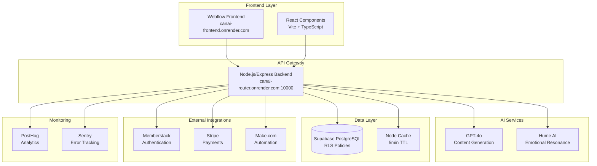

# CanAI Emotional Sovereignty Platform

## GPT-4o Token Counting & Cost Tracking (PRD Section 1.5, Task 5.5)

- **Token Counting:** Uses tiktoken to count tokens for GPT-4o inputs, supporting up to 128K tokens per request.
- **Cost Tracking:** Calculates cost at $5 per 1M tokens, logs usage and cost to `prompt_logs` (fields: user_id, token_usage, cost, prompt_version).
- **Chunking:** Automatically splits inputs >128K tokens using MapReduce, prioritizing `businessDescription`.
- **High Cost Alerts:** Logs to `support_requests` and PostHog if daily cost exceeds $50.
- **PostHog Events:** Emits `gpt4o_request` and `cost_threshold_exceeded` for observability.
- **Unit Tests:** >80% coverage for token counting, cost calculation, and chunking in `backend/tests/gpt4o.test.js`.

**Usage:**
- See `GPT4Service` in `backend/services/gpt4o.js` for methods: `countTokens`, `calculateCost`, `chunkInput`.
- Fully aligned with PRD Section 1.5 and TaskMaster Task 5.5. No scope creep or non-PRD features included.

<div align="center">


**Empowering Small Businesses Through AI-Driven Emotional Intelligence**

[](https://github.com/canai-platform/canai-platform/actions)
[](./coverage)
[](LICENSE)
[](https://nodejs.org/)
[](https://www.typescriptlang.org/)

[🚀 Live Demo](https://canai-frontend.onrender.com) | [📖 Documentation](./docs) |
[🎯 API Docs](./docs/api-contract-specification.md) |
[🏗️ Architecture](<./docs/technical-architecture-document-(TAD).md>)

</div>

## 🌟 Overview

The **CanAI Emotional Sovereignty Platform** is a revolutionary SaaS solution that empowers small
business owners, solopreneurs, and enterprise clients with AI-driven, emotionally intelligent
business solutions. Through our proprietary 9-stage user journey, we deliver personalized business
plans, social media strategies, and website audits that resonate on both logical and emotional
levels.

### 🎯 Mission Statement

To guide users through a transformative journey of self-discovery, decision-making, and personal
empowerment through AI-assisted emotional intelligence tools, achieving complete autonomy over their
business decisions and growth trajectory.

### ✨ Key Features

- **🧠 Emotional Intelligence AI**: Powered by GPT-4o and Hume AI for emotionally resonant content
- **📊 9-Stage User Journey**: From discovery to deliverable generation and feedback
- **🎨 Three Product Tracks**: Business Plan Builder, Social Media & Email Campaign, Website Audit &
  Feedback
- **🔒 Enterprise-Grade Security**: GDPR/CCPA compliant with Row-Level Security (RLS)
- **⚡ High Performance**: <200ms API responses, <2s deliverable generation
- **📈 Advanced Analytics**: Real-time tracking with PostHog and Sentry monitoring
- **🔄 SparkSplit Technology**: AI-powered comparison system for optimal decision-making

## 🏗️ Architecture Overview

### System Design



### Tech Stack

| Layer          | Technology            | Version     | Purpose                                 |
| -------------- | --------------------- | ----------- | --------------------------------------- |
| **Frontend**   | React + Vite          | 18.0 + 5.0  | User interface and interactions         |
| **Backend**    | Node.js + Express     | 18.0 + 4.18 | API server and business logic           |
| **Database**   | Supabase (PostgreSQL) | 14          | Data storage with RLS                   |
| **AI**         | GPT-4o + Hume AI      | Latest      | Content generation and emotion analysis |
| **Auth**       | Memberstack           | 2.0         | User authentication and management      |
| **Payments**   | Stripe                | v1          | Payment processing                      |
| **Automation** | Make.com              | v3          | Workflow automation                     |
| **Monitoring** | PostHog + Sentry      | v2 + v10    | Analytics and error tracking            |
| **Hosting**    | Render                | Latest      | Cloud hosting and deployment            |

## 🚀 Quick Start

### Prerequisites

- Node.js 18.0 or higher
- npm or yarn package manager
- Git for version control

### Useful Scripts

- `npm run format` — Auto-format all files with Prettier
- `npm run format:diff` — List files with formatting differences
- `cd backend && npm run typecheck` — Type-check backend TypeScript
- `cd frontend && npm run test:unit` — Run frontend unit tests with Vitest
- `cd backend && npm run migrate:test` — Run Supabase test DB migrations

### Installation

1. **Clone the repository**

   ```bash
   git clone https://github.com/canai-platform/canai-platform.git
   cd canai-platform
   ```

2. **Install dependencies**

   ```bash
   npm install
   ```

3. **Set up environment variables**

   ```bash
   cp env.example .env.local
   ```

   Configure the following essential variables:

   ```env
   # Database
   SUPABASE_URL=your-supabase-project-url
   SUPABASE_ANON_KEY=your-supabase-anon-key

   # AI Services
   OPENAI_API_KEY=your-openai-api-key
   HUME_API_KEY=your-hume-api-key

   # Authentication
   MEMBERSTACK_SECRET_KEY=your-memberstack-secret

   # Payments
   STRIPE_SECRET_KEY=your-stripe-secret-key

   # Monitoring
   SENTRY_DSN=your-sentry-dsn
   POSTHOG_API_KEY=your-posthog-api-key
   ```

4. **Run the development environment**

   ```bash
   npm run dev
   ```

5. **Access the application**
   - Frontend: <http://localhost:3000>
   - Backend API: <http://localhost:10000>
   - Health Check: <http://localhost:10000/health>

## 📁 Project Structure

This project follows a **monorepo architecture** with workspaces for maximum efficiency and
maintainability:

```
canai-platform/
├── 🎨 frontend/                    # React frontend application
│   ├── src/
│   │   ├── components/             # Reusable UI components
│   │   │   ├── DiscoveryHook/      # F1: Landing page components
│   │   │   ├── DiscoveryFunnel/    # F2: Quiz and assessment
│   │   │   ├── SparkLayer/         # F3: Engagement amplification
│   │   │   ├── PurchaseFlow/       # F4: Payment processing
│   │   │   ├── DetailedInput/      # F5: Data collection forms
│   │   │   ├── IntentMirror/       # F6: Input validation
│   │   │   ├── DeliverableGen/     # F7: AI content generation
│   │   │   ├── SparkSplit/         # F8: Comparison analysis
│   │   │   └── FeedbackCapture/    # F9: User feedback
│   │   ├── services/               # API integration services
│   │   └── utils/                  # Utility functions
│   └── public/                     # Static assets
│
├── 🔧 backend/                     # Node.js/Express backend
│   ├── api/                        # Domain-driven API architecture
│   ├── routes/                     # API endpoint definitions
│   ├── services/                   # Business logic services
│   ├── middleware/                 # Express middleware
│   ├── prompts/                    # GPT-4o prompt templates
│   ├── webhooks/                   # Make.com webhook handlers
│   ├── tests/                      # Comprehensive test suites
│   └── config/                     # Configuration files
│
├── 🗄️ databases/                   # Database schemas and migrations
│   ├── migrations/                 # Supabase schema migrations
│   ├── seed/                       # Test and initial data
│   └── cron/                       # Automated maintenance jobs
│
├── 📚 docs/                        # Comprehensive documentation
│   ├── api/                        # API documentation
│   ├── development/                # Development guides
│   ├── deployment/                 # Deployment procedures
│   └── *.md                        # Core documentation files
│
├── 🔧 .cursor/                     # Cursor IDE configuration
│   └── rules/                      # 20+ development rules
│
├── 🚀 .github/                     # GitHub Actions workflows
│   ├── workflows/                  # 16+ automated workflows
│   └── templates/                  # Issue and PR templates
│
└── 📦 packages/                    # Shared packages and utilities
```

## 🎭 The 9-Stage User Journey

Our platform guides users through a carefully crafted emotional and logical journey:

| Stage  | Name                      | Purpose                           | Key Features                            |
| ------ | ------------------------- | --------------------------------- | --------------------------------------- |
| **F1** | Discovery Hook            | Capture attention and build trust | Trust indicators, compelling CTAs       |
| **F2** | 2-Step Discovery Funnel   | Understand user needs             | Interactive quiz, emotional validation  |
| **F3** | Spark Layer               | Amplify engagement                | AI-generated sparks, selection tracking |
| **F4** | Purchase Flow             | Convert interest to commitment    | Stripe integration, transparent pricing |
| **F5** | Detailed Input Collection | Gather comprehensive data         | 12-field forms, auto-save, tooltips     |
| **F6** | Intent Mirror             | Validate understanding            | AI-powered summary, confirmation        |
| **F7** | Deliverable Generation    | Create personalized content       | GPT-4o + Hume AI, 700-800 word outputs  |
| **F8** | SparkSplit                | Prove superiority                 | CanAI vs generic comparison             |
| **F9** | Feedback Capture          | Complete the loop                 | Ratings, social sharing, referrals      |

### Performance Targets

- **Completion Rate**: >90% for F1-F2 funnel
- **Trust Delta**: ≥4.2/5.0 across all outputs
- **Emotional Resonance**: >0.7 (Hume AI validation)
- **CanAI Preference**: >65% in SparkSplit comparisons
- **Response Times**: <200ms API, <2s generation

## 🎨 Product Tracks

### 1. Business Plan Builder

**Target**: Early-stage founders seeking investor-ready business plans

- **Output**: 700-800 word comprehensive business plans
- **Key Features**: Financial projections, market analysis, growth strategies
- **Success Metric**: Plans used to secure $75,000+ funding

### 2. Social Media & Email Campaign

**Target**: Solopreneurs and small business owners

- **Output**: Platform-specific content strategies
- **Key Features**: Content calendars, engagement tactics, email sequences
- **Success Metric**: 25% increase in social engagement

### 3. Website Audit & Feedback

**Target**: Businesses with existing web presence

- **Output**: Comprehensive website analysis and recommendations
- **Key Features**: UX/UI analysis, conversion optimization, SEO insights
- **Success Metric**: 30% improvement in conversion rates

## 🔐 Security & Compliance

### Data Protection

- **GDPR/CCPA Compliance**: Full user consent management and data portability
- **Row-Level Security (RLS)**: Supabase policies ensure data isolation
- **Data Retention**: 24-month automatic purging with anonymization
- **Encryption**: End-to-end encryption for all sensitive data

### Authentication & Authorization

- **Memberstack Integration**: Secure JWT-based authentication
- **Role-Based Access**: User, Admin, and System-level permissions
- **Rate Limiting**: 100 requests/minute per IP with exponential backoff
- **API Security**: CORS policies, input validation, and sanitization

### Monitoring & Observability

- **Error Tracking**: Sentry integration with <100ms error responses
- **Performance Monitoring**: Real-time API response time tracking
- **Security Scanning**: Automated OWASP ZAP and Semgrep analysis
- **Uptime Target**: 99.9% availability with automated failover

## 🧪 Testing Strategy

### Test Coverage

- **Unit Tests**: >80% coverage requirement
- **Integration Tests**: API and database integration validation
- **End-to-End Tests**: Complete user journey simulation
- **Performance Tests**: Load testing for 10,000 concurrent users
- **Security Tests**: Automated vulnerability scanning

### Quality Assurance

```bash
# Run all tests
npm run test

# Run specific test suites
npm run test:backend
npm run test:frontend
npm run test:e2e

# Quality validation
npm run canai:validate
```

## 🚀 Deployment

### Production Environment

- **Primary Hosting**: Render (canai-router.onrender.com)
- **Fallback**: Heroku automatic failover
- **Auto-scaling**: 2-10 instances based on load
- **Health Checks**: Continuous monitoring with 5-minute intervals

### CI/CD Pipeline

Our comprehensive GitHub Actions pipeline includes:

- **Build & Test**: Automated testing and quality checks
- **Security Scanning**: OWASP ZAP and dependency auditing
- **Performance Testing**: Load testing and optimization
- **Deployment**: Blue-green deployment with rollback capability
- **Monitoring**: Post-deployment health validation

### Environment Management

```bash
# Deploy to staging
npm run deploy:staging

# Deploy to production
npm run deploy:production

# Health check
npm run health:check
```

## 📊 Analytics & Monitoring

### Key Performance Indicators (KPIs)

- **User Acquisition**: Funnel completion rates, source attribution
- **Engagement**: Session duration, feature usage, return visits
- **Conversion**: Payment success rates, upgrade patterns
- **Trust Metrics**: TrustDelta scores, emotional resonance ratings
- **Technical**: API response times, error rates, uptime

### Monitoring Stack

- **PostHog**: Product analytics and user behavior tracking
- **Sentry**: Error monitoring and performance insights
- **Custom Dashboards**: Real-time business metrics visualization
- **Alerting**: Automated notifications for critical issues

## 🤖 AI Integration

### GPT-4o Implementation

- **Content Generation**: Business plans, social media content, website audits
- **Token Management**: 128K token limit with MapReduce chunking
- **Cost Optimization**: $5/1M tokens with intelligent caching
- **Quality Assurance**: Automated output validation and scoring

### Hume AI Emotional Intelligence

- **Emotional Resonance**: Real-time sentiment and emotion analysis
- **Circuit Breaker**: Automatic fallback at 900+ requests/day
- **Performance**: <500ms response time target
- **Validation**: Arousal >0.5, Valence >0.6 thresholds

## 🔄 TaskMaster Integration

Our development process is enhanced by TaskMaster-compatible task breakdown:

- **Automated Task Generation**: AI-driven development task creation
- **Progress Tracking**: Real-time development milestone monitoring
- **Quality Gates**: Automated validation of task completion
- **Dependency Management**: Intelligent task sequencing and conflict resolution

## 🤝 Contributing

We welcome contributions to the CanAI platform! Please follow our development guidelines:

### Development Workflow

1. **Fork** the repository
2. **Create** a feature branch (`git checkout -b feature/amazing-feature`)
3. **Follow** our coding standards (see [Coding Standards](./docs/coding-standards-style-guide.md))
4. **Test** your changes (`npm run canai:validate`)
5. **Commit** with conventional commits (`git commit -m 'feat: add amazing feature'`)
6. **Push** to your branch (`git push origin feature/amazing-feature`)
7. **Create** a Pull Request

### Code Quality Standards

- **TypeScript**: Strict mode enabled with comprehensive type safety
- **ESLint**: Airbnb configuration with custom CanAI rules
- **Prettier**: Consistent code formatting
- **Testing**: Minimum 80% coverage requirement
- **Documentation**: Comprehensive inline and external documentation

## 📚 Documentation

### Core Documentation

- [📋 Product Requirements Document (PRD)](./PRD.md) - Complete platform requirements
- [🏗️ Technical Architecture Document](<./docs/technical-architecture-document-(TAD).md>) - System
  design and architecture
- [🔌 API Contract Specification](./docs/api-contract-specification.md) - Complete API documentation
- [🗄️ Data Model & Schema](./docs/data-model-schema.md) - Database design and relationships
- [🧪 Test Case Specification](./docs/test-case-specification.md) - Testing strategy and cases
- [🚀 Deployment Operations Playbook](./docs/deployment-operations-playbook.md) - Deployment and
  operations

### Development Resources

- [📝 Coding Standards](./docs/coding-standards-style-guide.md) - Code conventions and style guide
- [🎯 Prompt Engineering Templates](./docs/prompt-engineering-templates.md) - AI prompt optimization
- [⚠️ Risk & Assumption Log](./docs/risk-assumption-log.md) - Project risks and mitigations
- [🔄 Change Management Matrix](./docs/change-management-versioning-matrix.md) - Version control and
  updates

### Additional Resources

- [📖 Project Structure Mapping](./docs/project-structure-mapping.md) - Detailed folder organization
- [📚 Glossary](./docs/glossary.md) - Platform terminology and definitions
- [🎛️ Cursor Rules](./cursor/rules/) - 20+ development automation rules

## 🌟 Success Stories

### Real-World Impact

- **Sprinkle Haven Bakery**: Secured $75,000 funding using CanAI-generated business plan
- **Serenity Yoga Studio**: Achieved 40% increase in social media engagement
- **TechTrend Innovations**: Improved website conversion rate by 35%

### Platform Metrics

- **Trust Delta**: Consistently achieving 4.2+/5.0 ratings
- **User Satisfaction**: 92% positive feedback scores
- **Business Impact**: $2.3M+ in funding secured by users
- **Platform Growth**: 10,000+ active users across 50+ countries

## 🔮 Roadmap

### Phase 1: Foundation (Current)

- ✅ Core 9-stage user journey implementation
- ✅ Three primary product tracks
- ✅ AI integration (GPT-4o + Hume AI)
- ✅ Production deployment infrastructure

### Phase 2: Enhancement (Q2 2024)

- 🔄 Advanced personalization algorithms
- 🔄 Multi-language support
- 🔄 Mobile application development
- 🔄 Enterprise features and APIs

### Phase 3: Expansion (Q3-Q4 2024)

- 📋 Additional product tracks
- 📋 White-label solutions
- 📋 Advanced analytics dashboard
- 📋 AI model fine-tuning

## 📞 Support & Community

### Getting Help

- **Documentation**: Start with our comprehensive [docs](./docs) folder
- **GitHub Issues**: Report bugs and request features
- **Community**: Join our developer community discussions
- **Enterprise Support**: Contact our team for enterprise solutions

### Contact Information

- **Email**: <support@canai-platform.com>
- **Website**: [https://canai-platform.com](https://canai-platform.com)
- **Status Page**: [https://status.canai-platform.com](https://status.canai-platform.com)

## 📄 License

This project is licensed under the MIT License - see the [LICENSE](LICENSE) file for details.

## 🙏 Acknowledgments

Special thanks to:

- **OpenAI** for GPT-4o integration capabilities
- **Hume AI** for emotional intelligence technology
- **Supabase** for robust database infrastructure
- **Render** for reliable hosting services
- **The Open Source Community** for the amazing tools and libraries

---

<div align="center">

**Built with ❤️ by the CanAI Team**

[🌟 Star us on GitHub](https://github.com/canai-platform/canai-platform) |
[🐦 Follow us on Twitter](https://twitter.com/canai_platform) |
[💼 Connect on LinkedIn](https://linkedin.com/company/canai-platform)

</div>

<!-- Trigger CI: Node.js 20 workflow update validation -->
