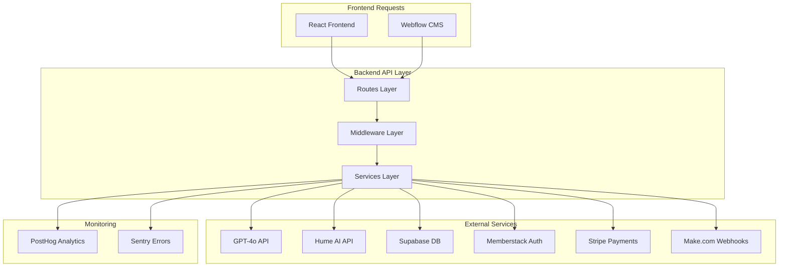

# CanAI Backend - Node.js/Express API Server

<div align="center">

**🔧 Backend Services & API Layer**


</div>

## 🌟 Overview

The CanAI backend is a robust Node.js/Express API server that orchestrates the complete 9-stage user
journey, manages AI integrations, and handles all business logic for the Emotional Sovereignty
Platform. Built with TypeScript and following domain-driven design principles, it provides secure,
scalable, and performant APIs.

### 🎯 Key Responsibilities

- **API Gateway**: Central routing for all frontend requests
- **AI Orchestration**: GPT-4o and Hume AI integration management
- **Data Management**: Supabase database operations with RLS
- **Authentication**: Memberstack JWT validation and user management
- **Payment Processing**: Stripe integration for subscriptions and one-time payments
- **Workflow Automation**: Make.com webhook handling and automation
- **Monitoring**: PostHog analytics and Sentry error tracking

### ⚡ Performance Targets

- **API Response Time**: <200ms for standard endpoints
- **Spark Generation**: <1.5s for 3-spark generation
- **Deliverable Creation**: <2s for 700-800 word outputs
- **Error Response**: <100ms for error handling
- **Uptime**: 99.9% availability with auto-scaling

## 🏗️ Architecture

### Domain-Driven Design Structure

```
backend/
├── 🎯 api/                        # Domain-driven API architecture
│   ├── src/
│   │   ├── App.ts                 # Express application setup
│   │   ├── Server.ts              # Server configuration
│   │   ├── Contexts/              # Business domain contexts
│   │   └── Shared/                # Shared utilities and constants
├── 🛣️ routes/                     # API endpoint definitions (TaskMaster ready)
├── 🔧 services/                   # Business logic services (TaskMaster ready)
├── 🛡️ middleware/                 # Express middleware (TaskMaster ready)
├── 🤖 prompts/                    # GPT-4o prompt templates (TaskMaster ready)
├── 🔗 webhooks/                   # Make.com webhook handlers
├── 📝 templates/                  # Email and notification templates
├── 🗄️ supabase/                   # Supabase client configuration
├── ⚙️ config/                     # Configuration files
├── 🧪 tests/                      # Comprehensive test suites
├── 📦 dist/                       # Compiled TypeScript output
└── 🏥 health.js                   # Health check endpoint
```

### Integration Flow



## 🚀 Quick Start

### Prerequisites

- Node.js 18.0 or higher
- npm or yarn package manager
- Access to environment variables (see `.env.example`)

### Development Setup

1. **Navigate to backend directory**

   ```bash
   cd backend
   ```

2. **Install dependencies**

   ```bash
   npm install
   ```

3. **Set up environment variables**

   ```bash
   cp ../env.example .env.local
   ```

4. **Build TypeScript**

   ```bash
   npm run build
   ```

5. **Start development server**

   ```bash
   npm run dev
   ```

6. **Verify health check**
   ```bash
   curl http://localhost:10000/health
   ```

### Production Deployment

```bash
# Build for production
npm run build:production

# Start production server
npm start

# Health check
npm run health:check
```

## 📁 Directory Structure

### Core API Layer (`/api/`)

Domain-driven architecture with clean separation of concerns:

- **`App.ts`**: Express application configuration and middleware setup
- **`Server.ts`**: Server initialization and port binding
- **`Contexts/`**: Business domain contexts (User, Journey, AI, Payment)
- **`Shared/`**: Common utilities, constants, and bootstrap dependencies

### Route Definitions (`/routes/`) - TaskMaster Ready

API endpoints organized by functional area:

```typescript
// Example route structure
routes/
├── messages.js          # F1: Trust indicators and interactions
├── funnel.js           # F2: Discovery funnel validation
├── sparks.js           # F3: Spark generation and management
├── purchase.js         # F4: Payment flow and Stripe integration
├── inputs.js           # F5: Detailed input collection
├── mirror.js           # F6: Intent mirror validation
├── deliverable.js      # F7: AI content generation
├── comparison.js       # F8: SparkSplit comparison
├── feedback.js         # F9: Feedback capture and sharing
├── admin.js            # Admin endpoints and metrics
└── health.js           # Health check and monitoring
```

### Business Services (`/services/`) - TaskMaster Ready

Core business logic and external integrations:

```typescript
services/
├── gpt4o.js            # GPT-4o integration and prompt management
├── hume.js             # Hume AI emotional intelligence
├── supabase.js         # Database operations and RLS
├── memberstack.js      # Authentication and user management
├── stripe.js           # Payment processing and subscriptions
├── makecom.js          # Webhook handling and automation
├── cache.js            # Node-cache implementation
├── posthog.js          # Analytics tracking
├── sentry.js           # Error monitoring
└── validation.js       # Input validation and sanitization
```

### Middleware Layer (`/middleware/`) - TaskMaster Ready

Express middleware for cross-cutting concerns:

```typescript
middleware/
├── auth.js             # JWT validation and user context
├── rateLimit.js        # Rate limiting (100 req/min/IP)
├── validation.js       # Input validation with Joi schemas
├── error.js            # Error handling and logging
├── retry.js            # Retry logic for external services
├── cors.js             # CORS configuration
└── security.js         # Security headers and sanitization
```

### AI Prompts (`/prompts/`) - TaskMaster Ready

GPT-4o prompt templates for consistent AI outputs:

```typescript
prompts/
├── sparks.js           # Spark generation prompts
├── business_plan.js    # Business plan templates
├── social_media.js     # Social media strategy prompts
├── website_audit.js    # Website audit analysis
├── intent_mirror.js    # Intent validation prompts
├── comparison.js       # SparkSplit comparison prompts
└── emotional_tone.js   # Emotional resonance optimization
```

### Webhook Handlers (`/webhooks/`)

Make.com integration scenarios:

```typescript
webhooks/
├── make_scenarios/
│   ├── add_project.json         # Project creation automation
│   ├── admin_add_project.json   # Admin project management
│   ├── add_client.json          # Client onboarding
│   └── SAAP_Update_Project_Blueprint.json
├── handlers/
│   ├── project_webhook.js       # Project lifecycle webhooks
│   ├── payment_webhook.js       # Stripe payment webhooks
│   └── user_webhook.js          # User management webhooks
```

## 🔐 Security Implementation

### Authentication & Authorization

```typescript
// JWT validation middleware
const authenticateUser = async (req, res, next) => {
  const token = req.headers.authorization?.split(' ')[1];
  const user = await memberstack.validateToken(token);
  req.user = user;
  next();
};

// Role-based access control
const requireAdmin = (req, res, next) => {
  if (req.user.role !== 'admin') {
    return res.status(403).json({ error: 'Admin access required' });
  }
  next();
};
```

### Input Validation & Sanitization

```typescript
// Joi schema validation
const validateFunnelInput = {
  body: Joi.object({
    businessType: Joi.string().valid('retail', 'service', 'tech').required(),
    primaryChallenge: Joi.string().min(5).max(500).required(),
    preferredTone: Joi.string().valid('warm', 'bold', 'optimistic').required(),
  }),
};

// DOMPurify sanitization
const sanitizeInput = input => {
  return DOMPurify.sanitize(input, { ALLOWED_TAGS: [] });
};
```

### Rate Limiting & Circuit Breakers

```typescript
// Rate limiting configuration
const rateLimiter = rateLimit({
  windowMs: 60 * 1000, // 1 minute
  max: 100, // 100 requests per minute per IP
  message: 'Too many requests, please try again later',
});

// Circuit breaker for Hume AI
const humeCircuitBreaker = new CircuitBreaker(humeService.analyze, {
  timeout: 500,
  errorThresholdPercentage: 50,
  resetTimeout: 30000,
});
```

## 🧪 Testing Strategy

### Test Structure

```
tests/
├── unit/                       # Unit tests for individual functions
│   ├── services/              # Service layer tests
│   ├── middleware/            # Middleware tests
│   └── utils/                 # Utility function tests
├── integration/               # Integration tests for APIs
│   ├── routes/               # Route integration tests
│   ├── database/             # Database integration tests
│   └── external/             # External service integration tests
└── e2e/                      # End-to-end journey tests
    ├── user_journey/         # Complete 9-stage journey tests
    ├── payment_flow/         # Payment processing tests
    └── admin_operations/     # Admin functionality tests
```

### Running Tests

```bash
# Run all tests
npm test

# Run specific test suites
npm run test:unit
npm run test:integration
npm run test:e2e

# Run tests with coverage
npm run test:coverage

# Watch mode for development
npm run test:watch
```

### Test Coverage Requirements

- **Unit Tests**: >90% coverage for services and utilities
- **Integration Tests**: All API endpoints must have integration tests
- **E2E Tests**: Complete user journey coverage for all 9 stages
- **Performance Tests**: Load testing for 10,000 concurrent users

## 📊 Monitoring & Observability

### Health Checks

```typescript
// Health check endpoint
app.get('/health', async (req, res) => {
  const health = {
    status: 'ok',
    timestamp: new Date().toISOString(),
    services: {
      database: await checkSupabaseConnection(),
      ai: await checkGPT4oConnection(),
      cache: await checkCacheConnection(),
      external: await checkExternalServices(),
    },
  };

  res.status(200).json(health);
});
```

### Error Tracking

```typescript
// Sentry error tracking
const Sentry = require('@sentry/node');

Sentry.init({
  dsn: process.env.SENTRY_DSN,
  environment: process.env.NODE_ENV,
  tracesSampleRate: 1.0,
});

// Error handling middleware
app.use(Sentry.Handlers.errorHandler());
```

### Analytics Integration

```typescript
// PostHog event tracking
const posthog = require('posthog-node');

const trackEvent = (userId, event, properties = {}) => {
  posthog.capture({
    distinctId: userId,
    event: event,
    properties: {
      ...properties,
      timestamp: new Date().toISOString(),
      environment: process.env.NODE_ENV,
    },
  });
};
```

## 🔄 TaskMaster Integration

The backend is structured to work seamlessly with TaskMaster for automated development:

### TaskMaster-Ready Directories

- **`/routes/`**: API endpoint implementations (Tasks T6.1.1 - T6.9.5)
- **`/services/`**: Business logic services (Tasks T8.1.1 - T8.6.3)
- **`/middleware/`**: Express middleware (Tasks T9.1.1 - T9.5.2)
- **`/prompts/`**: AI prompt templates (Tasks T10.1.1 - T10.6.1)

### Task Validation

```bash
# Validate TaskMaster compatibility
npm run taskmaster:validate

# Generate missing tasks
npm run taskmaster:generate

# Execute specific task
npm run taskmaster:execute T6.1.1
```

## 🚀 Deployment

### Production Configuration

```yaml
# render.yaml - Production deployment
services:
  - type: web
    name: canai-backend
    env: node
    buildCommand: npm ci && npm run build
    startCommand: npm start
    healthCheckPath: /health
    scaling:
      minInstances: 2
      maxInstances: 10
      targetCPUPercent: 70
```

### Environment Variables

```bash
# Required environment variables
NODE_ENV=production
PORT=10000
SUPABASE_URL=your-supabase-url
SUPABASE_ANON_KEY=your-supabase-key
OPENAI_API_KEY=your-openai-key
HUME_API_KEY=your-hume-key
STRIPE_SECRET_KEY=your-stripe-key
MEMBERSTACK_SECRET_KEY=your-memberstack-key
SENTRY_DSN=your-sentry-dsn
POSTHOG_API_KEY=your-posthog-key
```

### CI/CD Pipeline

```bash
# Build and test
npm run build
npm run test

# Security scan
npm audit --audit-level=moderate

# Deploy to staging
npm run deploy:staging

# Deploy to production
npm run deploy:production
```

## 📚 API Documentation

### Core Endpoints

| Endpoint              | Method | Purpose                    | Stage |
| --------------------- | ------ | -------------------------- | ----- |
| `/v1/messages`        | GET    | Fetch trust indicators     | F1    |
| `/v1/validate-input`  | POST   | Validate funnel inputs     | F2    |
| `/v1/generate-sparks` | POST   | Generate engagement sparks | F3    |
| `/v1/stripe-session`  | POST   | Create payment session     | F4    |
| `/v1/save-progress`   | POST   | Save detailed inputs       | F5    |
| `/v1/intent-mirror`   | POST   | Validate user intent       | F6    |
| `/v1/deliverable`     | POST   | Generate final content     | F7    |
| `/v1/spark-split`     | POST   | Compare outputs            | F8    |
| `/v1/feedback`        | POST   | Capture user feedback      | F9    |

### Response Format

```typescript
// Standard API response format
interface APIResponse<T> {
  success: boolean;
  data?: T;
  error?: string;
  timestamp: string;
  requestId: string;
}
```

## 🤝 Contributing

### Development Guidelines

1. **Follow TypeScript strict mode** for type safety
2. **Use domain-driven design** principles for organization
3. **Implement comprehensive error handling** with Sentry integration
4. **Write tests** for all new functionality (>80% coverage)
5. **Document APIs** with JSDoc comments
6. **Follow security best practices** for all endpoints

### Code Quality

```bash
# Lint code
npm run lint

# Format code
npm run format

# Type check
npm run typecheck

# Full validation
npm run validate
```

### Pull Request Process

1. Create feature branch from `main`
2. Implement changes with tests
3. Run full validation suite
4. Update documentation if needed
5. Submit PR with detailed description

## 📞 Support

### Getting Help

- **Documentation**: Check the [API Contract Specification](../docs/api-contract-specification.md)
- **Architecture**: Review the
  [Technical Architecture Document](<../docs/technical-architecture-document-(TAD).md>)
- **Issues**: Report bugs via GitHub Issues
- **Development**: See [Coding Standards](../docs/coding-standards-style-guide.md)

### Monitoring & Alerts

- **Health Dashboard**: Monitor `/health` endpoint
- **Error Tracking**: Sentry dashboard for real-time errors
- **Performance**: PostHog analytics for API performance
- **Logs**: Centralized logging in Supabase error_logs table

---

<div align="center">

**Built with ❤️ for the CanAI Emotional Sovereignty Platform**

[🏠 Back to Root](../README.md) | [📖 Full Documentation](../docs/) |
[🎯 API Docs](../docs/api-contract-specification.md)

</div>
