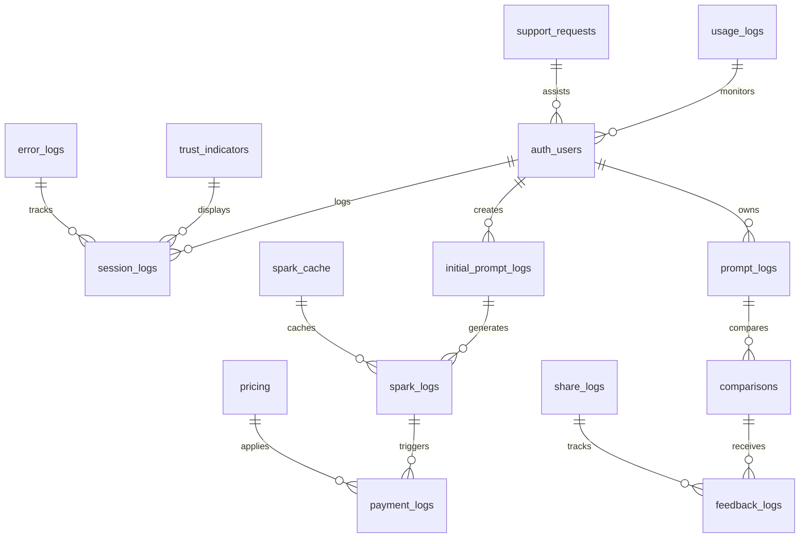

# CanAI Databases - Supabase Schema & Data Management

<div align="center">

**🗄️ Database Architecture & Data Lifecycle**


</div>

## 🌟 Overview

The CanAI databases directory contains all database schemas, migrations, seed data, and automated
maintenance jobs for the Emotional Sovereignty Platform. Built on Supabase (PostgreSQL 14) with
Row-Level Security (RLS) policies, it ensures data integrity, user privacy, and GDPR/CCPA compliance
while supporting the complete 9-stage user journey.

### 🎯 Key Features

- **🔒 Row-Level Security (RLS)**: User data isolation and access control
- **📊 Journey Tracking**: Complete user journey data from F1-F9
- **🤖 AI Integration**: Storage for GPT-4o prompts and Hume AI results
- **💳 Payment Data**: Secure Stripe transaction and subscription management
- **📈 Analytics**: PostHog event tracking and performance metrics
- **🔄 Data Lifecycle**: Automated purging and anonymization (24-month retention)
- **⚡ Performance**: Optimized indexes for <50ms query response times

### 🏗️ Database Architecture



## 📁 Directory Structure

```
databases/
├── 📄 migrations/                 # Database schema migrations
│   ├── 001_initial_schema.sql     # Core tables and RLS policies
│   ├── 002_journey_tracking.sql   # User journey tracking tables
│   ├── 003_ai_integration.sql     # AI service data tables
│   ├── 004_payment_system.sql     # Stripe payment integration
│   ├── 005_analytics.sql          # PostHog analytics tables
│   ├── 006_performance_indexes.sql # Query optimization indexes
│   └── 007_gdpr_compliance.sql    # Data lifecycle and purging
├── 🌱 seed/                       # Initial and test data
│   ├── trust_indicators.sql       # Sample trust indicators
│   ├── pricing_data.sql           # Product pricing information
│   ├── sample_users.sql           # Test user accounts
│   └── development_data.sql       # Development environment data
├── ⏰ cron/                       # Automated maintenance jobs
│   ├── purge_old_data.sql         # 24-month data purging
│   ├── anonymize_data.sql         # Monthly anonymization
│   ├── update_analytics.sql       # Analytics aggregation
│   └── health_checks.sql          # Database health monitoring
└── 📖 README.md                   # This documentation file
```

## 🗄️ Core Database Tables

### User Journey Tables

#### `initial_prompt_logs` - F2 Discovery Funnel Data

```sql
CREATE TABLE initial_prompt_logs (
  id UUID PRIMARY KEY DEFAULT gen_random_uuid(),
  user_id UUID REFERENCES auth.users(id) ON DELETE SET NULL,
  session_id TEXT NOT NULL,
  business_type TEXT NOT NULL CHECK (business_type IN ('retail', 'service', 'tech', 'creative', 'healthcare', 'food_beverage', 'consulting', 'other')),
  primary_challenge TEXT NOT NULL CHECK (char_length(primary_challenge) BETWEEN 5 AND 500),
  preferred_tone TEXT NOT NULL CHECK (preferred_tone IN ('warm', 'bold', 'optimistic', 'professional', 'playful', 'inspirational', 'custom')),
  desired_outcome TEXT NOT NULL CHECK (desired_outcome IN ('secure_funding', 'grow_customers', 'improve_operations', 'boost_online_presence', 'launch_product', 'scale_business')),
  trust_score NUMERIC(5,2) CHECK (trust_score BETWEEN 0 AND 100),
  emotional_resonance JSONB DEFAULT '{}',
  created_at TIMESTAMPTZ DEFAULT now()
);

-- RLS Policy
ALTER TABLE initial_prompt_logs ENABLE ROW LEVEL SECURITY;
CREATE POLICY initial_prompt_logs_rls ON initial_prompt_logs
  FOR ALL TO authenticated USING (auth.uid() = user_id);
```

#### `spark_logs` - F3 Spark Generation Data

```sql
CREATE TABLE spark_logs (
  id UUID PRIMARY KEY DEFAULT gen_random_uuid(),
  initial_prompt_id UUID REFERENCES initial_prompt_logs(id) ON DELETE CASCADE,
  user_id UUID REFERENCES auth.users(id) ON DELETE SET NULL,
  generated_sparks JSONB NOT NULL DEFAULT '[]',
  selected_spark JSONB,
  product_track TEXT CHECK (product_track IN ('business_builder', 'social_email', 'site_audit')),
  trust_score NUMERIC(5,2) CHECK (trust_score BETWEEN 0 AND 100),
  emotional_resonance JSONB DEFAULT '{}',
  status TEXT CHECK (status IN ('generated', 'selected', 'expired')) DEFAULT 'generated',
  expires_at TIMESTAMPTZ DEFAULT (now() + interval '24 hours'),
  created_at TIMESTAMPTZ DEFAULT now()
);

-- Performance indexes
CREATE INDEX idx_spark_logs_user_id ON spark_logs(user_id, created_at DESC);
CREATE INDEX idx_spark_logs_product_track ON spark_logs(product_track, status, created_at DESC);
```

#### `prompt_logs` - F5 Detailed Input Collection

```sql
CREATE TABLE prompt_logs (
  id UUID PRIMARY KEY DEFAULT gen_random_uuid(),
  spark_log_id UUID REFERENCES spark_logs(id) ON DELETE CASCADE,
  user_id UUID REFERENCES auth.users(id) ON DELETE SET NULL,
  business_description TEXT CHECK (char_length(business_description) BETWEEN 10 AND 2000),
  target_audience TEXT CHECK (char_length(target_audience) BETWEEN 5 AND 500),
  unique_value_proposition TEXT CHECK (char_length(unique_value_proposition) BETWEEN 5 AND 500),
  business_goals JSONB DEFAULT '[]',
  challenges JSONB DEFAULT '[]',
  budget_range TEXT CHECK (budget_range IN ('under_1k', '1k_5k', '5k_10k', '10k_25k', '25k_plus')),
  timeline TEXT CHECK (timeline IN ('immediate', '1_month', '3_months', '6_months', '1_year_plus')),
  industry_context TEXT,
  competitive_landscape TEXT,
  success_metrics JSONB DEFAULT '[]',
  additional_context TEXT,
  auto_save_data JSONB DEFAULT '{}',
  completion_percentage INTEGER DEFAULT 0 CHECK (completion_percentage BETWEEN 0 AND 100),
  created_at TIMESTAMPTZ DEFAULT now(),
  updated_at TIMESTAMPTZ DEFAULT now()
);

-- Auto-save optimization
CREATE INDEX idx_prompt_logs_user_completion ON prompt_logs(user_id, completion_percentage, updated_at DESC);
```

### AI Integration Tables

#### `comparisons` - F8 SparkSplit Data

```sql
CREATE TABLE comparisons (
  id UUID PRIMARY KEY DEFAULT gen_random_uuid(),
  prompt_log_id UUID REFERENCES prompt_logs(id) ON DELETE CASCADE,
  user_id UUID REFERENCES auth.users(id) ON DELETE SET NULL,
  canai_output TEXT NOT NULL,
  generic_output TEXT NOT NULL,
  user_preference TEXT CHECK (user_preference IN ('canai', 'generic', 'no_preference')),
  trust_delta NUMERIC(5,2) CHECK (trust_delta BETWEEN -5.0 AND 5.0),
  emotional_resonance_canai JSONB DEFAULT '{}',
  emotional_resonance_generic JSONB DEFAULT '{}',
  feedback_reason TEXT,
  comparison_metadata JSONB DEFAULT '{}',
  created_at TIMESTAMPTZ DEFAULT now()
);

-- Analytics optimization
CREATE INDEX idx_comparisons_trust_delta ON comparisons(trust_delta DESC, created_at DESC);
CREATE INDEX idx_comparisons_preference ON comparisons(user_preference, created_at DESC);
```

### Payment & Business Tables

#### `payment_logs` - F4 Purchase Flow Data

```sql
CREATE TABLE payment_logs (
  id UUID PRIMARY KEY DEFAULT gen_random_uuid(),
  spark_log_id UUID REFERENCES spark_logs(id) ON DELETE CASCADE,
  user_id UUID REFERENCES auth.users(id) ON DELETE SET NULL,
  stripe_session_id TEXT UNIQUE,
  stripe_payment_intent_id TEXT,
  product_track TEXT NOT NULL CHECK (product_track IN ('business_builder', 'social_email', 'site_audit')),
  tier TEXT CHECK (tier IN ('standard', 'premium')) DEFAULT 'standard',
  amount NUMERIC(10,2) NOT NULL CHECK (amount >= 0),
  currency TEXT DEFAULT 'USD',
  status TEXT CHECK (status IN ('pending', 'processing', 'succeeded', 'failed', 'cancelled', 'refunded')) DEFAULT 'pending',
  payment_method TEXT,
  billing_details JSONB DEFAULT '{}',
  metadata JSONB DEFAULT '{}',
  webhook_events JSONB DEFAULT '[]',
  created_at TIMESTAMPTZ DEFAULT now(),
  updated_at TIMESTAMPTZ DEFAULT now()
);

-- Payment processing optimization
CREATE INDEX idx_payment_logs_stripe_session ON payment_logs(stripe_session_id);
CREATE INDEX idx_payment_logs_status ON payment_logs(status, created_at DESC);
```

#### `pricing` - Dynamic Pricing Management

```sql
CREATE TABLE pricing (
  id UUID PRIMARY KEY DEFAULT gen_random_uuid(),
  product_track TEXT NOT NULL CHECK (product_track IN ('business_builder', 'social_email', 'site_audit')),
  tier TEXT CHECK (tier IN ('standard', 'premium')) DEFAULT 'standard',
  price NUMERIC(10,2) NOT NULL CHECK (price >= 0),
  currency TEXT DEFAULT 'USD' CHECK (currency = 'USD'),
  description TEXT NOT NULL,
  features JSONB NOT NULL DEFAULT '[]',
  word_count_range TEXT,
  emotional_benefits JSONB DEFAULT '[]',
  active BOOLEAN DEFAULT true,
  valid_from TIMESTAMPTZ DEFAULT now(),
  valid_until TIMESTAMPTZ,
  created_at TIMESTAMPTZ DEFAULT now()
);

-- Public read access for pricing
ALTER TABLE pricing ENABLE ROW LEVEL SECURITY;
CREATE POLICY pricing_public_read ON pricing
  FOR SELECT TO anon USING (active = true AND valid_from <= now() AND (valid_until IS NULL OR valid_until > now()));
```

## 🔒 Security Implementation

### Row-Level Security (RLS) Policies

```sql
-- Enable RLS on all user data tables
ALTER TABLE session_logs ENABLE ROW LEVEL SECURITY;
ALTER TABLE initial_prompt_logs ENABLE ROW LEVEL SECURITY;
ALTER TABLE spark_logs ENABLE ROW LEVEL SECURITY;
ALTER TABLE prompt_logs ENABLE ROW LEVEL SECURITY;
ALTER TABLE comparisons ENABLE ROW LEVEL SECURITY;
ALTER TABLE payment_logs ENABLE ROW LEVEL SECURITY;
ALTER TABLE feedback_logs ENABLE ROW LEVEL SECURITY;

-- User data isolation policy (applied to all user tables)
CREATE POLICY user_data_isolation ON session_logs
  FOR ALL TO authenticated USING (auth.uid() = user_id);

-- Admin access policy (for admin dashboard)
CREATE POLICY admin_access ON session_logs
  FOR ALL TO authenticated USING (
    EXISTS (
      SELECT 1 FROM auth.users
      WHERE id = auth.uid()
      AND raw_user_meta_data->>'role' = 'admin'
    )
  );

-- Anonymous insert policy (for unauthenticated users in F1-F2)
CREATE POLICY anonymous_insert ON session_logs
  FOR INSERT TO anon WITH CHECK (user_id IS NULL);
```

### Data Encryption

```sql
-- Enable encryption for sensitive fields
CREATE EXTENSION IF NOT EXISTS pgcrypto;

-- Encrypted PII storage
CREATE OR REPLACE FUNCTION encrypt_pii(data TEXT)
RETURNS TEXT AS $$
BEGIN
  RETURN encode(encrypt(data::bytea, current_setting('app.encryption_key'), 'aes'), 'base64');
END;
$$ LANGUAGE plpgsql SECURITY DEFINER;

-- Decrypt function for authorized access
CREATE OR REPLACE FUNCTION decrypt_pii(encrypted_data TEXT)
RETURNS TEXT AS $$
BEGIN
  RETURN convert_from(decrypt(decode(encrypted_data, 'base64'), current_setting('app.encryption_key'), 'aes'), 'UTF8');
END;
$$ LANGUAGE plpgsql SECURITY DEFINER;
```

## ⚡ Performance Optimization

### Query Performance Indexes

```sql
-- User journey performance indexes
CREATE INDEX idx_session_logs_user_id ON session_logs(user_id, created_at DESC);
CREATE INDEX idx_session_logs_session_id ON session_logs(session_id, created_at DESC);
CREATE INDEX idx_session_logs_interaction_type ON session_logs(interaction_type, created_at DESC);

-- AI service performance indexes
CREATE INDEX idx_spark_logs_attempt_count ON spark_logs(attempt_count, created_at DESC);
CREATE INDEX idx_comparisons_trust_delta ON comparisons(trust_delta DESC, created_at DESC);

-- Payment processing indexes
CREATE INDEX idx_payment_logs_stripe_session ON payment_logs(stripe_session_id);
CREATE INDEX idx_payment_logs_user_status ON payment_logs(user_id, status, created_at DESC);

-- Analytics aggregation indexes
CREATE INDEX idx_feedback_logs_rating ON feedback_logs(overall_rating, created_at DESC);
CREATE INDEX idx_usage_logs_endpoint ON usage_logs(endpoint_name, response_time_ms, created_at DESC);
```

### Query Performance Targets

- **User Data Queries**: <50ms response time
- **Analytics Aggregation**: <200ms for dashboard queries
- **Payment Processing**: <100ms for transaction lookups
- **Journey Progression**: <75ms for stage transitions

## 🔄 Data Lifecycle Management

### Automated Data Purging (GDPR/CCPA Compliance)

```sql
-- Monthly data purging job (24-month retention)
CREATE OR REPLACE FUNCTION purge_old_data()
RETURNS void AS $$
BEGIN
  -- Delete old session logs (24 months)
  DELETE FROM session_logs
  WHERE created_at < (now() - interval '24 months');

  -- Delete old prompt logs (24 months)
  DELETE FROM prompt_logs
  WHERE created_at < (now() - interval '24 months');

  -- Delete old comparison data (24 months)
  DELETE FROM comparisons
  WHERE created_at < (now() - interval '24 months');

  -- Anonymize old payment data (keep for compliance, remove PII)
  UPDATE payment_logs
  SET billing_details = '{"anonymized": true}'::jsonb,
      metadata = '{"anonymized": true}'::jsonb
  WHERE created_at < (now() - interval '24 months')
    AND billing_details != '{"anonymized": true}'::jsonb;

  RAISE NOTICE 'Data purging completed at %', now();
END;
$$ LANGUAGE plpgsql;

-- Schedule monthly execution
SELECT cron.schedule('purge-old-data', '0 2 1 * *', 'SELECT purge_old_data();');
```

### Data Anonymization

```sql
-- Monthly anonymization job
CREATE OR REPLACE FUNCTION anonymize_user_data()
RETURNS void AS $$
BEGIN
  -- Anonymize old user sessions (6 months)
  UPDATE session_logs
  SET ip_address = '0.0.0.0'::inet,
      user_agent = 'anonymized',
      utm_source = NULL,
      utm_medium = NULL,
      utm_campaign = NULL
  WHERE created_at < (now() - interval '6 months')
    AND ip_address != '0.0.0.0'::inet;

  -- Anonymize old feedback data
  UPDATE feedback_logs
  SET feedback_text = 'anonymized',
      contact_info = NULL
  WHERE created_at < (now() - interval '6 months')
    AND feedback_text != 'anonymized';

  RAISE NOTICE 'Data anonymization completed at %', now();
END;
$$ LANGUAGE plpgsql;

-- Schedule monthly execution
SELECT cron.schedule('anonymize-data', '0 3 1 * *', 'SELECT anonymize_user_data();');
```

## 📊 Analytics & Monitoring

### Database Health Monitoring

```sql
-- Database health check function
CREATE OR REPLACE FUNCTION database_health_check()
RETURNS TABLE(
  metric_name TEXT,
  metric_value NUMERIC,
  status TEXT,
  last_updated TIMESTAMPTZ
) AS $$
BEGIN
  RETURN QUERY
  SELECT
    'active_connections'::TEXT,
    (SELECT count(*) FROM pg_stat_activity WHERE state = 'active')::NUMERIC,
    CASE WHEN (SELECT count(*) FROM pg_stat_activity WHERE state = 'active') < 50
         THEN 'healthy' ELSE 'warning' END::TEXT,
    now();

  RETURN QUERY
  SELECT
    'avg_query_time_ms'::TEXT,
    (SELECT avg(total_time) FROM pg_stat_statements WHERE calls > 100)::NUMERIC,
    CASE WHEN (SELECT avg(total_time) FROM pg_stat_statements WHERE calls > 100) < 50
         THEN 'healthy' ELSE 'warning' END::TEXT,
    now();

  RETURN QUERY
  SELECT
    'database_size_mb'::TEXT,
    (SELECT pg_database_size(current_database()) / 1024 / 1024)::NUMERIC,
    'info'::TEXT,
    now();
END;
$$ LANGUAGE plpgsql;

-- Schedule hourly health checks
SELECT cron.schedule('db-health-check', '0 * * * *', 'SELECT database_health_check();');
```

### Analytics Aggregation

```sql
-- Daily analytics aggregation
CREATE OR REPLACE FUNCTION aggregate_daily_analytics()
RETURNS void AS $$
BEGIN
  -- Insert daily user journey metrics
  INSERT INTO daily_analytics (
    date,
    metric_name,
    metric_value,
    created_at
  )
  SELECT
    current_date,
    'funnel_completion_rate',
    (COUNT(CASE WHEN completion_percentage = 100 THEN 1 END)::NUMERIC / COUNT(*)::NUMERIC * 100),
    now()
  FROM prompt_logs
  WHERE created_at >= current_date - interval '1 day'
    AND created_at < current_date;

  -- Insert daily trust delta metrics
  INSERT INTO daily_analytics (
    date,
    metric_name,
    metric_value,
    created_at
  )
  SELECT
    current_date,
    'avg_trust_delta',
    AVG(trust_delta),
    now()
  FROM comparisons
  WHERE created_at >= current_date - interval '1 day'
    AND created_at < current_date;

  RAISE NOTICE 'Daily analytics aggregation completed at %', now();
END;
$$ LANGUAGE plpgsql;

-- Schedule daily execution at 1 AM
SELECT cron.schedule('daily-analytics', '0 1 * * *', 'SELECT aggregate_daily_analytics();');
```

## 🚀 Migration Management

### Running Migrations

```bash
# Apply all pending migrations
supabase db push

# Apply specific migration
supabase db push --include-schema-diff

# Reset database (development only)
supabase db reset

# Generate new migration
supabase db diff --schema public > migrations/new_migration.sql
```

### Migration Best Practices

1. **Backward Compatibility**: Always ensure migrations can be rolled back
2. **Data Integrity**: Use transactions for complex data transformations
3. **Performance**: Create indexes concurrently to avoid table locks
4. **Testing**: Test migrations on staging before production deployment
5. **Documentation**: Include clear comments explaining migration purpose

### Example Migration Template

```sql
-- Migration: 008_example_feature.sql
-- Description: Add new feature tables and indexes
-- Author: CanAI Development Team
-- Date: 2024-01-15

BEGIN;

-- Create new table
CREATE TABLE new_feature_table (
  id UUID PRIMARY KEY DEFAULT gen_random_uuid(),
  user_id UUID REFERENCES auth.users(id) ON DELETE CASCADE,
  feature_data JSONB NOT NULL DEFAULT '{}',
  created_at TIMESTAMPTZ DEFAULT now(),
  updated_at TIMESTAMPTZ DEFAULT now()
);

-- Enable RLS
ALTER TABLE new_feature_table ENABLE ROW LEVEL SECURITY;

-- Create RLS policy
CREATE POLICY new_feature_table_rls ON new_feature_table
  FOR ALL TO authenticated USING (auth.uid() = user_id);

-- Create performance indexes
CREATE INDEX CONCURRENTLY idx_new_feature_table_user_id
  ON new_feature_table(user_id, created_at DESC);

-- Update existing table (if needed)
ALTER TABLE existing_table
  ADD COLUMN new_column TEXT;

-- Create trigger for updated_at
CREATE TRIGGER update_new_feature_table_updated_at
  BEFORE UPDATE ON new_feature_table
  FOR EACH ROW
  EXECUTE FUNCTION update_updated_at_column();

COMMIT;
```

## 🧪 Testing & Development

### Seed Data for Development

```sql
-- Insert test trust indicators
INSERT INTO trust_indicators (text, author, type, emotional_tone, trust_score_context, active) VALUES
('CanAI helped me secure $75,000 in funding with their business plan!', 'Sarah Chen, Bakery Owner', 'testimonial', 'optimistic', 95, true),
('The emotional intelligence in their content is incredible.', 'Mike Rodriguez, Tech Startup', 'trust_indicator', 'inspirational', 88, true),
('Finally, AI that understands my business vision.', 'Lisa Park, Yoga Studio', 'testimonial', 'warm', 92, true);

-- Insert test pricing data
INSERT INTO pricing (product_track, tier, price, description, features, word_count_range, active) VALUES
('business_builder', 'standard', 29.99, 'Comprehensive Business Plan', '["Financial projections", "Market analysis", "Growth strategies"]', '700-800 words', true),
('social_email', 'standard', 19.99, 'Social Media Strategy', '["Content calendar", "Engagement tactics", "Email sequences"]', '500-600 words', true),
('site_audit', 'standard', 24.99, 'Website Audit Report', '["UX/UI analysis", "Conversion optimization", "SEO insights"]', '600-700 words', true);
```

### Database Testing

```bash
# Run database tests
npm run test:db

# Test migrations
npm run test:migrations

# Test RLS policies
npm run test:rls

# Performance testing
npm run test:performance
```

## 🤝 Contributing

### Database Development Guidelines

1. **Schema Changes**: Always create migrations for schema changes
2. **RLS Policies**: Implement RLS for all user data tables
3. **Performance**: Add appropriate indexes for query optimization
4. **Security**: Encrypt sensitive data and implement proper access controls
5. **Documentation**: Document all tables, functions, and procedures

### Code Quality

```sql
-- Follow naming conventions
-- Tables: snake_case (e.g., user_sessions)
-- Columns: snake_case (e.g., created_at)
-- Indexes: idx_table_column (e.g., idx_users_email)
-- Functions: snake_case (e.g., update_user_profile)

-- Use proper data types
-- UUIDs for primary keys
-- TIMESTAMPTZ for timestamps
-- JSONB for structured data
-- TEXT with CHECK constraints for validated strings
```

## 📞 Support & Resources

### Getting Help

- **Schema Documentation**: Check the [Data Model Schema](../docs/data-model-schema.md)
- **API Integration**: Review the
  [API Contract Specification](../docs/api-contract-specification.md)
- **Performance**: See the
  [Technical Architecture Document](<../docs/technical-architecture-document-(TAD).md>)
- **Security**: Check the [Security Guidelines](../docs/security-guidelines.md)

### External Resources

- **Supabase Documentation**: [https://supabase.com/docs](https://supabase.com/docs)
- **PostgreSQL Documentation**: [https://www.postgresql.org/docs/](https://www.postgresql.org/docs/)
- **RLS Guide**:
  [https://supabase.com/docs/guides/auth/row-level-security](https://supabase.com/docs/guides/auth/row-level-security)

---

<div align="center">

**Built with ❤️ for the CanAI Emotional Sovereignty Platform**

[🏠 Back to Root](../README.md) | [🔧 Backend](../backend/README.md) |
[🎨 Frontend](../frontend/README.md)

</div>
