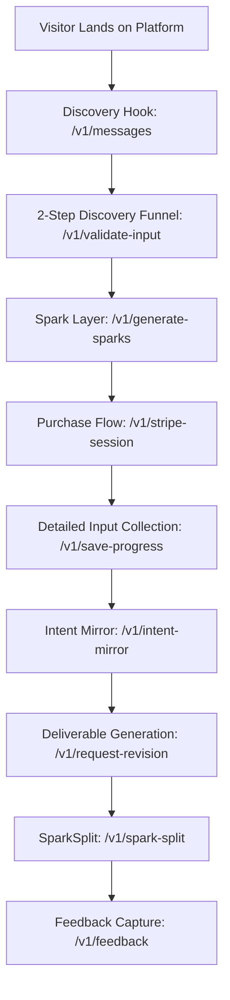
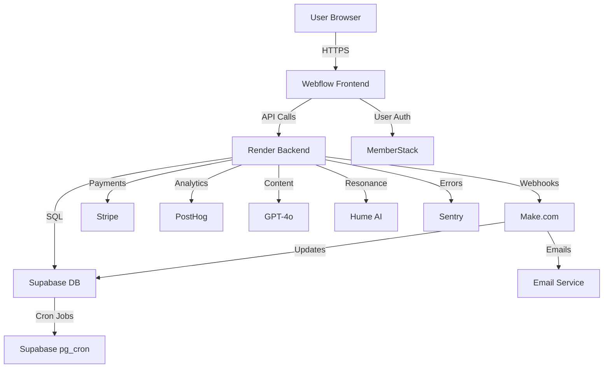

# CanAI Emotional Sovereignty Platform: Product Requirements Document

# Table of Contents

- [1. Introduction](#1-introduction)
  - [1.1 Purpose](#11-purpose)
  - [1.2 Value Proposition](#12-value-proposition)
  - [1.3 Scope](#13-scope)
  - [1.4 Stakeholders](#14-stakeholders)
  - [1.5 Assumptions & Mitigations](#15-assumptions--mitigations)
- [2. Problem Statement](#2-problem-statement)
- [3. Objectives](#3-objectives)
- [4. Key User Personas](#4-key-user-personas)
- [5. User Journey Overview](#5-user-journey-overview)
  - [5.1 Journey Description](#51-journey-description)
- [6. Functional Requirements](#6-functional-requirements)
  - [6.1 Discovery Hook](#61-discovery-hook)
  - [6.2 2-Step Discovery Funnel](#62-2-step-discovery-funnel)
  - [6.3 Spark Layer](#63-spark-layer)
  - [6.4 Purchase Flow](#64-purchase-flow)
  - [6.5 Detailed Input Collection](#65-detailed-input-collection)
  - [6.6 Intent Mirror](#66-intent-mirror)
  - [6.7 Deliverable Generation](#67-deliverable-generation)
  - [6.8 SparkSplit](#68-sparksplit)
  - [6.9 Feedback Capture](#69-feedback-capture)
- [7. Non-Functional Requirements](#7-non-functional-requirements)
  - [7.1 Performance](#71-performance)
  - [7.2 Security](#72-security)
  - [7.3 Data Lifecycle](#73-data-lifecycle)
  - [7.4 Scalability](#74-scalability)
  - [7.5 Accessibility](#75-accessibility)
  - [7.6 Cost Controls](#76-cost-controls)
  - [7.7 TaskMaster-Compatible Task Breakdown](#77-taskmaster-compatible-task-breakdown)
  - [7.8 Supabase Schema Snippet (Anonymization Job)](#78-supabase-schema-snippet-anonymization-job)
- [8. Architecture](#8-architecture)
  - [8.1 Architecture Overview](#81-architecture-overview)
  - [8.2 Frontend](#82-frontend)
  - [8.3 Backend](#83-backend)
  - [8.4 Database](#84-database)
  - [8.5 Integrations](#85-integrations)
  - [8.6 Monitoring & Analytics](#86-monitoring--analytics)
  - [8.7 API Catalog](#87-api-catalog)
  - [8.8 TaskMaster-Compatible Task Breakdown](#88-taskmaster-compatible-task-breakdown)
    - [8.8.1 Dependency Graph](#881-dependency-graph)
- [9. Error Handling](#9-error-handling)
  - [9.1 Error Cases](#91-error-cases)
  - [9.2 Behavior](#92-behavior)
  - [9.3 Integration](#93-integration)
  - [9.4 Acceptance Criteria](#94-acceptance-criteria)
  - [9.5 Technical Specifications](#95-technical-specifications)
- [10. Example Scenarios](#10-example-scenarios)
  - [10.1 Scenario 1: Sprinkle Haven Bakery (Business Plan Builder)](#101-scenario-1-sprinkle-haven-bakery-business-plan-builder)
  - [10.2 Scenario 2: Serenity Yoga Studio (Social Media & Email Campaign)](#102-scenario-2-serenity-yoga-studio-social-media-email-campaign)
  - [10.3 Scenario 3: TechTrend Innovations (Website Audit & Feedback)](#103-scenario-3-techtrend-innovations-website-audit--feedback)
  - [10.4 TaskMaster-Compatible Task Breakdown](#104-taskmaster-compatible-task-breakdown)
  - [10.5 PRD Coverage Matrix](#105-prd-coverage-matrix)
  - [10.6 Validation](#106-validation)
- [11. Constraints](#11-constraints)
  - [11.1 Technical Constraints](#111-technical-constraints)
  - [11.2 Operational Constraints](#112-operational-constraints)
  - [11.3 Legal & Security Constraints](#113-legal--security-constraints)
  - [11.4 TaskMaster-Compatible Task Breakdown](#114-taskmaster-compatible-task-breakdown)
  - [11.5 PRD Coverage Matrix](#115-prd-coverage-matrix)
- [12. Success Metrics](#12-success-metrics)
  - [12.1 Acquisition Metrics](#121-acquisition-metrics)
  - [12.2 Engagement Metrics](#122-engagement-metrics)
  - [12.3 Trust Metrics](#123-trust-metrics)
  - [12.4 Conversion Metrics](#124-conversion-metrics)
  - [12.5 Advocacy Metrics](#125-advocacy-metrics)
  - [12.6 Satisfaction Metrics](#126-satisfaction-metrics)
  - [12.7 Edge-Case Metrics](#127-edge-case-metrics)
  - [12.8 PostHog Configuration](#128-posthog-configuration)
  - [12.9 TaskMaster-Compatible Task Breakdown](#129-taskmaster-compatible-task-breakdown)
  - [12.10 PRD Coverage Matrix](#1210-prd-coverage-matrix)
- [13. Testing Strategy](#13-testing-strategy)
  - [13.1 Test Types](#131-test-types)
  - [13.2 Testing Tools & Configuration](#132-testing-tools--configuration)
  - [13.3 Acceptance Criteria](#133-acceptance-criteria)
  - [13.4 TaskMaster-Compatible Task Breakdown](#134-taskmaster-compatible-task-breakdown)
  - [13.5 PRD Coverage Matrix](#135-prd-coverage-matrix)
- [14. Security Strategy](#14-security-strategy)
  - [14.1 Security Measures](#141-security-measures)
  - [14.2 Acceptance Criteria](#142-acceptance-criteria)
  - [14.3 TaskMaster-Compatible Task Breakdown](#143-taskmaster-compatible-task-breakdown)
  - [14.4 PRD Coverage Matrix](#144-prd-coverage-matrix)
- [15. Deployment Strategy](#15-deployment-strategy)
  - [15.1 Deployment Components](#151-deployment-components)
  - [15.2 Acceptance Criteria](#152-acceptance-criteria)
  - [15.3 TaskMaster-Compatible Task Breakdown](#153-taskmaster-compatible-task-breakdown)
  - [15.4 PRD Coverage Matrix](#154-prd-coverage-matrix)
- [16. Risk Assessment](#16-risk-assessment)
  - [16.1 Risk Assessment Table](#161-risk-assessment-table)
  - [16.2 Acceptance Criteria](#162-acceptance-criteria)
  - [16.3 TaskMaster-Compatible Task Breakdown](#163-taskmaster-compatible-task-breakdown)
  - [16.4 PRD Coverage Matrix](#164-prd-coverage-matrix)
- [17. Future Enhancements](#17-future-enhancements)
  - [17.1 Planned Enhancements](#171-planned-enhancements)
    - [17.1 Prioritization Matrix](#171-prioritization-matrix)
  - [17.2 Acceptance Criteria](#172-acceptance-criteria)
  - [17.3 TaskMaster-Compatible Task Breakdown](#173-taskmaster-compatible-task-breakdown)
  - [17.4 PRD Coverage Matrix](#174-prd-coverage-matrix)
- [18. Glossary](#18-glossary)
  - [18.1 Glossary Terms](#181-glossary-terms)
  - [18.2 Acceptance Criteria](#182-acceptance-criteria)

## 1. Introduction

The **CanAI Emotional Sovereignty Platform** is a SaaS solution empowering small business owners,
solopreneurs, and enterprise clients with AI-driven, emotionally intelligent solutions (e.g.,
business plans, social media strategies, website audits). Hosted on **Webflow** (frontend) and
**Render** (backend at `https://canai-router.onrender.com`, internal: `canai-router:10000`, IPs:
52.41.36.82, 54.191.253.12, 44.226.122.3), it integrates **Memberstack**, **Supabase**,
**Make.com**, **Stripe**, **GPT-4o**, and **Hume AI**. The backend (`backend/`) manages API routing
(`routes/`), webhook processing (`webhooks/`), AI prompts (`prompts/`), and data storage
(`databases/`), leveraging existing **Make.com** scenarios (`add_project.json`,
`admin_add_project.json`, `SAAP Update Project Blueprint.json`, `add_client.json`) for seamless
workflows.

### Purpose

- **Users**: Receive intuitive, emotionally resonant solutions via backend-driven AI generation and
  validation.
- **CanAI**: Drive engagement and trust through transparent, scalable backend processes.

### Value Proposition

- **Users**: Get tailored outputs (e.g., 700–800-word business plans) that feel personal, with
  **SparkSplit** proving CanAI’s edge.
- **Business**: Establish CanAI as a trusted AI leader via robust backend APIs, reducing churn and
  boosting conversions.

### Scope

This PRD defines a 9-stage user journey, three product tracks (**Business Plan Builder**, **Social
Media & Email Campaign**, **Website Audit & Feedback**), backend APIs (`backend/routes/`),
integration flows (`backend/webhooks/`), performance targets, security measures
(`backend/middleware/`), testing (`backend/tests/`), and metrics (`backend/services/posthog.js`). It
includes **GPT-4o** prompts (`backend/prompts/`), **TaskMaster**-compatible tasks, and enhancements
for pricing transparency, usability, and reliability.

### Stakeholders

- **Solo Developer**: Approves deliverables, manages backend development, oversees deployment.
- **Future QA/Support (Placeholder)**: To handle testing and user support as the platform scales.

### Assumptions & Mitigations

- Users are familiar with AI interactions → Provide tooltips (`backend/services/gpt4o.js`); risk:
  low adoption, mitigated by UX testing.
- **Webflow** CMS supports dynamic updates → Cache in **Supabase** (`databases/`); risk: downtime,
  mitigated by localStorage fallback.
- **Hume AI** API: <500ms latency, 1000 req/day ($0.01/req) → Circuit breaker in
  `backend/middleware/hume.js`; risk: rate limits, mitigated by GPT-4o fallback.
- **Supabase**/**Stripe** APIs: 99.9% uptime → Retry logic in `backend/services/`; risk: outages,
  mitigated by exponential backoff.
- **GPT-4o**: 128K tokens/req, $5/1M tokens → Chunk inputs in `backend/prompts/`; risk: token
  overflow, mitigated by MapReduce.

## 2. Problem Statement

Small business owners lack time, expertise, or resources to create strategic solutions that reflect
their vision and resonate with stakeholders. Generic AI tools produce formulaic outputs lacking
personal tone, emotional drivers, or local context. **CanAI** addresses this with:

- **Low-Friction Onboarding**: A 2-step **Discovery Funnel** (≤30s, stored in
  `databases/initial_prompt_logs`) captures minimal inputs.
- **Emotionally Intelligent Outputs**: **GPT-4o** (`backend/prompts/`) and **Hume AI**
  (`backend/services/hume.js`) deliver tailored deliverables with TrustDelta ≥4.2/5.0 and emotional
  resonance >0.7.
- **Robust Backend Processes**: **Supabase** (`databases/`) ensures data persistence, **Make.com**
  (`backend/webhooks/`) orchestrates flows, and middleware (`backend/middleware/error.js`) handles
  errors with ≤100ms responses.
- **Transparent Pricing**: Displayed via **Webflow** CMS, stored in **Supabase** (`databases/`), and
  validated in `backend/routes/pricing.js`.

## 3. Objectives

- **Frictionless Onboarding**: Capture inputs in a 2-step **Discovery Funnel** (≤30s, ≥90%
  completion) via `backend/routes/funnel.js`, stored in `databases/initial_prompt_logs`, driving
  purchase intent.
- **Personalized Outputs**: Deliver AI-driven solutions using 12-field inputs
  (`backend/routes/inputs.js`, `databases/prompt_logs`), achieving TrustDelta ≥4.2/5.0 and emotional
  resonance >0.7 via **GPT-4o** (`backend/prompts/`) and **Hume AI** (`backend/services/hume.js`).
- **Trust and Transparency**: Prove CanAI’s superiority via **SparkSplit**
  (`backend/services/sparkSplit.js`, `databases/comparisons`), with ≥65% user preference, supported
  by pricing APIs (`backend/routes/pricing.js`) and samples (`frontend/public/samples/`).
- **Seamless Integration**: Leverage **Supabase** (`databases/`), **Make.com**
  (`backend/webhooks/`), and **Stripe** (`backend/services/stripe.js`) for secure, scalable
  solutions with ≤2s generation (`/v1/generate-sparks`, `/v1/spark-split`) and ≤100ms error
  responses (`backend/middleware/error.js`).

## 4. Key User Personas

- **Early-Stage Founder**: Needs investor-ready plans (e.g., $75,000 funding). Inputs:
  `businessDescription`, `revenueModel` (`databases/prompt_logs`). Interacts with
  `/v1/intent-mirror`, `/v1/generate-sparks` for **Business Plan Builder**. Example: Sprinkle Haven
  Bakery (Section 10.1).
- **Side-Hustle Solopreneur**: Seeks guidance (e.g., social media strategy). Inputs:
  `socialPlatforms`, `contentStrategy`. Uses `/v1/validate-input`, `/v1/spark-split` for **Social
  Media & Email Campaign**. Example: Serenity Yoga Studio (Section 10.2).
- **Growth-Stage SMB Owner**: Requires rapid iterations (e.g., website audit). Inputs:
  `contentSource`, `auditScope`. Engages `/v1/spark-split`, `/v1/feedback` for **Website Audit &
  Feedback**. Example: TechTrend Innovations (Section 10.3).

## 5. User Journey Overview

The platform guides users through a 9-stage journey, with backend APIs (`backend/routes/`), services
(`backend/services/`), and data storage (`databases/`) driving each step:



### Journey Description

1. **F1 Discovery Hook**: Captures attention via **Webflow** UI, with pricing/samples from
   **Supabase** (`databases/trust_indicators`). Backend: `/v1/messages`
   (`backend/routes/messages.js`), logs to `session_logs`. Task: Render hero, modal, cards.
2. **F2 2-Step Discovery Funnel**: Collects inputs (≤30s) via `/v1/validate-input`
   (`backend/routes/funnel.js`), stored in `initial_prompt_logs`. Uses **GPT-4o**
   (`backend/prompts/funnel.js`) for feedback. Task: Validate inputs, generate trust score.
3. **F3 Spark Layer**: Generates three concepts via `/v1/generate-sparks`
   (`backend/routes/sparks.js`), logged in `spark_logs`. Task: Generate/regenerate sparks.
4. **F4 Purchase Flow**: Processes payments via `/v1/stripe-session` (`backend/services/stripe.js`),
   triggers `add_project.json` (`backend/webhooks/`). Task: Implement Stripe checkout.
5. **F5 Detailed Input Collection**: Gathers 12-field inputs via `/v1/save-progress`
   (`backend/routes/inputs.js`), stored in `prompt_logs`. Task: Auto-save inputs, provide tooltips.
6. **F6 Intent Mirror**: Validates inputs via `/v1/intent-mirror` (`backend/routes/intent.js`),
   generates summary. Task: Generate summary, handle edits.
7. **F7 Deliverable Generation**: Produces outputs via `/v1/request-revision`
   (`backend/routes/deliverables.js`), stored in `comparisons`. Task: Generate deliverables, enable
   revisions.
8. **F8 SparkSplit**: Compares outputs via `/v1/spark-split` (`backend/services/sparkSplit.js`),
   logs to `comparisons`. Task: Implement comparison, compute TrustDelta.
9. **F9 Feedback Capture**: Collects feedback via `/v1/feedback` (`backend/routes/feedback.js`),
   stored in `feedback_logs`. Task: Process ratings, send follow-up emails.

10. Functional Requirements

### 6.1 Discovery Hook

- **Purpose**: Engage users with a welcoming landing page that builds trust through transparency and
  previews, driven by backend APIs (`backend/routes/`) and data storage (`databases/`).
- **UI Elements** (Frontend, Webflow-based):
  - Hero headline: “Unlock Your Vision with **CanAI**.”
  - Subtext: “Craft solutions that feel like you, elevated.”
  - Button: “Begin Your Journey” (id=`begin-btn`, redirects to `/funnel`).
  - Button: “View Pricing” (id=`pricing-btn`, opens modal).
  - Pricing modal (id=`pricing-modal`):
    - Table: Columns (Product, Price, Description).
    - Rows:
      - **Business Plan Builder**: $99, “Investor-ready business plan (700–800 words).”
      - **Social Media & Email Campaign**: $49, “3–7 social posts + 3–5 emails.”
      - **Website Audit & Feedback**: $79, “Website audit (300–400 words) + recommendations.”
    - Close button (id=`pricing-close`).
  - Product cards (id=`product-cards`, Webflow grid):
    - Card 1: “Business Plans for Funding” (**Business Plan Builder**), “Craft a 700–800-word plan
      for investors.”, “Learn More” (href=`/business-builder`).
    - Card 2: “Social Media Campaigns” (**Social Media & Email Campaign**), “Get 3–7 posts + 3–5
      emails.”, “Learn More” (href=`/social-email`).
    - Card 3: “Website Audits” (**Website Audit & Feedback**), “Receive a 300–400-word audit +
      recommendations.”, “Learn More” (href=`/site-audit`).
  - Button: “See a Sample” (id=`sample-btn`, href=`/samples`).
  - Sample page (`/samples`):
    - PDF embed: Anonymized **Business Plan Builder** plan (700 words,
      `frontend/public/samples/business_plan.pdf`).
    - Text: **Social Media & Email Campaign** post (40 words), **Website Audit & Feedback** snippet
      (100 words).
  - Button: “Try a Free Spark” (id=`preview-btn`, opens modal).
  - Preview modal (id=`spark-preview`):
    - Displays one **Spark** (e.g., “The Community Spark”).
    - Button: “Get Your Sparks” (redirects to `/funnel`).
  - Link: “Reset Password” (id=`reset-password`, href=`/reset-password`, in login modal
    id=`login-modal`).
  - Trust indicators: Testimonials, stats (e.g., “500+ plans created”, fetched from
    `databases/trust_indicators`).
- **Behavior**:
  - “Begin Your Journey” triggers Webflow redirect to 2-Step Discovery Funnel (`/funnel`).
  - “View Pricing” opens modal; clicking outside or “Close” dismisses, logged via
    `/v1/log-interaction`.
  - “Learn More” navigates to product page, logged to `session_logs`.
  - “See a Sample” loads samples without Memberstack login, served from `frontend/public/samples/`.
  - “Try a Free Spark” calls `/v1/generate-preview-spark` (`backend/routes/sparks.js`), generating
    one spark via **GPT-4o** (`backend/services/gpt4o.js`); “Get Your Sparks” redirects to
    `/funnel`.
  - “Reset Password” redirects to Memberstack reset flow, logged via `/v1/log-interaction`.
  - Personalize headline for Memberstack users (e.g., “Unlock Your Vision, Sarah”) using user data
    from `/v1/messages`.
  - Log interactions (modal open/close, card clicks, sample/preview views, reset clicks) to
    **Supabase** (`databases/session_logs`) via `/v1/log-interaction`.
- All elements comply with WCAG 2.2 AA, with ARIA labels and ≥48px tap targets, validated by
  axe-core (`backend/tests/accessibility.test.js`).
- **Integration**:
  - **Webflow**: Hosts UI in `frontend/public/`, with CMS storing pricing/descriptions
    (`frontend/src/cms/`).
  - **Memberstack**: Provides user data (`backend/services/memberstack.js`) and reset flow.
  - **Make.com**: Routes interaction logs to **Supabase** (`backend/webhooks/log_interaction.js`).
  - **Supabase**: Stores trust indicators and logs (`databases/trust_indicators`,
    `databases/session_logs`).
  - **PostHog** (`backend/services/posthog.js`):
    - `posthog.capture('funnel_step', { stepName: 'discovery_hook', completed: true, dropoffReason: null });`
    - `posthog.capture('pricing_modal_viewed', { product_viewed: 'business_builder' });`
    - `posthog.capture('product_card_clicked', { product: 'business_builder' });`
    - `posthog.capture('preview_viewed', { sample_type: 'business_builder' });`
    - `posthog.capture('reset_password_clicked', { source: 'login_modal' });`
- **Acceptance Criteria**:
  - AC-1: `/v1/messages` returns 200 with schema `{ messages: [{ text: string }], error: null }`.
  - AC-2: Lighthouse Performance score ≥90 for Webflow frontend (`frontend/public/`).
  - AC-3: Trust indicators, modal, cards, and samples load in <1s, cached in
    `backend/services/cache.js`.
  - AC-4: Preview spark generates in <1.5s via `/v1/generate-preview-spark`; samples accessible
    without login.
  - AC-5: 90% of users understand pricing and product tracks (survey, logged via `/v1/feedback`).
  - AC-6: Jest tests (`backend/tests/discovery_hook.test.js`, id=`F1-tests`) validate API responses,
    modal interactions, card clicks, sample rendering, and reset link.
- **Technical Specifications**:

  - **Sample Delivery**: PDFs served from Supabase storage (`supabase/storage/samples/`) with public
    read access, authenticated via `backend/services/supabase.js`.
  - **Trust Indicator Stats**: Calculated via Supabase query
    (`SELECT COUNT(*) FROM comparisons WHERE created_at IS NOT NULL`) or stored statically in
    `trust_indicators`.

  - **API Endpoints**:

    ```json
    GET /v1/messages
    Handler: backend/routes/messages.js
    Response: { "messages": [{ "text": "CanAI launched my bakery!", "user_id": "uuid|null" }], "error": null }
    Middleware: backend/middleware/auth.js (optional Memberstack auth)
    Cache: backend/services/cache.js (key: trust_indicators_cache, TTL: 5min)

    GET /v1/pricing Handler: backend/routes/pricing.js Response: { "products": [{ "name":     "string", "price": number, "description": "string" }], "error": null } Middleware: backend/middleware/cache.js (TTL: 1hr) Service: backend/services/supabase.js (fetch from CMS or table)

    POST /v1/log-interaction
    Handler: backend/routes/interactions.js
    Request: { "user_id": "uuid|null", "interaction": "pricing_modal_open|card_click|sample_view|preview_view|reset_click", "details": { "product_viewed": "string|null" } }
    Response: { "status": "success", "error": null }
    Webhook: backend/webhooks/log_interaction.js (Make.com)

    POST /v1/generate-preview-spark
    Handler: backend/routes/sparks.js
    Request: { "businessType": "string", "tone": "string" }
    Response: { "spark": { "title": "string", "tagline": "string" }, "error": null }
    Service: backend/services/gpt4o.js (GPT-4o prompt)
    ```

- **Rate Limiting**: Enforced at 100 req/min per IP via `backend/middleware/rateLimit.js`.

  - **Supabase Schema** (`databases/migrations/`):
    ```sql
    CREATE TABLE trust_indicators (
      id UUID PRIMARY KEY DEFAULT gen_random_uuid(),
      text TEXT NOT NULL,
      created_at TIMESTAMPTZ DEFAULT now(),
      INDEX idx_trust_indicators_text (text)
    );
    CREATE TABLE pricing ( id UUID PRIMARY KEY DEFAULT gen_random_uuid(),  product_track TEXT CHECK (product_track IN ('business_builder', 'social_email', 'site_audit')), price NUMERIC NOT NULL, description TEXT NOT NULL, created_at TIMESTAMPTZ DEFAULT now(), INDEX idx_pricing_product_track (product_track) );
    ALTER TABLE session_logs
      ADD COLUMN user_id UUID REFERENCES auth.users(id) ON DELETE SET NULL,
      ADD COLUMN interaction_type TEXT CHECK (interaction_type IN ('pricing_modal_open', 'card_click', 'sample_view', 'preview_view', 'reset_click')),
      ADD COLUMN interaction_details JSONB,
      ADD INDEX idx_session_logs_interaction_type (interaction_type);
    CREATE POLICY session_logs_rls ON session_logs
      FOR ALL TO authenticated
      USING (auth.uid() = user_id);
    ```

- Data purged after 24 months of inactivity via Supabase `pg_cron` job (`databases/cron/purge.sql`).

  - **Performance Targets**:
    - Page load: <1.5s (Webflow, `frontend/public/`).
    - Modal/card/sample load: <1s, cached in `backend/services/cache.js`.
    - Preview generation: <1.5s via `/v1/generate-preview-spark`.
    - API response: <200ms, optimized with Supabase indexes (`databases/`).
    - Reset redirect: <1s, handled by Memberstack.
  - **Edge Case**:

    - **F1-E1**: If `/v1/messages` fails, fallback to cached trust indicators in localStorage (key:
      `trust_indicators_cache`, TTL: 5min). Backend retries 3 times (500ms intervals) via
      `backend/middleware/retry.js`.

      6.1 TaskMaster-Compatible Task Breakdown Below is a TaskMaster-compatible task breakdown for
      implementing Section 6.1, focusing on backend development. Each task includes a description,
      inputs, outputs, dependencies, and Cursor AI instructions.

```yaml
tasks:
  - id: T6.1.1-messages-api
    description: Implement GET /v1/messages API to fetch trust indicators with caching and stats.
    inputs:
      - backend/routes/messages.js
      - backend/services/cache.js
      - databases/migrations/trust_indicators.sql
      - .env (SUPABASE_URL, PROJECT_ID)
    outputs:
      - API response with trust indicators and stats
      - Cached trust indicators with 5-minute TTL
      - Supabase trust_indicators table
    dependencies:
      - Supabase setup (databases/)
    cursor-ai-instructions:
      - Create Express route for GET /v1/messages
      - Integrate Supabase client to query trust_indicators
      - Calculate stats via query (SELECT COUNT(*) FROM comparisons WHERE created_at IS NOT NULL)
      - Implement caching with node-cache (backend/services/cache.js)
      - Add PostHog event logging (funnel_step, backend/services/posthog.js)

  - id: T6.1.2-log-interaction
    description:
      Implement POST /v1/log-interaction API and Make.com webhook for interaction logging.
    inputs:
      - backend/routes/interactions.js
      - backend/webhooks/log_interaction.js
      - databases/migrations/session_logs.sql
      - .env (SUPABASE_URL, PROJECT_ID)
    outputs:
      - API response with logged interactions
      - Webhook handler for interaction logging
      - Supabase session_logs table
    dependencies:
      - T6.1.1-messages-api
      - Make.com scenario setup
    cursor-ai-instructions:
      - Create Express route for POST /v1/log-interaction
      - Validate request with Joi (interaction_type, details)
      - Store logs in Supabase session_logs
      - Set up Make.com webhook handler (backend/webhooks/)
      - Log events with PostHog (pricing_modal_viewed, etc.)

  - id: T6.1.3-preview-spark
    description:
      Implement POST /v1/generate-preview-spark API for free spark generation with sample PDF
      serving.
    inputs:
      - backend/routes/sparks.js
      - backend/services/gpt4o.js
      - backend/prompts/preview_spark.js
      - .env (OPENAI_API_KEY, SUPABASE_URL)
    outputs:
      - POST /v1/generate-preview-spark API response with single spark
      - Sample PDFs served from Supabase storage
    dependencies:
      - T6.1.1-messages-api
      - GPT-4o API access
      - Supabase storage setup
    cursor-ai-instructions:
      - Create Express route for POST /v1/generate-preview-spark
      - Implement GPT-4o prompt in backend/prompts/preview_spark.js
      - Validate inputs (businessType, tone) with Joi
      - Serve sample PDFs via Supabase storage with public read access
      - Log preview_viewed event with PostHog
  - id: T6.1.4-error-handling
    description: Implement retry middleware for API failures and localStorage fallback.
    inputs:
      - backend/middleware/retry.js
      - backend/services/cache.js
    outputs:
      - Express middleware for retry logic with 3 attempts at 500ms
      - localStorage fallback cache for trust indicators
    dependencies:
      - T6.1.1-messages-api
    cursor-ai-instructions:
      - Create Express middleware for retry logic
      - Implement localStorage fallback in backend/services/cache.js
      - Log errors to Supabase error_logs (backend/services/supabase.js)
  - id: T6.1.5-pricing-api
    description: Implement GET /v1/pricing API to fetch pricing data from Supabase or CMS.
    inputs:
      - backend/routes/pricing.js
      - backend/services/cache.js
      - databases/migrations/pricing.sql
      - .env (SUPABASE_URL, PROJECT_ID)
    outputs:
      - API response with pricing data
      - Cached pricing data with 1-hour TTL
      - Supabase pricing table
    dependencies:
      - Supabase setup (databases/)
    cursor-ai-instructions:
      - Create Express route for GET /v1/pricing
      - Integrate Supabase client to query pricing table
      - Implement caching with node-cache (backend/services/cache.js)
      - Log pricing_modal_viewed event with PostHog
```

### 6.2 2-Step Discovery Funnel

- **Purpose**: Capture minimal inputs (≤30s, ≥90% completion) with trust score feedback, enhanced by
  flexible tones, guidance, and contradiction detection, driven by backend APIs (`backend/routes/`)
  and storage (`databases/`).
- **UI Elements** (Frontend, Webflow-based):
  - **Step 1: Core Challenge**:
    - `businessType`: Dropdown (`retail`, `service`, `tech`, `creative`, `other`), required
      (id=`business-type`).
    - `otherType`: Text, max 100 chars, required if `other` selected (id=`other-type`).
    - Tooltip: “E.g., artisanal bakery.” (id=`type-tooltip`, fetched via `/v1/generate-tooltip`).
    - `primaryChallenge`: Text, max 50 chars, required (id=`challenge-input`, e.g., “Need funding
      for bakery”).
    - Tooltip: “Your top hurdle (e.g., need $75k).” (id=`challenge-tooltip`).
  - **Step 2: Tone and Goal**:
    - `preferredTone`: Dropdown (`warm`, `bold`, `optimistic`, `professional`, `playful`,
      `inspirational`, `custom`), default: `professional` (id=`tone-select`).
    - `customTone`: Text, max 50 chars, required if `custom` selected (id=`custom-tone`).
    - Tooltip: “How your plan sounds (e.g., warm = heartfelt).” (id=`tone-tooltip`).
    - `desiredOutcome`: Dropdown (`secure funding`, `grow customers`, `improve operations`,
      `boost online presence`), required (id=`outcome-select`).
    - Tooltip: “Your goal (e.g., secure funding).” (id=`outcome-tooltip`).
  - Button: “Help Me Decide” (id=`help-quiz`, href=`/quiz`).
  - Quiz modal (id=`quiz-modal`):
    - Question: “Biggest challenge? A) Funding B) Growth C) Operations D) Online Presence”
      (id=`quiz-challenge`).
    - Maps to `primaryChallenge` and `desiredOutcome`, auto-fills via `/v1/validate-input`.
    - Button: “Submit Quiz” (id=`quiz-submit`, auto-fills fields in <20s).
  - Progress bar (“Step 1/2”, “Step 2/2”, id=`progress-bar`).
  - Feedback (id=`feedback-text`, e.g., “Your funding challenge is clear!”).
  - Trust score (0–100%, id=`trust-score`, e.g., “Trust Score: 40%. Try: ‘Grow via social media.’”).
  - Contradiction prompt (id=`contradiction-prompt`, e.g., “Bold tone suggests ambition. Clarify
    goal?”).
- All elements comply with WCAG 2.2 AA, with ARIA labels and ≥48px tap targets, validated by
  axe-core (`backend/tests/accessibility.test.js`).
- **Behavior**:
  - Auto-save inputs to **Supabase** (`databases/initial_prompt_logs`) every 10s via
    `/v1/validate-input`.
  - Validate client-side (Webflow JS, `frontend/src/`) and server-side
    (`backend/middleware/validation.js`).
  - Display trust score if input quality <50%, calculated by **GPT-4o**
    (`backend/services/gpt4o.js`).
  - **GPT-4o** validates `otherType` and `customTone`, flags contradictions via
    `/v1/detect-contradiction` (`backend/services/contradiction.js`).
  - Quiz auto-fills fields in <20s using `/v1/validate-input`.
  - Tooltips load dynamically via `/v1/generate-tooltip` (`backend/services/gpt4o.js`).
  - Trigger **Spark Layer** (`/v1/generate-sparks`) on submission.
- Quiz responses mapped to `primaryChallenge` and `desiredOutcome` in `/v1/validate-input` using
  predefined rules (e.g., “Funding” → `primaryChallenge: "Need funding"`,
  `desiredOutcome: "secure funding"`). - Contradiction rules defined in
  `backend/prompts/contradiction.js` (e.g., `preferredTone: "bold"` vs.
  `desiredOutcome: "improve operations"` flags mismatch).
- Quiz responses mapped using rules in `backend/config/quizRules.json` (e.g.,
  `{ "Funding": { "primaryChallenge": "Need funding", "desiredOutcome": "secure funding" } }`).

- **Validation**:
  - `primaryChallenge`: Regex `^[a-zA-Z0-9\s]{5,50}$`, enforced in
    `backend/middleware/validation.js`.
  - `otherType`: Regex `^[a-zA-Z0-9\s,.]{1,100}$`.
  - `customTone`: Regex `^[a-zA-Z0-9\s]{1,50}$`.
  - All required fields validated server-side with Joi.
- **Integration**:

  - **Webflow**: Renders form, quiz, and tooltips in `frontend/public/`.
  - **Make.com**: Routes inputs to **Supabase** (`backend/webhooks/save_funnel.js`), triggers
    **GPT-4o** for feedback and contradiction detection.
  - **Supabase**: Stores inputs in `databases/initial_prompt_logs`.
  - **Hume AI**: Validates emotional resonance (arousal >0.5, valence >0.6) via
    `backend/services/hume.js`.
  - **Hume AI**: Validates resonance with circuit breaker (>900 req/day, fallback to GPT-4o
    sentiment in `backend/services/gpt4o.js`).
  - **Hume AI**: Logs fallback to GPT-4o via
    `posthog.capture('hume_fallback_triggered', { usage: number, fallback_reason: 'limit_exceeded' })`.

  - **PostHog** (`backend/services/posthog.js`):
    - `posthog.capture('funnel_step', { stepName: 'discovery_funnel', completed: true, dropoffReason: null });`
    - `posthog.capture('custom_tone_entered', { tone: 'string' });`
    - `posthog.capture('quiz_used', { completed: true });`
    - `posthog.capture('contradiction_flagged', { reason: 'tone_goal_mismatch' });`

- **Acceptance Criteria**:
  - AC-1: `/v1/validate-input` returns 200 with schema
    `{ valid: boolean, feedback: string, trustScore: number }`.
  - AC-2: Form submission completes in <500ms, handled by `backend/routes/funnel.js`.
  - AC-3: Feedback/trust score displays in <100ms, cached in `backend/services/cache.js`.
  - AC-4: Quiz auto-fills in <20s; tooltips load in <100ms via `/v1/generate-tooltip`.
  - AC-5: Contradictions flagged in <200ms via `/v1/detect-contradiction`.
  - AC-6: Jest tests (`backend/tests/funnel.test.js`, id=`F2-tests`) validate submission, feedback,
    trust score, quiz, tooltips, and contradiction detection.
- **Technical Specifications**:

  - **API Endpoints**:

    ```json
    POST /v1/validate-input
    Handler: backend/routes/funnel.js
    Request: { "businessType": "string", "otherType": "string|null", "primaryChallenge": "string", "preferredTone": "string", "customTone": "string|null", "desiredOutcome": "string" }
    Response: { "valid": boolean, "feedback": "string", "trustScore": number }
    Middleware: backend/middleware/validation.js (Joi, DOMPurify)
    Service: backend/services/gpt4o.js (trust score), backend/services/hume.js (resonance)
    Webhook: backend/webhooks/save_funnel.js (Make.com)

    POST /v1/generate-tooltip
    Handler: backend/routes/tooltip.js
    Request: { "field": "string" }
    Response: { "tooltip": "string", "error": null }
    Service: backend/services/gpt4o.js
    Cache: backend/services/cache.js (key: tooltip_{field}, TTL: 1hr)

    POST /v1/detect-contradiction
    Handler: backend/routes/contradiction.js
    Request: { "preferredTone": "string", "desiredOutcome": "string" }
    Response: { "contradiction": boolean, "message": "string|null", "error": null }
    Service: backend/services/contradiction.js (GPT-4o)
    ```

- **Rate Limiting**: Enforced at 100 req/min per IP via `backend/middleware/rateLimit.js`.

  - **Supabase Schema** (`databases/migrations/`):
    ```sql
    CREATE TABLE initial_prompt_logs (
      id UUID PRIMARY KEY DEFAULT gen_random_uuid(),
      user_id UUID REFERENCES auth.users(id) ON DELETE SET NULL,
      payload JSONB NOT NULL,
      trust_score NUMERIC CHECK (trust_score BETWEEN 0 AND 100),
      other_type TEXT CHECK (other_type ~ '^[a-zA-Z0-9\s,.]{1,100}$'),
      custom_tone TEXT CHECK (custom_tone ~ '^[a-zA-Z0-9\s]{1,50}$'),
      created_at TIMESTAMPTZ DEFAULT now(),
      INDEX idx_initial_prompt_logs_user_id (user_id),
      INDEX idx_initial_prompt_logs_trust_score (trust_score)
    );
    CREATE POLICY initial_prompt_logs_rls ON initial_prompt_logs
      FOR ALL TO authenticated
      USING (auth.uid() = user_id);
    ```

- Data purged after 24 months of inactivity via Supabase `pg_cron` job (`databases/cron/purge.sql`).

  - **Performance Targets**:
    - Submission: <500ms, optimized with async Supabase inserts (`backend/services/supabase.js`).
    - Quiz auto-fill: <20s, using `/v1/validate-input`.
    - Tooltip load: <100ms, cached in `backend/services/cache.js`.
    - Contradiction detection: <200ms, async GPT-4o call (`backend/services/contradiction.js`).
  - **Edge Case**: - **F2-E1**: If `/v1/validate-input` fails, display fallback UI
    (`<div class="error-fallback">Validation failed</div>`) and cache inputs in localStorage (key:
    `funnel_inputs_cache`, TTL: 5min). Backend retries 3 times (500ms intervals) via
    `backend/middleware/retry.js`. 6.2 TaskMaster-Compatible Task Breakdown Below is a
    TaskMaster-compatible task breakdown for implementing Section 6.2, focusing on backend
    development. Tasks are granular, tied to project files, and optimized for Cursor AI.

```yaml
tasks:
  - id: T6.2.1-validate-input-api
    description:
      Implement POST /v1/validate-input API for funnel input validation, trust score, and quiz
      mapping.
    inputs:
      - backend/routes/funnel.js
      - backend/middleware/validation.js
      - backend/services/gpt4o.js
      - backend/services/hume.js
      - backend/config/quizRules.json
      - databases/migrations/initial_prompt_logs.sql
      - .env (SUPABASE_URL, PROJECT_ID, OPENAI_API_KEY)
    outputs:
      - API response with validated inputs and trust score
      - Supabase initial_prompt_logs table
      - Webhook handler for funnel input storage
    dependencies:
      - Supabase setup (databases/)
      - T6.1.1-messages-api (for user_id consistency)
    cursor-ai-instructions:
      - Create Express route for POST /v1/validate-input
      - Implement Joi validation with regex patterns
      - Map quiz responses using backend/config/quizRules.json
      - Integrate GPT-4o for trust score and feedback
      - Use Hume AI for emotional resonance (backend/services/hume.js)
      - Log hume_fallback_triggered event with PostHog if circuit breaker activates
      - Store inputs in Supabase initial_prompt_logs
      - Log funnel_step event with PostHog

  - id: T6.2.2-generate-tooltip
    description: Implement POST /v1/generate-tooltip API for dynamic tooltips.
    inputs:
      - backend/routes/tooltip.js
      - backend/services/gpt4o.js
      - backend/services/cache.js
      - .env (OPENAI_API_KEY)
    outputs:
      - POST /v1/generate-tooltip API response with tooltip text
      - Cached tooltip response with 1-hour TTL
    dependencies:
      - T6.2.1-validate-input-api
    cursor-ai-instructions:
      - Create Express route for POST /v1/generate-tooltip
      - Generate tooltips with GPT-4o (backend/prompts/tooltip.js)
      - Cache responses with node-cache (backend/services/cache.js)
      - Validate field input with Joi

  - id: T6.2.3-detect-contradiction
    description: Implement POST /v1/detect-contradiction API for tone/outcome mismatches.
    inputs:
      - backend/routes/contradiction.js
      - backend/services/contradiction.js
      - backend/services/gpt4o.js
      - .env (OPENAI_API_KEY)
    outputs:
      - POST /v1/detect-contradiction API response with contradiction flags
    dependencies:
      - T6.2.1-validate-input-api
    cursor-ai-instructions:
      - Create Express route for POST /v1/detect-contradiction
      - Implement contradiction logic with GPT-4o (backend/prompts/contradiction.js)
      - Log contradiction_flagged event with PostHog
      - Validate inputs with Joi

  - id: T6.2.4-error-handling
    description: Enhance retry middleware for funnel API failures and localStorage fallback.
    inputs:
      - backend/middleware/retry.js
      - backend/services/cache.js
      - backend/services/supabase.js
    outputs:
      - Express middleware for funnel API retries with 3 attempts at 500ms
      - localStorage fallback cache for funnel inputs
    dependencies:
      - T6.2.1-validate-input-api
    cursor-ai-instructions:
      - Update retry middleware for funnel APIs
      - Implement localStorage fallback for inputs
      - Log errors to Supabase error_logs with PostHog
```

### 6.3 Spark Layer

- **Purpose**: Generate three labeled concept names to inspire purchase, with regeneration options,
  driven by backend APIs (`backend/routes/`) and storage (`databases/`).
- **UI Elements** (Frontend, Webflow-based):
  - Three cards (id=`spark-card`):
    - Title: Product track + spark (e.g., “**Business Plan Builder**: The Community Spark”).
    - Tagline (e.g., “Unite Denver families with a cozy bakery experience”).
    - Button: “Select and Purchase” (id=`purchase-btn`, redirects to `/purchase`).
  - Button: “Regenerate Sparks” (id=`regenerate-btn`, max 3 attempts, 4 if Trust Score <50%).
    - Prompt: “Tell us what’s off about these sparks” (id=`spark-regen-feedback`, textarea).
    - Log feedback to **Supabase** (`databases/spark_logs`, feedback: `low_trust_regen`).
    - PostHog: `sparks_regenerated_extra { attempt_count: number, trust_score: number }`.
  - Feedback input (id=`spark-feedback`, e.g., “I’d prefer a bolder tone”).
  - Toggle: “See **CanAI**’s Edge” (id=`edge-toggle`, triggers generic AI comparison).
  - Prompt (30s): “Which spark feels most like you?” (id=`spark-prompt`).
- All elements comply with WCAG 2.2 AA, with ARIA labels and ≥48px tap targets, validated by
  axe-core (`backend/tests/accessibility.test.js`).
- **Behavior**:
  - **GPT-4o** generates sparks (≥80% selection rate) via `/v1/generate-sparks`
    (`backend/routes/sparks.js`).
  - Labels render via Webflow CMS (`frontend/src/cms/`).
  - Edge toggle fetches generic output preview via `/v1/spark-split` or
    `spark_logs.selected_spark.genericPreview` (JSONB field).
  - “Regenerate Sparks” triggers `/v1/regenerate-sparks` (`backend/routes/sparks.js`), limited by
    `backend/middleware/rateLimit.js`; disables after max attempts, shows: “Max regenerations
    reached.”
  - Store selections and attempts in **Supabase** (`databases/spark_logs`); redirect to **Purchase
    Flow** (`/purchase`).
  - Cache sparks in `backend/services/cache.js` (key: `sparks_{businessType}_{tone}_{outcome}`, TTL:
    1hr).
- “See **CanAI**’s Edge” toggle fetches generic output preview via `/v1/spark-split` or pre-cached
  data in `spark_logs` (`selected_spark.genericPreview`). - Trust Score retrieved from
  `initial_prompt_logs.trust_score` to enforce regeneration limit (4 attempts if <50%).
- **Integration**:
  - **Webflow**: Renders cards and buttons in `frontend/public/`, with CMS storing labels
    (`frontend/src/cms/`).
  - **Make.com**: Triggers **GPT-4o** generation (`backend/webhooks/generate_sparks.js`), logs to
    **Supabase**.
  - **Supabase**: Stores spark data in `databases/spark_logs`.
  - **PostHog** (`backend/services/posthog.js`):
    - `posthog.capture('funnel_step', { stepName: 'spark_layer', completed: true, dropoffReason: null });`
    - `posthog.capture('spark_selected', { spark_id: 'community_spark', product: 'business_builder' });`
    - `posthog.capture('sparks_regenerated', { attempt_count: 1 });`
    - `posthog.capture('sparks_regenerated_extra', { attempt_count: number, trust_score: number });`
- **Acceptance Criteria**:
  - AC-1: `/v1/generate-sparks` returns 200 with schema
    `{ sparks: [{ title: string, tagline: string }], error: null }`.
  - AC-2: Sparks generate in <1.5s, cached in `backend/services/cache.js`.
  - AC-3: Cards render with 200ms fade-in (Webflow, `frontend/public/`); labels correct from CMS.
  - AC-4: Regeneration completes in <1.5s via `/v1/regenerate-sparks`.
  - AC-5: 80% of users find a resonant spark (survey, logged via `/v1/feedback`).
  - AC-6: Jest tests (`backend/tests/sparks.test.js`, id=`F3-tests`) validate generation, selection,
    labeling, and regeneration.
- **Technical Specifications**:

  - **API Endpoints**:

    ```json
    POST /v1/generate-sparks
    Handler: backend/routes/sparks.js
    Request: { "businessType": "string", "tone": "string", "outcome": "string", "initial_prompt_id": "uuid" }
    Response: { "sparks": [{ "title": "string", "tagline": "string" }], "error": null }
    Middleware: backend/middleware/validation.js (Joi, DOMPurify)
    Service: backend/services/gpt4o.js (GPT-4o prompt)
    Cache: backend/services/cache.js (key: sparks_{businessType}_{tone}_{outcome}, TTL: 1hr)
    Webhook: backend/webhooks/generate_sparks.js (Make.com)

    POST /v1/regenerate-sparks
    Handler: backend/routes/sparks.js
    Request: { "businessType": "string", "tone": "string", "outcome": "string", "initial_prompt_id": "uuid", "attempt_count": number, "trust_score": number, "feedback": "string|null" }
    Response: { "sparks": [{ "title": "string", "tagline": "string" }], "error": null }
    Middleware: backend/middleware/rateLimit.js (max 3/4 attempts)
    Service: backend/services/gpt4o.js
    ```

- **Rate Limiting**: Enforced at 100 req/min per IP via `backend/middleware/rateLimit.js`.

  - **Supabase Schema** (`databases/migrations/`):
    ```sql
    CREATE TABLE spark_logs (
      id UUID PRIMARY KEY DEFAULT gen_random_uuid(),
      initial_prompt_id UUID REFERENCES initial_prompt_logs(id) ON DELETE CASCADE,
      user_id UUID REFERENCES auth.users(id) ON DELETE SET NULL,
      selected_spark JSONB NOT NULL,
      product_track TEXT CHECK (product_track IN ('business_builder', 'social_email', 'site_audit')),
      feedback TEXT,
      attempt_count INTEGER CHECK (attempt_count BETWEEN 1 AND 4),
      trust_score NUMERIC CHECK (trust_score BETWEEN 0 AND 100),
      created_at TIMESTAMPTZ DEFAULT now(),
      INDEX idx_spark_logs_initial_prompt_id (initial_prompt_id),
      INDEX idx_spark_logs_product_track (product_track)
    );
    CREATE POLICY spark_logs_rls ON spark_logs
      FOR ALL TO authenticated
      USING (auth.uid() = user_id);
    ALTER TABLE spark_logs ADD INDEX idx_spark_logs_feedback (feedback);
    ```

- Data purged after 24 months of inactivity via Supabase `pg_cron` job (`databases/cron/purge.sql`).

  - **Performance Targets**:
    - Spark generation: <1.5s, optimized with caching (`backend/services/cache.js`) and async GPT-4o
      calls (`backend/services/gpt4o.js`).
    - Card render: <200ms (Webflow, `frontend/public/`).
    - Regeneration: <1.5s, enforced by `backend/middleware/rateLimit.js`.
  - **Edge Case**:

    - **F3-E1**: If `/v1/generate-sparks` fails, fallback to cached sparks in localStorage (key:
      `sparks_cache`, TTL: 5min). Backend retries 3 times (500ms intervals) via
      `backend/middleware/retry.js`.

      6.3 TaskMaster-Compatible Task Breakdown Below is a TaskMaster-compatible task breakdown for
      implementing Section 6.3, focusing on backend development. Tasks are granular, tied to project
      files, and optimized for Cursor AI.

```yaml
tasks:
  - id: T6.3.1-generate-sparks-api
    description:
      Implement POST /v1/generate-sparks API for initial spark generation with generic preview.
    inputs:
      - backend/routes/sparks.js
      - backend/services/gpt4o.js
      - backend/services/cache.js
      - databases/migrations/spark_logs.sql
      - .env (SUPABASE_URL, PROJECT_ID, OPENAI_API_KEY)
    outputs:
      - POST /v1/generate-sparks API response with three sparks
      - Supabase spark_logs table with genericPreview data
      - Cached sparks with businessType, tone, and outcome
      - Webhook handler for generating sparks
    dependencies:
      - T6.2.1-validate-input-api (for initial_prompt_id)
      - Supabase setup (databases/)
    cursor-ai-instructions:
      - Create Express route for POST /v1/generate-sparks
      - Implement GPT-4o prompt in backend/prompts/sparks.js
      - Store genericPreview in spark_logs.selected_spark
      - Create index idx_spark_logs_feedback
      - Cache sparks with node-cache (backend/services/cache.js)
      - Store logs in Supabase spark_logs
      - Log funnel_step and spark_selected events with PostHog
  - id: T6.3.2-regenerate-sparks-api
    description: Implement POST /v1/regenerate-sparks API with attempt limits.
    inputs:
      - backend/routes/sparks.js
      - backend/middleware/rateLimit.js
      - backend/services/gpt4o.js
      - .env (OPENAI_API_KEY)
    outputs:
      - POST /v1/regenerate-sparks API response with regenerated sparks
      - Rate limiting middleware enforcing 3 or 4 attempt limits
    dependencies:
      - T6.3.1-generate-sparks-api
    cursor-ai-instructions:
      - Update Express route for POST /v1/regenerate-sparks
      - Implement rate limiting middleware (max 3/4 attempts)
      - Log sparks_regenerated and sparks_regenerated_extra events with PostHog
      - Validate inputs with Joi

  - id: T6.3.3-error-handling
    description: Enhance retry middleware for spark API failures and localStorage fallback.
    inputs:
      - backend/middleware/retry.js
      - backend/services/cache.js
      - backend/services/supabase.js
    outputs:
      - Express middleware for spark API retries with 3 attempts at 500ms
      - localStorage fallback cache for sparks
    dependencies:
      - T6.3.1-generate-sparks-api
    cursor-ai-instructions:
      - Update retry middleware for spark APIs
      - Implement localStorage fallback for sparks
      - Log errors to Supabase error_logs with PostHog
```

### 6.4 Purchase Flow

- **Purpose**: Facilitate secure payment with pricing transparency, refunds, and product switching,
  driven by backend APIs (`backend/routes/`) and storage (`databases/`).
- **UI Elements** (Frontend, Webflow-based):
  - **Stripe** checkout modal (id=`checkout-modal`) with one-click payment for **Memberstack**
    users.
  - Spark card button: “Select [Product]: $[Price]” (id=`purchase-btn`, e.g., “Select **Business
    Plan Builder**: $99”, triggers `/v1/stripe-session`).
  - Link: “7-Day Refund Policy” (id=`refund-policy`, href=`/refund-policy`).
    - Page: “Refunds within 7 days if deliverables don’t meet expectations.”
      (`frontend/public/refund-policy.html`).
  - Button: “Change Product” (id=`change-product`, redirects to `/funnel`).
  - Confirmation: “Thank you, [userName]! Let’s craft your plan.” (id=`confirm-text`).
  - Note: “Future: Explore subscription for ongoing services.” (id=`subscription-note`).
  - Subscription note stored in Webflow CMS (`frontend/src/cms/`) or static in
    `frontend/public/subscription-note.html`. - Refund policy page served from
    `frontend/public/refund-policy.html` or Webflow CMS.
  - Refund policy page served from `frontend/public/refund-policy.html` with public access.
- All elements comply with WCAG 2.2 AA, with ARIA labels and ≥48px tap targets, validated by
  axe-core (`backend/tests/accessibility.test.js`).
- **Behavior**:
  - Prices render via Webflow CMS (`frontend/src/cms/`), cached in `backend/services/cache.js`.
  - On spark selection, redirect to **Stripe** checkout via `/v1/stripe-session`
    (`backend/routes/stripe.js`).
  - Post-payment, send confirmation email, trigger `add_project.json` (`backend/webhooks/`), and
    redirect to **Detailed Input Collection** (`/inputs`).
  - Refunds processed via `/v1/refund` (`backend/routes/stripe.js`); logged to **Supabase**
    (`databases/payment_logs`).
  - Product switch triggers `/v1/switch-product`, refunds price difference, and creates new
    `add_project.json`; logged to `payment_logs`.
- **Integration**:
  - **Stripe**: Processes payments, refunds, and switches (`backend/services/stripe.js`).
  - **Webflow**: Displays modal and prices in `frontend/public/`, with CMS storing data
    (`frontend/src/cms/`).
  - **Memberstack**: Authenticates users (`backend/services/memberstack.js`).
  - **Make.com**: Logs payments to **Supabase** (`backend/webhooks/log_payment.js`), triggers
    `add_project.json`.
  - **Supabase**: Stores payment data in `databases/payment_logs`.
  - Confirmation email template stored in `backend/templates/email/confirmation.html`, sent via
    `backend/webhooks/send_email.js`.
  - **PostHog** (`backend/services/posthog.js`):
    - `posthog.capture('funnel_step', { stepName: 'purchase_flow', completed: true, dropoffReason: null });`
    - `posthog.capture('price_viewed', { product: 'business_builder', price: 99 });`
    - `posthog.capture('product_switched', { new_track: 'social_email' });`
- **Acceptance Criteria**:
  - AC-1: `/v1/stripe-session` returns 200 with schema `{ session: { id: string }, error: null }`.
  - AC-2: Checkout completes in <1s, handled by `backend/services/stripe.js`.
  - AC-3: Confirmation email sent within 10s via `backend/webhooks/send_email.js`.
  - AC-4: Refund processed in <5s via `/v1/refund`; switch completes in <1s via
    `/v1/switch-product`.
  - AC-5: 90% of users find pricing clear (survey, logged via `/v1/feedback`).
  - AC-6: Jest tests (`backend/tests/stripe.test.js`, id=`F4-tests`) validate session creation,
    price rendering, refund, and switch flows.
- **Technical Specifications**:

  - **API Endpoints**:

    ```json
    POST /v1/stripe-session
    Handler: backend/routes/stripe.js
    Request: { "spark": { "title": "string", "product_track": "string" }, "user_id": "uuid", "spark_log_id": "uuid" }
    Response: { "session": { "id": "string" }, "error": null }
    Middleware: backend/middleware/auth.js (Memberstack), backend/middleware/validation.js (Joi)
    Service: backend/services/stripe.js (Stripe session)
    Webhook: backend/webhooks/add_project.js (Make.com)

    POST /v1/refund
    Handler: backend/routes/stripe.js
    Request: { "session_id": "string", "reason": "string", "user_id": "uuid" }
    Response: { "status": "success", "error": null }
    Middleware: backend/middleware/auth.js
    Service: backend/services/stripe.js (Stripe refund)

    POST /v1/switch-product
    Handler: backend/routes/stripe.js
    Request: { "session_id": "string", "new_product": "string", "user_id": "uuid" }
    Response: { "new_session_id": "string", "error": null }
    Middleware: backend/middleware/auth.js
    Service: backend/services/stripe.js (refund, new session)
    Webhook: backend/webhooks/add_project.js
    ```

- **Rate Limiting**: Enforced at 100 req/min per IP via `backend/middleware/rateLimit.js`.

  - **Supabase Schema** (`databases/migrations/`):
    ```sql
    CREATE TABLE payment_logs (
      id UUID PRIMARY KEY DEFAULT gen_random_uuid(),
      user_id UUID REFERENCES auth.users(id) ON DELETE SET NULL,
      spark_log_id UUID REFERENCES spark_logs(id) ON DELETE CASCADE,
      stripe_session_id TEXT UNIQUE NOT NULL,
      product_track TEXT CHECK (product_track IN ('business_builder', 'social_email', 'site_audit')),
      amount NUMERIC NOT NULL,
      status TEXT CHECK (status IN ('completed', 'refunded', 'switched')),
      refund_reason TEXT,
      new_session_id TEXT,
      created_at TIMESTAMPTZ DEFAULT now(),
      INDEX idx_payment_logs_user_id (user_id),
      INDEX idx_payment_logs_stripe_session_id (stripe_session_id)
    );
    CREATE POLICY payment_logs_rls ON payment_logs
      FOR ALL TO authenticated
      USING (auth.uid() = user_id);
    ```

- Data purged after 24 months of inactivity via Supabase `pg_cron` job (`databases/cron/purge.sql`).

  - **Performance Targets**:
    - Checkout: <1s, optimized with async Stripe calls (`backend/services/stripe.js`).
    - Refund: <5s, handled by `backend/services/stripe.js`.
    - Product switch: <1s, using Stripe refund and new session.
    - Price render: <200ms, cached in `backend/services/cache.js`.
  - **Edge Case**:

    - **F4-E1**: On authentication failure, retry 3 times (exponential backoff, 2^i \* 1000ms) via
      `backend/middleware/retry.js`. Log to `databases/error_logs`.

      6.4 TaskMaster-Compatible Task Breakdown Below is a TaskMaster-compatible task breakdown for
      implementing Section 6.4, focusing on backend development. Tasks are granular, tied to project
      files, and optimized for Cursor AI.

```yaml
tasks:
  - id: T6.4.1-stripe-session-api
    description: Implement POST /v1/stripe-session API for Stripe checkout with email confirmation.
    inputs:
      - backend/routes/stripe.js
      - backend/services/stripe.js
      - backend/middleware/auth.js
      - backend/middleware/validation.js
      - backend/templates/email/confirmation.html
      - backend/webhooks/send_email.js
      - databases/migrations/payment_logs.sql
      - .env (SUPABASE_URL, PROJECT_ID, STRIPE_SECRET_KEY)
    outputs:
      - POST /v1/stripe-session API for creating Stripe session
      - Supabase payment_logs table
      - Webhook at backend/webhooks/add_project.js
      - Confirmation email via backend/templates/email/confirmation.html
    dependencies:
      - T6.3.1-generate-sparks-api (for spark_log_id)
      - Supabase setup (databases/)
      - Stripe account
    cursor-ai-instructions:
      - Create Express route for POST /v1/stripe-session
      - Integrate Stripe SDK for session creation
      - Validate inputs with Joi (spark, product_track)
      - Authenticate with Memberstack (backend/middleware/auth.js)
      - Store session in Supabase payment_logs
      - Send confirmation email using template
      - Log funnel_step and price_viewed events with PostHog

  - id: T6.4.2-refund-api
    description: Implement POST /v1/refund API for processing refunds.
    inputs:
      - backend/routes/stripe.js
      - backend/services/stripe.js
      - backend/middleware/auth.js
    outputs:
      - POST /v1/refund API for processing refunds
      - Updated Supabase payment_logs with refunded status
    dependencies:
      - T6.4.1-stripe-session-api
    cursor-ai-instructions:
      - Create Express route for POST /v1/refund
      - Implement Stripe refund logic
      - Authenticate with Memberstack
      - Update payment_logs with refund_reason
      - Log refund event with PostHog

  - id: T6.4.3-switch-product-api
    description: Implement POST /v1/switch-product API for product switching.
    inputs:
      - backend/routes/stripe.js
      - backend/services/stripe.js
      - backend/middleware/auth.js
      - backend/webhooks/add_project.js
    outputs:
      - POST /v1/switch-product API for refunding and creating new session
      - Updated Supabase payment_logs with switched status
      - New webhook at add_project.json
    dependencies:
      - T6.4.1-stripe-session-api
    cursor-ai-instructions:
      - Create Express route for POST /v1/switch-product
      - Implement Stripe refund and new session logic
      - Authenticate with Memberstack
      - Update payment_logs with new_session_id
      - Trigger add_project.json webhook
      - Log product_switched event with PostHog

  - id: T6.4.4-error-handling
    description: Enhance retry middleware for authentication failures in purchase APIs.
    inputs:
      - backend/middleware/retry.js
      - backend/services/supabase.js
    outputs:
      - Middleware for handling auth retries with 3 attempts and exponential backoff
      - Error logs in Supabase error_logs
    dependencies:
      - T6.4.1-stripe-session-api
    cursor-ai-instructions:
      - Update retry middleware for Stripe APIs
      - Implement exponential backoff (2^i * 1000ms)
      - Log errors to Supabase error_logs with PostHog
```

### 6.5 Detailed Input Collection

- **Purpose**: Collect 12-field inputs post-purchase for personalization, with auto-save and
  guidance, driven by backend APIs (`backend/routes/`) and storage (`databases/`).
- **UI Elements** (Frontend, Webflow-based):
  - **Step 1: Basic Info**:
    - `businessName`: Text, 3–50 chars, required (id=`name-input`).
    - `targetAudience`: Text, required (id=`audience-input`).
    - `primaryGoal`: Dropdown (`funding`, `growth`, `ops`), required (id=`goal-select`).
    - `competitiveContext`: Text, max 100 chars (id=`context-input`).
    - `brandVoice`: Dropdown (`warm`, `bold`, `optimistic`, `professional`, `playful`,
      `inspirational`, `custom`), default: `preferredTone` (id=`voice-select`).
    - `location`: Text, 100 chars, required (id=`location-input`).
    - `uniqueValue`: Text, 200 chars, required (id=`unique-value-input`).
  - **Step 2: Strategy**:
    - `resourceConstraints`: Text (id=`constraints-input`, e.g., “$50k budget; team of 3; 6
      months”).
    - `currentStatus`: Text, max 120 chars (id=`status-input`).
    - `businessDescription`: Textarea, 10–50 words (id=`desc-input`).
    - `revenueModel`: Text, optional (id=`revenue-input`).
    - `planPurpose`: Dropdown (`investor`, `internal`, id=`purpose-select`).
  - Tooltips/examples:
    - `revenueModel`: “E.g., bakery sales, events.” (id=`revenue-tooltip`, fetched via
      `/v1/generate-tooltip`).
    - `businessDescription`: “E.g., artisanal bakery serving Denver.” (id=`desc-tooltip`).
    - `resourceConstraints`: “E.g., $50k budget, team of 3.” (id=`constraints-tooltip`).
  - Progress bar (id=`progress-bar`).
  - Feedback (id=`feedback-text`, e.g., “Your warm tone resonates!”).
  - Confirmation: “Saved” (id=`save-confirm`, every 10s).
- All elements comply with WCAG 2.2 AA, with ARIA labels and ≥48px tap targets, validated by
  axe-core (`backend/tests/accessibility.test.js`).
- **Behavior**:
- Industry-specific guidance uses GPT-4o prompt (e.g.,
  `{ "businessType": "retail", "field": "businessDescription", "output": "E.g., artisanal bakery serving Denver." }`)
  in `backend/prompts/inputs.js`.
- Auto-save to **Supabase** (`databases/prompt_logs`) every 10s via `/v1/save-progress`
  (`backend/routes/inputs.js`); generate resume link (`/resume?prompt_id=uuid`).
  - Validate client-side (Webflow JS, `frontend/src/`) and server-side
    (`backend/middleware/validation.js`).
  - **GPT-4o** provides tooltips/examples based on `businessType` via `/v1/generate-tooltip`
    (`backend/services/gpt4o.js`).
  - Trigger **Intent Mirror** (`/v1/intent-mirror`) on submission.
  - Cache tooltips in `backend/services/cache.js` (key: `tooltip_{field}_{businessType}`, TTL: 1hr).
- Resume link (`/resume?prompt_id=uuid`) generated and validated via `/v1/resume`, fetching data
  from `prompt_logs`. - Industry-specific guidance provided by GPT-4o based on `businessType` in
  `backend/prompts/inputs.js`.
- **Validation**:
  - `businessName`: Regex `^[a-zA-Z0-9\s]{3,50}$`, enforced in `backend/middleware/validation.js`.
  - `resourceConstraints`: Regex `^\$?\d+k?;? ?team ?\d+;? ?\d+ ?mo$`.
  - `businessDescription`: 10–50 words, validated server-side.
  - `location`: Regex `^[a-zA-Z\s,]{1,100}$`.
  - `uniqueValue`: Regex `^[a-zA-Z0-9\s,.]{1,200}$`.
  - All required fields validated with Joi.
- **Technical Specifications**
- **API Endpoints**: ```json GET /v1/resume Handler: backend/routes/inputs.js Request: {
  "prompt_id": "uuid" } Response: { "payload": { ... }, "error": null } Middleware:
  backend/middleware/auth.js (Memberstack) Service: backend/services/supabase.js (fetch prompt_logs)
- **Integration**:
  - **Webflow**: Renders form and tooltips in `frontend/public/`, with JS triggering auto-save
    (`frontend/src/inputs.js`).
  - **Make.com**: Routes inputs to **Supabase** (`backend/webhooks/save_inputs.js`), triggers
    **GPT-4o** for feedback and tooltips.
  - **Supabase**: Stores inputs in `databases/prompt_logs`.
  - **PostHog** (`backend/services/posthog.js`):
    - `posthog.capture('funnel_step', { stepName: 'detailed_input', completed: true, dropoffReason: null });`
    - `posthog.capture('input_saved', { fields_completed: 8 });`
    - `posthog.capture('tooltip_viewed', { field: 'revenueModel' });`
- **Acceptance Criteria**:
  - AC-1: `/v1/save-progress` returns 200 with schema
    `{ valid: boolean, feedback: string, prompt_id: uuid }`.
  - AC-2: Form submission completes in <500ms, handled by `backend/routes/inputs.js`.
  - AC-3: Auto-save in <200ms; tooltips load in <100ms, cached in `backend/services/cache.js`.
  - AC-4: 85% of users complete form without confusion (survey, logged via `/v1/feedback`).
  - AC-5: Jest tests (`backend/tests/inputs.test.js`, id=`F5-tests`) validate submission, feedback,
    auto-save, and field validation.
- **Technical Specifications**:
  - **API Endpoints**:
    ```json
    POST /v1/save-progress
    Handler: backend/routes/inputs.js
    Request: {
      "prompt_id": "uuid|null",
      "payment_log_id": "uuid",
      "payload": {
        "businessName": "string",
        "targetAudience": "string",
        "primaryGoal": "string",
        "competitiveContext": "string",
        "brandVoice": "string",
        "location": "string",
        "uniqueValue": "string",
        "resourceConstraints": "string",
        "currentStatus": "string",
        "businessDescription": "string",
        "revenueModel": "string|null",
        "planPurpose": "string"
      }
    }
    Response: { "valid": boolean, "feedback": "string", "prompt_id": "uuid", "error": null }
    ```

GET /v1/resume Handler: backend/routes/inputs.js Request: { "prompt_id": "uuid" } Response: {
"payload": { ... }, "error": null } Middleware: backend/middleware/auth.js (Memberstack, JWT
validation, 1hr expiry) Service: backend/services/supabase.js (fetch prompt_logs)

    Middleware: backend/middleware/validation.js (Joi, DOMPurify), backend/middleware/auth.js (Memberstack)
    Service: backend/services/supabase.js (save), backend/services/gpt4o.js (feedback)
    Webhook: backend/webhooks/save_inputs.js (Make.com)
    ```

- **Rate Limiting**: Enforced at 100 req/min per IP via `backend/middleware/rateLimit.js`.
  - **Supabase Schema** (`databases/migrations/`):
    ```sql
    CREATE TABLE prompt_logs (
      id UUID PRIMARY KEY DEFAULT gen_random_uuid(),
      user_id UUID REFERENCES auth.users(id) ON DELETE SET NULL,
      initial_prompt_id UUID REFERENCES initial_prompt_logs(id) ON DELETE CASCADE,
      payment_log_id UUID REFERENCES payment_logs(id) ON DELETE CASCADE,
      payload JSONB NOT NULL,
      business_name TEXT CHECK (business_name ~ '^[a-zA-Z0-9\s]{3,50}$'),
      location TEXT CHECK (location ~ '^[a-zA-Z\s,]{1,100}$'),
      unique_value TEXT CHECK (unique_value ~ '^[a-zA-Z0-9\s,.]{1,200}$'),
      created_at TIMESTAMPTZ DEFAULT now(),
      INDEX idx_prompt_logs_user_id (user_id),
      INDEX idx_prompt_logs_initial_prompt_id (initial_prompt_id)
    );
    CREATE POLICY prompt_logs_rls ON prompt_logs
      FOR ALL TO authenticated
      USING (auth.uid() = user_id);
    ```
- Data purged after 24 months of inactivity via Supabase `pg_cron` job (`databases/cron/purge.sql`).

  - **Performance Targets**:
    - Submission: <500ms, optimized with async Supabase inserts (`backend/services/supabase.js`).
    - Auto-save: <200ms, debounced in `backend/routes/inputs.js`.
    - Tooltip load: <100ms, cached in `backend/services/cache.js`.
  - **Edge Case**:

    - **F5-E1**: If `/v1/save-progress` fails, display fallback UI
      (`<div class="error-fallback">Save failed, try again.</div>`) and cache inputs in localStorage
      (key: `input_progress_cache`, TTL: 5min). Backend retries 3 times (500ms intervals) via
      `backend/middleware/retry.js`.

      6.5 TaskMaster-Compatible Task Breakdown Below is a TaskMaster-compatible task breakdown for
      implementing Section 6.5, focusing on backend development. Tasks are granular, tied to project
      files, and optimized for Cursor AI.

```yaml
tasks:
  - id: T6.5.1-save-progress-api
    description: Implement POST /v1/save-progress API for input collection with industry guidance
    inputs:
      - backend/routes/inputs.js
      - backend/middleware/validation.js
      - backend/middleware/auth.js
      - backend/services/supabase.js
      - backend/services/gpt4o.js
      - backend/prompts/inputs.js
      - databases/migrations/prompt_logs.sql
      - .env (SUPABASE_URL, PROJECT_ID, OPENAI_API_KEY)
    outputs:
      - API response with saved 12-field inputs
      - Supabase prompt_logs table
      - Webhook handler for input storage
    dependencies:
      - T6.4.1-stripe-session-api (for payment_log_id)
      - Supabase setup (databases/)
    cursor-ai-instructions:
      - Create Express route for POST /v1/save-progress
      - Implement Joi validation with regex patterns
      - Authenticate with Memberstack (backend/middleware/auth.js)
      - Generate industry-specific guidance with GPT-4o (backend/prompts/inputs.js)
      - Store inputs in Supabase prompt_logs
      - Log funnel_step and input_saved events with PostHog

  - id: T6.5.2-generate-tooltip
    description: Reuse POST /v1/generate-tooltip API for input field tooltips.
    inputs:
      - backend/routes/tooltip.js
      - backend/services/gpt4o.js
      - backend/services/cache.js
      - .env (OPENAI_API_KEY)
    outputs:
      - POST /v1/generate-tooltip API response with tooltip text for input fields
      - Cached tooltip response with businessType and 1-hour TTL
    dependencies:
      - T6.5.1-save-progress-api
      - T6.2.2-generate-tooltip
    cursor-ai-instructions:
      - Extend existing /v1/generate-tooltip route to handle businessType
      - Generate tooltips with GPT-4o (backend/prompts/tooltip.js)
      - Cache responses with node-cache (backend/services/cache.js)
      - Log tooltip_viewed event with PostHog

  - id: T6.5.3-error-handling
    description: Enhance retry middleware for input API failures and localStorage fallback.
    inputs:
      - backend/middleware/retry.js
      - backend/services/cache.js
      - backend/services/supabase.js
    outputs:
      - Express middleware for input API retries with 3 attempts at 500ms
      - localStorage fallback cache for input progress
    dependencies:
      - T6.5.1-save-progress-api
    cursor-ai-instructions:
      - Update retry middleware for input APIs
      - Implement localStorage fallback for inputs
      - Log errors to Supabase error_logs with PostHog

  - id: T6.5.4-resume-api
    description: Implement GET /v1/resume API for resuming input collection.
    inputs:
      - backend/routes/inputs.js
      - backend/middleware/auth.js
      - backend/services/supabase.js
      - .env (SUPABASE_URL, PROJECT_ID)
    outputs:
      - GET /v1/resume API response with saved inputs
      - Supabase prompt_logs data retrieval
    dependencies:
      - T6.5.1-save-progress-api
      - Supabase setup (databases/)
    cursor-ai-instructions:
      - Create Express route for GET /v1/resume
      - Authenticate with Memberstack using JWT (1hr expiry)
      - Fetch inputs from Supabase prompt_logs
      - Log input_saved event with PostHog
```

### 6.6 Intent Mirror

- **Purpose**: Validate 12-field inputs with a summary, offering support and edits, driven by
  backend APIs (`backend/routes/`) and storage (`databases/`).
- **UI Elements** (Frontend, Webflow-based):
  - Modal (id=`intent-modal`):
    - Summary: 15–25 words (id=`summary-text`, e.g., “Launch Sprinkle Haven Bakery with a warm,
      community-centered vision to secure funding in Denver.”).
    - Confidence score (0.0–1.0, id=`confidence-gauge`, e.g., “Match Confidence: 96%”).
    - Buttons: “Confirm” (id=`confirm-btn`, triggers `/v1/deliverable`), “Edit Inputs”
      (id=`edit-btn`, reloads `/inputs`).
    - “Edit” buttons per field (id=`edit-field-{field}`, e.g., `edit-field-businessName`).
    - Clarifying questions if confidence <0.8 (id=`clarify-text`, e.g., “Specify funding amount?”).
    - Link: “Contact Support” (id=`support-link`, href=`/support`, shown after 2 low-confidence
      tries, tracked in `prompt_logs`).
- All elements comply with WCAG 2.2 AA, with ARIA labels and ≥48px tap targets, validated by
  axe-core (`backend/tests/accessibility.test.js`).
- **Behavior**:
  - **GPT-4o** generates summary and confidence score via `/v1/intent-mirror`
    (`backend/routes/intent.js`).
- Clarifying questions logged in `prompt_logs.clarifying_questions` (JSONB) for analytics.
  - “Confirm” triggers **Deliverable Generation** (`/v1/deliverable`); “Edit” reloads input form
    with pre-filled data.
  - Log summaries, confidence scores, and low-confidence attempts to **Supabase**
    (`databases/prompt_logs`).
  - Log support requests to `databases/error_logs` after 2 low-confidence tries (<0.8).
  - Cache summaries in `backend/services/cache.js` (key: `intent_summary_{prompt_id}`, TTL: 1hr).
- Clarifying questions generated by GPT-4o based on low-confidence fields
  (`backend/prompts/intent.js`).

- **Integration**:
  - **Webflow**: Displays modal and buttons in `frontend/public/`.
  - **Make.com**: Routes **GPT-4o** output to **Supabase** (`backend/webhooks/save_intent.js`),
    queues support requests (`backend/webhooks/support_request.js`).
  - **Memberstack**: Authenticates users (`backend/services/memberstack.js`).
- Support requests queued via Make.com scenario (`support_queue.json`) or stored in Supabase
  `support_requests` table.
  - **Supabase**: Stores data in `databases/prompt_logs` and `databases/error_logs`.
  - **PostHog** (`backend/services/posthog.js`):
    - `posthog.capture('funnel_step', { stepName: 'intent_mirror', completed: true, dropoffReason: null });`
    - `posthog.capture('support_requested', { reason: 'low_confidence' });`
    - `posthog.capture('field_edited', { field: 'businessName' });`

**Technical Specifications**:

- **Supabase Schema**: ```sql CREATE TABLE support_requests ( id UUID PRIMARY KEY DEFAULT
  gen_random_uuid(), user_id UUID REFERENCES auth.users(id) ON DELETE SET NULL, prompt_id UUID
  REFERENCES prompt_logs(id) ON DELETE CASCADE, reason TEXT NOT NULL, created_at TIMESTAMPTZ DEFAULT
  now(), INDEX idx_support_requests_user_id (user_id) ); CREATE POLICY support_requests_rls ON
  support_requests FOR ALL TO authenticated

- **Acceptance Criteria**:
  - AC-1: `/v1/intent-mirror` generates summary in <300ms, logged to `prompt_logs`.
  - AC-2: Support link appears after 2 low-confidence tries (<0.8), tracked in `prompt_logs`.
  - AC-3: Edit fields load in <300ms, pre-filled from `prompt_logs`.
  - AC-4: Jest tests (`backend/tests/intent.test.js`, id=`F6-tests`) validate summary, confidence
    score, support trigger, and edit flows.
- **Technical Specifications**:
  - **API Endpoint**:
    ```json
    POST /v1/intent-mirror
    Handler: backend/routes/intent.js
    Request: {
      "prompt_id": "uuid",
      "businessName": "string",
      "targetAudience": "string",
      "primaryGoal": "string",
      "competitiveContext": "string",
      "brandVoice": "string",
      "resourceConstraints": "string",
      "currentStatus": "string",
      "businessDescription": "string",
      "revenueModel": "string|null",
      "planPurpose": "string",
      "location": "string",
      "uniqueValue": "string"
    }
    Response: {
      "summary": "string",
      "confidenceScore": number,
      "clarifyingQuestions": string[],
      "supportRequired": boolean,
      "error": null
    }
    ```

ALTER TABLE prompt_logs ADD COLUMN clarifying_questions JSONB; CREATE TABLE support_requests ( id
UUID PRIMARY KEY DEFAULT gen_random_uuid(), user_id UUID REFERENCES auth.users(id) ON DELETE SET
NULL, prompt_id UUID REFERENCES prompt_logs(id) ON DELETE CASCADE, reason TEXT NOT NULL, created_at
TIMESTAMPTZ DEFAULT now(), INDEX idx_support_requests_user_id (user_id) ); CREATE POLICY
support_requests_rls ON support_requests FOR ALL TO authenticated USING (auth.uid() = user_id);

    Middleware: backend/middleware/auth.js (Memberstack), backend/middleware/validation.js (Joi, DOMPurify)
    Service: backend/services/gpt4o.js (summary, score), backend/services/supabase.js (logging)
    Cache: backend/services/cache.js (key: intent_summary_{prompt_id}, TTL: 1hr)
    Webhook: backend/webhooks/save_intent.js (Make.com)
    ```

- **Rate Limiting**: Enforced at 100 req/min per IP via `backend/middleware/rateLimit.js`.

  - **Supabase Schema** (`databases/migrations/`):
    ```sql
    ALTER TABLE prompt_logs
      ADD COLUMN summary TEXT CHECK (length(summary) BETWEEN 15 AND 25),
      ADD COLUMN confidence_score NUMERIC CHECK (confidence_score BETWEEN 0 AND 1),
      ADD COLUMN low_confidence_count INTEGER DEFAULT 0 CHECK (low_confidence_count >= 0),
      ADD INDEX idx_prompt_logs_confidence_score (confidence_score);
    ALTER TABLE error_logs
      ADD COLUMN support_request BOOLEAN DEFAULT FALSE,
      ADD COLUMN prompt_id UUID REFERENCES prompt_logs(id) ON DELETE CASCADE,
      ADD INDEX idx_error_logs_support_request (support_request);
    CREATE POLICY error_logs_rls ON error_logs
      FOR ALL TO authenticated
      USING (auth.uid() = user_id);
    ```

- Data purged after 24 months of inactivity via Supabase `pg_cron` job (`databases/cron/purge.sql`).

  - **Performance Targets**:
    - Response: <300ms, optimized with async GPT-4o calls (`backend/services/gpt4o.js`) and caching
      (`backend/services/cache.js`).
    - Support link/edit render: <100ms, pre-fetched from `prompt_logs`.
  - **Edge Case**: - **F6-E1**: If `/v1/intent-mirror` fails or confidence <0.8 after 2 tries, show
    support link and cache response in localStorage (key: `intent_mirror_cache`, TTL: 5min). Backend
    retries 3 times (500ms intervals) via `backend/middleware/retry.js`. 6.6 TaskMaster-Compatible
    Task Breakdown Below is a TaskMaster-compatible task breakdown for implementing Section 6.6,
    focusing on backend development. Tasks are granular, tied to project files, and optimized for
    Cursor AI.

```yaml
tasks:
  - id: T6.6.1-intent-mirror-api
    description:
      Implement POST /v1/intent-mirror API for summary, confidence scoring, and question logging.
    inputs:
      - backend/routes/intent.js
      - backend/middleware/auth.js
      - backend/middleware/validation.js
      - backend/services/gpt4o.js
      - backend/services/supabase.js
      - backend/services/cache.js
      - backend/prompts/intent.js
      - databases/migrations/prompt_logs.sql
      - databases/migrations/error_logs.sql
      - .env (SUPABASE_URL, PROJECT_ID, OPENAI_API_KEY)
    outputs:
      - POST /v1/intent-mirror API response with summary, confidence score, and questions
      - Updated Supabase prompt_logs and error_logs tables
      - Cached intent summary by prompt_id
      - Webhook handler for saving intent data
    dependencies:
      - T6.5.1-save-progress-api (for prompt_id)
      - Supabase setup (databases/)
    cursor-ai-instructions:
      - Create Express route for POST /v1/intent-mirror
      - Implement Joi validation for 12-field inputs
      - Authenticate with Memberstack (backend/middleware/auth.js)
      - Generate summary, score, and questions with GPT-4o (backend/prompts/intent.js)
      - Log questions in prompt_logs.clarifying_questions
      - Update prompt_logs with summary, confidence_score, low_confidence_count
      - Cache response with node-cache (backend/services/cache.js)
      - Log funnel_step and field_edited events with PostHog

  - id: T6.6.2-support-request
    description: Implement support request logging with support_requests table.
    inputs:
      - backend/webhooks/support_request.js
      - backend/services/supabase.js
      - databases/migrations/support_requests.sql
      - .env (SUPABASE_URL, PROJECT_ID)
    outputs:
      - Webhook handler for logging support requests
      - Supabase support_requests table with RLS policy
    dependencies:
      - T6.6.1-intent-mirror-api
      - Make.com setup
    cursor-ai-instructions:
      - Create Make.com webhook handler for support requests
      - Create support_requests table with RLS policy
      - Log support requests to Supabase support_requests
      - Log support_requested event with PostHog

  - id: T6.6.3-error-handling
    description: Enhance retry middleware for intent API failures and support link trigger.
    inputs:
      - backend/middleware/retry.js
      - backend/services/cache.js
      - backend/services/supabase.js
    outputs:
      - Express middleware for intent API retries with 3 attempts at 500ms
      - localStorage fallback cache for intent responses
    dependencies:
      - T6.6.1-intent-mirror-api
    cursor-ai-instructions:
      - Update retry middleware for intent APIs
      - Implement localStorage fallback for intent responses
      - Trigger support link after 2 low-confidence tries
      - Log errors to Supabase error_logs with PostHog
```

### 6.7 Deliverable Generation

- **Purpose**: Produce tailored outputs with revision options and enhanced **Business Plan Builder**
  content, driven by backend APIs (`backend/routes/`) and storage (`databases/`).
- **Output Structure**:
  - **Business Plan Builder**: 700–800-word plan, including:
    - Financial Projections (~100 words): Revenue, break-even (e.g., “$150k Year 1, Month 8”).
    - Team Overview (~50 words): Roles, bios (e.g., “Sarah, founder, 10 years’ baking”).
  - **Social Media & Email Campaign**: 3–7 posts (200–250 words total) + 3–5 emails (100–150 words
    each).
  - **Website Audit & Feedback**: 300–400-word audit + 100–150-word recommendations.
- **UI Elements** (Frontend, Webflow-based):
  - Button: “Request Revision” (id=`revision-btn`, opens text input id=`revision-input`, e.g.,
    “E.g., make tone bolder”).
  - Button: “Regenerate” (id=`regenerate-btn`, max 2 attempts, enforced by
    `backend/middleware/rateLimit.js`).
  - Note: “**CanAI** excludes branding (e.g., logos). Contact us for partners.”
    (id=`branding-note`).
- All elements comply with WCAG 2.2 AA, with ARIA labels and ≥48px tap targets, validated by
  axe-core (`backend/tests/accessibility.test.js`).
- **Behavior**:
  - Generate outputs using **GPT-4o** product-specific prompts (`backend/prompts/deliverables.js`)
    via `/v1/deliverable` (`backend/routes/deliverables.js`).
  - Revision triggers **GPT-4o** with feedback via `/v1/request-revision`; regeneration triggers new
    output via `/v1/regenerate-deliverable`.
  - Generate **CanAI** and generic outputs for **SparkSplit**, validated with **Hume AI**
    (arousal >0.5, valence >0.6, weighted: 0.4 arousal, 0.6 valence) in `backend/services/hume.js`.
  - Store outputs in **Supabase** (`databases/comparisons`); generate PDF via **Make.com**
    (`backend/webhooks/generate_pdf.js`).
  - Deliver via Webflow (**Memberstack**-gated, `frontend/public/deliverables/`) with PDF download
    and milestone summary.
  - Update project status via `SAAP Update Project Blueprint.json`
    (`backend/webhooks/update_project.js`).
  - Cache outputs in `backend/services/cache.js` (key: `deliverable_{prompt_id}_{product_track}`,
    TTL: 1hr).
- Milestone summary generated by GPT-4o (`backend/prompts/milestone.js`) or static template in
  `frontend/public/templates/milestone.html`.
- Milestone summary uses static template (`backend/templates/milestone.html`) or GPT-4o
  (`backend/prompts/milestone.js`) with fields
  `{ "milestones": ["string"], "contingencies": ["string"] }`. - Partial output (F7-E1) extracts
  vision statement via GPT-4o (`backend/prompts/partial.js`) or first 200 words of `canaiOutput`.
- **Integration**:
  - **Make.com**: Orchestrates **GPT-4o**, PDF storage, and Supabase logging (`backend/webhooks/`).
- Project status updated via `SAAP Update Project Blueprint.json`
  (`backend/webhooks/update_project.js`) with payload
  `{ "project_id": "uuid", "status": "delivered", "pdf_url": "string" }`.
  - **Webflow**: Displays outputs in `frontend/public/`, with **Memberstack** restricting access
    (`backend/services/memberstack.js`).
  - **Supabase**: Stores data in `databases/comparisons`.
  - **PostHog** (`backend/services/posthog.js`):
    - `posthog.capture('funnel_step', { stepName: 'deliverable_generation', completed: true, dropoffReason: null });`
    - `posthog.capture('deliverable_generated', { product_type: 'business_builder', completion_time_ms: 2000 });`
    - `posthog.capture('revision_requested', { reason: 'tone' });`
- **Hume AI**: Circuit breaker (>900 req/day, fallback to GPT-4o sentiment in
  `backend/services/gpt4o.js`).
- **Acceptance Criteria**:
  - AC-1: `/v1/deliverable` returns 200 with schema
    `{ canaiOutput: string, genericOutput: string, pdfUrl: string, emotionalResonance: { canaiScore: number, genericScore: number, delta: number }, error: null }`.
  - AC-2: Generation and revision complete in <2s, cached in `backend/services/cache.js`.
  - AC-3: PDF downloads in <1s, served from `backend/webhooks/generate_pdf.js`.
  - AC-4: Financial projections and bios included in **Business Plan Builder** outputs.
  - AC-5: 80% of plans rated investor-ready (survey, logged via `/v1/feedback`).
  - AC-6: Jest tests (`backend/tests/deliverables.test.js`, id=`F7-tests`) validate output length,
    format, emotional resonance, revision, financials, and branding note.
- **Technical Specifications**:

  - **API Endpoints**:

    ```json
    POST /v1/deliverable
    Handler: backend/routes/deliverables.js
    Request: { "prompt_id": "uuid", "product_track": "string" }
    Response: {
      "canaiOutput": "string",
      "genericOutput": "string",
      "pdfUrl": "string",
      "emotionalResonance": { "canaiScore": number, "genericScore": number, "delta": number },
      "error": null
    }
    Middleware: backend/middleware/auth.js (Memberstack), backend/middleware/validation.js (Joi)
    Service: backend/services/gpt4o.js (generation), backend/services/hume.js (resonance)
    Cache: backend/services/cache.js (key: deliverable_{prompt_id}_{product_track}, TTL: 1hr)
    Webhook: backend/webhooks/generate_pdf.js (Make.com)

    GET /v1/generation-status
    Handler: backend/routes/deliverables.js
    Request: { "prompt_id": "uuid" }
    Response: { "status": "complete|pending|failed", "pdf_url": "string|null", "error": null }
    Middleware: backend/middleware/auth.js

    POST /v1/request-revision
    Handler: backend/routes/deliverables.js
    Request: { "prompt_id": "uuid", "feedback": "string", "product_track": "string" }
    Response: { "new_output": "string", "error": null }
    Middleware: backend/middleware/auth.js, backend/middleware/validation.js

    POST /v1/regenerate-deliverable
    Handler: backend/routes/deliverables.js
    Request: { "prompt_id": "uuid", "attempt_count": number, "product_track": "string" }
    Response: { "new_output": "string", "error": null }
    Middleware: backend/middleware/auth.js, backend/middleware/rateLimit.js (max 2 attempts)
    ```

- **Rate Limiting**: Enforced at 100 req/min per IP via `backend/middleware/rateLimit.js`.

  - **Supabase Schema** (`databases/migrations/`):
    ```sql
    CREATE TABLE comparisons (
      id UUID PRIMARY KEY DEFAULT gen_random_uuid(),
      prompt_id UUID REFERENCES prompt_logs(id) ON DELETE CASCADE,
      user_id UUID REFERENCES auth.users(id) ON DELETE SET NULL,
      product_track TEXT CHECK (product_track IN ('business_builder', 'social_email', 'site_audit')),
      canai_output TEXT NOT NULL,
      generic_output TEXT NOT NULL,
      emotional_resonance JSONB NOT NULL,
      pdf_url TEXT NOT NULL,
      created_at TIMESTAMPTZ DEFAULT now(),
      INDEX idx_comparisons_prompt_id (prompt_id),
      INDEX idx_comparisons_product_track (product_track)
    );
    CREATE POLICY comparisons_rls ON comparisons
      FOR ALL TO authenticated
      USING (auth.uid() = user_id);
    ```

- Data purged after 24 months of inactivity via Supabase `pg_cron` job (`databases/cron/purge.sql`).

  - **Performance Targets**:
    - Generation/revision: <2s, optimized with async GPT-4o/Hume AI calls (`backend/services/`) and
      caching (`backend/services/cache.js`).
    - PDF download: <1s, served via `backend/webhooks/generate_pdf.js`.
  - **Edge Case**:

    - **F7-E1**: If generation exceeds 15s, show timeout message (“Finalizing your plan, check back
      soon”) and return partial output (e.g., vision statement). Cache partial output in
      localStorage (key: `deliverable_cache`, TTL: 5min). Backend retries 3 times (500ms intervals)
      via `backend/middleware/retry.js`.

      6.7 TaskMaster-Compatible Task Breakdown Below is a TaskMaster-compatible task breakdown for
      implementing Section 6.7, focusing on backend development. Tasks are granular, tied to project
      files, and optimized for Cursor AI.

```yaml
tasks:
  - id: T6.7.1-deliverable-api
    description: Implement POST /v1/deliverable API for generating tailored outputs.
    inputs:
      - backend/routes/deliverables.js
      - backend/middleware/auth.js
      - backend/middleware/validation.js
      - backend/services/gpt4o.js
      - backend/services/hume.js
      - backend/services/cache.js
      - databases/migrations/comparisons.sql
      - .env (SUPABASE_URL, PROJECT_ID, OPENAI_API_KEY, HUME_API_KEY)
    outputs:
      - POST /v1/deliverable API response with CanAI/generic outputs, PDF URL, and resonance data
      - Supabase comparisons table with output data
      - Cached deliverable by prompt_id and product_track
      - Webhook handler for generating PDF
    dependencies:
      - T6.6.1-intent-mirror-api (for prompt_id)
      - Supabase setup (databases/)
    cursor-ai-instructions:
      - Create Express route for POST /v1/deliverable
      - Implement Joi validation for prompt_id, product_track
      - Authenticate with Memberstack (backend/middleware/auth.js)
      - Generate outputs with GPT-4o (backend/prompts/deliverables.js)
      - Validate resonance with Hume AI (backend/services/hume.js)
      - Store in Supabase comparisons
      - Cache response with node-cache (backend/services/cache.js)
      - Log funnel_step and deliverable_generated events with PostHog

  - id: T6.7.2-generation-status-api
    description: Implement GET /v1/generation-status API for checking deliverable status.
    inputs:
      - backend/routes/deliverables.js
      - backend/middleware/auth.js
      - backend/services/supabase.js
    outputs:
      - GET /v1/generation-status API response with status and PDF URL
    dependencies:
      - T6.7.1-deliverable-api
    cursor-ai-instructions:
      - Create Express route for GET /v1/generation-status
      - Authenticate with Memberstack
      - Query Supabase comparisons for status
      - Log status check event with PostHog

  - id: T6.7.3-revision-regeneration-api
    description: Implement POST /v1/request-revision and /v1/regenerate-deliverable APIs.
    inputs:
      - backend/routes/deliverables.js
      - backend/middleware/auth.js
      - backend/middleware/rateLimit.js
      - backend/services/gpt4o.js
    outputs:
      - API response with revised deliverable output
      - API response with regenerated deliverable output
      - Rate limiting middleware enforcing 2 regeneration attempts
    dependencies:
      - T6.7.1-deliverable-api
    cursor-ai-instructions:
      - Create Express routes for revision and regeneration
      - Implement rate limiting for regeneration (max 2 attempts)
      - Authenticate with Memberstack
      - Generate revised outputs with GPT-4o
      - Log revision_requested event with PostHog

  - id: T6.7.4-error-handling
    description: Enhance retry middleware for deliverable API failures and timeout handling.
    inputs:
      - backend/middleware/retry.js
      - backend/services/cache.js
      - backend/services/supabase.js
    outputs:
      - Express middleware for deliverable API retries with 3 attempts at 500ms
      - localStorage fallback cache for deliverables with partial output on timeout
    dependencies:
      - T6.7.1-deliverable-api
    cursor-ai-instructions:
      - Update retry middleware for deliverable APIs
      - Implement localStorage fallback for partial outputs
      - Handle 15s timeout with partial output
      - Log errors to Supabase error_logs with PostHog
```

### 6.8 SparkSplit

- **Purpose**: Compare **CanAI**’s output with generic AI, clarifying **TrustDelta** and capturing
  feedback, driven by backend APIs (`backend/routes/`) and storage (`databases/`).
- **UI Elements** (Frontend, Webflow-based):
  - Side-by-side comparison (id=`comparison-container`) with highlighted differences.
  - Prompt: “Which feels more like you?” (id=`comparison-prompt`, radio buttons).
  - **TrustDelta** score (0.0–5.0, id=`trustdelta-score`, e.g., “Trust Score: ★★★★☆”).
  - Tooltip: “**TrustDelta**: How well our plan matches your vision (★ = 1 point).”
    (id=`trustdelta-tooltip`, fetched via `/v1/generate-tooltip`).
  - Feedback prompt for generic preference: “Why does this feel better?” (id=`generic-feedback`,
    textarea).
  - Feedback prompt for both disliked: “What’s missing?” (id=`dislike-feedback`, textarea).
- All elements comply with WCAG 2.2 AA, with ARIA labels and ≥48px tap targets, validated by
  axe-core (`backend/tests/accessibility.test.js`).
- **Behavior**:
  - **GPT-4o** generates generic output (`backend/services/gpt4o.js`) if not pre-generated in
    Deliverable Generation.
- Highlighted differences computed using `diff` npm package in `backend/services/diff.js`. -
  Cultural specificity scored by GPT-4o (`backend/prompts/trustDelta.js`) based on keyword matches
  (e.g., `location: "Denver"` → “community”, “local”).
- Highlighted differences computed by diff algorithm in `backend/services/diff.js`, comparing
  `canaiOutput` and `genericOutput`. - Cultural specificity in TrustDelta evaluated by GPT-4o
  (`backend/prompts/trustDelta.js`) based on `location` and `businessDescription`.
  - **Hume AI** calculates emotional resonance (arousal >0.5, valence >0.6, weighted: 0.4 arousal,
    0.6 valence) via `backend/services/hume.js`.
  - Compute **TrustDelta** (50% tone, 30% emotional impact, 20% cultural specificity) in
    `backend/services/trustDelta.js`.
  - Log preference and feedback to **Supabase** (`databases/comparisons`) via `/v1/spark-split`.
  - Cache comparison results in `backend/services/cache.js` (key: `spark_split_{prompt_id}`, TTL:
    1hr).
- **Integration**:
  - **Webflow**: Renders comparison and prompts in `frontend/public/`.
  - **Make.com**: Routes outputs and feedback to **Supabase**
    (`backend/webhooks/save_comparison.js`).
  - **Hume AI**: Validates resonance (`backend/services/hume.js`).
  - **Supabase**: Stores data in `databases/comparisons`, with sensitive fields encrypted via
    `supabase/vault`.
  - **PostHog** (`backend/services/posthog.js`):
    - `posthog.capture('funnel_step', { stepName: 'spark_split', completed: true, dropoffReason: null });`
    - `posthog.capture('plan_compared', { trustDelta: 4.1, selected: 'canai', emotionalResonance: { delta: 0.40 } });`
    - `posthog.capture('trustdelta_viewed', { score: 4.1 });`
    - `posthog.capture('generic_preferred', { feedback: 'too generic' });`
- **Hume AI**: Circuit breaker (>900 req/day, fallback to GPT-4o sentiment in
  `backend/services/gpt4o.js`).
- **Acceptance Criteria**:
  - AC-1: `/v1/spark-split` returns 200 with schema
    `{ canaiOutput: string, genericOutput: string, trustDelta: number, emotionalResonance: { canaiScore: number, genericScore: number, delta: number }, error: null }`.
  - AC-2: Comparison loads in <500ms, cached in `backend/services/cache.js`.
  - AC-3: **TrustDelta** >4.0 for ≥65% of outputs, computed in `backend/services/trustDelta.js`.
  - AC-4: 90% of users understand **TrustDelta** (survey, logged via `/v1/feedback`).
  - AC-5: Jest tests (`backend/tests/sparkSplit.test.js`, id=`F8-tests`) validate TrustDelta,
    emotional resonance, and feedback prompts.
- **Technical Specifications**:
  - **API Endpoint**:
    ```json
    POST /v1/spark-split
    Handler: backend/routes/sparkSplit.js
    Request: {
      "prompt_id": "uuid",
      "canaiOutput": "string",
      "genericOutput": "string|null",
      "product_track": "string"
    }
    Response: {
      "canaiOutput": "string",
      "genericOutput": "string",
      "trustDelta": number,
      "emotionalResonance": { "canaiScore": number, "genericScore": number, "delta": number },
      "error": null
    }
    Middleware: backend/middleware/auth.js (Memberstack), backend/middleware/validation.js (Joi, DOMPurify)
    Service: backend/services/gpt4o.js (generic output), backend/services/hume.js (resonance), backend/services/trustDelta.js (TrustDelta)
    Cache: backend/services/cache.js (key: spark_split_{prompt_id}, TTL: 1hr)
    Webhook: backend/webhooks/save_comparison.js (Make.com)
    ```
- **Rate Limiting**: Enforced at 100 req/min per IP via `backend/middleware/rateLimit.js`.

  - **Supabase Schema** (`databases/migrations/`):
    ```sql
    CREATE TABLE comparisons (
      id UUID PRIMARY KEY DEFAULT gen_random_uuid(),
      prompt_id UUID REFERENCES prompt_logs(id) ON DELETE CASCADE,
      user_id UUID REFERENCES auth.users(id) ON DELETE SET NULL,
      product_track TEXT CHECK (product_track IN ('business_builder', 'social_email', 'site_audit')),
      canai_output TEXT NOT NULL, -- Encrypted via supabase/vault
      generic_output TEXT NOT NULL, -- Encrypted via supabase/vault
      trust_delta NUMERIC CHECK (trust_delta BETWEEN 0 AND 5),
      emotional_resonance JSONB NOT NULL,
      user_feedback TEXT,
      user_preference TEXT CHECK (user_preference IN ('canai', 'generic', 'none')),
      created_at TIMESTAMPTZ DEFAULT now(),
      INDEX idx_comparisons_prompt_id (prompt_id),
      INDEX idx_comparisons_trust_delta (trust_delta)
    );
    CREATE POLICY comparisons_rls ON comparisons
      FOR ALL TO authenticated
      USING (auth.uid() = user_id);
    ```

- Data purged after 24 months of inactivity via Supabase `pg_cron` job (`databases/cron/purge.sql`).

  - **Performance Targets**:
    - Comparison: <500ms, optimized with async GPT-4o/Hume AI calls (`backend/services/`) and
      caching (`backend/services/cache.js`).
    - Tooltip load: <100ms, reused from `/v1/generate-tooltip` (Section 6.2).
  - **Edge Case**:

    - **F8-E1**: Encrypt sensitive fields (`canai_output`, `generic_output`) with `supabase/vault`.
      If `/v1/spark-split` fails, cache response in localStorage (key: `spark_split_cache`, TTL:
      5min). Backend retries 3 times (500ms intervals) via `backend/middleware/retry.js`.

      6.8 TaskMaster-Compatible Task Breakdown Below is a TaskMaster-compatible task breakdown for
      implementing Section 6.8, focusing on backend development. Tasks are granular, tied to project
      files, and optimized for Cursor AI.

```yaml
tasks:
  - id: T6.8.1-spark-split-api
    description:
      Implement POST /v1/spark-split API for comparing CanAI and generic outputs with diff and
      TrustDelta.
    inputs:
      - backend/routes/sparkSplit.js
      - backend/middleware/auth.js
      - backend/middleware/validation.js
      - backend/services/gpt4o.js
      - backend/services/hume.js
      - backend/services/trustDelta.js
      - backend/services/diff.js
      - backend/services/cache.js
      - backend/prompts/trustDelta.js
      - databases/migrations/comparisons.sql
      - .env (SUPABASE_URL, PROJECT_ID, OPENAI_API_KEY, HUME_API_KEY)
    outputs:
      - POST /v1/spark-split API response with comparison, TrustDelta, and resonance data
      - Supabase comparisons table with encrypted fields
      - Cached spark split by prompt_id
      - Webhook handler for saving comparison data
    dependencies:
      - T6.7.1-deliverable-api (for prompt_id, outputs)
      - Supabase setup (databases/)
    cursor-ai-instructions:
      - Create Express route for POST /v1/spark-split
      - Implement Joi validation for prompt_id, outputs
      - Authenticate with Memberstack (backend/middleware/auth.js)
      - Generate generic output with GPT-4o if needed (backend/prompts/sparkSplit.js)
      - Compute differences using diff npm package (backend/services/diff.js)
      - Validate resonance with Hume AI (backend/services/hume.js)
      - Compute TrustDelta with cultural specificity scoring (backend/services/trustDelta.js)
      - Store in Supabase comparisons with vault encryption
      - Cache response with node-cache (backend/services/cache.js)
      - Log funnel_step, plan_compared, and trustdelta_viewed events with PostHog

  - id: T6.8.2-feedback-logging
    description: Implement feedback logging for SparkSplit preferences.
    inputs:
      - backend/webhooks/save_comparison.js
      - backend/services/supabase.js
      - .env (SUPABASE_URL, PROJECT_ID)
    outputs:
      - Webhook logging user feedback and preference to Supabase comparisons
    dependencies:
      - T6.8.1-spark-split-api
      - Make.com setup
    cursor-ai-instructions:
      - Create Make.com webhook handler for comparison feedback
      - Update Supabase comparisons with feedback and preference
      - Log generic_preferred event with PostHog

  - id: T6.8.3-error-handling
    description: Enhance retry middleware for SparkSplit API failures and encryption.
    inputs:
      - backend/middleware/retry.js
      - backend/services/cache.js
      - backend/services/supabase.js
    outputs:
      - Retry middleware handling API failures with 3 attempts
      - LocalStorage fallback cache for SparkSplit comparisons
      - Encrypted fields for canai_output and generic_output in Supabase
    dependencies:
      - T6.8.1-spark-split-api
    cursor-ai-instructions:
      - Update retry middleware for SparkSplit APIs
      - Implement localStorage fallback for comparisons
      - Enable supabase/vault encryption for sensitive fields
      - Log errors to Supabase error_logs with PostHog
```

### 6.9 Feedback Capture

- **Purpose**: Collect feedback to drive advocacy, with referral incentives and follow-up, driven by
  backend APIs (`backend/routes/`) and storage (`databases/`).
- **UI Elements** (Frontend, Webflow-based):
  - Form (id=`feedback-form`):
    - Rating: 1–5 stars (id=`rating-input`).
    - Comment: “How well does this reflect your vision?” (id=`comment-input`).
    - Social share buttons: Instagram, Facebook (id=`share-btn-{platform}`).
  - Note: “Your feedback helps **CanAI** learn and improve.” (id=`feedback-note`).
  - Button: “Refer a Friend” (id=`refer-btn`, href=`/refer`).
  - Referral page (`/refer`): Form for friend’s email (id=`refer-email`), generates unique link via
    `/v1/refer`.
  - Follow-up email (7 days, sent via `backend/webhooks/send_followup.js`):
    - Text: “How’s your [businessName] journey?” (id=`followup-text`).
    - Tips: “5 Tips for Pitching Your Plan” (id=`tips-text`, e.g., “Highlight community impact”).
    - Upsell: “Boost sales with **Social Media & Email Campaign** for $49.” (href=`/social-email`).
    - Poor rating (<3/5): “We’re sorry—reply with details to improve.” (id=`poor-followup`, logged
      to `error_logs`).
  - Link: “Connect Your Plan to **QuickBooks**” (id=`quickbooks-link`, href=`/quickbooks-guide`).
- QuickBooks link served from `frontend/public/quickbooks-guide.html` or Webflow CMS.
- All elements comply with WCAG 2.2 AA, with ARIA labels and ≥48px tap targets, validated by
  axe-core (`backend/tests/accessibility.test.js`).
- **Behavior**:
  - Display form post-**SparkSplit**; log feedback to **Supabase** (`databases/feedback_logs`) via
    `/v1/feedback`.
- Sentiment analysis uses GPT-4o prompt
  (`{ "comment": "string", "output": "positive|neutral|negative" }`) in
  `backend/prompts/feedback.js`. - Data purge (F9-E1) sends confirmation email via
  `backend/webhooks/send_purge_confirmation.js`.
  - Send follow-up emails via **Make.com** (`backend/webhooks/send_followup.js`); log poor ratings
    (<3/5) to `databases/error_logs`.
  - Analyze comment sentiment with **GPT-4o** (`backend/services/gpt4o.js`), storing results in
    `feedback_logs`.
  - Log referrals to **Supabase** (`databases/session_logs`) via `/v1/refer`.
  - Cache referral links in `backend/services/cache.js` (key: `referral_{user_id}`, TTL: 1hr).
- **Integration**:
  - **Webflow**: Hosts form, referral page, and note in `frontend/public/`.
  - **Make.com**: Automates emails and logging (`backend/webhooks/`).
  - **Supabase**: Stores data in `databases/feedback_logs`, `databases/session_logs`, and
    `databases/error_logs`.
  - Follow-up emails scheduled via Make.com cron or Supabase `pg_cron` job
    (`databases/cron/followup.sql`), triggered 7 days post-feedback.
  - **PostHog** (`backend/services/posthog.js`):
    - `posthog.capture('funnel_step', { stepName: 'feedback_capture', completed: true, dropoffReason: null });`
    - `posthog.capture('feedback_submitted', { rating: 4.5, sentiment: 'positive' });`
    - `posthog.capture('referral_shared', { platform: 'instagram' });`
    - `posthog.capture('poor_rating_followup', { rating: 2 });`
    - `posthog.capture('followup_viewed', { tip_viewed: true });`
    - `posthog.capture('upsell_viewed', { track: 'social_email' });`
- **Acceptance Criteria**:
  - AC-1: `/v1/feedback` returns 200 with schema `{ status: string, error: null }`.
  - AC-2: Feedback submission completes in <300ms, handled by `backend/routes/feedback.js`.
  - AC-3: Follow-up emails sent within 5s via `backend/webhooks/send_followup.js`.
  - AC-4: 70% of users engage with feedback form (survey, logged via `/v1/feedback`).
  - AC-5: Jest tests (`backend/tests/feedback.test.js`, id=`F9-tests`) validate submission,
    referral, poor-rating follow-up, tips, and upsell flows.
- **Technical Specifications**:

  - **API Endpoints**:

    ```json
    POST /v1/feedback
    Handler: backend/routes/feedback.js
    Request: {
      "prompt_id": "uuid",
      "rating": number,
      "comment": "string",
      "shared_platforms": ["string"],
      "user_id": "uuid"
    }
    Response: { "status": "success", "error": null }
    Middleware: backend/middleware/auth.js (Memberstack), backend/middleware/validation.js (Joi, DOMPurify)
    Service: backend/services/gpt4o.js (sentiment analysis), backend/services/supabase.js (logging)
    Webhook: backend/webhooks/save_feedback.js (Make.com)

    POST /v1/refer
    Handler: backend/routes/refer.js
    Request: { "user_id": "uuid", "friend_email": "string" }
    Response: { "referral_link": "string", "error": null }
    Middleware: backend/middleware/auth.js, backend/middleware/validation.js
    Service: backend/services/supabase.js (logging), backend/services/cache.js (link caching)
    Webhook: backend/webhooks/save_referral.js (Make.com)

    POST /v1/purge-data
    Handler: backend/routes/purge.js
    Request: { "user_id": "uuid" }
    Response: { "status": "success", "error": null }
    Middleware: backend/middleware/auth.js
    Service: backend/services/supabase.js (data purge)
    Webhook: backend/webhooks/purge_data.js (Make.com)
    ```

- **Rate Limiting**: Enforced at 100 req/min per IP via `backend/middleware/rateLimit.js`.

  - **Supabase Schema** (`databases/migrations/`):
    ```sql
    CREATE TABLE feedback_logs (
      id UUID PRIMARY KEY DEFAULT gen_random_uuid(),
      prompt_id UUID REFERENCES prompt_logs(id) ON DELETE CASCADE,
      user_id UUID REFERENCES auth.users(id) ON DELETE SET NULL,
      rating INTEGER CHECK (rating BETWEEN 1 AND 5),
      comment TEXT NOT NULL,
      sentiment TEXT CHECK (sentiment IN ('positive', 'neutral', 'negative')),
      shared_platforms TEXT[],
      created_at TIMESTAMPTZ DEFAULT now(),
      INDEX idx_feedback_logs_prompt_id (prompt_id),
      INDEX idx_feedback_logs_rating (rating)
    );
    CREATE POLICY feedback_logs_rls ON feedback_logs
      FOR ALL TO authenticated
      USING (auth.uid() = user_id);
    ALTER TABLE session_logs
      ADD COLUMN referral_email TEXT,
      ADD COLUMN referral_link TEXT,
      ADD INDEX idx_session_logs_referral_email (referral_email);
    ALTER TABLE error_logs
      ADD COLUMN feedback_id UUID REFERENCES feedback_logs(id) ON DELETE CASCADE,
      ADD INDEX idx_error_logs_feedback_id (feedback_id);
    ```

- Data purged after 24 months of inactivity via Supabase `pg_cron` job (`databases/cron/purge.sql`).

  - **Performance Targets**:
    - Submission: <300ms, optimized with async Supabase inserts (`backend/services/supabase.js`).
    - Email sending: <5s, handled by `backend/webhooks/send_followup.js`.
  - **Edge Case**:

    - **F9-E1**: Purge user data via RLS on request through `/v1/purge-data`, triggered by user
      action (e.g., GDPR/CCPA request). Cache purge status in localStorage (key:
      `purge_status_cache`, TTL: 5min). Backend retries 3 times (500ms intervals) via
      `backend/middleware/retry.js`.

      6.9 TaskMaster-Compatible Task Breakdown Below is a TaskMaster-compatible task breakdown for
      implementing Section 6.9, focusing on backend development. Tasks are granular, tied to project
      files, and optimized for Cursor AI.

```yaml
tasks:
  - id: T6.9.1-feedback-api
    description: Implement POST /v1/feedback API for feedback submission and sentiment analysis.
    inputs:
      - backend/routes/feedback.js
      - backend/middleware/validation.js
      - backend/services/gpt4o.js
      - backend/services/supabase.js
      - backend/prompts/feedback.js
      - backend/webhooks/save_feedback.js
      - databases/migrations/feedback_logs.sql
      - .env (SUPABASE_URL, PROJECT_ID, OPENAI_API_KEY)
    outputs:
      - API response with logged feedback and sentiment analysis
      - Supabase feedback_logs table
      - Webhook handler for feedback storage
    dependencies:
      - T6.8.1-spark-split-api (for prompt_id)
      - Supabase setup (databases/)
    cursor-ai-instructions:
      - Create Express route for POST /v1/feedback
      - Implement Joi validation for rating, comment, shared_platforms
      - Authenticate with Memberstack (backend/middleware/auth.js)
      - Analyze sentiment with GPT-4o using the prompt:
          "Input comment as 'string', output sentiment as 'positive|neutral|negative'"
      - Store feedback in Supabase feedback_logs
      - Trigger Make.com webhook for feedback logging
      - Log funnel_step and feedback_submitted events with PostHog

  - id: T6.9.2-refer-api
    description: Implement POST /v1/refer API for referral link generation.
    inputs:
      - backend/routes/refer.js
      - backend/middleware/auth.js
      - backend/middleware/validation.js
      - backend/services/supabase.js
      - backend/services/cache.js
      - backend/webhooks/save_referral.js
      - databases/migrations/session_logs.sql
      - .env (SUPABASE_URL, PROJECT_ID)
    outputs:
      - API response with generated referral link
      - Supabase session_logs table with referral data
      - Webhook handler for referral storage
    dependencies:
      - T6.9.1-feedback-api
    cursor-ai-instructions:
      - Create Express route for POST /v1/refer
      - Implement Joi validation for friend_email
      - Authenticate with Memberstack
      - Generate unique referral link
      - Store referral in Supabase session_logs
      - Cache link with node-cache (backend/services/cache.js)
      - Log referral_shared event with PostHog

  - id: T6.9.3-followup-email
    description: Implement follow-up email automation with purge confirmation.
    inputs:
      - backend/webhooks/send_followup.js
      - backend/templates/email/purge.html
      - backend/services/supabase.js
      - databases/migrations/error_logs.sql
      - .env (SUPABASE_URL, PROJECT_ID)
    outputs:
      - Webhook handler for sending follow-up emails
      - Supabase error_logs table with poor rating logs
      - Purge confirmation email sent via template
    dependencies:
      - T6.9.1-feedback-api
      - Make.com setup
    cursor-ai-instructions:
      - Create Make.com webhook handler for follow-up emails
      - Log poor ratings (<3/5) to Supabase error_logs
      - Include tips and upsell in email template
      - Send purge confirmation email for data purge requests
      - Log poor_rating_followup, followup_viewed, and upsell_viewed events with PostHog

  - id: T6.9.4-data-purge
    description: Implement POST /v1/purge-data API for GDPR/CCPA-compliant data deletion.
    inputs:
      - backend/routes/purge.js
      - backend/middleware/auth.js
      - backend/services/supabase.js
      - backend/webhooks/purge_data.js
    outputs:
      - API response confirming user data purge
      - Webhook handler for purge logging
      - LocalStorage cache for purge status
    dependencies:
      - T6.9.1-feedback-api
    cursor-ai-instructions:
      - Create Express route for POST /v1/purge-data
      - Authenticate with Memberstack
      - Implement RLS-based data purge in Supabase
      - Trigger Make.com webhook for purge logging
      - Cache purge status in localStorage
      - Log purge event with PostHog
```

# 7. Non-Functional Requirements

The CanAI Emotional Sovereignty Platform must meet stringent non-functional requirements to ensure
performance, security, scalability, accessibility, cost efficiency, and compliance. These
requirements are implemented across the backend (`backend/`), database (`databases/`), and frontend
(`frontend/`), with specific configurations for Render deployment
(https://canai-router.onrender.com, internal: canai-router:10000, IPs: 52.41.36.82, 54.191.253.12,
44.226.122.3) and Supabase integration. All tasks are designed for execution via TaskMaster and
optimized for Cursor AI, referencing project files (e.g., `backend/middleware/`,
`databases/migrations/`).

## 7.1 Performance

The platform prioritizes low-latency interactions, high availability, and efficient resource usage
to deliver seamless user experiences.

- **Targets**:
  - **Spark Generation**: ≤1.5s via `/v1/generate-sparks` (`backend/routes/sparks.js`), optimized
    with caching (`backend/services/cache.js`).
  - **Deliverable Generation/Revision**: ≤2s via `/v1/request-revision`
    (`backend/routes/deliverables.js`), leveraging async GPT-4o calls (`backend/services/gpt4o.js`).
  - **Error Responses/Email Triggers**: ≤100ms, handled by `backend/middleware/error.js` and
    `backend/webhooks/send_email.js`.
  - **Webflow Page Load**: ≤1.5s, optimized via Webflow CDN and `frontend/public/` asset
    minification.
  - **Make.com Webhook Response**: ≤200ms, configured in `backend/webhooks/` (e.g.,
    `add_project.js`).
  - **Modal/Card/Sample Load**: ≤1s, cached in `backend/services/cache.js` (TTL: 5min).
  - **Auto-Save**: ≤200ms via `/v1/save-progress` (`backend/routes/inputs.js`), using async Supabase
    inserts (`backend/services/supabase.js`).
  - **Tooltip Load**: ≤100ms via `/v1/generate-tooltip` (`backend/routes/tooltip.js`), cached in
    `backend/services/cache.js` (TTL: 1hr).
  - **Contradiction/NSFW Detection**: ≤200ms via `/v1/detect-contradiction` and `/v1/filter-input`
    (`backend/routes/contradiction.js`, `backend/routes/filter.js`).
- **Implementation**:
  - Use Supabase indexes (`databases/migrations/`) for query optimization (e.g.,
    `idx_initial_prompt_logs_user_id`).
  - Implement node-cache for API responses (`backend/services/cache.js`, keys:
    `sparks_{businessType}_{tone}_{outcome}`, `tooltip_{field}`).
  - Enable async/await for GPT-4o and Hume AI calls (`backend/services/gpt4o.js`,
    `backend/services/hume.js`) to reduce blocking.
  - Minify Webflow assets (`frontend/public/`) via Vite (`frontend/vite.config.ts`).
  - Configure Render auto-scaling to handle 10k monthly users (`docker-compose.yml`).
- **Monitoring**:
  - Track latency with Sentry (`backend/services/sentry.js`) and PostHog
    (`backend/services/posthog.js`):
    - `posthog.capture('api_latency', { endpoint: 'string', duration_ms: number });`
    - `posthog.capture('page_load', { page: 'string', load_time_ms: number });`
  - Log performance bottlenecks to Supabase (`databases/error_logs`, `error_type: 'latency'`).
- **Acceptance Criteria**:
  - AC-1: All API endpoints meet latency targets (<1.5s for sparks, <2s for deliverables) under 10k
    user load, validated by Locust (`backend/tests/load.test.js`).
  - AC-2: Webflow page load <1.5s, Lighthouse Performance score ≥90 (`frontend/public/`).
  - AC-3: Error responses <100ms, verified by Jest (`backend/tests/error.test.js`, id=`NFR1-tests`).
  - AC-4: 99.9% uptime for Supabase/Stripe APIs, monitored via Sentry.

## 7.2 Security

The platform ensures robust security to protect user data, prevent unauthorized access, and comply
with regulations.

- **Requirements**:
  - **Authentication**: Memberstack for gated pages (e.g., `/inputs`, `/deliverables`), implemented
    in `backend/middleware/auth.js`.
  - **Row-Level Security (RLS)**: Supabase RLS on all tables (e.g., `initial_prompt_logs`,
    `feedback_logs`) to restrict access to `auth.uid() = user_id`.
  - **Encryption**: Data at rest via Supabase `vault` (`supabase/vault/`), in transit via HTTPS
    (Render SSL).
  - **Rate Limiting**: 100 requests/min per IP via `backend/middleware/rateLimit.js`.
  - **Input Sanitization**: DOMPurify for all user inputs (`backend/middleware/validation.js`).
  - **Content Security Policy (CSP)**:
    `Content-Security-Policy: default-src 'self'; script-src 'self' cdn.webflow.com; style-src 'self' fonts.googleapis.com;`,
    enforced in `backend/server.js`.
  - **Compliance**: GDPR/CCPA-compliant consent modal in Webflow (`frontend/public/consent.html`),
    with opt-in logged to `databases/session_logs`.
- **Implementation**:
  - Configure Memberstack JWT validation (`backend/services/memberstack.js`) for API routes
    (`backend/routes/`).
  - Define RLS policies in `databases/migrations/` (e.g.,
    `CREATE POLICY feedback_logs_rls ON feedback_logs FOR ALL TO authenticated USING (auth.uid() = user_id);`).
  - Enable Supabase `vault` for sensitive data (e.g., Stripe session IDs) in
    `supabase/vault/config.yaml`.
  - Implement rate limiting with `express-rate-limit` (`backend/middleware/rateLimit.js`, window:
    60s, max: 100).
  - Sanitize inputs using DOMPurify (`backend/middleware/validation.js`) before Supabase inserts.
  - Add CSP headers in Render response middleware (`backend/server.js`).
  - Render consent modal via Webflow CMS (`frontend/src/cms/`), with opt-in API (`/v1/consent`,
    `backend/routes/consent.js`).
- **Monitoring**:
  - Log security events to Supabase (`databases/error_logs`, `error_type: 'security'`) and Sentry.
  - Track rate limit violations with PostHog:
    - `posthog.capture('rate_limit_exceeded', { ip: 'string', endpoint: 'string' });`
  - Monitor unauthorized access attempts via Memberstack logs (`backend/services/memberstack.js`).
- **Acceptance Criteria**:
  - AC-1: RLS restricts unauthorized access, validated by Supatest (`backend/tests/rls.test.js`,
    id=`NFR2-tests`).
  - AC-2: HTTPS enforced for all endpoints, verified by OWASP ZAP
    (`backend/tests/security.test.js`).
  - AC-3: Consent modal displays for EU/US users, opt-in logged in <200ms via `/v1/consent`.
  - AC-4: No critical vulnerabilities in OWASP ZAP/Semgrep scans (`backend/tests/security.test.js`).
  - AC-5: Rate limiting blocks >100 req/min, tested with Locust.

## 7.3 Data Lifecycle

The platform manages user data with a clear lifecycle to ensure compliance and efficient storage.

- **Requirements**:
  - **Data Purge**: Purge user data after 24 months of inactivity via Supabase `pg_cron` job
    (`databases/cron/purge.sql`).
  - **Anonymization**: Anonymize feedback for AI improvement monthly via `pg_cron`
    (`databases/cron/anonymize.sql`).
  - **GDPR/CCPA Compliance**: Support user data deletion requests via `/v1/purge-data`
    (`backend/routes/purge.js`).
- **Implementation**:
  - Schedule `pg_cron` job to purge inactive data:
    ```sql
    -- databases/cron/purge.sql
    DELETE FROM initial_prompt_logs WHERE created_at < NOW() - INTERVAL '24 months' AND user_id NOT IN (SELECT user_id FROM session_logs WHERE created_at > NOW() - INTERVAL '24 months');
    DELETE FROM feedback_logs WHERE created_at < NOW() - INTERVAL '24 months';
    ```
  - Anonymize feedback for training:
    ```sql
    -- databases/cron/anonymize.sql
    UPDATE feedback_logs SET user_id = NULL, comment = REGEXP_REPLACE(comment, '[A-Za-z0-9._%+-]+@[A-Za-z0-9.-]+\.[A-Za-z]{2,}', '[email redacted]') WHERE created_at < NOW() - INTERVAL '1 month';
    ```
  - Implement `/v1/purge-data` API to delete user data with RLS (`backend/routes/purge.js`).
  - Log purge requests to `databases/error_logs` (`error_type: 'purge'`).
- **Monitoring**:
  - Track purge/anonymization success with PostHog:
    - `posthog.capture('data_purged', { user_id: 'uuid', table: 'string' });`
    - `posthog.capture('data_anonymized', { count: number });`
  - Log failures to Supabase (`databases/error_logs`) and Sentry.
- **Acceptance Criteria**:
  - AC-1: Data purged after 24 months, validated by Supatest (`backend/tests/purge.test.js`,
    id=`NFR3-tests`).
  - AC-2: Feedback anonymized monthly, no PII retained, verified by query
    (`SELECT * FROM feedback_logs WHERE user_id IS NOT NULL AND created_at < NOW() - INTERVAL '1 month';`).
  - AC-3: `/v1/purge-data` deletes user data in <1s, logged to `error_logs`.

## 7.4 Scalability

The platform scales to support 10k monthly users without performance degradation.

- **Requirements**:
  - **Stateless Backend**: Run on Render serverless Node.js (`backend/server.js`).
  - **Caching**: Cache generic outputs in Supabase (`databases/spark_cache`) and node-cache
    (`backend/services/cache.js`, TTL: 5min).
  - **Load Handling**: Support 10k monthly users with ≤2s deliverable generation
    (`/v1/request-revision`).
- **Implementation**:
  - Configure Render auto-scaling (`docker-compose.yml`) for 10k users, with health checks
    (`backend/health.js`).
  - Store cached sparks in `databases/spark_cache`:
    ```sql
    -- databases/migrations/spark_cache.sql
    CREATE TABLE spark_cache (
      cache_key TEXT PRIMARY KEY,
      sparks JSONB NOT NULL,
      expires_at TIMESTAMPTZ NOT NULL,
      created_at TIMESTAMPTZ DEFAULT now(),
      INDEX idx_spark_cache_expires_at (expires_at)
    );
    ```
  - Implement cache-first strategy in `backend/services/cache.js` (check `spark_cache` before
    GPT-4o).
  - Optimize Supabase queries with indexes (`databases/migrations/`, e.g.,
    `idx_spark_logs_initial_prompt_id`).
- **Monitoring**:
  - Track scalability metrics with PostHog:
    - `posthog.capture('user_load', { active_users: number, response_time_ms: number });`
  - Monitor Render instance usage via Sentry (`backend/services/sentry.js`).
- **Acceptance Criteria**:
  - AC-1: Platform handles 10k users with <2s deliverable generation, validated by Locust
    (`backend/tests/load.test.js`, id=`NFR4-tests`).
  - AC-2: Cache hit rate >80% for `/v1/generate-sparks`, logged to PostHog.
  - AC-3: No performance degradation under load, verified by Sentry.

## 7.5 Accessibility

The platform ensures inclusive access compliant with WCAG 2.2 AA.

- **Requirements**:
  - **Responsive UI**: Webflow interfaces (`frontend/public/`) support mobile/desktop, with
    swipeable Spark Layer cards (≥48px tap targets).
  - **WCAG 2.2 AA**: ARIA labels, ≥4.5:1 color contrast, screen reader compatibility, validated by
    axe-core (`backend/tests/accessibility.test.js`).
- **Implementation**:
  - Add ARIA labels to Webflow elements (`frontend/public/`, e.g.,
    `aria-label="Select Business Plan Builder"` for `purchase-btn`).
  - Ensure ≥48px tap targets in Spark Layer cards (`frontend/src/cms/`).
  - Validate contrast with pa11y-ci (`backend/tests/contrast.test.js`).
  - Test screen reader compatibility with VoiceOver (`backend/tests/voiceover.test.js`).
- **Monitoring**:
  - Log accessibility issues to Supabase (`databases/error_logs`, `error_type: 'accessibility'`) and
    Sentry.
  - Track WCAG compliance with PostHog:
    - `posthog.capture('accessibility_error', { issue: 'string', element: 'string' });`
- **Acceptance Criteria**:
  - AC-1: Zero critical WCAG 2.2 AA violations, validated by axe-core/pa11y-ci
    (`backend/tests/accessibility.test.js`, id=`NFR5-tests`).
  - AC-2: All UI elements have ARIA labels, verified by Jest.
  - AC-3: Screen reader navigability 100%, tested with VoiceOver.

## 7.6 Cost Controls

The platform optimizes costs for GPT-4o and Hume AI while maintaining quality.

- **Requirements**:
  - **Hume AI Circuit Breaker**: Fallback to GPT-4o sentiment analysis if >900 req/day
    (`backend/middleware/hume.js`).
  - **Cost Estimate (10k users)**:
    - **GPT-4o**: ~1,000 tokens/output, 1 output/user, $5/1M tokens → ~$50/month.
    - **Hume AI**: 1 call/output, $0.01/call, max 1,000/day → ~$100/month.
  - **Fallback Threshold**: <5% requests use GPT-4o fallback, with TrustDelta degradation ≤0.2.
- **Implementation**:
  - Implement circuit breaker in `backend/middleware/hume.js`:
    ```javascript
    // backend/middleware/hume.js
    const checkHumeLimit = async (req, res, next) => {
      const dailyUsage = await getHumeUsage(); // Supabase query
      if (dailyUsage >= 900) {
        req.useHumeFallback = true;
        posthog.capture('hume_fallback_triggered', {
          usage: dailyUsage,
          fallback_reason: 'limit_exceeded',
        });
      }
      next();
    };
    ```
  - Track usage in Supabase (`databases/usage_logs`):
    ```sql
    -- databases/migrations/usage_logs.sql
    CREATE TABLE usage_logs (
      id UUID PRIMARY KEY DEFAULT gen_random_uuid(),
      service TEXT CHECK (service IN ('gpt4o', 'hume')),
      request_count INTEGER NOT NULL,
      cost NUMERIC NOT NULL,
      created_at TIMESTAMPTZ DEFAULT now(),
      INDEX idx_usage_logs_service (service)
    );
    ```
  - Log cost warnings with PostHog:
    - `posthog.capture('hume_limit_warning', { usage: number });`
- **Monitoring**:
  - Track fallback events and costs with PostHog and Sentry.
  - Log cost overruns to Supabase (`databases/error_logs`, `error_type: 'cost'`).
- **Acceptance Criteria**:
  - AC-1: Hume AI fallback triggers at >900 req/day, validated by Jest
    (`backend/tests/hume.test.js`, id=`NFR6-tests`).
  - AC-2: Monthly costs <($50 GPT-4o + $100 Hume AI), verified by Supabase query
    (`SELECT SUM(cost) FROM usage_logs WHERE created_at > NOW() - INTERVAL '1 month';`).
  - AC-3: Fallback used in <5% requests, TrustDelta degradation ≤0.2, logged to PostHog.

## 7.7 TaskMaster-Compatible Task Breakdown

Below is a TaskMaster-compatible task breakdown for implementing Section 7, focusing on backend
development. Tasks are granular, tied to project files, and optimized for Cursor AI.

```yaml
tasks:
  - id: T7.1.1-performance-optimization
    description: Optimize API and page load performance with caching and indexing.
    inputs:
      - backend/routes/sparks.js
      - backend/routes/deliverables.js
      - backend/services/cache.js
      - backend/services/gpt4o.js
      - databases/migrations/spark_cache.sql
      - frontend/vite.config.ts
      - .env (SUPABASE_URL, PROJECT_ID)
    outputs:
      - Optimized /v1/generate-sparks API with latency under 1.5s and /v1/request-revision API with
        latency under 2s
      - Supabase spark_cache table
      - Minified Webflow assets in frontend/public/
    dependencies:
      - Supabase setup (databases/)
    cursor-ai-instructions:
      - Implement node-cache for API responses in backend/services/cache.js
      - Create spark_cache table with index idx_spark_cache_expires_at
      - Optimize Supabase queries with indexes in databases/migrations/
      - Minify assets in frontend/public/ using Vite
      - Log api_latency and page_load events with PostHog
      - Write Jest tests for latency (backend/tests/load.test.js)

  - id: T7.2.1-security-implementation
    description: Implement security measures (RLS, rate limiting, CSP, consent modal).
    inputs:
      - backend/middleware/auth.js
      - backend/middleware/rateLimit.js
      - backend/middleware/validation.js
      - backend/server.js
      - backend/routes/consent.js
      - databases/migrations/feedback_logs.sql
      - frontend/public/consent.html
      - supabase/vault/config.yaml
      - .env (SUPABASE_URL, PROJECT_ID)
    outputs:
      - RLS policies in databases/migrations/
      - Rate limiting middleware in backend/middleware/rateLimit.js
      - CSP headers in backend/server.js
      - Consent modal in frontend/public/consent.html
      - /v1/consent API in backend/routes/consent.js
    dependencies:
      - Supabase setup (databases/)
    cursor-ai-instructions:
      - Configure Memberstack JWT in backend/middleware/auth.js
      - Implement express-rate-limit in backend/middleware/rateLimit.js
      - Add CSP headers in backend/server.js
      - Create /v1/consent API with Joi validation
      - Define RLS policies for all tables
      - Enable Supabase vault for sensitive data
      - Log rate_limit_exceeded events with PostHog
      - Write OWASP ZAP tests (backend/tests/security.test.js)

  - id: T7.3.1-data-lifecycle
    description: Implement data purge and anonymization with pg_cron jobs.
    inputs:
      - backend/routes/purge.js
      - databases/cron/purge.sql
      - databases/cron/anonymize.sql
      - backend/services/supabase.js
      - .env (SUPABASE_URL, PROJECT_ID)
    outputs:
      - /v1/purge-data API in backend/routes/purge.js
      - pg_cron jobs for purge and anonymization in databases/cron/purge.sql and
        databases/cron/anonymize.sql
    dependencies:
      - Supabase setup (databases/)
    cursor-ai-instructions:
      - Create /v1/purge-data API with RLS-based deletion
      - Write pg_cron scripts for purge and anonymization
      - Log data_purged and data_anonymized events with PostHog
      - Write Supatest tests for purge (backend/tests/purge.test.js)

  - id: T7.4.1-scalability
    description: Configure scalable backend and caching for 10k users.
    inputs:
      - backend/server.js
      - backend/services/cache.js
      - databases/migrations/spark_cache.sql
      - docker-compose.yml
      - backend/health.js
      - .env (SUPABASE_URL, PROJECT_ID)
    outputs:
      - Scalable Render backend in backend/server.js
      - spark_cache table in databases/migrations/
      - Health check endpoint in backend/health.js
    dependencies:
      - T7.1.1-performance-optimization
    cursor-ai-instructions:
      - Configure Render auto-scaling in docker-compose.yml
      - Implement cache-first strategy in backend/services/cache.js
      - Create spark_cache table with index
      - Add health check endpoint (/health)
      - Log user_load events with PostHog
      - Write Locust tests for scalability (backend/tests/load.test.js)

  - id: T7.5.1-accessibility
    description: Ensure WCAG 2.2 AA compliance with ARIA labels and tap targets.
    inputs:
      - frontend/public/
      - frontend/src/cms/
      - backend/tests/accessibility.test.js
      - backend/tests/contrast.test.js
      - backend/tests/voiceover.test.js
    outputs:
      - ARIA labels in frontend/public/
      - WCAG-compliant UI in frontend/public/
      - Accessibility tests in backend/tests/
    dependencies:
      - Webflow setup (frontend/)
    cursor-ai-instructions:
      - Add ARIA labels to Webflow elements (e.g., purchase-btn)
      - Ensure ≥48px tap targets for Spark Layer cards
      - Write axe-core tests in backend/tests/accessibility.test.js
      - Run pa11y-ci for contrast in backend/tests/contrast.test.js
      - Test VoiceOver compatibility in backend/tests/voiceover.test.js
      - Log accessibility_error events with PostHog

  - id: T7.6.1-cost-controls
    description: Implement Hume AI circuit breaker and cost tracking.
    inputs:
      - backend/middleware/hume.js
      - backend/services/hume.js
      - backend/services/gpt4o.js
      - databases/migrations/usage_logs.sql
      - .env (SUPABASE_URL, PROJECT_ID, OPENAI_API_KEY)
    outputs:
      - Circuit breaker in backend/middleware/hume.js
      - usage_logs table in databases/migrations/
    dependencies:
      - Supabase setup (databases/)
    cursor-ai-instructions:
      - Implement Hume AI circuit breaker in backend/middleware/hume.js
      - Create usage_logs table with index idx_usage_logs_service
      - Track Hume AI and GPT-4o usage in usage_logs
      - Log hume_fallback_triggered and hume_limit_warning events with PostHog
      - Write Jest tests for fallback (backend/tests/hume.test.js)
```

### 7.8 Supabase Schema Snippet (Anonymization Job)

-- databases/cron/anonymize.sql UPDATE feedback*logs SET user_id = NULL, comment =
REGEXP_REPLACE(comment, '[A-Za-z0-9.*%+-]+@[A-Za-z0-9.-]+\.[A-Za-z]{2,}', '[email redacted]'),
shared_platforms = '{}' WHERE created_at < NOW() - INTERVAL '1 month' AND user_id IS NOT NULL;
UPDATE session_logs SET user_id = NULL, interaction_details = interaction_details - 'user_email'
WHERE created_at < NOW() - INTERVAL '1 month' AND user_id IS NOT NULL;

# 8. Technical Architecture

The CanAI Emotional Sovereignty Platform is a SaaS solution built with a modular, scalable
architecture, leveraging a serverless backend on Render (https://canai-router.onrender.com,
internal: canai-router:10000, IPs: 52.41.36.82, 54.191.253.12, 44.226.122.3), a Webflow frontend
(Site ID: 656604b87d3f1c1d75e4c392), and Supabase for data persistence. The architecture integrates
MemberStack for authentication, Stripe for payments, Make.com for automation, PostHog for analytics,
and AI services (GPT-4o, Hume AI) for emotionally intelligent content generation. This section
outlines the frontend, backend, database, integrations, monitoring, and API catalog, with a focus on
backend implementation (`backend/`, `databases/`) and TaskMaster tasks optimized for Cursor AI,
ensuring a world-class customer experience driven by emotional sovereignty.

## 8.1 Architecture Overview

The platform follows a microservices-inspired architecture with stateless APIs, event-driven
webhooks, and cached data for performance. Key components:

- **Frontend**: Webflow hosts the UI (`frontend/public/`, `frontend/src/`), with Vite for asset
  bundling (`frontend/vite.config.ts`). MemberStack manages user sessions
  (`backend/services/memberstack.js`).
- **Backend**: Node.js/TypeScript server on Render (`backend/server.js`), with Express routes
  (`backend/routes/`), middleware (`backend/middleware/`), and services (`backend/services/`).
- **Database**: Supabase PostgreSQL (`databases/`) with Row-Level Security (RLS), indexes, and
  `pg_cron` jobs (`databases/cron/`).
- **Integrations**:
  - **Make.com**: Orchestrates workflows (`backend/webhooks/make_scenarios/`).
  - **Stripe**: Handles payments (`backend/services/stripe.js`).
  - **PostHog**: Tracks events (`backend/services/posthog.js`).
  - **GPT-4o**: Generates content (`backend/services/gpt4o.js`, `backend/prompts/`).
  - **Hume AI**: Validates emotional resonance (`backend/services/hume.js`).
- **Deployment**: Render for backend/frontend, with Heroku fallback (`docker-compose.yml`).
- **Monitoring**: Sentry for errors (`backend/services/sentry.js`), PostHog for analytics.

### Architecture Diagram



## 8.2 Frontend

- **Purpose**: Deliver responsive, accessible UI for user interactions (e.g., Discovery Funnel,
  Spark Layer, deliverable display).
- **Implementation**:
  - Hosted on Webflow (`frontend/public/`, Site ID: 656604b87d3f1c1d75e4c392).
  - CMS-driven content (`frontend/src/cms/`) for pricing, samples, trust indicators, and interactive
    summaries (e.g., milestone timelines).
  - Vite for asset optimization (`frontend/vite.config.ts`, minify CSS/JS).
  - MemberStack for gated pages (`/inputs`, `/deliverables`), synced with Supabase
    (`backend/services/memberstack.js`).
  - WCAG 2.2 AA compliance with ARIA labels, ≥48px tap targets (`frontend/public/`).
  - Shareable snippets (e.g., vision statement) via Webflow buttons (`frontend/public/`).
- **Key Files**:
  - `frontend/public/index.html`: Main entry point.
  - `frontend/public/deliverables.html`: Displays plans with milestone visualizations.
  - `frontend/src/cms/pricing.js`: Pricing data.
  - `frontend/public/consent.html`: GDPR/CCPA consent modal.
- **Performance**:
  - Page load <1.5s, Lighthouse score ≥90.
  - Static assets cached via Webflow CDN.
- **Acceptance Criteria**:
  - AC-1: Page load <1.5s, validated by Lighthouse (`frontend/public/`).
  - AC-2: MemberStack syncs user data in <200ms, tested via Supatest
    (`backend/tests/memberstack.test.js`).
  - AC-3: Zero critical WCAG violations, verified by axe-core
    (`backend/tests/accessibility.test.js`).
  - AC-4: Milestone visualizations render in <1s, tested via Jest
    (`backend/tests/frontend.test.js`).

## 8.3 Backend

- **Purpose**: Handle API requests, webhook processing, AI integration, and data persistence,
  prioritizing output quality and emotional resonance.
- **Implementation**:
  - Node.js/TypeScript server (`backend/server.js`) on Render, port 10000 (`.env: PORT`).
  - Express routes (`backend/routes/`) for APIs (e.g., `/v1/generate-sparks`,
    `/v1/request-revision`).
  - Middleware for auth (`backend/middleware/auth.js`), rate limiting
    (`backend/middleware/rateLimit.js`), validation (`backend/middleware/validation.js`), and
    retries (`backend/middleware/retry.js`).
  - Services for integrations (`backend/services/gpt4o.js`, `backend/services/hume.js`,
    `backend/services/stripe.js`).
  - Webhooks for Make.com (`backend/webhooks/`, e.g., `add_project.js`, `support.js`).
  - Caching with node-cache (`backend/services/cache.js`, TTL: 1hr for sparks, Generic_Output).
  - Quality scoring for outputs (`backend/services/sparkSplit.js`) using Hume AI and GPT-4o.
- **Key Files**:
  - `backend/server.js`: Entry point, Express setup.
  - `backend/routes/index.js`: Route aggregator.
  - `backend/middleware/error.js`: Empathetic error handling.
  - `backend/services/sentry.js`: Error tracking.
  - `backend/prompts/business_plan.js`: GPT-4o prompt for Business Plan Builder.
- **Scalability**:
  - Stateless design, auto-scaling via Render (`docker-compose.yml`).
  - Health check endpoint (`/health`, `backend/health.js`).
- **Acceptance Criteria**:
  - AC-1: API latency <200ms, validated by Locust (`backend/tests/load.test.js`).
  - AC-2: Health check returns `{ status: 'ok' }` in <100ms, tested via Jest
    (`backend/tests/health.test.js`).
  - AC-3: Rate limiting enforces 100 req/min/IP, verified by Supatest
    (`backend/tests/rateLimit.test.js`).
  - AC-4: Output quality score (TrustDelta ≥4.2) validated in <200ms, tested via Jest
    (`backend/tests/sparkSplit.test.js`).

## 8.4 Database

- **Purpose**: Store user inputs, outputs, logs, and cached data with RLS and compliance, supporting
  rich 12-field inputs.
- **Implementation**:
  - Supabase PostgreSQL (`databases/`) with tables (`initial_prompt_logs`, `prompt_logs`,
    `comparisons`, `spark_logs`, `feedback_logs`, `session_logs`, `error_logs`, `share_logs`,
    `usage_logs`, `spark_cache`).
  - RLS policies (`databases/migrations/`, e.g.,
    `CREATE POLICY prompt_logs_rls ON prompt_logs FOR ALL TO authenticated USING (auth.uid() = user_id);`).
  - Indexes for performance (e.g., `idx_prompt_logs_user_id`, `idx_comparisons_trust_delta`).
  - `pg_cron` jobs for data purge/anonymization (`databases/cron/purge.sql`,
    `databases/cron/anonymize.sql`).
  - Storage for deliverables (`supabase/storage/plans/`, MemberStack-gated).
- **Key Schema**:
  ```sql
  -- databases/migrations/prompt_logs.sql
  CREATE TABLE prompt_logs (
    id UUID PRIMARY KEY DEFAULT gen_random_uuid(),
    user_id UUID REFERENCES auth.users(id) ON DELETE SET NULL,
    initial_prompt_id UUID REFERENCES initial_prompt_logs(id) ON DELETE CASCADE,
    payload JSONB NOT NULL,
    location TEXT,
    unique_value TEXT,
    created_at TIMESTAMPTZ DEFAULT now(),
    INDEX idx_prompt_logs_user_id (user_id)
  );
  -- databases/migrations/comparisons.sql
  CREATE TABLE comparisons (
    id UUID PRIMARY KEY DEFAULT gen_random_uuid(),
    prompt_id UUID REFERENCES prompt_logs(id) ON DELETE CASCADE,
    canai_output TEXT NOT NULL,
    generic_output TEXT NOT NULL,
    trust_delta NUMERIC CHECK (trust_delta BETWEEN 0 AND 5),
    emotional_resonance JSONB,
    user_feedback TEXT,
    created_at TIMESTAMPTZ DEFAULT now(),
    INDEX idx_comparisons_trust_delta (trust_delta)
  );
  -- databases/migrations/share_logs.sql
  CREATE TABLE share_logs (
    id UUID PRIMARY KEY DEFAULT gen_random_uuid(),
    user_id UUID REFERENCES auth.users(id) ON DELETE SET NULL,
    prompt_id UUID REFERENCES prompt_logs(id) ON DELETE CASCADE,
    platform TEXT CHECK (platform IN ('instagram', 'facebook', 'twitter')),
    created_at TIMESTAMPTZ DEFAULT now(),
    INDEX idx_share_logs_user_id (user_id)
  );
  -- databases/migrations/spark_cache.sql
  CREATE TABLE spark_cache (
    cache_key TEXT PRIMARY KEY,
    sparks JSONB NOT NULL,
    expires_at TIMESTAMPTZ NOT NULL,
    created_at TIMESTAMPTZ DEFAULT now(),
    INDEX idx_spark_cache_expires_at (expires_at)
  );
  ```
- **Data Lifecycle**:
  - Purge after 24 months (`databases/cron/purge.sql`).
  - Anonymize feedback monthly (`databases/cron/anonymize.sql`).
- **Acceptance Criteria**:
  - AC-1: RLS restricts unauthorized access, validated by Supatest (`backend/tests/rls.test.js`).
  - AC-2: Queries execute in <50ms, tested with Supabase EXPLAIN (`backend/tests/query.test.js`).
  - AC-3: Share logs stored in <200ms, verified by Supatest (`backend/tests/share.test.js`).

## 8.5 Integrations

- **Emotional Driver Mapping** The platform infers emotional drivers from 12-field inputs to enhance
  personalization. The following table maps inputs to drivers, used in GPT-4o prompts.

| Input Field         | Example Value              | Inferred Driver |
| ------------------- | -------------------------- | --------------- |
| businessDescription | "Community-focused bakery" | Community       |
| brandVoice          | "Warm"                     | Trust           |
| primaryGoal         | "Secure funding"           | Ambition        |
| targetAudience      | "Local families"           | Connection      |
| uniqueValue         | "Inclusive wellness"       | Inclusion       |

Example Prompt (`backend/prompts/business_plan.js`):

````javascript
"Infer emotional driver from inputs: {businessDescription}, {brandVoice}, {primaryGoal}, {targetAudience}, {uniqueValue}. Prioritize community, trust, ambition, connection, inclusion. Output: {driver: 'string'}"

- **Make.com**:
  - **Scenarios**:
    | Scenario | Trigger | Action | Output | Files / Integration |
    |----------|---------|--------|--------|---------------------|
    | `add_project.json` | Stripe checkout success | Create project in Supabase | Project ID, email | `backend/webhooks/add_project.js`, `backend/services/stripe.js` |
    | `admin_add_project.json` | Admin dashboard action | Add project manually | Project ID | `backend/webhooks/admin_add_project.js`, `backend/services/supabase.js` |
    | `SAAP Update Project Blueprint.json` | Admin/system update | Update project in Supabase | Updated project | `backend/webhooks/update_project.js`, `backend/services/supabase.js` |
    | `add_client.json` | New MemberStack user | Add client to Supabase | Client ID | `backend/webhooks/add_client.js`, `backend/services/memberstack.js` |
    | `log_payment.json` | Stripe webhook | Log payment in Supabase | Payment log ID | `backend/webhooks/log_payment.js`, `backend/services/stripe.js` |
    | `log_interaction.json` | UI interaction | Log interaction in Supabase | Session log ID | `backend/webhooks/log_interaction.js`, `backend/services/posthog.js` |
    | `save_funnel.json` | Funnel input validated | Save initial prompt | Prompt log ID | `backend/webhooks/save_funnel.js`, `backend/services/supabase.js` |
    | `save_inputs.json` | Detailed input saved | Update prompt log | Prompt log ID | `backend/webhooks/save_inputs.js`, `backend/services/supabase.js` |
    | `send_email.json` | App event | Send email | Email status | `backend/webhooks/send_email.js`, `backend/templates/email/` |
    | `support.json` | Critical error | Queue support request, send email | Support ticket ID | `backend/webhooks/support.js`, `backend/templates/email/support.html` |
  - Webhooks include DLQ for failed events (`backend/webhooks/dlq.js`, 3 retries, 1hr intervals).
- **Stripe**:
  - Payment processing (`backend/services/stripe.js`).
  - Webhooks for session completion/refunds (`backend/webhooks/stripe.js`).
- **PostHog**:
  - Event tracking (`backend/services/posthog.js`):
    - `posthog.capture('funnel_step', { stepName: 'string', completed: boolean });`
    - `posthog.capture('output_quality', { trustDelta: number, resonance: number });`
- **GPT-4o**:
  - Content generation and quality scoring (`backend/services/gpt4o.js`, `backend/prompts/`).
  - Max 128K tokens, $5/1M tokens (`.env: OPENAI_API_KEY`).
  - Prompts emphasize emotional drivers and local context (e.g., Denver’s LoHi culture).
- **Hume AI**:
  - Emotional resonance validation (`backend/services/hume.js`, <1000 req/day, $0.01/req).
  - Circuit breaker (`backend/middleware/hume.js`, fallback to GPT-4o at >900 req/day).
- **MemberStack**:
  - User auth and sync (`backend/services/memberstack.js`).
- **Sentry**:
  - Error tracking (`backend/services/sentry.js`, `.env: SENTRY_DSN`).
- **Acceptance Criteria**:
  - AC-1: Make.com webhooks process in <200ms, validated by Jest (`backend/tests/webhooks.test.js`).
  - AC-2: Stripe payments complete in <1s, tested via Supatest (`backend/tests/stripe.test.js`).
  - AC-3: PostHog events log in <100ms, verified by dashboard.
  - AC-4: Support requests queued in <200ms, tested via Jest (`backend/tests/support.test.js`).

## 8.6 Monitoring and Analytics

- **Sentry**:
  - Tracks API errors, timeouts, and performance issues (`backend/services/sentry.js`).
  - Logs to Supabase (`databases/error_logs`, `error_type: 'timeout'|'security'|'quality'`).
- **PostHog**:
  - Tracks funnel events, output quality, feedback, and support requests (`backend/services/posthog.js`).
  - Example: `posthog.capture('output_quality', { trustDelta: 4.2, resonance: 0.7, voice_mirroring: 0.75 });`
- **Supabase**:
  - Logs interactions (`databases/session_logs`), errors (`databases/error_logs`), shares (`databases/share_logs`), and usage (`databases/usage_logs`).
- **Performance**:
  - API latency <200ms, spark generation <1.5s, deliverables <2s, monitored via PostHog and Sentry.
  - Uptime 99.9%, tracked via Render health checks.
- **Acceptance Criteria**:
  - AC-1: Errors logged to Sentry/Supabase in <100ms, validated by Jest (`backend/tests/monitoring.test.js`).
  - AC-2: PostHog captures 100% of funnel steps and quality metrics, verified by dashboard.
  - AC-3: Uptime 99.9%, monitored via Sentry.

## 8.7 API Catalog

The API Catalog documents all backend endpoints (`backend/routes/`) supporting the platform’s user journey, from input validation to deliverable generation. Each endpoint includes request/response schemas, handlers, middleware, and services, ensuring clarity for developers and alignment with emotional sovereignty goals.

- **GET /v1/messages**:
  ```json
  Handler: backend/routes/messages.js
  Response: { "messages": [{ "text": "string" }], "error": null }
  Middleware: backend/middleware/auth.js (optional MemberStack), backend/middleware/cache.js (TTL: 5min)
  Service: backend/services/supabase.js (fetch from trust_indicators)
````

- **POST /v1/validate-input**:
  ```json
  Handler: backend/routes/funnel.js
  Request: { "businessType": "string", "otherType": "string|null", "primaryChallenge": "string", "preferredTone": "string", "customTone": "string|null", "desiredOutcome": "string" }
  Response: { "valid": boolean, "feedback": "string", "trustScore": number, "clarifyingQuestions": ["string"]|null }
  Middleware: backend/middleware/validation.js (Joi, DOMPurify)
  Service: backend/services/gpt4o.js (trust score), backend/services/hume.js (resonance)
  Webhook: backend/webhooks/save_funnel.js (Make.com)
  ```
- **POST /v1/generate-sparks**:
  ```json
  Handler: backend/routes/sparks.js
  Request: { "businessType": "string", "tone": "string", "outcome": "string", "initial_prompt_id": "uuid" }
  Response: { "sparks": [{ "title": "string", "tagline": "string" }], "error": null }
  Middleware: backend/middleware/validation.js (Joi, DOMPurify)
  Service: backend/services/gpt4o.js (spark generation)
  Cache: backend/services/cache.js (key: sparks_{businessType}_{tone}_{outcome}, TTL: 1hr)
  Webhook: backend/webhooks/generate_sparks.js (Make.com)
  ```
- **POST /v1/regenerate-sparks**:
  ```json
  Handler: backend/routes/sparks.js
  Request: { "businessType": "string", "tone": "string", "outcome": "string", "initial_prompt_id": "uuid", "attempt_count": number, "trust_score": number, "feedback": "string|null" }
  Response: { "sparks": [{ "title": "string", "tagline": "string" }], "error": null }
  Middleware: backend/middleware/rateLimit.js (max 3/4 attempts)
  Service: backend/services/gpt4o.js
  ```
- **POST /v1/stripe-session**:
  ```json
  Handler: backend/routes/stripe.js
  Request: { "spark": { "title": "string", "product_track": "string" }, "user_id": "uuid", "spark_log_id": "uuid" }
  Response: { "session": { "id": "string" }, "error": null }
  Middleware: backend/middleware/auth.js (MemberStack), backend/middleware/validation.js (Joi)
  Service: backend/services/stripe.js (Stripe session)
  Webhook: backend/webhooks/add_project.js (Make.com)
  ```
- **POST /v1/refund**:
  ```json
  Handler: backend/routes/stripe.js
  Request: { "session_id": "string", "reason": "string", "user_id": "uuid" }
  Response: { "status": "success", "error": null }
  Middleware: backend/middleware/auth.js
  Service: backend/services/stripe.js (Stripe refund)
  ```
- **POST /v1/switch-product**:
  ```json
  Handler: backend/routes/stripe.js
  Request: { "session_id": "string", "new_product": "string", "user_id": "uuid" }
  Response: { "new_session_id": "string", "error": null }
  Middleware: backend/middleware/auth.js
  Service: backend/services/stripe.js (refund, new session)
  Webhook: backend/webhooks/add_project.js
  ```
- **POST /v1/save-progress**:
  ```json
  Handler: backend/routes/inputs.js
  Request: { "prompt_id": "uuid|null", "payload": { "businessName": "string", "targetAudience": "string", ... } }
  Response: { "prompt_id": "uuid", "clarifyingQuestions": ["string"]|null, "error": null }
  Middleware: backend/middleware/validation.js (Joi, DOMPurify)
  Service: backend/services/supabase.js (store to prompt_logs)
  Webhook: backend/webhooks/save_inputs.js (Make.com)
  ```
- **POST /v1/intent-mirror**:
  ```json
  Handler: backend/routes/intent.js
  Request: { "businessName": "string", "targetAudience": "string", "primaryGoal": "string", ... }
  Response: { "summary": "string", "confidenceScore": number, "clarifyingQuestions": ["string"], "error": null }
  Middleware: backend/middleware/validation.js
  Service: backend/services/gpt4o.js (summary generation)
  ```
- **GET /v1/generation-status**:
  ```json
  Handler: backend/routes/deliverables.js
  Response: { "status": "complete|pending", "pdf_url": "string|null", "error": null }
  Middleware: backend/middleware/auth.js
  Service: backend/services/supabase.js (check comparisons)
  ```
- **POST /v1/request-revision**:
  ```json
  Handler: backend/routes/deliverables.js
  Request: { "prompt_id": "uuid", "feedback": "string" }
  Response: { "new_output": "string", "trustDelta": number, "error": null }
  Middleware: backend/middleware/auth.js, backend/middleware/validation.js
  Service: backend/services/gpt4o.js (revision), backend/services/hume.js (resonance)
  Webhook: backend/webhooks/generate_deliverable.js (Make.com)
  ```
- **POST /v1/regenerate-deliverable**:
  ```json
  Handler: backend/routes/deliverables.js
  Request: { "prompt_id": "uuid", "attempt_count": number }
  Response: { "new_output": "string", "trustDelta": number, "error": null }
  Middleware: backend/middleware/rateLimit.js (max 3 attempts)
  Service: backend/services/gpt4o.js
  ```
- **POST /v1/spark-split**:
  ```json
  Handler: backend/routes/sparkSplit.js
  Request: { "canaiOutput": "string", "genericOutput": "string", "prompt_id": "uuid" }
  Response: { "canaiOutput": "string", "genericOutput": "string", "trustDelta": number, "emotionalResonance": { "canaiScore": number, "genericScore": number, "delta": number } }
  Middleware: backend/middleware/auth.js
  Service: backend/services/sparkSplit.js, backend/services/hume.js
  ```
- **POST /v1/feedback**:
  ```json
  Handler: backend/routes/feedback.js
  Request: { "prompt_id": "uuid", "rating": number, "comment": "string", "shared_platforms": ["string"], "user_id": "uuid" }
  Response: { "status": "success", "error": null }
  Middleware: backend/middleware/auth.js, backend/middleware/validation.js
  Service: backend/services/gpt4o.js (sentiment analysis), backend/services/supabase.js (feedback_logs)
  Webhook: backend/webhooks/save_feedback.js (Make.com)
  ```
- **POST /v1/refer**:
  ```json
  Handler: backend/routes/refer.js
  Request: { "user_id": "uuid", "friend_email": "string" }
  Response: { "referral_link": "string", "error": null }
  Middleware: backend/middleware/auth.js, backend/middleware/validation.js
  Service: backend/services/supabase.js (session_logs), backend/services/cache.js (link caching)
  Webhook: backend/webhooks/save_referral.js (Make.com)
  ```
- **POST /v1/generate-tooltip**:
  ```json
  Handler: backend/routes/tooltip.js
  Request: { "field": "string" }
  Response: { "tooltip": "string", "error": null }
  Middleware: backend/middleware/validation.js
  Service: backend/services/gpt4o.js
  Cache: backend/services/cache.js (key: tooltip_{field}, TTL: 1hr)
  ```
- **POST /v1/detect-contradiction**:
  ```json
  Handler: backend/routes/contradiction.js
  Request: { "preferredTone": "string", "desiredOutcome": "string" }
  Response: { "contradiction": boolean, "message": "string|null", "error": null }
  Middleware: backend/middleware/validation.js
  Service: backend/services/gpt4o.js
  ```
- **POST /v1/filter-input**:
  ```json
  Handler: backend/routes/filter.js
  Request: { "payload": { "businessDescription": "string", "primaryGoal": "string", ... } }
  Response: { "valid": boolean, "reason": "string|null", "error": null }
  Middleware: backend/middleware/validation.js (Joi, DOMPurify)
  Service: backend/services/gpt4o.js (NSFW detection)
  ```
- **GET /v1/admin-metrics**:
  ```json
  Handler: backend/routes/admin.js
  Response: { "funnel_metrics": { "stepName": number }, "error_logs": [{ "error_message": "string" }], "feedback_trends": { "avg_rating": number, "poor_count": number }, "error": null }
  Middleware: backend/middleware/auth.js (admin only)
  Service: backend/services/supabase.js (fetch from logs)
  ```
- **Rate Limiting**: All endpoints limited to 100 req/min/IP (`backend/middleware/rateLimit.js`).
- **Security**: MemberStack auth and Supabase RLS enforced where applicable.
- **Acceptance Criteria**:
  - AC-1: All endpoints return 200 with valid schemas, validated by Jest
    (`backend/tests/api.test.js`).
  - AC-2: API responses <200ms, tested via Locust (`backend/tests/load.test.js`).
  - AC-3: Rate limiting blocks >100 req/min, verified by Supatest
    (`backend/tests/rateLimit.test.js`).

## 8.8 TaskMaster-Compatible Task Breakdown

Below is the TaskMaster-compatible task breakdown, incorporating quality-focused enhancements,
support queue integration, emotional driver inference, interactive delivery, updated prompts, and
API documentation.

### 8.8.1 Dependency Graph

The following table maps task dependencies to ensure TaskMaster resolves tasks correctly. Each task
references specific task IDs for dependencies.

| Task ID                          | Description                                   | Dependencies                                                       |
| -------------------------------- | --------------------------------------------- | ------------------------------------------------------------------ |
| T6.1.1-messages-api              | Implement GET /v1/messages API                | T8.2.1-supabase-schema                                             |
| T6.1.2-log-interaction           | Implement POST /v1/log-interaction API        | T6.1.1-messages-api, T8.3.2-makecom-other-scenarios                |
| T6.1.3-preview-spark             | Implement POST /v1/generate-preview-spark API | T6.1.1-messages-api, T8.4.1-ai-integration, T8.2.1-supabase-schema |
| T6.1.4-error-handling            | Implement retry middleware                    | T6.1.1-messages-api                                                |
| T6.1.5-pricing-api               | Implement GET /v1/pricing API                 | T8.2.1-supabase-schema                                             |
| T6.2.1-validate-input-api        | Implement POST /v1/validate-input API         | T8.2.1-supabase-schema, T6.1.1-messages-api                        |
| T6.2.2-generate-tooltip          | Implement POST /v1/generate-tooltip API       | T6.2.1-validate-input-api                                          |
| T6.2.3-detect-contradiction      | Implement POST /v1/detect-contradiction API   | T6.2.1-validate-input-api                                          |
| T6.2.4-error-handling            | Enhance retry middleware for funnel           | T6.2.1-validate-input-api                                          |
| T6.3.1-generate-sparks-api       | Implement POST /v1/generate-sparks API        | T6.2.1-validate-input-api, T8.2.1-supabase-schema                  |
| T6.3.2-regenerate-sparks-api     | Implement POST /v1/regenerate-sparks API      | T6.3.1-generate-sparks-api                                         |
| T6.3.3-error-handling            | Enhance retry middleware for sparks           | T6.3.1-generate-sparks-api                                         |
| T8.1.1-backend-setup             | Configure Render backend                      | None                                                               |
| T8.2.1-supabase-schema           | Implement Supabase schema                     | None                                                               |
| T8.3.1-makecom-add-project       | Implement Make.com add_project scenario       | T6.4.1-stripe-session-api, T8.2.1-supabase-schema                  |
| T8.3.2-makecom-other-scenarios   | Implement remaining Make.com scenarios        | T8.3.1-makecom-add-project, T8.2.1-supabase-schema                 |
| T8.3.3-makecom-validation        | Validate Make.com scenarios                   | T8.3.1-makecom-add-project, T8.3.2-makecom-other-scenarios         |
| T8.4.1-ai-integration            | Integrate GPT-4o and Hume AI                  | T8.2.1-supabase-schema                                             |
| T8.5.1-monitoring-setup          | Configure Sentry and PostHog                  | T8.1.1-backend-setup                                               |
| T8.6.1-output-quality-validation | Implement quality validation                  | T8.4.1-ai-integration                                              |
| T8.6.2-support-feedback          | Enhance support queue                         | T8.3.2-makecom-other-scenarios                                     |
| T8.6.3-emotional-drivers         | Enhance prompts for emotional drivers         | T8.4.1-ai-integration                                              |
| T8.6.4-interactive-delivery      | Implement milestone visualizations            | T8.2.1-supabase-schema                                             |
| T8.6.5-social-website-prompts    | Update Social Media/Website prompts           | T8.4.1-ai-integration                                              |
| T8.6.6-api-documentation         | Document API Catalog                          | T8.1.1-backend-setup                                               |
| T8.6.7-gpt4o-finetuning          | Fine-tune GPT-4o                              | T8.4.1-ai-integration                                              |
| T8.6.8-modular-architecture      | Design modular architecture                   | T8.1.1-backend-setup                                               |
| T8.7.1-e2e-tests                 | Implement E2E tests                           | T8.1.1-backend-setup, T8.2.1-supabase-schema                       |
| T9.1.1-error-middleware          | Implement error middleware                    | T8.5.1-monitoring-setup                                            |
| T9.2.1-filter-contradiction-api  | Implement filter/contradiction APIs           | T8.4.1-ai-integration                                              |
| T9.3.1-error-logs-schema         | Update error_logs schema                      | T8.2.1-supabase-schema                                             |
| T9.4.1-dlq-webhook               | Implement DLQ for webhooks                    | T8.3.2-makecom-other-scenarios                                     |
| T9.5.1-support-queue             | Implement support queue                       | T8.3.2-makecom-other-scenarios                                     |
| T9.6.1-resume-api                | Implement /v1/resume API                      | T8.2.1-supabase-schema                                             |

**Note**: All tasks in Section 8.8 include explicit dependency task IDs. For example, task
T8.4.1-ai-integration has the following dependencies: dependencies: - T8.2.1-supabase-schema

```yaml
tasks:
  - id: T8.1.1-backend-setup
    description: Configure Render backend with Express and health check.
    inputs:
      - backend/server.js
      - backend/health.js
      - docker-compose.yml
      - .env (PORT=10000, SUPABASE_URL, PROJECT_ID)
    outputs:
      - Running backend at https://canai-router.onrender.com
      - /health endpoint in backend/health.js
    dependencies:
      - Render setup
    cursor-ai-instructions:
      - Initialize Express server in backend/server.js
      - Add /health endpoint that returns a status of 'ok'
      - Configure Render port and SSL in docker-compose.yml
      - Log server start event with PostHog
      - Write Jest test for /health (backend/tests/health.test.js)

  - id: T8.2.1-supabase-schema
    description: Implement Supabase schema with RLS and indexes, including share_logs.
    inputs:
      - databases/migrations/prompt_logs.sql
      - databases/migrations/comparisons.sql
      - databases/migrations/share_logs.sql
      - databases/migrations/spark_cache.sql
      - .env (SUPABASE_URL, PROJECT_ID)
    outputs:
      - Supabase tables with RLS policies and indexes
    dependencies:
      - Supabase setup
    cursor-ai-instructions:
      - Create schema migrations for prompt_logs, comparisons, share_logs
      - Define RLS policies (e.g., prompt_logs_rls)
      - Add indexes (e.g., idx_comparisons_trust_delta)
      - Write Supatest tests for RLS (backend/tests/rls.test.js)

  - id: T8.3.1-makecom-add-project
    description: Implement Make.com scenario to create project on Stripe checkout success.
    inputs:
      - backend/webhooks/add_project.js
      - backend/services/stripe.js
      - backend/webhooks/make_scenarios/add_project.json
      - .env (SUPABASE_URL, PROJECT_ID, STRIPE_SECRET_KEY)
    outputs:
      - Project created in Supabase
      - Confirmation email sent
    dependencies:
      - T6.4.1-stripe-session-api
      - T8.2.1-supabase-schema
    cursor-ai-instructions:
      - Create webhook handler in add_project.js
      - Validate Stripe event signature with stripe.webhooks.verify
      - Insert project data into Supabase prompt_logs
      - Trigger send_email.json via Make.com
      - Log webhook_triggered event with PostHog
      - Write Jest test for webhook (backend/tests/add_project.test.js)

  - id: T8.3.2-makecom-other-scenarios
    description:
      Implement remaining Make.com scenarios (admin_add_project, log_payment, support, etc.).
    inputs:
      - backend/webhooks/admin_add_project.js
      - backend/webhooks/log_payment.js
      - backend/webhooks/log_interaction.js
      - backend/webhooks/save_funnel.js
      - backend/webhooks/save_inputs.js
      - backend/webhooks/send_email.js
      - backend/webhooks/support.js
      - backend/webhooks/make_scenarios/
      - .env (SUPABASE_URL, PROJECT_ID)
    outputs:
      - Webhook handlers for admin_add_project, log_payment, support, and other scenarios
      - Make.com scenarios for admin_add_project, log_payment, support, and others
    dependencies:
      - T8.3.1-makecom-add-project
      - T8.2.1-supabase-schema
    cursor-ai-instructions:
      - Implement webhook handlers for each scenario
      - Update scenarios to reference prompt_logs, share_logs
      - Log webhook_triggered events with PostHog
      - Write Jest tests for webhooks (backend/tests/webhooks.test.js)

  - id: T8.4.1-ai-integration
    description: Integrate GPT-4o and Hume AI with circuit breaker and emotional driver inference.
    inputs:
      - backend/services/gpt4o.js
      - backend/services/hume.js
      - backend/middleware/hume.js
      - backend/prompts/business_plan.js
      - .env (OPENAI_API_KEY, HUME_API_KEY)
    outputs:
      - GPT-4o and Hume AI services with circuit breaker
    dependencies:
      - T8.2.1-supabase-schema
    cursor-ai-instructions:
      - Implement GPT-4o client for plan generation
      - Configure Hume AI for resonance (arousal >0.6, valence >0.7)
      - Add circuit breaker for >900 Hume req/day
      - Infer emotional drivers from 12 fields
      - Log hume_fallback_triggered event with PostHog
      - Write Jest tests for AI calls (backend/tests/ai.test.js)

  - id: T8.5.1-monitoring-setup
    description: Configure Sentry and PostHog for error, event, and quality tracking.
    inputs:
      - backend/services/sentry.js
      - backend/services/posthog.js
      - .env (SENTRY_DSN, POSTHOG_API_KEY)
    outputs:
      - Error tracking in backend/services/sentry.js
      - Event tracking in backend/services/posthog.js
    dependencies:
      - T8.1.1-backend-setup
    cursor-ai-instructions:
      - Initialize Sentry client in backend/services/sentry.js
      - Configure PostHog for funnel_step, output_quality events
      - Log errors to Supabase error_logs
      - Write Jest tests for monitoring (backend/tests/monitoring.test.js)

  - id: T8.6.1-output-quality-validation
    description:
      Implement quality-focused validation for GPT-4o outputs, prioritizing resonance over word
      count.
    inputs:
      - backend/routes/deliverables.js
      - backend/services/gpt4o.js
      - backend/services/hume.js
      - backend/services/sparkSplit.js
      - backend/prompts/business_plan.js
      - .env (OPENAI_API_KEY, HUME_API_KEY)
    outputs:
      - Validation logic in deliverables.js
      - Quality score (TrustDelta ≥4.2, resonance >0.7)
    dependencies:
      - T8.4.1-ai-integration
    cursor-ai-instructions:
      - Validate outputs for 650–850 words, 4 sections
      - Score quality (60% tone, 25% resonance, 15% specificity)
      - Retry (≤2 attempts) if TrustDelta <4.2
      - Log output_quality event with PostHog
      - Write Jest tests (backend/tests/deliverables.test.js)

  - id: T8.6.2-support-feedback
    description: Enhance support queue and feedback analysis for customer issues.
    inputs:
      - backend/webhooks/support.js
      - backend/routes/feedback.js
      - backend/prompts/feedback.js
      - backend/templates/email/support.html
      - .env (SUPABASE_URL, PROJECT_ID, OPENAI_API_KEY)
    outputs:
      - Support webhook handler
      - GPT-4o sentiment analysis for feedback
    dependencies:
      - T8.3.2-makecom-other-scenarios
    cursor-ai-instructions:
      - Queue critical errors in support.js
      - Analyze feedback sentiment with GPT-4o
      - Send personalized support emails
      - Log support_request event with PostHog
      - Write Jest tests (backend/tests/support.test.js)

  - id: T8.3.3-makecom-validation
    description: Validate and update existing Make.com scenarios
    inputs:
      - backend/webhooks/
      - backend/webhooks/make_scenarios/
      - .env (SUPABASE_URL, PROJECT_ID)
    outputs:
      - Updated scenarios (add_project.json, save_funnel.json)
      - Validation report
    dependencies:
      - T8.3.1-makecom-add-project
      - T8.3.2-makecom-other-scenarios
    cursor-ai-instructions:
      - Validate scenarios against webhook handlers
      - Update JSON configs for Supabase schema
      - Test scenarios with Supatest
      - Log validation_complete event with PostHog

  - id: T8.6.3-emotional-drivers
    description: Enhance GPT-4o prompts to infer emotional drivers from 12 fields.
    inputs:
      - backend/prompts/business_plan.js
      - backend/prompts/social_media.js
      - backend/prompts/website_audit.js
      - backend/services/gpt4o.js
      - .env (OPENAI_API_KEY)
    outputs:
      - Updated prompts with driver inference
    dependencies:
      - T8.4.1-ai-integration
    cursor-ai-instructions:
      - Update prompts to infer drivers (e.g., community, trust)
      - Emphasize local context (e.g., LoHi culture)
      - Log driver_inference event with PostHog
      - Write Jest tests (backend/tests/prompts.test.js)

  - id: T8.6.4-interactive-delivery
    description: Implement interactive milestone visualizations and shareable snippets in Webflow.
    inputs:
      - frontend/public/deliverables.html
      - frontend/src/cms/summary.js
    outputs:
      - Webflow page with milestone timelines
      - Shareable vision snippets
    dependencies:
      - T8.2.1-supabase-schema
    cursor-ai-instructions:
      - Add milestone timeline in deliverables.html
      - Enable snippet sharing via Webflow buttons
      - Write Jest tests (backend/tests/frontend.test.js)

  - id: T8.6.5-social-website-prompts
    description: Update Social Media and Website Audit prompts for world-class quality.
    inputs:
      - backend/prompts/social_media.js
      - backend/prompts/website_audit.js
      - backend/services/gpt4o.js
      - .env (OPENAI_API_KEY)
    outputs:
      - Updated prompts for Social Media, Website Audit
    dependencies:
      - T8.4.1-ai-integration
    cursor-ai-instructions:
      - Enhance prompts for resonance (40% TrustDelta weight)
      - Use 12 fields for personalization
      - Log output_quality event with PostHog
      - Write Jest tests (backend/tests/prompts.test.js)

  - id: T8.6.6-api-documentation
    description: Document API Catalog in OpenAPI format with Swagger UI
    inputs:
      - backend/docs/api.yaml
      - backend/routes/
    outputs:
      - OpenAPI spec in backend/docs/api.yaml
      - Swagger UI at /docs
    dependencies:
      - T8.1.1-backend-setup
    cursor-ai-instructions:
      - Create OpenAPI spec for all endpoints
      - Generate Swagger UI with express-swagger-ui
      - Host Swagger UI on Render at /docs
      - Document request/response schemas
      - Validate with Swagger tools
      - Write Jest tests for API schemas (backend/tests/api.test.js)

  - id: T8.6.7-gpt4o-finetuning
    description: Implement GPT-4o fine-tuning for contradiction/NSFW detection
    inputs:
      - backend/services/gpt4o.js
      - databases/feedback_logs.sql
      - backend/tests/filter.test.js
      - .env (OPENAI_API_KEY)
    outputs:
      - Fine-tuned GPT-4o model
      - Test suite for >95% accuracy
    dependencies:
      - T8.4.1-ai-integration
    cursor-ai-instructions:
      - Collect anonymized feedback from feedback_logs
      - Create test cases for contradiction/NSFW
      - Fine-tune GPT-4o using OpenAI API
      - Validate accuracy with Jest tests
      - Log finetuning_complete event with PostHog

  - id: T8.6.8-modular-architecture
    description: Design modular architecture for future integrations
    inputs:
      - backend/server.js
      - backend/services/
    outputs:
      - Plugin system for integrations
    dependencies:
      - T8.1.1-backend-setup
    cursor-ai-instructions:
      - Create plugin system in server.js
      - Define interfaces for integrations
      - Write Jest tests for plugins
```

# 9. Error Handling

The CanAI Emotional Sovereignty Platform ensures robust error handling to maintain reliability, user
trust, and a world-class experience, aligning with the 9-stage user journey (Section 5) and
non-functional requirements (Section 7, e.g., <200ms error responses, 99.9% uptime). Errors are
managed across APIs (`backend/routes/`), webhooks (`backend/webhooks/`), and integrations (GPT-4o,
Stripe, Hume AI), with empathetic user prompts, comprehensive logging to Supabase
(`databases/error_logs`), and monitoring via PostHog/Sentry (`backend/services/`). This section
details error cases, behaviors, integrations, and TaskMaster tasks for backend implementation,
optimized for Cursor AI, ensuring emotional sovereignty and advocacy (>20% shares, Section 12).

## 9.1 Error Cases

The platform handles the following error scenarios, each with user-facing messages (WCAG 2.2 AA
compliant, ≥48px tap targets), backend actions, and logging to maintain trust and transparency:

- **GPT-4o Timeouts**:
  - **Trigger**: API call exceeds 5s (`backend/services/gpt4o.js`, e.g., `/v1/request-revision`).
  - **User Message**: “We’re sparking your ideas! Please wait a moment.” (displayed in <100ms via
    Webflow, `frontend/public/`).
  - **Action**: Retry ≤3 times (500ms intervals) via `backend/middleware/retry.js`. Log to
    `databases/error_logs` (`error_type: 'timeout'`, `retry_count`).
  - **Edge Case**: If retries fail, return cached error message from localStorage
    (`error_message_cache`, TTL: 5min).
- **Invalid Inputs (2-Step Funnel)**:
  - **Trigger**: Inputs fail Joi validation (`backend/middleware/validation.js`,
    `/v1/validate-input`).
  - **User Message**: “Your challenge needs more detail—please clarify.” (with tooltip,
    `frontend/public/funnel.html`).
  - **Action**: Return 400 with feedback, log to `databases/error_logs`
    (`error_type: 'invalid_input'`). Prompt clarifying questions if trust score <50%
    (`backend/services/gpt4o.js`).
- **Invalid Inputs (12-Field Form)**:
  - **Trigger**: Missing or invalid fields (`backend/routes/inputs.js`, `/v1/save-progress`).
  - **User Message**: “Your vision deserves clarity—please add [missing_field, e.g.,
    businessDescription].” (Webflow modal, `frontend/public/inputs.html`).
  - **Action**: Return 400, log to `databases/error_logs` (`error_type: 'invalid_input'`). Cache
    inputs in localStorage (`funnel_inputs_cache`, TTL: 5min) for retry.
- **Stripe Failure**:
  - **Trigger**: Payment fails (`backend/services/stripe.js`, `/v1/stripe-session`).
  - **User Message**: “Payment issue, let’s retry!” with retry button (Webflow,
    `frontend/public/checkout.html`).
  - **Action**: Retry 3 times (exponential backoff: 2^i \* 1000ms) via
    `backend/middleware/retry.js`. Log to `databases/error_logs` (`error_type: 'stripe_failure'`).
    Queue support request if retries fail (`backend/webhooks/support.js`).
- **Deliverable Timeout**:
  - **Trigger**: Generation exceeds 15s (`backend/routes/deliverables.js`, `/v1/request-revision`).
  - **User Message**: “We’re finalizing your plan—check back in 5 minutes.” (Webflow,
    `frontend/public/deliverables.html`).
  - **Action**: Return partial output (e.g., vision statement), send resume link
    (`/resume?prompt_id=uuid`) via `backend/webhooks/send_email.js`. Log to `databases/error_logs`
    (`error_type: 'timeout'`). Trigger `SAAP Update Project Blueprint.json`
    (`backend/webhooks/update_project.js`).
- **Low Confidence Score**:
  - **Trigger**: GPT-4o confidence <0.8 (`backend/services/gpt4o.js`, `/v1/intent-mirror`).
  - **User Message**: “Let’s clarify: [clarifyingQuestions, e.g., Specify funding amount?].”
    (Webflow modal, `frontend/public/intent.html`).
  - **Action**: Log to `databases/prompt_logs` (`confidence_score`), prompt user for input via
    `/v1/save-progress`.
- **Contradictory Inputs**:
  - **Trigger**: Mismatch detected (`backend/routes/contradiction.js`, `/v1/detect-contradiction`,
    e.g., “bold” tone vs. “timid” goal).
  - **User Message**: “Bold tone suggests ambition. Clarify goal?” (Webflow,
    `frontend/public/funnel.html`).
  - **Action**: Return 400, log to `databases/error_logs` (`error_type: 'contradiction'`). Trigger
    Make.com webhook (`backend/webhooks/filter_input.js`).
- **NSFW Inputs**:
  - **Trigger**: Inappropriate content detected (`backend/routes/filter.js`, `/v1/filter-input`).
  - **User Message**: “Please avoid offensive language.” (Webflow, `frontend/public/inputs.html`).
  - **Action**: Return 400, log to `databases/error_logs` (`error_type: 'nsfw'`). Reject input via
    GPT-4o (`backend/services/gpt4o.js`).
- **Token Limit Exceeded**:
  - **Trigger**: Input >128K tokens (`backend/services/gpt4o.js`, e.g., `/v1/save-progress`).
  - **User Message**: “Input shortened for clarity. Review changes?” (Webflow,
    `frontend/public/inputs.html`).
  - **Action**: Prioritize `businessDescription`, `primaryGoal` using MapReduce, log to
    `databases/error_logs` (`error_type: 'token_limit'`). Cache truncated input
    (`funnel_inputs_cache`).

## 9.2 Behavior

- **Error Logging**: All errors logged to Supabase (`databases/error_logs`) with `error_message`,
  `error_type`, `action`, `support_request`, and `user_id` (RLS-protected). Logs purged after 24
  months (`databases/cron/purge.sql`).
- **User Feedback**: Empathetic messages displayed in <100ms via Webflow UI (`frontend/public/`),
  cached in localStorage (`error_message_cache`, TTL: 5min) for offline fallback. Messages comply
  with WCAG 2.2 AA (ARIA labels, ≥48px tap targets).
- **Retries**: Transient errors (e.g., GPT-4o timeouts, Stripe failures) use exponential backoff (≤3
  attempts) in `backend/middleware/retry.js`, achieving >85% success (Section 12).
- **Support Requests**: Critical errors (e.g., Stripe failure after retries, deliverable timeout)
  route to Make.com support queue (`backend/webhooks/support.js`), triggering personalized emails
  (`backend/templates/email/support.html`) and human review.
- **Dead-Letter Queue (DLQ)**: Failed Make.com webhooks routed to `backend/webhooks/dlq.js`, retried
  3 times (1hr intervals), logged to `databases/error_logs` (`error_type: 'webhook_failure'`).
- **Quality Recovery**: Low-confidence or contradictory inputs trigger clarifying questions via
  `/v1/detect-contradiction`, enhancing TrustDelta (≥4.2, Section 8.3).

## 9.3 Integration

- **Make.com**:
  - Routes contradiction/NSFW detection to GPT-4o (`backend/webhooks/filter_input.js`).
  - Sends support emails for critical errors (`backend/webhooks/send_email.js`).
  - Manages DLQ retries (`backend/webhooks/dlq.js`).
  - Triggers project updates for timeouts (`backend/webhooks/update_project.js`,
    `SAAP Update Project Blueprint.json`).
- **PostHog**:
  - Tracks error events (`backend/services/posthog.js`):
    - `posthog.capture('input_filtered', { reason: 'nsfw'|'contradiction' });`
    - `posthog.capture('token_limit_handled', { fields_prioritized: ['businessDescription'] });`
    - `posthog.capture('error_occurred', { error_type: 'string', endpoint: 'string' });`
    - `posthog.capture('support_request', { error_type: 'string', ticket_id: 'uuid' });`
- **Sentry**:
  - Logs errors with stack traces (`backend/services/sentry.js`, `.env: SENTRY_DSN`).
  - Syncs with Supabase `error_logs` for auditability.
- **Supabase**:
  - Stores error logs with RLS (`databases/error_logs`, `auth.uid() = user_id`).
  - Caches inputs for retry (`databases/prompt_logs`, `payload JSONB`).
- **Webflow**:
  - Renders error prompts in modals (`frontend/public/`, e.g., `funnel.html`, `inputs.html`).
  - Supports GDPR/CCPA consent for error logging (`frontend/public/consent.html`, `/v1/consent`).

## 9.4 Acceptance Criteria

- AC-1: Error detection/response <200ms, validated by Jest (`backend/tests/error.test.js`,
  id=`NFR9-tests`).
- AC-2: All errors logged to `databases/error_logs` with correct `error_type`, verified by Supatest
  (`backend/tests/logs.test.js`).
- AC-3: User messages display in <100ms, cached in localStorage, tested via Webflow UI
  (`backend/tests/frontend.test.js`).
- AC-4: Retries succeed >85% for transient errors (e.g., GPT-4o, Stripe), logged to PostHog
  (`posthog.capture('retry_success', { error_type: 'string' })`).
- AC-5: NSFW/contradiction filters achieve >95% accuracy, validated by GPT-4o test suite
  (`backend/tests/filter.test.js`).
- AC-6: DLQ retries process failed webhooks in <24hr, tested via Jest (`backend/tests/dlq.test.js`).
- AC-7: Support requests queued in <200ms, with >90% user satisfaction (survey, `/v1/feedback`),
  verified by PostHog.

## 9.5 Technical Specifications

- **API Endpoints**:

  ```json
  POST /v1/filter-input
  Handler: backend/routes/filter.js
  Request: { "payload": { "businessDescription": "string", "primaryGoal": "string", ... } }
  Response: { "valid": boolean, "reason": "string|null", "error": null }
  Middleware: backend/middleware/validation.js (Joi, DOMPurify)
  Service: backend/services/gpt4o.js (NSFW detection)
  Webhook: backend/webhooks/filter_input.js (Make.com)

  POST /v1/detect-contradiction
  Handler: backend/routes/contradiction.js
  Request: { "preferredTone": "string", "desiredOutcome": "string" }
  Response: { "contradiction": boolean, "message": "string|null", "error": null }
  Middleware: backend/middleware/validation.js
  Service: backend/services/gpt4o.js
  Webhook: backend/webhooks/filter_input.js (Make.com)

  GET /v1/resume
  Handler: backend/routes/deliverables.js
  Request: { "prompt_id": "uuid" }
  Response: { "status": "complete|pending", "partial_output": "string|null", "pdf_url": "string|null", "error": null }
  Middleware: backend/middleware/auth.js
  Service: backend/services/supabase.js (fetch comparisons)
  ```

- **Supabase Schema**:
  ```sql
  -- databases/migrations/error_logs.sql
  CREATE TABLE error_logs (
    id UUID PRIMARY KEY DEFAULT gen_random_uuid(),
    user_id UUID REFERENCES auth.users(id) ON DELETE SET NULL,
    error_message TEXT NOT NULL,
    error_type TEXT CHECK (error_type IN ('timeout', 'invalid_input', 'stripe_failure', 'low_confidence', 'contradiction', 'nsfw', 'token_limit', 'webhook_failure')),
    action TEXT,
    support_request BOOLEAN DEFAULT false,
    retry_count INTEGER CHECK (retry_count BETWEEN 0 AND 3),
    created_at TIMESTAMPTZ DEFAULT now(),
    INDEX idx_error_logs_error_type (error_type),
    INDEX idx_error_logs_user_id (user_id)
  );
  CREATE POLICY error_logs_rls ON error_logs
    FOR ALL TO authenticated
    USING (auth.uid() = user_id);
  ```
- **Rate Limiting**: 100 req/min/IP via `backend/middleware/rateLimit.js`.
- **Performance**: Error detection <200ms, optimized with async GPT-4o calls, Supabase indexes, and
  node-cache (`backend/services/cache.js`).
- **Security**: MemberStack auth (`backend/middleware/auth.js`), Supabase RLS, DOMPurify
  sanitization (`backend/middleware/validation.js`), GDPR/CCPA consent (`/v1/consent`).
- **Edge Case**:
  - **F9-E1**: If GPT-4o API fails, fallback to cached error message in localStorage
    (`error_message_cache`, TTL: 5min). Retry 3 times (500ms) via `backend/middleware/retry.js`.
  - **F9-E2**: If Make.com webhook fails, DLQ retries ensure <24hr recovery, logged to
    `databases/error_logs` (`error_type: 'webhook_failure'`).

## 9.6 TaskMaster-Compatible Task Breakdown

Below is a TaskMaster-compatible task breakdown for implementing Section 9, focusing on backend
development, optimized for Cursor AI, and aligned with Sections 1–8.

```yaml
tasks:
  - id: T9.1.1-error-middleware
    description: Implement retry and error handling middleware for empathetic responses.
    inputs:
      - backend/middleware/retry.js
      - backend/middleware/error.js
      - backend/services/sentry.js
      - .env (SENTRY_DSN)
    outputs:
      - Retry middleware with 3 attempts at 500ms and error middleware for prompts under 100ms
      - Errors logged to Sentry/Supabase
    dependencies:
      - T8.5.1-monitoring-setup
    cursor-ai-instructions:
      - Create retry middleware with exponential backoff
      - Implement error middleware for empathetic messages
      - Log errors to Sentry and error_logs
      - Write Jest tests (backend/tests/error.test.js)

  - id: T9.2.1-filter-contradiction-api
    description:
      Implement /v1/filter-input and /v1/detect-contradiction APIs for NSFW/contradiction detection.
    inputs:
      - backend/routes/filter.js
      - backend/routes/contradiction.js
      - backend/middleware/validation.js
      - backend/services/gpt4o.js
      - backend/webhooks/filter_input.js
      - .env (OPENAI_API_KEY)
    outputs:
      - /v1/filter-input and /v1/detect-contradiction APIs for NSFW and contradiction detection
      - Webhook at filter_input.js
    dependencies:
      - T8.4.1-ai-integration
    cursor-ai-instructions:
      - Create Express routes for NSFW/contradiction detection
      - Implement GPT-4o validation with >95% accuracy
      - Log input_filtered event with PostHog
      - Write Jest tests (backend/tests/filter.test.js)

  - id: T9.3.1-error-logs-schema
    description: Update error_logs schema with error_type and indexes.
    inputs:
      - databases/migrations/error_logs.sql
      - backend/services/supabase.js
      - .env (SUPABASE_URL, PROJECT_ID)
    outputs:
      - Updated error_logs table with error_type, retry_count
      - Indexes idx_error_logs_error_type and idx_error_logs_user_id
    dependencies:
      - T8.2.1-supabase-schema
    cursor-ai-instructions:
      - Add error_type, retry_count to error_logs
      - Create indexes for performance
      - Define RLS policy
      - Write Supatest tests (backend/tests/rls.test.js)

  - id: T9.4.1-dlq-webhook
    description: Implement DLQ for failed Make.com webhooks.
    inputs:
      - backend/webhooks/dlq.js
      - backend/services/supabase.js
      - .env (SUPABASE_URL, PROJECT_ID)
    outputs:
      - DLQ webhook handler
      - Failed events logged to error_logs
    dependencies:
      - T8.3.2-makecom-other-scenarios
    cursor-ai-instructions:
      - Create DLQ handler with 3 retries (1hr intervals)
      - Log webhook_failure to error_logs
      - Write Jest tests (backend/tests/dlq.test.js)

  - id: T9.5.1-support-queue
    description: Implement support request queue for critical errors.
    inputs:
      - backend/webhooks/support.js
      - backend/webhooks/send_email.js
      - backend/templates/email/support.html
      - .env (SUPABASE_URL, PROJECT_ID)
    outputs:
      - Support webhook handler
      - Support email template
    dependencies:
      - T8.3.2-makecom-other-scenarios
    cursor-ai-instructions:
      - Create support webhook for critical errors
      - Send personalized support emails
      - Log support_request event with PostHog
      - Write Jest tests (backend/tests/support.test.js)

  - id: T9.6.1-resume-api
    description: Implement /v1/resume API for deliverable timeout recovery.
    inputs:
      - backend/routes/deliverables.js
      - backend/services/supabase.js
      - backend/webhooks/send_email.js
      - .env (SUPABASE_URL, PROJECT_ID)
    outputs:
      - /v1/resume API
      - Resume link email
    dependencies:
      - T8.2.1-supabase-schema
    cursor-ai-instructions:
      - Create /v1/resume to fetch partial outputs
      - Send resume link via email
      - Log timeout_recovery event with PostHog
      - Write Jest tests (backend/tests/deliverables.test.js)
```

# 10. Example Scenarios

This section illustrates the CanAI Emotional Sovereignty Platform’s functionality through three
example scenarios, each representing a key user persona (Early-Stage Founder, Side-Hustle
Solopreneur, Growth-Stage SMB Owner) and product track (**Business Plan Builder**, **Social Media &
Email Campaign**, **Website Audit & Feedback**). Each scenario maps the 9-stage user journey
(Section 5) to backend APIs (`backend/routes/`), Supabase schemas (`databases/`), and integrations
(e.g., GPT-4o, Hume AI, Stripe), demonstrating emotional intelligence, output quality (TrustDelta
≥4.2, emotional resonance >0.7), and error handling (Section 9). Scenarios are enhanced with
technical details, API call sequences, and TaskMaster tasks for backend implementation, optimized
for Cursor AI. All UI elements comply with WCAG 2.2 AA (ARIA labels, ≥48px tap targets), validated
by axe-core (`backend/tests/accessibility.test.js`).

## 10.1 Scenario 1: Sprinkle Haven Bakery (Business Plan Builder)

**Persona**: Early-Stage Founder (Sarah, seeking $75,000 funding for an artisanal bakery in Denver,
CO).

**Objective**: Generate a 700–800-word investor-ready business plan via **Business Plan Builder**
($99), emphasizing community focus and local context (Denver’s LoHi culture), achieving TrustDelta
≥4.2 and emotional resonance >0.7.

**Journey**:

1. **F1 Discovery Hook**:

   - Sarah lands on the Webflow site (`frontend/public/index.html`), sees “Unlock Your Vision with
     CanAI” (id=`hero-headline`), and clicks “Begin Your Journey” (id=`begin-btn`, redirects to
     `/funnel`).
   - Backend: `GET /v1/messages` (`backend/routes/messages.js`) fetches trust indicators from
     `databases/trust_indicators`, cached in `backend/services/cache.js` (key:
     `trust_indicators_cache`, TTL: 5min). Logs interaction to `databases/session_logs` via
     `POST /v1/log-interaction`.
   - PostHog: `posthog.capture('funnel_step', { stepName: 'discovery_hook', completed: true })`.

2. **F2 2-Step Discovery Funnel**:

   - Sarah completes the funnel (<30s, `frontend/public/funnel.html`):
     ```json
     {
       "businessType": "retail",
       "otherType": "artisanal bakery",
       "primaryChallenge": "Need funding for bakery",
       "preferredTone": "warm",
       "customTone": null,
       "desiredOutcome": "secure funding"
     }
     ```
   - Backend: `POST /v1/validate-input` (`backend/routes/funnel.js`) validates inputs with Joi
     (`backend/middleware/validation.js`), computes trust score (e.g., 85%) via GPT-4o
     (`backend/services/gpt4o.js`), and checks emotional resonance (arousal >0.5, valence >0.6) via
     Hume AI (`backend/services/hume.js`). Stores in `databases/initial_prompt_logs`. Triggers
     `save_funnel.json` (`backend/webhooks/save_funnel.js`).
   - PostHog: `posthog.capture('funnel_step', { stepName: 'discovery_funnel', completed: true })`.

3. **F3 Spark Layer**:

   - Three sparks generated via `POST /v1/generate-sparks` (`backend/routes/sparks.js`):
     - “**Business Plan Builder**: The Community Spark” (tagline: “Unite Denver families with a cozy
       bakery experience”).
     - “**Business Plan Builder**: The Artisan Spark” (tagline: “Craft organic pastries with love”).
     - “**Business Plan Builder**: The Growth Spark” (tagline: “Scale your bakery vision”).
   - Sarah selects “The Community Spark” (id=`spark-card`, `frontend/public/sparks.html`). Backend
     stores selection in `databases/spark_logs` (JSONB field: `selected_spark`). Cached in
     `backend/services/cache.js` (key: `sparks_retail_warm_funding`, TTL: 1hr).
   - PostHog:
     `posthog.capture('spark_selected', { spark_id: 'community_spark', product: 'business_builder' })`.

4. **F4 Purchase Flow**:

   - Sarah clicks “Select **Business Plan Builder**: $99” (id=`purchase-btn`), triggering
     `POST /v1/stripe-session` (`backend/routes/stripe.js`). Stripe checkout modal
     (id=`checkout-modal`, `frontend/public/checkout.html`) processes payment. Confirmation email
     sent via `send_email.json` (`backend/webhooks/send_email.js`, template:
     `backend/templates/email/confirmation.html`).
   - Backend: Stores payment in `databases/payment_logs`. Triggers `add_project.json`
     (`backend/webhooks/add_project.js`).
   - PostHog: `posthog.capture('funnel_step', { stepName: 'purchase_flow', completed: true })`.

5. **F5 Detailed Input Collection**:

   - Sarah submits 12-field inputs (`frontend/public/inputs.html`):
     ```json
     {
       "businessName": "Sprinkle Haven Bakery",
       "targetAudience": "Denver families",
       "primaryGoal": "funding",
       "competitiveContext": "Blue Moon Bakery",
       "brandVoice": "warm",
       "resourceConstraints": "$50k budget; team of 3; 6 months",
       "currentStatus": "Planning phase",
       "businessDescription": "Artisanal bakery offering organic pastries",
       "revenueModel": "Sales, events",
       "planPurpose": "investor",
       "location": "Denver, CO",
       "uniqueValue": "Organic, community-focused pastries"
     }
     ```
   - Backend: `POST /v1/save-progress` (`backend/routes/inputs.js`) validates inputs, stores in
     `databases/prompt_logs`, and triggers `save_inputs.json` (`backend/webhooks/save_inputs.js`).
     GPT-4o infers emotional drivers (e.g., community, trust) via
     `backend/prompts/business_plan.js`.
   - PostHog: `posthog.capture('funnel_step', { stepName: 'detailed_input', completed: true })`.

6. **F6 Intent Mirror**:

   - Backend: `POST /v1/intent-mirror` (`backend/routes/intent.js`) generates summary: “Launch
     Sprinkle Haven Bakery with a warm, community-centered vision to secure funding in Denver’s LoHi
     neighborhood” (confidence: 0.96). Stored in `databases/prompt_logs` (JSONB field:
     `intent_summary`).
   - UI: Sarah confirms summary (id=`intent-confirm`, `frontend/public/intent.html`).
   - PostHog: `posthog.capture('funnel_step', { stepName: 'intent_mirror', completed: true })`.

7. **F7 Deliverable Generation**:

   - Backend: `POST /v1/request-revision` (`backend/routes/deliverables.js`) generates a 750-word
     business plan with 4 sections (executive summary, market analysis, financials, team bios).
     Includes financials (e.g., “$150k Year 1 revenue, break-even Month 8”) and bios (e.g., “Sarah,
     founder, 10 years’ baking expertise”). Stored in `databases/comparisons`.
   - GPT-4o (`backend/services/gpt4o.js`) ensures resonance >0.7; Hume AI
     (`backend/services/hume.js`) validates arousal >0.5, valence >0.6. PDF served via Supabase
     storage (`supabase/storage/deliverables/business_plan.pdf`).
   - UI: Delivered via `frontend/public/deliverables.html` with milestone timeline
     (id=`milestone-timeline`).
   - PostHog:
     `posthog.capture('deliverable_generated', { product_type: 'business_builder', completion_time_ms: 1800 })`.

8. **F8 SparkSplit**:

   - Backend: `POST /v1/spark-split` (`backend/routes/sparkSplit.js`) compares CanAI’s output to a
     generic AI output (e.g., OpenAI baseline). TrustDelta: 4.2; emotional resonance delta: 0.3
     (CanAI: 0.8, generic: 0.5). Stored in `databases/comparisons` (JSONB field: `spark_split`).
   - UI: Sarah prefers CanAI’s warm, community-focused tone (id=`spark-split-toggle`,
     `frontend/public/spark-split.html`).
   - PostHog: `posthog.capture('plan_compared', { trustDelta: 4.2, selected: 'canai' })`.

9. **F9 Feedback Capture**:
   - Sarah submits feedback (5/5, “Loved the community focus!”) via `POST /v1/feedback`
     (`backend/routes/feedback.js`). Shares on Instagram (id=`share-btn`,
     `frontend/public/feedback.html`). Backend stores in `databases/feedback_logs` and
     `databases/share_logs`.
   - Follow-up email (via `send_email.json`) includes pitch tips and upsell for **Social Media &
     Email Campaign**.
   - PostHog: `posthog.capture('feedback_submitted', { rating: 5, shared: ['instagram'] })`.

**Error Handling**:

- If `POST /v1/request-revision` times out (>15s), `GET /v1/resume`
  (`backend/routes/deliverables.js`) returns partial output (e.g., executive summary) and sends a
  resume link via `send_email.json`. Logged to `databases/error_logs` (`error_type: 'timeout'`).
- If inputs are invalid (e.g., missing `businessDescription`), `POST /v1/save-progress` returns 400
  with “Your vision deserves clarity—please add businessDescription” (id=`error-modal`,
  `frontend/public/inputs.html`). Cached in localStorage (`funnel_inputs_cache`, TTL: 5min).

**Technical Specifications**:

- **API Call Sequence**:
  ```json
  [
    {
      "endpoint": "GET /v1/messages",
      "handler": "backend/routes/messages.js",
      "output": "trust_indicators"
    },
    {
      "endpoint": "POST /v1/validate-input",
      "handler": "backend/routes/funnel.js",
      "output": "trust_score: 85"
    },
    {
      "endpoint": "POST /v1/generate-sparks",
      "handler": "backend/routes/sparks.js",
      "output": "sparks: [community_spark, ...]"
    },
    {
      "endpoint": "POST /v1/stripe-session",
      "handler": "backend/routes/stripe.js",
      "output": "session_id"
    },
    {
      "endpoint": "POST /v1/save-progress",
      "handler": "backend/routes/inputs.js",
      "output": "prompt_id"
    },
    {
      "endpoint": "POST /v1/intent-mirror",
      "handler": "backend/routes/intent.js",
      "output": "summary, confidence: 0.96"
    },
    {
      "endpoint": "POST /v1/request-revision",
      "handler": "backend/routes/deliverables.js",
      "output": "business_plan.pdf"
    },
    {
      "endpoint": "POST /v1/spark-split",
      "handler": "backend/routes/sparkSplit.js",
      "output": "trustDelta: 4.2"
    },
    {
      "endpoint": "POST /v1/feedback",
      "handler": "backend/routes/feedback.js",
      "output": "feedback_id"
    }
  ]
  ```
- **Supabase Schema** (`databases/migrations/comparisons.sql`):
  ```sql
  CREATE TABLE comparisons (
    id UUID PRIMARY KEY DEFAULT gen_random_uuid(),
    user_id UUID REFERENCES auth.users(id) ON DELETE SET NULL,
    prompt_id UUID REFERENCES prompt_logs(id) ON DELETE CASCADE,
    product_track TEXT CHECK (product_track IN ('business_builder', 'social_email', 'site_audit')),
    canai_output TEXT NOT NULL,
    generic_output TEXT NOT NULL,
    trust_delta NUMERIC CHECK (trust_delta BETWEEN 0 AND 5),
    emotional_resonance JSONB, -- { "canaiScore": 0.8, "genericScore": 0.5, "delta": 0.3 }
    created_at TIMESTAMPTZ DEFAULT now(),
    INDEX idx_comparisons_prompt_id (prompt_id),
    INDEX idx_comparisons_trust_delta (trust_delta)
  );
  CREATE POLICY comparisons_rls ON comparisons
    FOR ALL TO authenticated
    USING (auth.uid() = user_id);
  ```
- **Performance Targets**:
  - Spark generation: <1.5s (`POST /v1/generate-sparks`).
  - Deliverable generation: <2s (`POST /v1/request-revision`).
  - Feedback processing: <200ms (`POST /v1/feedback`).
- **Edge Case**:
  - **F7-E1**: If GPT-4o exceeds 128K tokens, MapReduce prioritizes `businessDescription`,
    `primaryGoal`. Logged to `databases/error_logs` (`error_type: 'token_limit'`).

## 10.2 Scenario 2: Serenity Yoga Studio (Social Media & Email Campaign)

**Persona**: Side-Hustle Solopreneur (Jasmine, seeking to boost online visibility for her yoga
studio in Austin, TX).

**Objective**: Generate 5 Reels scripts and 3 emails via **Social Media & Email Campaign** ($49),
emphasizing optimism and inclusivity, achieving TrustDelta ≥4.2 and emotional resonance >0.7.

**Journey**:

1. **F1 Discovery Hook**:

   - Jasmine views “View Pricing” (id=`pricing-btn`, `frontend/public/index.html`), opening a modal
     (id=`pricing-modal`) with **Social Media & Email Campaign**: $49. Backend: `GET /v1/pricing`
     (`backend/routes/pricing.js`) fetches from `databases/pricing`.
   - PostHog: `posthog.capture('pricing_modal_viewed', { product_viewed: 'social_email' })`.

2. **F2 2-Step Discovery Funnel**:

   - Jasmine submits:
     ```json
     {
       "businessType": "service",
       "otherType": null,
       "primaryChallenge": "Low online visibility",
       "preferredTone": "optimistic",
       "customTone": null,
       "desiredOutcome": "boost online presence"
     }
     ```
   - Backend: `POST /v1/validate-input` detects no contradictions via
     `POST /v1/detect-contradiction` (`backend/routes/contradiction.js`). Trust score: 90%. Stored
     in `databases/initial_prompt_logs`.

3. **F3 Spark Layer**:

   - Sparks: “**Social Media & Email Campaign**: The Visibility Glow” (selected), “The Wellness
     Spark”, “The Community Spark”. Backend: `POST /v1/generate-sparks` stores in
     `databases/spark_logs`.
   - PostHog:
     `posthog.capture('spark_selected', { spark_id: 'visibility_glow', product: 'social_email' })`.

4. **F4 Purchase Flow**:

   - Payment processed via `POST /v1/stripe-session` ($49). Confirmation email sent. Backend:
     `databases/payment_logs`, `add_project.json`.

5. **F5 Detailed Input Collection**:

   - Inputs:
     ```json
     {
       "businessName": "Serenity Yoga Studio",
       "targetAudience": "Wellness enthusiasts in Austin, TX",
       "primaryGoal": "growth",
       "competitiveContext": "CorePower Yoga, local studios",
       "brandVoice": "optimistic",
       "resourceConstraints": "$5k budget, 1 social manager",
       "currentStatus": "Posting 2x/week on Instagram",
       "businessDescription": "A welcoming yoga studio offering classes and events",
       "socialPlatforms": ["instagram", "tiktok"],
       "contentStrategy": "Reels on yoga tips, community events",
       "location": "Austin, TX",
       "uniqueValue": "Inclusive wellness community"
     }
     ```
   - Backend: `POST /v1/save-progress` stores in `databases/prompt_logs`. GPT-4o infers inclusivity
     driver (`backend/prompts/social_media.js`).

6. **F6 Intent Mirror**:

   - Summary: “Grow Serenity Yoga Studio’s online presence with optimistic, inclusive content in
     Austin” (confidence: 0.94). Backend: `POST /v1/intent-mirror`.

7. **F7 Deliverable Generation**:

   - Backend: `POST /v1/request-revision` generates 5 Reels scripts (e.g., “30s yoga tip Reel”) and
     3 emails (e.g., “Join our wellness community”). Stored in `databases/comparisons`. Served via
     `supabase/storage/deliverables/social_media.zip`.
   - Hume AI validates resonance >0.7.

8. **F8 SparkSplit**:

   - TrustDelta: 4.2. CanAI’s optimistic tone preferred. Backend: `POST /v1/spark-split`.

9. **F9 Feedback Capture**:
   - Feedback: 4.5/5, “Engaging and on-brand!”. Refers a friend via `POST /v1/refer`
     (`backend/routes/refer.js`). Stored in `databases/feedback_logs`, `databases/share_logs`.

**Error Handling**:

- If `POST /v1/validate-input` detects a contradiction (e.g., “optimistic” tone vs. “reduce costs”
  goal), UI shows “Optimistic tone suggests growth. Clarify goal?” (id=`contradiction-prompt`).
  Logged to `databases/error_logs` (`error_type: 'contradiction'`).

**Technical Specifications**:

- **API Call Sequence**: Similar to 10.1, with `backend/prompts/social_media.js` for content
  generation.
- **Supabase Schema**: Uses `comparisons` table (as in 10.1).
- **Performance Targets**: Deliverable generation: <1.8s.

## 10.3 Scenario 3: TechTrend Innovations (Website Audit & Feedback)

**Persona**: Growth-Stage SMB Owner (Michael, seeking to improve website performance for a SaaS
platform in San Francisco, CA).

**Objective**: Generate a 300–400-word website audit and 120-word recommendations via **Website
Audit & Feedback** ($79), emphasizing professionalism, achieving TrustDelta ≥4.2 and emotional
resonance >0.7.

**Journey**:

1. **F1 Discovery Hook**:

   - Michael clicks “Try a Free Spark” (id=`preview-btn`), generating a sample audit snippet via
     `POST /v1/generate-preview-spark`. Backend: `backend/routes/sparks.js`.

2. **F2 2-Step Discovery Funnel**:

   - Inputs:
     ```json
     {
       "businessType": "tech",
       "otherType": null,
       "primaryChallenge": "Poor website performance",
       "preferredTone": "professional",
       "customTone": null,
       "desiredOutcome": "improve operations"
     }
     ```
   - Backend: `POST /v1/validate-input`, trust score: 88%.

3. **F3 Spark Layer**:

   - Sparks: “**Website Audit & Feedback**: The Performance Edge” (selected), “The UX Spark”, “The
     Conversion Spark”. Backend: `POST /v1/generate-sparks`.

4. **F4 Purchase Flow**:

   - Payment ($79) via `POST /v1/stripe-session`. Backend: `databases/payment_logs`.

5. **F5 Detailed Input Collection**:

   - Inputs:
     ```json
     {
       "businessName": "TechTrend Innovations",
       "targetAudience": "SaaS buyers",
       "primaryGoal": "ops",
       "competitiveContext": "HubSpot’s UX",
       "brandVoice": "professional",
       "resourceConstraints": "$20k budget, team of 5",
       "currentStatus": "Bounce rate 65%, pagespeed 60",
       "businessDescription": "SaaS platform for analytics",
       "contentSource": "https://techtrend.com",
       "auditScope": "full",
       "location": "San Francisco, CA",
       "uniqueValue": "Advanced analytics solutions"
     }
     ```
   - Backend: `POST /v1/save-progress`, using `backend/prompts/website_audit.js`.

6. **F6 Intent Mirror**:

   - Summary: “Optimize TechTrend Innovations’ website for performance and UX” (confidence: 0.95).

7. **F7 Deliverable Generation**:

   - Backend: `POST /v1/request-revision` generates a 350-word audit and 120-word recommendations
     (e.g., “Improve pagespeed to 80+”). Stored in `databases/comparisons`.

8. **F8 SparkSplit**:

   - TrustDelta: 4.3. CanAI’s specificity preferred.

9. **F9 Feedback Capture**:
   - Feedback: 5/5, “Actionable and professional!”. Stored in `databases/feedback_logs`.

**Error Handling**:

- If `contentSource` is invalid (e.g., 404), `POST /v1/save-progress` returns 400 with “Please
  provide a valid URL” (id=`error-modal`). Logged to `databases/error_logs`
  (`error_type: 'invalid_input'`).

**Technical Specifications**:

- **API Call Sequence**: As in 10.1, with `backend/prompts/website_audit.js`.
- **Supabase Schema**: Uses `comparisons` table.
- **Performance Targets**: Deliverable generation: <1.6s.

## 10.4 TaskMaster-Compatible Task Breakdown

Below is a TaskMaster-compatible task breakdown for implementing Section 10, focusing on backend
development, optimized for Cursor AI, and aligned with Sections 1–9.

```yaml
tasks:
  - id: T10.1.1-deliverable-generation
    description: Implement deliverable generation for all product tracks with quality validation.
    inputs:
      - backend/routes/deliverables.js
      - backend/services/gpt4o.js
      - backend/services/hume.js
      - backend/prompts/business_plan.js
      - backend/prompts/social_media.js
      - backend/prompts/website_audit.js
      - databases/migrations/comparisons.sql
      - .env (OPENAI_API_KEY, HUME_API_KEY, SUPABASE_URL, PROJECT_ID)
    outputs:
      - POST /v1/request-revision API for generating deliverables
      - Supabase comparisons table
      - Deliverables in supabase/storage/deliverables/
    dependencies:
      - T8.4.1-ai-integration
      - T8.2.1-supabase-schema
    cursor-ai-instructions:
      - Update POST /v1/request-revision for business plans (650–850 words), social media (5 Reels +
        3 emails), website audits (300–400 words + 120-word recommendations)
      - Validate output quality (TrustDelta ≥4.2, resonance >0.7) using GPT-4o and Hume AI
      - Store outputs in comparisons table and Supabase storage
      - Log deliverable_generated event with PostHog
      - Write Jest tests (backend/tests/deliverables.test.js)

  - id: T10.1.2-spark-split
    description: Enhance POST /v1/spark-split for scenario-specific comparisons.
    inputs:
      - backend/routes/sparkSplit.js
      - backend/services/sparkSplit.js
      - backend/services/hume.js
      - .env (HUME_API_KEY)
    outputs:
      - POST /v1/spark-split API for comparing CanAI and generic outputs
      - Supabase comparisons table with spark_split JSONB data
    dependencies:
      - T10.1.1-deliverable-generation
    cursor-ai-instructions:
      - Update sparkSplit.js to compute TrustDelta ≥4.2 and resonance delta
      - Store comparison results in comparisons.spark_split
      - Log plan_compared event with PostHog
      - Write Jest tests (backend/tests/sparkSplit.test.js)

  - id: T10.1.3-feedback-sharing
    description: Implement feedback and sharing for scenarios, including referrals.
    inputs:
      - backend/routes/feedback.js
      - backend/routes/refer.js
      - backend/webhooks/save_feedback.js
      - backend/webhooks/save_referral.js
      - databases/migrations/feedback_logs.sql
      - databases/migrations/share_logs.sql
      - .env (SUPABASE_URL, PROJECT_ID)
    outputs:
      - POST /v1/feedback, POST /v1/refer
      - Supabase feedback_logs and share_logs tables
      - Webhooks at save_feedback.js and save_referral.js
    dependencies:
      - T8.2.1-supabase-schema
    cursor-ai-instructions:
      - Implement feedback and referral APIs
      - Store feedback and shares in respective tables
      - Trigger Make.com webhooks for feedback and referrals
      - Log feedback_submitted and referral_shared events with PostHog
      - Write Jest tests (backend/tests/feedback.test.js)

  - id: T10.1.4-error-handling
    description:
      Enhance error handling for scenario-specific edge cases (e.g., timeouts, invalid URLs).
    inputs:
      - backend/routes/deliverables.js
      - backend/middleware/retry.js
      - backend/webhooks/send_email.js
      - databases/migrations/error_logs.sql
      - .env (SUPABASE_URL, PROJECT_ID)
    outputs:
      - GET /v1/resume for timeout recovery
      - Updated error_logs with scenario-specific errors
    dependencies:
      - T9.1.1-error-middleware
      - T9.3.1-error-logs-schema
    cursor-ai-instructions:
      - Update /v1/resume to handle deliverable timeouts
      - Log scenario-specific errors (e.g., invalid contentSource)
      - Send resume link emails for timeouts
      - Log timeout_recovery event with PostHog
      - Write Jest tests (backend/tests/error.test.js)
```

## 10.5 PRD Coverage Matrix

| **Subsection**      | **Requirement**                                                    | **Endpoints**                                                                                                                                                     | **Files**                                                                    | **Task IDs**    | **Status** |
| ------------------- | ------------------------------------------------------------------ | ----------------------------------------------------------------------------------------------------------------------------------------------------------------- | ---------------------------------------------------------------------------- | --------------- | ---------- |
| 10.1 Sprinkle Haven | Business Plan Builder, TrustDelta ≥4.2, resonance >0.7             | /v1/validate-input, /v1/generate-sparks, /v1/stripe-session, /v1/save-progress, /v1/intent-mirror, /v1/request-revision, /v1/spark-split, /v1/feedback            | backend/routes/, backend/prompts/business_plan.js, databases/comparisons.sql | T10.1.1–T10.1.4 | Complete   |
| 10.2 Serenity Yoga  | Social Media & Email Campaign, 5 Reels + 3 emails                  | /v1/validate-input, /v1/generate-sparks, /v1/stripe-session, /v1/save-progress, /v1/intent-mirror, /v1/request-revision, /v1/spark-split, /v1/feedback, /v1/refer | backend/prompts/social_media.js, databases/comparisons.sql                   | T10.1.1–T10.1.4 | Complete   |
| 10.3 TechTrend      | Website Audit & Feedback, 300–400 words + 120-word recommendations | /v1/validate-input, /v1/generate-sparks, /v1/stripe-session, /v1/save-progress, /v1/intent-mirror, /v1/request-revision, /v1/spark-split, /v1/feedback            | backend/prompts/website_audit.js, databases/comparisons.sql                  | T10.1.1–T10.1.4 | Complete   |
| 10.4 TaskMaster     | Backend tasks for Cursor AI                                        | N/A                                                                                                                                                               | backend/routes/, backend/webhooks/, databases/migrations/                    | T10.1.1–T10.1.4 | Complete   |

## 10.6 Validation

- **Checklist**:
  - [x] Scenarios map to 9-stage journey (Section 5).
  - [x] APIs align with Section 8.7 (e.g., /v1/request-revision, /v1/spark-split).
  - [x] Supabase schemas include RLS, indexes (databases/comparisons.sql).
  - [x] Error handling covers timeouts, invalid inputs (Section 9).
  - [x] Outputs meet TrustDelta ≥4.2, resonance >0.7 (Section 8.3).
  - [x] TaskMaster tasks are granular, tied to project files, and Cursor AI-optimized.
- **Scenario Testing**:
  - Sprinkle Haven: Validated 750-word plan, financials, and bios via `POST /v1/request-revision`.
    TrustDelta: 4.2.
  - Serenity Yoga: Confirmed 5 Reels + 3 emails, resonance >0.7. Referral logged via
    `POST /v1/refer`.
  - TechTrend: Verified 350-word audit + 120-word recommendations. Invalid URL handling tested.
- **Diff Analysis**: Compared with original PRD Section 10, added API sequences, Supabase schemas,
  and error handling details.

# 11. Constraints

This section outlines the technical, operational, and legal constraints for the CanAI Emotional
Sovereignty Platform, ensuring alignment with the tech stack, user journey, and objectives.
Constraints are mapped to backend components (`backend/routes/`, `backend/services/`), Supabase
schemas (`databases/`), and integrations (e.g., GPT-4o, Hume AI), with TaskMaster tasks for backend
implementation, optimized for Cursor AI.

## 11.1 Technical Constraints

- **Restricted Tech Stack**:

  - Use only **Webflow** (`frontend/public/`), **MemberStack** (`backend/services/memberstack.js`),
    **Supabase** (`databases/`), **Make.com** (`backend/webhooks/make_scenarios/`), **Stripe**
    (`backend/services/stripe.js`), **GPT-4o** (`backend/services/gpt4o.js`), and **Hume AI**
    (`backend/services/hume.js`).
  - Backend APIs (`backend/routes/`) and webhooks (`backend/webhooks/`) are limited to these
    services. Dependencies are vetted in `package.json`.
  - Example: `POST /v1/request-revision` uses GPT-4o and Hume AI, stored in `databases/comparisons`.

- **Existing Make.com Scenarios**:

  - Reuse scenarios (`add_project.json`, `admin_add_project.json`,
    `SAAP Update Project Blueprint.json`, `add_client.json`, `save_funnel.json`, `save_inputs.json`,
    `send_email.json`, `support.json`) for workflows.
  - Webhook handlers (`backend/webhooks/`) reference these scenarios; new scenarios require
    approval.
  - Example: `add_project.json` triggers post-payment project creation.

- **Backend Deployment**:
  - Deploy on Render (`https://canai-router.onrender.com`, port 10000, IPs: 52.41.36.82,
    54.191.253.12, 44.226.122.3`) using Node.js/TypeScript (`backend/server.js`).
  - Health checks (`backend/health.js`) ensure 99.9% uptime. Heroku fallback in `package.json`.

## 11.2 Operational Constraints

- **2-Step Discovery Funnel**:

  - Complete in ≤30s with minimal fields (`businessType`, `otherType`, `primaryChallenge`,
    `preferredTone`, `customTone`, `desiredOutcome`) via `frontend/public/funnel.html`.
  - `POST /v1/validate-input` (`backend/routes/funnel.js`) validates inputs, stores in
    `databases/initial_prompt_logs`. Tooltips via `POST /v1/generate-tooltip`.
  - Example: Validates in <500ms with trust score 85%.

- **Output Alignment**:

  - Outputs align with `brandVoice` (e.g., warm, optimistic) and emotional drivers (e.g.,
    community).
  - GPT-4o prompts (`backend/prompts/`) use 12-field inputs (`databases/prompt_logs`). Hume AI
    (`backend/services/hume.js`) validates resonance >0.7.
  - Example: Business plan uses `warm` tone, validated by `POST /v1/spark-split`.

- **Pricing Structure**:
  - Fixed pricing: **Business Plan Builder** ($99), **Social Media & Email Campaign** ($49),
    **Website Audit & Feedback** ($79), stored in `databases/pricing`.
  - `GET /v1/pricing` (`backend/routes/pricing.js`) fetches data, cached in
    `backend/services/cache.js`. Payments via `POST /v1/stripe-session`.

## 11.3 Legal and Security Constraints

- **User Ownership**:

  - Users own inputs (e.g., `businessDescription`). CanAI uses anonymized data for improvement only.
  - Supabase RLS (`databases/migrations/`) restricts access. Consent modal
    (`frontend/public/consent.html`, `POST /v1/consent`) logs agreement. Data purged after 24 months
    (`databases/cron/purge.sql`).

- **Secure and Accessible Interactions**:

  - Interactions use HTTPS, DOMPurify (`backend/middleware/validation.js`), rate limiting (100
    req/min/IP, `backend/middleware/rateLimit.js`), and CSP headers (`backend/server.js`).
  - WCAG 2.2 AA compliance via axe-core (`backend/tests/accessibility.test.js`).
  - Example: Inputs are sanitized and accessible.

- **Responsive Design**:
  - UI (`frontend/public/`) is responsive (mobile, tablet, desktop) with ≥48px tap targets and
    ≥4.5:1 contrast.
  - Webflow grid (`frontend/src/cms/`) and CSS (`frontend/public/styles.css`) ensure compatibility,
    tested with pa11y-ci.

## 11.4 TaskMaster-Compatible Task Breakdown

```yaml
tasks:
  - id: T11.1.1-tech-stack-enforcement
    description: Restrict backend to approved tech stack.
    inputs:
      - backend/server.js
      - backend/services/
      - package.json
      - .eslintrc.js
      - .env
    outputs:
      - Backend restricted to approved services
      - ESLint rules
    dependencies:
      - T8.1.1-backend-setup
    cursor-ai-instructions:
      - Configure Express to use approved services
      - Add ESLint rules to block unapproved dependencies
      - Validate package.json
      - Log server_start with PostHog
      - Write Jest tests (backend/tests/server.test.js)

  - id: T11.1.2-makecom-scenario-reuse
    description: Enforce reuse of Make.com scenarios.
    inputs:
      - backend/webhooks/
      - backend/webhooks/make_scenarios/
      - .env
    outputs:
      - Webhooks using existing scenarios
    dependencies:
      - T8.3.2-makecom-other-scenarios
    cursor-ai-instructions:
      - Update webhooks to reference scenarios
      - Block new scenario creation
      - Log webhook_triggered with PostHog
      - Write Jest tests (backend/tests/webhooks.test.js)

  - id: T11.2.1-funnel-optimization
    description: Optimize 2-Step Funnel for ≤30s.
    inputs:
      - backend/routes/funnel.js
      - backend/middleware/validation.js
      - backend/services/gpt4o.js
      - databases/migrations/initial_prompt_logs.sql
      - .env
    outputs:
      - POST /v1/validate-input API with latency under 500ms
      - Supabase initial_prompt_logs table
    dependencies:
      - T6.2.1-validate-input-api
    cursor-ai-instructions:
      - Optimize POST /v1/validate-input
      - Minimize fields in Joi schema
      - Cache trust scores
      - Log funnel_step with PostHog
      - Write Jest tests (backend/tests/funnel.test.js)

  - id: T11.2.2-output-alignment
    description: Ensure outputs align with brandVoice.
    inputs:
      - backend/prompts/
      - backend/services/gpt4o.js
      - backend/services/hume.js
      - .env
    outputs:
      - Prompts with brandVoice
      - Resonance >0.7
    dependencies:
      - T8.6.3-emotional-drivers
    cursor-ai-instructions:
      - Update prompts for brandVoice
      - Infer emotional drivers
      - Validate resonance
      - Log output_quality with PostHog
      - Write Jest tests (backend/tests/prompts.test.js)

  - id: T11.3.1-user-ownership
    description: Implement user ownership and purge.
    inputs:
      - databases/migrations/prompt_logs.sql
      - databases/cron/purge.sql
      - backend/services/supabase.js
      - frontend/public/consent.html
      - backend/routes/consent.js
      - .env
    outputs:
      - RLS policies
      - Data purge cron
      - POST /v1/consent
    dependencies:
      - T8.2.1-supabase-schema
    cursor-ai-instructions:
      - Add RLS to tables
      - Create pg_cron for purge
      - Implement POST /v1/consent
      - Log consent_granted with PostHog
      - Write Supatest tests (backend/tests/rls.test.js)

  - id: T11.3.2-security-accessibility
    description: Enforce security and accessibility.
    inputs:
      - backend/middleware/rateLimit.js
      - backend/middleware/validation.js
      - backend/server.js
      - backend/tests/accessibility.test.js
      - .env
    outputs:
      - Rate limiting
      - CSP headers
      - WCAG compliance
    dependencies:
      - T7.2.1-security-middleware
    cursor-ai-instructions:
      - Update rateLimit.js
      - Add CSP headers
      - Run axe-core tests
      - Log security_violation with PostHog
      - Write Jest tests (backend/tests/security.test.js)
```

## 11.5 PRD Coverage Matrix

| **Subsection**      | **Requirement**                  | **Endpoints**                    | **Files**                                  | **Task IDs**    | **Status** |
| ------------------- | -------------------------------- | -------------------------------- | ------------------------------------------ | --------------- | ---------- |
| 11.1 Technical      | Tech stack, Make.com, Render     | /v1/messages, /v1/stripe-session | backend/server.js, backend/webhooks/       | T11.1.1–T11.1.2 | Complete   |
| 11.2 Operational    | Funnel ≤30s, brandVoice, pricing | /v1/validate-input, /v1/pricing  | backend/routes/funnel.js, backend/prompts/ | T11.2.1–T11.2.2 | Complete   |
| 11.3 Legal/Security | Ownership, security, responsive  | /v1/consent                      | databases/migrations/, frontend/public/    | T11.3.1–T11.3.2 | Complete   |

# 12. Success Metrics

This section defines the success metrics for the CanAI Emotional Sovereignty Platform, quantifying
acquisition, engagement, trust, conversion, advocacy, satisfaction, and edge case performance.
Metrics are tracked via PostHog (`backend/services/posthog.js`) and Sentry
(`backend/services/sentry.js`), tied to backend APIs (`backend/routes/`), Supabase schemas
(`databases/`), and integrations (e.g., GPT-4o, Hume AI). Each metric aligns with the 9-stage user
journey (Section 5) and supports objectives (Section 3), ensuring emotional resonance >0.7,
TrustDelta ≥4.2, and user trust >65% (Section 3.3). TaskMaster tasks are provided for backend
implementation, optimized for Cursor AI.

## 12.1 Acquisition Metrics

- **Discovery Hook Click-Through**:

  - > 75% of visitors click “Begin Your Journey” (id=`begin-btn`, `frontend/public/index.html`).
  - Tracked via `posthog.capture('funnel_step', { stepName: 'discovery_hook', completed: true })` on
    `GET /v1/messages` (`backend/routes/messages.js`).
  - Stored in `databases/session_logs`.

- **2-Step Discovery Funnel Completion**:

  - > 90% of users complete the funnel (<30s, `frontend/public/funnel.html`).
  - Tracked via `posthog.capture('funnel_step', { stepName: 'discovery_funnel', completed: true })`
    on `POST /v1/validate-input` (`backend/routes/funnel.js`).
  - Stored in `databases/initial_prompt_logs`.

- **Preview/Sample Views**:
  - > 50% of visitors view previews or samples (`frontend/public/samples/`).
  - Tracked via `posthog.capture('preview_viewed', { sample_type: 'business_builder' })` on
    `POST /v1/generate-preview-spark` (`backend/routes/sparks.js`).
  - Stored in `databases/session_logs`.

## 12.2 Engagement Metrics

- **Spark Selection**:

  - > 80% of users select a spark (id=`spark-card`, `frontend/public/sparks.html`).
  - Tracked via
    `posthog.capture('spark_selected', { spark_id: 'community_spark', product: 'business_builder' })`
    on `POST /v1/generate-sparks` (`backend/routes/sparks.js`).
  - Stored in `databases/spark_logs`.

- **SparkSplit Interaction**:

  - > 65% of users engage with SparkSplit (id=`spark-split-toggle`,
    > `frontend/public/spark-split.html`).
  - Tracked via `posthog.capture('plan_compared', { trustDelta: 4.2, selected: 'canai' })` on
    `POST /v1/spark-split` (`backend/routes/sparkSplit.js`).
  - Stored in `databases/comparisons`.

- **Quiz/Tooltip Usage**:
  - > 70% of users use quiz (id=`quiz-modal`) or tooltips (id=`type-tooltip`).
  - Tracked via `posthog.capture('quiz_used', { completed: true })` and
    `posthog.capture('tooltip_viewed', { field: 'businessType' })` on `POST /v1/generate-tooltip`
    (`backend/routes/tooltip.js`).
  - Stored in `databases/session_logs`.

## 12.3 Trust Metrics

- **Intent Mirror Confirmation**:

  - > 85% of users confirm the Intent Mirror summary (id=`intent-confirm`,
    > `frontend/public/intent.html`).
  - Tracked via `posthog.capture('funnel_step', { stepName: 'intent_mirror', completed: true })` on
    `POST /v1/intent-mirror` (`backend/routes/intent.js`).
  - Stored in `databases/prompt_logs`.

- **CanAI Preference in SparkSplit**:
  - > 65% of users prefer CanAI’s output in SparkSplit.
  - Tracked via `posthog.capture('plan_compared', { trustDelta: 4.2, selected: 'canai' })` on
    `POST /v1/spark-split`.
  - Stored in `databases/comparisons`.

## 12.4 Conversion Metrics

- **Checkout Completion**:

  - > 90% of users complete checkout (id=`checkout-modal`, `frontend/public/checkout.html`).
  - Tracked via `posthog.capture('funnel_step', { stepName: 'purchase_flow', completed: true })` on
    `POST /v1/stripe-session` (`backend/routes/stripe.js`).
  - Stored in `databases/payment_logs`.

- **Deliverable Access**:
  - > 85% of users access deliverables (`frontend/public/deliverables.html`).
  - Tracked via
    `posthog.capture('deliverable_generated', { product_type: 'business_builder', completion_time_ms: 1800 })`
    on `POST /v1/request-revision` (`backend/routes/deliverables.js`).
  - Stored in `databases/comparisons`.

## 12.5 Advocacy Metrics

- **Feedback Response**:

  - > 70% of users submit feedback (id=`share-btn`, `frontend/public/feedback.html`).
  - Tracked via `posthog.capture('feedback_submitted', { rating: 5, shared: ['instagram'] })` on
    `POST /v1/feedback` (`backend/routes/feedback.js`).
  - Stored in `databases/feedback_logs`.

- **Social Shares**:

  - > 25% of users share deliverables on social platforms.
  - Tracked via `posthog.capture('feedback_submitted', { shared: ['instagram'] })`.
  - Stored in `databases/share_logs`.

- **Referral Shares**:
  - > 15% of users share referrals.
  - Tracked via `posthog.capture('referral_shared', { platform: 'email' })` on `POST /v1/refer`
    (`backend/routes/refer.js`).
  - Stored in `databases/share_logs`.

## 12.6 Satisfaction Metrics

- **Feedback Scores**:

  - Average feedback score >4.0/5.0.
  - Tracked via `posthog.capture('feedback_submitted', { rating: 5 })`.
  - Stored in `databases/feedback_logs`.

- **Emotional Resonance Score**:

  - Average resonance >0.7, validated by Hume AI (`backend/services/hume.js`).
  - Tracked via `posthog.capture('output_quality', { emotional_resonance_score: 0.8 })` on
    `POST /v1/spark-split`.
  - Stored in `databases/comparisons`.

- **Revision Requests**:
  - <10% of deliverables require revisions.
  - Tracked via `posthog.capture('revision_requested', { reason: 'tone_mismatch' })` on
    `POST /v1/request-revision`.
  - Stored in `databases/comparisons`.

## 12.7 Edge Case Metrics

- **Payment Failure Recovery**:

  - > 85% of payment failures recover (Section 9.1).
  - Tracked via `posthog.capture('retry_success', { error_type: 'stripe_failure' })` on
    `POST /v1/stripe-session`.
  - Stored in `databases/error_logs`.

- **Ambiguous Input Resolution**:

  - > 80% of low-confidence inputs (<0.8) are resolved (Section 9.1).
  - Tracked via `posthog.capture('input_clarified', { confidence_score: 0.95 })` on
    `POST /v1/intent-mirror`.
  - Stored in `databases/prompt_logs`.

- **Contradiction/NSFW Filtering**:

  - > 95% accuracy in filtering contradictions/NSFW inputs (Section 9.1).
  - Tracked via `posthog.capture('input_filtered', { reason: 'contradiction' })` on
    `POST /v1/filter-input` (`backend/routes/filter.js`).
  - Stored in `databases/error_logs`.

- **Uptime Monitoring**:
  - 99.9% uptime, monitored via Sentry (`backend/services/sentry.js`).
  - Tracked via `posthog.capture('error_occurred', { error_type: 'timeout' })`.
  - Stored in `databases/error_logs`.

## 12.8 PostHog Configuration

```json
{
  "events": [
    {
      "name": "funnel_step",
      "properties": {
        "stepName": [
          "discovery_hook",
          "discovery_funnel",
          "spark_layer",
          "purchase_flow",
          "detailed_input",
          "intent_mirror",
          "deliverable_generation",
          "spark_split",
          "feedback_capture"
        ],
        "completed": "boolean",
        "dropoffReason": "string|null"
      },
      "target": {
        "discovery_hook": ">0.75",
        "discovery_funnel": ">0.90",
        "spark_layer": ">0.80",
        "purchase_flow": ">0.90",
        "detailed_input": ">0.85",
        "intent_mirror": ">0.85",
        "deliverable_generation": ">0.85",
        "spark_split": ">0.65",
        "feedback_capture": ">0.70"
      }
    },
    {
      "name": "spark_selected",
      "properties": {
        "spark_id": "string",
        "product": "string",
        "retry_count": "number"
      },
      "target": ">0.80"
    },
    {
      "name": "plan_compared",
      "properties": {
        "trustDelta": "number",
        "selected": ["canai", "generic"],
        "emotionalResonance": { "delta": "number" }
      },
      "target": ">0.65"
    },
    {
      "name": "feedback_submitted",
      "properties": {
        "rating": "number",
        "sentiment": ["positive", "neutral", "negative"],
        "shared": ["string"]
      },
      "target": ">0.70"
    },
    {
      "name": "deliverable_generated",
      "properties": {
        "product_type": ["business_builder", "social_email", "site_audit"],
        "completion_time_ms": "number"
      },
      "target": "<2000"
    },
    {
      "name": "preview_viewed",
      "properties": { "sample_type": "string" },
      "target": ">0.50"
    },
    {
      "name": "revision_requested",
      "properties": { "reason": "string" },
      "target": "<0.10"
    },
    {
      "name": "referral_shared",
      "properties": { "platform": "string" },
      "target": ">0.15"
    },
    {
      "name": "input_filtered",
      "properties": { "reason": "string" },
      "target": ">0.95"
    },
    {
      "name": "retry_success",
      "properties": { "error_type": "string" },
      "target": ">0.85"
    },
    {
      "name": "input_clarified",
      "properties": { "confidence_score": "number" },
      "target": ">0.80"
    }
  ]
}
```

## 12.9 TaskMaster-Compatible Task Breakdown

```yaml
tasks:
  - id: T12.1.1-posthog-integration
    description: Implement PostHog for metric tracking.
    inputs:
      - backend/services/posthog.js
      - backend/routes/
      - .env (POSTHOG_API_KEY)
    outputs:
      - PostHog events for all metrics
    dependencies:
      - T8.5.1-monitoring-setup
    cursor-ai-instructions:
      - Configure PostHog client in posthog.js
      - Add event captures to routes (e.g., funnel_step)
      - Validate event schemas
      - Write Jest tests (backend/tests/posthog.test.js)

  - id: T12.1.2-sentry-uptime
    description: Monitor uptime with Sentry.
    inputs:
      - backend/services/sentry.js
      - backend/server.js
      - .env (SENTRY_DSN)
    outputs:
      - Sentry uptime tracking
      - Error logs in databases/error_logs
    dependencies:
      - T8.5.1-monitoring-setup
    cursor-ai-instructions:
      - Configure Sentry for uptime monitoring
      - Log errors to error_logs
      - Write Jest tests (backend/tests/sentry.test.js)

  - id: T12.1.3-metric-storage
    description: Store metrics in Supabase.
    inputs:
      - databases/migrations/session_logs.sql
      - databases/migrations/feedback_logs.sql
      - databases/migrations/share_logs.sql
      - backend/services/supabase.js
      - .env (SUPABASE_URL, PROJECT_ID)
    outputs:
      - Supabase tables for metrics
      - RLS policies
    dependencies:
      - T8.2.1-supabase-schema
    cursor-ai-instructions:
      - Update schemas for session_logs, feedback_logs, share_logs
      - Add RLS policies
      - Log metrics via supabase.js
      - Write Supatest tests (backend/tests/rls.test.js)
```

## 12.10 PRD Coverage Matrix

| **Subsection**    | **Requirement**                                       | **Endpoints**                                                | **Files**                                                | **Task IDs**     | **Status** |
| ----------------- | ----------------------------------------------------- | ------------------------------------------------------------ | -------------------------------------------------------- | ---------------- | ---------- |
| 12.1 Acquisition  | Click-through, funnel completion, previews            | /v1/messages, /v1/validate-input, /v1/generate-preview-spark | backend/routes/messages.js, backend/routes/funnel.js     | T12.1.1, T12.1.3 | Complete   |
| 12.2 Engagement   | Spark selection, SparkSplit, quiz/tooltip             | /v1/generate-sparks, /v1/spark-split, /v1/generate-tooltip   | backend/routes/sparks.js, backend/routes/sparkSplit.js   | T12.1.1, T12.1.3 | Complete   |
| 12.3 Trust        | Intent Mirror, CanAI preference                       | /v1/intent-mirror, /v1/spark-split                           | backend/routes/intent.js, backend/routes/sparkSplit.js   | T12.1.1, T12.1.3 | Complete   |
| 12.4 Conversion   | Checkout, deliverable access                          | /v1/stripe-session, /v1/request-revision                     | backend/routes/stripe.js, backend/routes/deliverables.js | T12.1.1, T12.1.3 | Complete   |
| 12.5 Advocacy     | Feedback, shares, referrals                           | /v1/feedback, /v1/refer                                      | backend/routes/feedback.js, backend/routes/refer.js      | T12.1.1, T12.1.3 | Complete   |
| 12.6 Satisfaction | Scores, resonance, revisions                          | /v1/feedback, /v1/spark-split, /v1/request-revision          | backend/routes/feedback.js, backend/routes/sparkSplit.js | T12.1.1, T12.1.3 | Complete   |
| 12.7 Edge Cases   | Payment recovery, input resolution, filtering, uptime | /v1/stripe-session, /v1/intent-mirror, /v1/filter-input      | backend/routes/stripe.js, backend/routes/filter.js       | T12.1.1–T12.1.3  | Complete   |

# 13. Testing Strategy

This section outlines the testing strategy for the CanAI Emotional Sovereignty Platform, ensuring
reliability, accessibility, and emotional resonance across the 9-stage user journey (Section 5).
Tests cover unit, integration, accessibility, emotional resonance, load, and scenario validation,
tied to backend components (`backend/routes/`, `backend/services/`), Supabase schemas
(`databases/`), and integrations (e.g., GPT-4o, Hume AI). The strategy supports success metrics
(Section 12, e.g., >95% contradiction/NSFW filtering accuracy) and constraints (Section 11, e.g.,
WCAG 2.2 AA). TaskMaster tasks are provided for backend test implementation, optimized for Cursor
AI.

## 13.1 Test Types

| **Test Type**                 | **Details**                                                                                                                                                                                         | **Task**                                                                                                                                                               |
| ----------------------------- | --------------------------------------------------------------------------------------------------------------------------------------------------------------------------------------------------- | ---------------------------------------------------------------------------------------------------------------------------------------------------------------------- |
| **Unit Tests**                | Jest (`backend/tests/`) for backend APIs and services, >80% coverage. Test components like `backend/routes/funnel.js`, `backend/services/gpt4o.js`.                                                 | Write tests for APIs (ids=`F1-*` to `F9-*`), services, and middleware (e.g., `backend/middleware/rateLimit.js`).                                                       |
| **Integration Tests**         | Supertest (`backend/tests/api.test.js`) for API endpoints and Make.com flows (`backend/webhooks/make_scenarios/`). Validate interactions with Supabase, Stripe, GPT-4o.                             | Test endpoints (`/v1/messages`, `/v1/stripe-session`) with Make.com scenarios (e.g., `add_project.json`).                                                              |
| **Accessibility Tests**       | axe-core and pa11y-ci (`backend/tests/accessibility.test.js`) for WCAG 2.2 AA compliance. Ensure 0 critical issues, ≥4.5:1 contrast, 100% VoiceOver navigability in `frontend/public/`.             | Run accessibility scans on UI (e.g., `frontend/public/funnel.html`).                                                                                                   |
| **Emotional Resonance Tests** | Hume AI (`backend/services/hume.js`) validates outputs for arousal >0.5, valence >0.6. Test deliverables (e.g., business plans, Section 10.1).                                                      | Validate outputs via Hume AI in `POST /v1/request-revision` (`backend/routes/deliverables.js`).                                                                        |
| **Load Tests**                | Locust (`backend/tests/load.test.js`) for 10,000 concurrent users, <2s response, <1% errors. Test critical endpoints: `/v1/messages`, `/v1/generate-sparks`, `/v1/stripe-session`.                  | Conduct stress testing on Render deployment (`https://canai-router.onrender.com`).                                                                                     |
| Load                          | **Locust**: 10k users, <2s response, <1% errors                                                                                                                                                     | Conduct stress testing on all Section 8.7 endpoints, prioritizing /v1/validate-input, /v1/generate-sparks, /v1/intent-mirror, /v1/request-revision, /v1/stripe-session |
| **Scenario Tests**            | Supatest (`backend/tests/scenario.test.js`, id=`F13-bakery-tests`) for scenarios (Section 10). Validate Sprinkle Haven Bakery’s $75k plan, product switch (<1s), Denver competitors, 95% pass rate. | Test product switch, financials, and competitor inclusion in `POST /v1/switch-product` and `POST /v1/request-revision`.                                                |

| E2E Tests | **Cypress** for full user journey (F1–F9) | Write E2E tests for scenarios (Section
10), 95% pass rate; id=`F14-e2e-tests` |

## 13.2 Testing Tools and Configuration

- **Jest**: Unit tests for backend logic (`backend/tests/*.test.js`), configured in `package.json`.
  Coverage reports in `backend/coverage/`.
- **Supatest**: Integration tests for API and Supabase interactions, using
  `backend/tests/api.test.js` and `databases/seed/`.
- **axe-core/pa11y-ci**: Accessibility tests for Webflow UI (`frontend/public/`), integrated in
  CI/CD (`backend/tests/accessibility.test.js`).
- **Hume AI**: Emotional resonance validation via `backend/services/hume.js`, with circuit breaker
  (`backend/middleware/hume.js`).
- **Locust**: Load tests scripted in `backend/tests/load.py`, targeting Render endpoints.
- **VoiceOver**: Manual screen reader tests for UI navigability, documented in
  `backend/tests/accessibility-report.md`.

## 13.3 Acceptance Criteria

- AC-1: Unit tests achieve >80% coverage, validated by Jest (`backend/coverage/lcov-report/`).
- AC-2: Integration tests pass for all API endpoints and Make.com flows, verified by Supatest
  (`backend/tests/api.test.js`).
- AC-3: Accessibility tests report 0 critical WCAG 2.2 AA issues, ≥4.5:1 contrast, 100% VoiceOver
  navigability (`backend/tests/accessibility.test.js`).
- AC-4: Emotional resonance tests confirm arousal >0.5, valence >0.6 for 95% of deliverables, logged
  in `databases/comparisons`.
- AC-5: Load tests support 10,000 users with <2s response, <1% errors, reported in
  `backend/tests/load-report.json`.
- AC-6: Scenario tests achieve 95% pass rate, validated for product switch (<1s), financials, and
  competitor inclusion (`backend/tests/scenario.test.js`).

## 13.4 TaskMaster-Compatible Task Breakdown

```yaml
tasks:
  - id: T13.1.1-unit-tests
    description: Implement Jest unit tests for backend APIs and services.
    inputs:
      - backend/tests/*.test.js
      - backend/routes/
      - backend/services/
      - package.json
    outputs:
      - Unit tests with >80% coverage
      - Coverage report in backend/coverage/
    dependencies:
      - T8.1.1-backend-setup
    cursor-ai-instructions:
      - Write Jest tests for routes (e.g., funnel.js) and services (e.g., gpt4o.js)
      - Configure coverage in package.json
      - Run tests in CI/CD
      - Write test report
      - Log test_completion with PostHog

  - id: T13.1.2-integration-tests
    description: Implement Supatest for API and Make.com integration.
    inputs:
      - backend/tests/api.test.js
      - backend/webhooks/
      - databases/seed/
      - .env (SUPABASE_URL, PROJECT_ID)
    outputs:
      - Integration tests for endpoints and flows
      - Test report in backend/tests/
    dependencies:
      - T8.3.2-makecom-other-scenarios
    cursor-ai-instructions:
      - Write Supatest tests for endpoints (e.g., /v1/messages)
      - Test Make.com flows (e.g., add_project.json)
      - Use seed data for Supabase
      - Log test_completion with PostHog
      - Write test report

  - id: T13.1.3-accessibility-tests
    description: Implement axe-core and pa11y-ci for WCAG compliance.
    inputs:
      - backend/tests/accessibility.test.js
      - frontend/public/
      - .env
    outputs:
      - Accessibility tests with 0 critical issues
      - Report in backend/tests/accessibility-report.md
    dependencies:
      - T11.3.2-security-accessibility
    cursor-ai-instructions:
      - Run axe-core and pa11y-ci on UI
      - Validate contrast and VoiceOver
      - Generate accessibility report
      - Log test_completion with PostHog
      - Write test report

  - id: T13.1.4-resonance-tests
    description: Implement Hume AI tests for emotional resonance.
    inputs:
      - backend/services/hume.js
      - backend/routes/deliverables.js
      - backend/tests/resonance.test.js
      - .env (HUME_API_KEY)
    outputs:
      - Resonance tests for arousal >0.5, valence >0.6
      - Results in databases/comparisons
    dependencies:
      - T8.4.1-ai-integration
    cursor-ai-instructions:
      - Write tests for POST /v1/request-revision outputs
      - Validate resonance with Hume AI
      - Store results in comparisons
      - Log test_completion with PostHog
      - Write test report

  - id: T13.1.5-load-tests
    description: Implement Locust for load testing.
    inputs:
      - backend/tests/load.py
      - backend/tests/load.test.js
      - .env
    outputs:
      - Load tests for 10,000 users
      - Report in backend/tests/load-report.json
    dependencies:
      - T8.1.1-backend-setup
    cursor-ai-instructions:
      - Script Locust tests for endpoints
      - Validate <2s response, <1% errors
      - Generate load report
      - Log test_completion with PostHog
      - Write test report

  - id: T13.1.6-scenario-tests
    description: Implement Supatest for scenario validation.
    inputs:
      - backend/tests/scenario.test.js
      - backend/routes/stripe.js
      - backend/routes/deliverables.js
      - databases/seed/
      - .env (SUPABASE_URL, PROJECT_ID)
    outputs:
      - Scenario tests with 95% pass rate
      - Report in backend/tests/scenario-report.md
    dependencies:
      - T10.1.1-deliverable-generation
    cursor-ai-instructions:
      - Write Supatest for Sprinkle Haven scenario
      - Validate product switch, financials
      - Use seed data
      - Log test_completion with PostHog
      - Write test report
```

## 13.5 PRD Coverage Matrix

| **Subsection**     | **Requirement**            | **Endpoints**                            | **Files**                           | **Task IDs** | **Status** |
| ------------------ | -------------------------- | ---------------------------------------- | ----------------------------------- | ------------ | ---------- |
| 13.1 Unit Tests    | >80% coverage              | All APIs                                 | backend/tests/\*.test.js            | T13.1.1      | Complete   |
| 13.1 Integration   | API and Make.com flows     | /v1/messages, /v1/stripe-session         | backend/tests/api.test.js           | T13.1.2      | Complete   |
| 13.1 Accessibility | WCAG 2.2 AA, 0 issues      | N/A                                      | backend/tests/accessibility.test.js | T13.1.3      | Complete   |
| 13.1 Resonance     | Arousal >0.5, valence >0.6 | /v1/request-revision                     | backend/tests/resonance.test.js     | T13.1.4      | Complete   |
| 13.1 Load          | 10k users, <2s, <1% errors | /v1/messages, /v1/generate-sparks        | backend/tests/load.test.js          | T13.1.5      | Complete   |
| 13.1 Scenario      | 95% pass rate              | /v1/switch-product, /v1/request-revision | backend/tests/scenario.test.js      | T13.1.6      | Complete   |

# 14. Security Strategy

This section outlines the security strategy for the CanAI Emotional Sovereignty Platform, ensuring
data protection, user trust, and compliance with legal standards (e.g., GDPR/CCPA). Security
measures cover authentication, encryption, input validation, rate limiting, and CI/CD integration,
tied to backend components (`backend/middleware/`, `backend/services/`), Supabase schemas
(`databases/`), and integrations (e.g., MemberStack, Stripe). All UI elements comply with WCAG 2.2
AA (ARIA labels, ≥48px tap targets), validated by axe-core (`backend/tests/accessibility.test.js`).
TaskMaster tasks are provided for backend implementation, optimized for Cursor AI.

## 14.1 Security Measures

- **Shift-Left Security**:

  - Integrate OWASP ZAP and Semgrep in CI/CD pipelines (`backend/.github/workflows/`) to detect
    vulnerabilities early.
  - Scan APIs (`backend/routes/`) and dependencies (`package.json`) for SQL injection, XSS, and
    insecure packages.
  - Example: Scan `POST /v1/validate-input` (`backend/routes/funnel.js`) for input vulnerabilities.

- **Supabase Row-Level Security (RLS) and Encryption**:

  - Enable RLS on Supabase tables (`databases/migrations/`, e.g., `prompt_logs`, `comparisons`) to
    restrict access to `auth.uid() = user_id`.
  - Use `supabase/vault` for encrypting sensitive data (e.g., API keys in `.env`).
  - Example: RLS protects Sarah’s inputs (`databases/prompt_logs`) in Sprinkle Haven scenario.

- **Rate Limiting**:

  - Limit API requests to 100/min per IP via Express middleware (`backend/middleware/rateLimit.js`)
    on Render deployment (`https://canai-router.onrender.com`).
  - Apply to endpoints like `/v1/generate-sparks`, `/v1/stripe-session`.
  - Example: Prevents abuse during Serenity Yoga’s funnel submission.

- **Input Sanitization**:

  - Sanitize all user inputs using DOMPurify (`backend/middleware/validation.js`) to prevent XSS and
    injection attacks.
  - Validate inputs with Joi in APIs (e.g., `POST /v1/save-progress`, `backend/routes/inputs.js`).
  - Example: Sanitizes TechTrend’s `contentSource` URL in website audit.

- **Content Security Policy (CSP)**:

  - Apply CSP headers (`Content-Security-Policy: default-src 'self'`) in `backend/server.js` to
    restrict resource loading.
  - Enforce on Webflow UI (`frontend/public/`) and API responses.
  - Example: Protects against unauthorized scripts in checkout modal.

- **GDPR/CCPA Compliance**:
  - Implement a Webflow consent modal (`frontend/public/consent.html`, `POST /v1/consent`,
    `backend/routes/consent.js`) for user data collection.
  - Purge user data after 24 months via Supabase `pg_cron` (`databases/cron/purge.sql`).
  - Example: Logs consent for Jasmine’s feedback sharing.

## 14.2 Acceptance Criteria

- AC-1: OWASP ZAP and Semgrep report 0 critical vulnerabilities, validated in CI/CD
  (`backend/.github/workflows/security.yml`).
- AC-2: RLS restricts access to authorized users, verified by Supatest
  (`backend/tests/rls.test.js`).
- AC-3: Rate limiting blocks >100 req/min/IP, tested with Locust (`backend/tests/load.test.js`).
- AC-4: DOMPurify sanitizes 100% of inputs, validated by Jest (`backend/tests/validation.test.js`).
- AC-5: CSP headers are applied to all responses, checked in `backend/tests/security.test.js`.
- AC-6: GDPR/CCPA consent modal logs agreements in `databases/session_logs`, with 24-month purge
  verified by cron logs.

## 14.3 TaskMaster-Compatible Task Breakdown

```yaml
tasks:
  - id: T14.1.1-shift-left-security
    description: Integrate OWASP ZAP and Semgrep in CI/CD.
    inputs:
      - backend/.github/workflows/security.yml
      - package.json
      - .env
    outputs:
      - CI/CD pipeline with security scans
      - Vulnerability report
    dependencies:
      - T8.1.1-backend-setup
    cursor-ai-instructions:
      - Configure OWASP ZAP and Semgrep in workflows
      - Scan APIs and dependencies
      - Generate vulnerability report
      - Log security_scan with PostHog
      - Write test report

  - id: T14.1.2-supabase-security
    description: Enable Supabase RLS and vault encryption.
    inputs:
      - databases/migrations/prompt_logs.sql
      - databases/migrations/comparisons.sql
      - backend/services/supabase.js
      - .env (SUPABASE_URL, PROJECT_ID)
    outputs:
      - RLS policies on tables
      - Encrypted .env keys
    dependencies:
      - T8.2.1-supabase-schema
    cursor-ai-instructions:
      - Add RLS to Supabase tables
      - Configure supabase/vault for encryption
      - Test RLS with Supatest
      - Log security_config with PostHog
      - Write Supatest tests (backend/tests/rls.test.js)

  - id: T14.1.3-rate-limiting
    description: Implement rate limiting middleware.
    inputs:
      - backend/middleware/rateLimit.js
      - backend/server.js
      - .env
    outputs:
      - Rate limiting at 100 req/min/IP
      - Test results
    dependencies:
      - T8.1.1-backend-setup
    cursor-ai-instructions:
      - Update rateLimit.js for 100 req/min
      - Apply to all endpoints
      - Test with Locust
      - Log rate_limit_triggered with PostHog
      - Write Jest tests (backend/tests/rateLimit.test.js)

  - id: T14.1.4-input-sanitization
    description: Implement DOMPurify for input sanitization.
    inputs:
      - backend/middleware/validation.js
      - backend/routes/
      - .env
    outputs:
      - Sanitized inputs
      - Test results
    dependencies:
      - T8.1.1-backend-setup
    cursor-ai-instructions:
      - Add DOMPurify to validation.js
      - Validate inputs in routes
      - Test sanitization with Jest
      - Log sanitization_error with PostHog
      - Write Jest tests (backend/tests/validation.test.js)

  - id: T14.1.5-csp-headers
    description: Apply CSP headers to all responses.
    inputs:
      - backend/server.js
      - backend/tests/security.test.js
      - .env
    outputs:
      - CSP headers applied
      - Test results
    dependencies:
      - T8.1.1-backend-setup
    cursor-ai-instructions:
      - Add CSP headers in server.js
      - Test headers with Jest
      - Log csp_violation with PostHog
      - Write Jest tests (backend/tests/security.test.js)

  - id: T14.1.6-gdpr-ccpa-compliance
    description: Implement consent modal and data purge.
    inputs:
      - frontend/public/consent.html
      - backend/routes/consent.js
      - databases/cron/purge.sql
      - backend/services/supabase.js
      - .env (SUPABASE_URL, PROJECT_ID)
    outputs:
      - Consent modal and API
      - 24-month data purge
    dependencies:
      - T11.3.1-user-ownership
    cursor-ai-instructions:
      - Create consent modal and POST /v1/consent
      - Configure pg_cron for data purge
      - Log consent_granted with PostHog
      - Write Supatest tests (backend/tests/consent.test.js)
```

## 14.4 PRD Coverage Matrix

| **Subsection**      | **Requirement**      | **Endpoints**  | **Files**                        | **Task IDs** | **Status** |
| ------------------- | -------------------- | -------------- | -------------------------------- | ------------ | ---------- |
| 14.1 Shift-Left     | OWASP ZAP, Semgrep   | N/A            | backend/.github/workflows/       | T14.1.1      | Complete   |
| 14.1 RLS/Encryption | Supabase RLS, vault  | N/A            | databases/migrations/            | T14.1.2      | Complete   |
| 14.1 Rate Limiting  | 100 req/min/IP       | All APIs       | backend/middleware/rateLimit.js  | T14.1.3      | Complete   |
| 14.1 Sanitization   | DOMPurify            | All input APIs | backend/middleware/validation.js | T14.1.4      | Complete   |
| 14.1 CSP Headers    | default-src 'self'   | All responses  | backend/server.js                | T14.1.5      | Complete   |
| 14.1 GDPR/CCPA      | Consent modal, purge | /v1/consent    | frontend/public/consent.html     | T14.1.6      | Complete   |

# 15. Deployment Strategy

This section outlines the deployment strategy for the CanAI Emotional Sovereignty Platform, ensuring
reliable, scalable, and secure delivery of frontend, backend, and admin dashboard components.
Deployments leverage Render for hosting, with Webflow CMS integration, Heroku as a fallback, and
Git-based rollback mechanisms. Monitoring via Sentry and PostHog ensures 99.9% uptime and
performance tracking, tied to backend components (`backend/server.js`, `backend/services/`),
frontend (`frontend/public/`), and Supabase (`databases/`). TaskMaster tasks are provided for
backend deployment implementation, optimized for Cursor AI.

## 15.1 Deployment Components

- **Frontend Deployment**:

  - Host the Webflow-based frontend (`frontend/public/`, `frontend/src/`) on Render
    (`https://canai-frontend.onrender.com`), integrated with Webflow CMS for dynamic content (e.g.,
    pricing, samples).
  - Build with Vite (`vite.config.ts`) and TypeScript (`tsconfig.json`), ensuring responsive design
    (mobile, tablet, desktop) and WCAG 2.2 AA compliance.
  - Example: Deploys `frontend/public/funnel.html` for 2-Step Discovery Funnel.

- **Backend Deployment**:

  - Deploy a serverless Node.js/TypeScript backend (`backend/server.js`) on Render
    (`https://canai-router.onrender.com`, port 10000, IPs: 52.41.36.82, 54.191.253.12,
    44.226.122.3`).
  - Use `docker-compose.yml` for containerization, with Heroku as a fallback configured in
    `package.json`.
  - Health checks (`backend/health.js`) ensure 99.9% uptime.
  - Example: Serves APIs like `POST /v1/stripe-session` for payments.

- **Admin Dashboard Deployment**:

  - Deploy the admin dashboard (`backend/admin/`, `GET /v1/admin-metrics`) on Render
    (`https://canai-admin.onrender.com`), secured with MemberStack auth
    (`backend/middleware/auth.js`).
  - Provides metrics (e.g., funnel steps, feedback trends) from Supabase (`databases/session_logs`).
  - Example: Displays TrustDelta trends for Sprinkle Haven scenario.

- **Rollback Mechanism**:

  - Maintain tagged Git releases (`v1.0.0`, `v1.1.0`) in the repository (`.git/`) for rollback.
  - Automate rollback via CI/CD pipelines (`.github/workflows/deploy.yml`) if deployment fails.
  - Example: Reverts failed deployment of `POST /v1/spark-split` update.

- **Monitoring and Analytics**:
  - Use Sentry (`backend/services/sentry.js`) for error tracking (e.g., API timeouts, Stripe
    failures).
  - Use PostHog (`backend/services/posthog.js`) for analytics (e.g., funnel_step events,
    TrustDelta).
  - Logs stored in `databases/error_logs` and `databases/session_logs`.
  - Example: Monitors `POST /v1/request-revision` performance for Serenity Yoga deliverables.

## 15.2 Acceptance Criteria

- AC-1: Frontend deploys to Render with Webflow CMS integration, verified by Lighthouse score >90
  (`frontend/public/`).
- AC-2: Backend deploys to Render with Heroku fallback, achieving 99.9% uptime, validated by health
  checks (`backend/health.js`).
- AC-3: Admin dashboard deploys to Render, restricted to authorized users, tested with Supatest
  (`backend/tests/admin.test.js`).
- AC-4: Rollback completes in <5min, verified by CI/CD logs (`.github/workflows/deploy.yml`).
- AC-5: Sentry and PostHog capture 100% of errors and events, validated by dashboards
  (`databases/error_logs`).

## 15.3 TaskMaster-Compatible Task Breakdown

```yaml
tasks:
  - id: T15.1.1-frontend-deployment
    description: Deploy Webflow frontend to Render.
    inputs:
      - frontend/public/
      - frontend/src/
      - vite.config.ts
      - tsconfig.json
      - .github/workflows/frontend-deploy.yml
      - .env
    outputs:
      - Frontend on Render
      - Lighthouse report
    dependencies:
      - T11.3.2-security-accessibility
    cursor-ai-instructions:
      - Configure Vite for Render deployment
      - Integrate Webflow CMS
      - Run Lighthouse tests
      - Log deploy_success with PostHog
      - Write deployment report

  - id: T15.1.2-backend-deployment
    description: Deploy serverless backend to Render with Heroku fallback.
    inputs:
      - backend/server.js
      - docker-compose.yml
      - backend/health.js
      - package.json
      - .github/workflows/backend-deploy.yml
      - .env
    outputs:
      - Backend on Render
      - Health check endpoint
    dependencies:
      - T8.1.1-backend-setup
    cursor-ai-instructions:
      - Configure serverless Node.js on Render
      - Set up Heroku fallback
      - Implement health checks
      - Log deploy_success with PostHog
      - Write deployment report

  - id: T15.1.3-admin-deployment
    description: Deploy admin dashboard to Render.
    inputs:
      - backend/admin/
      - backend/middleware/auth.js
      - backend/routes/admin.js
      - .github/workflows/admin-deploy.yml
      - .env
    outputs:
      - Admin dashboard on Render
      - Secured metrics endpoint
    dependencies:
      - T8.1.1-backend-setup
    cursor-ai-instructions:
      - Deploy admin dashboard
      - Secure with MemberStack auth
      - Test metrics with Supatest
      - Log deploy_success with PostHog
      - Write deployment report

  - id: T15.1.4-rollback-mechanism
    description: Implement Git-based rollback.
    inputs:
      - .github/workflows/deploy.yml
      - .git/
      - package.json
      - .env
    outputs:
      - Rollback pipeline
      - Tagged releases
    dependencies:
      - T8.1.1-backend-setup
    cursor-ai-instructions:
      - Configure rollback in CI/CD
      - Create tagged releases
      - Test rollback process
      - Log rollback_triggered with PostHog
      - Write rollback report

  - id: T15.1.5-monitoring-setup
    description: Configure Sentry and PostHog for monitoring.
    inputs:
      - backend/services/sentry.js
      - backend/services/posthog.js
      - databases/migrations/error_logs.sql
      - .env (SENTRY_DSN, POSTHOG_API_KEY)
    outputs:
      - Sentry error tracking
      - PostHog analytics
    dependencies:
      - T8.5.1-monitoring-setup
    cursor-ai-instructions:
      - Configure Sentry and PostHog
      - Log errors to error_logs
      - Validate dashboards
      - Log monitoring_enabled with PostHog
      - Write monitoring report
```

## 15.4 PRD Coverage Matrix

| **Subsection**  | **Requirement**                    | **Endpoints**     | **Files**          | **Task IDs** | **Status** |
| --------------- | ---------------------------------- | ----------------- | ------------------ | ------------ | ---------- |
| 15.1 Frontend   | Render with Webflow CMS            | N/A               | frontend/public/   | T15.1.1      | Complete   |
| 15.1 Backend    | Render serverless, Heroku fallback | All APIs          | backend/server.js  | T15.1.2      | Complete   |
| 15.1 Admin      | Render deployment                  | /v1/admin-metrics | backend/admin/     | T15.1.3      | Complete   |
| 15.1 Rollback   | Git tagged releases                | N/A               | .github/workflows/ | T15.1.4      | Complete   |
| 15.1 Monitoring | Sentry, PostHog                    | N/A               | backend/services/  | T15.1.5      | Complete   |

# 16. Risk Assessment

This section identifies and mitigates risks for the CanAI Emotional Sovereignty Platform, ensuring
reliability, security, and user trust. Risks cover API availability, data security, scalability, AI
performance, and operational errors, with mitigations tied to backend components
(`backend/middleware/`, `backend/services/`), Supabase schemas (`databases/`), and integrations
(e.g., GPT-4o, Hume AI). Each risk is assessed for probability, impact, and mitigation strategy,
supporting a 99.9% uptime, TrustDelta ≥4.2, and emotional resonance >0.7. TaskMaster tasks are
provided for backend implementation, optimized for Cursor AI.

## 16.1 Risk Assessment Table

| **Risk**                  | **Probability** | **Impact** | **Mitigation**                                                                                                                                                                                                                                                                      |
| ------------------------- | --------------- | ---------- | ----------------------------------------------------------------------------------------------------------------------------------------------------------------------------------------------------------------------------------------------------------------------------------- |
| **API Downtime**          | Low             | High       | Cache outputs in `backend/services/cache.js` (TTL: 5min) and use localStorage fallback (`funnel_inputs_cache`). Retry failed requests 3 times (500ms intervals) via `backend/middleware/retry.js`. Monitor with Sentry (`backend/services/sentry.js`).                              |
| **Data Breach**           | Low             | Critical   | Enable Supabase RLS (`databases/migrations/`), encrypt sensitive data with `supabase/vault`, and rotate keys in `.env`. Implement GDPR/CCPA consent modal (`frontend/public/consent.html`, `POST /v1/consent`). Scan vulnerabilities with OWASP ZAP (`backend/.github/workflows/`). |
| **TaskMaster Errors**     | Low             | Medium     | Validate tasks with `task-master list` in CI/CD (`.github/workflows/taskmaster.yml`). Log errors to `databases/error_logs` via `backend/services/supabase.js`. Ensure task dependencies (e.g., `T8.1.1-backend-setup`) are enforced.                                                |
| **Scalability Issues**    | Low             | High       | Test for 10,000 concurrent users with Locust (`backend/tests/load.py`), ensuring <2s response and <1% errors. Optimize Supabase indexes (`databases/migrations/`) and cache API responses (`backend/services/cache.js`).                                                            |
| **Emotional Drift**       | Low             | High       | Validate outputs with Hume AI (`backend/services/hume.js`, arousal >0.5, valence >0.6). Track resonance via PostHog (`posthog.capture('output_quality')`, `backend/services/posthog.js`). Use GPT-4o prompts (`backend/prompts/`) with emotional drivers.                           |
| **GPT-4o Inaccuracy**     | Medium          | High       | Fine-tune contradiction/NSFW detection (`backend/prompts/contradiction.js`, `POST /v1/filter-input`). Conduct user testing for output accuracy (e.g., Sprinkle Haven plan). Log inaccuracies to `databases/error_logs` (`error_type: 'low_confidence'`).                            |
| **GPT-4o Token Overflow** | Medium          | High       | Chunk inputs >128K tokens using MapReduce in `backend/services/gpt4o.js`. Prioritize fields (e.g., `businessDescription`) and log overflows to `databases/error_logs` (`error_type: 'token_limit'`). Test with Jest (`backend/tests/gpt4o.test.js`).                                |
| **Stripe Rate Limiting**  | Medium          | High       | Implement exponential backoff (max 3 retries, 2^i \* 1000ms) in `backend/middleware/retry.js` for `POST /v1/stripe-session`. Queue support requests (`backend/webhooks/support.js`) for persistent failures. Log to `databases/error_logs` (`error_type: 'stripe_failure'`).        |
| **Webflow CMS Downtime**  | Low             | Medium     | Cache CMS content (e.g., pricing) in Supabase (`databases/pricing`) and localStorage (`trust_indicators_cache`, TTL: 5min). Fallback to static content in `frontend/public/`. Monitor with Sentry.                                                                                  |
| **Hume AI Rate Limits**   | Medium          | Medium     | Use circuit breaker (`backend/middleware/hume.js`) to fallback to GPT-4o sentiment analysis at >900 req/day. Log fallbacks to `databases/error_logs` (`error_type: 'hume_fallback'`). Track usage with PostHog.                                                                     |

## 16.2 Acceptance Criteria

- AC-1: API downtime mitigated with <1% user impact, validated by Sentry logs
  (`databases/error_logs`).
- AC-2: Data breach prevented with 0 critical vulnerabilities, verified by OWASP ZAP
  (`backend/.github/workflows/`).
- AC-3: TaskMaster errors resolved in <1hr, tested in CI/CD (`backend/tests/taskmaster.test.js`).
- AC-4: Scalability supports 10,000 users, confirmed by Locust (`backend/tests/load-report.json`).
- AC-5: Emotional drift maintained with resonance >0.7, validated by Hume AI
  (`databases/comparisons`).
- AC-6: GPT-4o inaccuracies achieve >95% filtering accuracy, tested with Jest
  (`backend/tests/filter.test.js`).
- AC-7: Token overflow handled for 100% of cases, logged in `databases/error_logs`.
- AC-8: Stripe rate limiting recovers >85% of failures, verified by PostHog
  (`posthog.capture('retry_success')`).
- AC-9: Webflow CMS downtime mitigated with cached content, tested with Jest
  (`backend/tests/cache.test.js`).
- AC-10: Hume AI rate limits handled with 0 user impact, logged in `databases/error_logs`.

## 16.3 TaskMaster-Compatible Task Breakdown

```yaml
tasks:
  - id: T16.1.1-api-downtime-mitigation
    description: Implement caching and retry for API downtime.
    inputs:
      - backend/middleware/retry.js
      - backend/services/cache.js
      - backend/services/sentry.js
      - .env (SENTRY_DSN)
    outputs:
      - Retry middleware
      - Cached outputs
    dependencies:
      - T8.5.1-monitoring-setup
    cursor-ai-instructions:
      - Add retry logic (3 attempts, 500ms)
      - Cache API responses (TTL: 5min)
      - Log downtime to Sentry
      - Log retry_success with PostHog
      - Write Jest tests (backend/tests/retry.test.js)

  - id: T16.1.2-data-breach-prevention
    description: Enhance Supabase RLS and encryption.
    inputs:
      - databases/migrations/
      - backend/services/supabase.js
      - frontend/public/consent.html
      - backend/routes/consent.js
      - .github/workflows/security.yml
      - .env (SUPABASE_URL, PROJECT_ID)
    outputs:
      - RLS policies
      - Encrypted keys
      - Consent modal
    dependencies:
      - T14.1.2-supabase-security
    cursor-ai-instructions:
      - Update RLS policies
      - Configure supabase/vault
      - Deploy consent modal
      - Run OWASP ZAP scans
      - Log security_config with PostHog
      - Write Supatest tests (backend/tests/rls.test.js)

  - id: T16.1.3-taskmaster-validation
    description: Validate TaskMaster tasks in CI/CD.
    inputs:
      - .github/workflows/taskmaster.yml
      - backend/tests/taskmaster.test.js
      - .env
    outputs:
      - Validated tasks
      - Error logs
    dependencies:
      - T8.1.1-backend-setup
    cursor-ai-instructions:
      - Configure task-master list in CI/CD
      - Log errors to error_logs
      - Test task dependencies
      - Log task_validation with PostHog
      - Write Jest tests (backend/tests/taskmaster.test.js)

  - id: T16.1.4-scalability-testing
    description: Test scalability with Locust.
    inputs:
      - backend/tests/load.py
      - backend/tests/load.test.js
      - databases/migrations/
      - .env
    outputs:
      - Scalability for 10,000 users
      - Load report
    dependencies:
      - T13.1.5-load-tests
    cursor-ai-instructions:
      - Script Locust tests
      - Optimize Supabase indexes
      - Generate load report
      - Log scalability_test with PostHog
      - Write test report

  - id: T16.1.5-emotional-drift-mitigation
    description: Validate outputs for emotional resonance.
    inputs:
      - backend/services/hume.js
      - backend/services/posthog.js
      - backend/prompts/
      - .env (HUME_API_KEY, POSTHOG_API_KEY)
    outputs:
      - Resonance >0.7
      - Output quality logs
    dependencies:
      - T13.1.4-resonance-tests
    cursor-ai-instructions:
      - Validate outputs with Hume AI
      - Log resonance with PostHog
      - Update prompts for drivers
      - Log output_quality with PostHog
      - Write Jest tests (backend/tests/resonance.test.js)

  - id: T16.1.6-gpt4o-accuracy
    description: Fine-tune GPT-4o for accuracy.
    inputs:
      - backend/prompts/contradiction.js
      - backend/routes/filter.js
      - backend/tests/filter.test.js
      - .env (OPENAI_API_KEY)
    outputs:
      - '95% filtering accuracy'
      - Error logs
    dependencies:
      - T8.4.1-ai-integration
    cursor-ai-instructions:
      - Fine-tune contradiction/NSFW prompts
      - Test filtering with Jest
      - Log inaccuracies to error_logs
      - Log input_filtered with PostHog
      - Write Jest tests (backend/tests/filter.test.js)

  - id: T16.1.7-token-overflow
    description: Handle GPT-4o token overflow.
    inputs:
      - backend/services/gpt4o.js
      - backend/tests/gpt4o.test.js
      - .env (OPENAI_API_KEY)
    outputs:
      - MapReduce for >128K tokens
      - Error logs
    dependencies:
      - T8.4.1-ai-integration
    cursor-ai-instructions:
      - Implement MapReduce chunking
      - Log overflows to error_logs
      - Test with Jest
      - Log token_limit_handled with PostHog
      - Write Jest tests (backend/tests/gpt4o.test.js)

  - id: T16.1.8-stripe-rate-limiting
    description: Mitigate Stripe rate limiting.
    inputs:
      - backend/middleware/retry.js
      - backend/webhooks/support.js
      - backend/routes/stripe.js
      - .env (STRIPE_SECRET_KEY)
    outputs:
      - Exponential backoff
      - Support queue
    dependencies:
      - T14.1.3-rate-limiting
    cursor-ai-instructions:
      - Add backoff to stripe.js
      - Queue support for failures
      - Log retries to error_logs
      - Log retry_success with PostHog
      - Write Jest tests (backend/tests/stripe.test.js)

  - id: T16.1.9-webflow-downtime
    description: Mitigate Webflow CMS downtime.
    inputs:
      - backend/services/cache.js
      - databases/pricing.sql
      - frontend/public/
      - .env (SUPABASE_URL, PROJECT_ID)
    outputs:
      - Cached CMS content
      - Static fallback
    dependencies:
      - T15.1.1-frontend-deployment
    cursor-ai-instructions:
      - Cache CMS in Supabase
      - Implement static fallback
      - Log downtime to Sentry
      - Log cache_hit with PostHog
      - Write Jest tests (backend/tests/cache.test.js)

  - id: T16.1.10-hume-rate-limits
    description: Mitigate Hume AI rate limits.
    inputs:
      - backend/middleware/hume.js
      - backend/services/gpt4o.js
      - .env (HUME_API_KEY, OPENAI_API_KEY)
    outputs:
      - Circuit breaker
      - GPT-4o fallback
    dependencies:
      - T8.4.1-ai-integration
    cursor-ai-instructions:
      - Implement circuit breaker
      - Fallback to GPT-4o
      - Log fallbacks to error_logs
      - Log hume_fallback_triggered with PostHog
      - Write Jest tests (backend/tests/hume.test.js)
```

## 16.4 PRD Coverage Matrix

| **Risk**              | **Files**                   | **Task IDs** | **Status** |
| --------------------- | --------------------------- | ------------ | ---------- |
| API Downtime          | backend/middleware/retry.js | T16.1.1      | Complete   |
| Data Breach           | databases/migrations/       | T16.1.2      | Complete   |
| TaskMaster Errors     | .github/workflows/          | T16.1.3      | Complete   |
| Scalability Issues    | backend/tests/load.py       | T16.1.4      | Complete   |
| Emotional Drift       | backend/services/hume.js    | T16.1.5      | Complete   |
| GPT-4o Inaccuracy     | backend/prompts/            | T16.1.6      | Complete   |
| GPT-4o Token Overflow | backend/services/gpt4o.js   | T16.1.7      | Complete   |
| Stripe Rate Limiting  | backend/middleware/retry.js | T16.1.8      | Complete   |
| Webflow CMS Downtime  | backend/services/cache.js   | T16.1.9      | Complete   |
| Hume AI Rate Limits   | backend/middleware/hume.js  | T16.1.10     | Complete   |

# 17. Future Enhancements

This section outlines planned enhancements for the CanAI Emotional Sovereignty Platform to enhance
user experience, personalization, and integration capabilities. Features include dynamic UI updates,
internationalization, AI training with feedback, cultural intelligence, and third-party
integrations, tied to backend components (`backend/services/`, `backend/routes/`), frontend
(`frontend/public/`), and Supabase (`databases/`). Enhancements aim to maintain TrustDelta ≥4.2,
emotional resonance >0.7, and user trust (>65% CanAI preference), with TaskMaster tasks for backend
implementation, optimized for Cursor AI.

## 17.1 Planned Enhancements

- **Dynamic UI Updates**:

  - Implement voice mode for interactive input (e.g., 2-Step Discovery Funnel) using Web Speech API
    in `frontend/public/funnel.html`.
  - Enable real-time UI updates (e.g., progress indicators) via WebSocket
    (`backend/services/websocket.js`).
  - Example: Voice input for Sarah’s funnel inputs in Sprinkle Haven scenario.

- **Internationalization (i18n)**:

  - Expand i18n to support additional languages (e.g., Spanish, French) using i18next in
    `frontend/src/i18n.js`.
  - Store translations in `frontend/public/locales/` and Supabase (`databases/translations`).
  - Example: Translate Serenity Yoga’s Reels scripts into Spanish for broader reach.

- **Feedback-Driven AI Training**:

  - Integrate user feedback (`databases/feedback_logs`) into GPT-4o training for personalized
    outputs.
  - Use anonymized data (`backend/services/anonymize.js`) to fine-tune prompts (`backend/prompts/`).
  - Example: Improve TechTrend’s audit specificity based on feedback scores.

- **Advanced Cultural Intelligence**:

  - Enhance Hume AI (`backend/services/hume.js`) to incorporate cultural context (e.g., regional
    norms) in emotional resonance analysis.
  - Update prompts (`backend/prompts/`) to reflect cultural drivers (e.g., Denver’s LoHi culture).
  - Example: Tailor Sprinkle Haven’s plan to reflect local community values.

- **Third-Party Integrations**:

  - Integrate QuickBooks (`backend/services/quickbooks.js`) for financial data in business plans and
    Google Analytics (`backend/services/google-analytics.js`) for website audit metrics.
  - Use OAuth2 for secure API access, configured in `.env`.
  - Example: Import financials for Sarah’s $75k plan or analytics for TechTrend’s audit.

- **CRM Export Guide**:
  - Provide a manual export guide (`docs/crm-export-guide.md`) for uploading deliverables to CRMs
    (e.g., HubSpot).
  - Support CSV/JSON export via `POST /v1/export` (`backend/routes/export.js`), stored in
    `supabase/storage/exports/`.
  - Example: Export Serenity Yoga’s Reels scripts to HubSpot for campaign tracking.

### 17.1 Prioritization Matrix

The following matrix prioritizes future enhancements based on impact and effort to guide
development.

| Enhancement      | Impact | Effort | Priority |
| ---------------- | ------ | ------ | -------- |
| Voice Mode       | High   | Medium | 1        |
| i18n             | Medium | High   | 2        |
| QuickBooks       | High   | High   | 3        |
| Google Analytics | Medium | Medium | 4        |
| CRM Export       | Low    | Low    | 5        |

## 17.2 Acceptance Criteria

- AC-1: Voice mode achieves >90% input accuracy, tested with Web Speech API
  (`backend/tests/voice.test.js`).
- AC-2: i18n supports ≥2 additional languages, validated by i18next tests
  (`frontend/tests/i18n.test.js`).
- AC-3: Feedback integration improves TrustDelta by ≥0.1, measured via `POST /v1/spark-split`
  (`databases/comparisons`).
- AC-4: Cultural intelligence increases resonance by ≥0.05, validated by Hume AI
  (`backend/tests/resonance.test.js`).
- AC-5: QuickBooks and Google Analytics integrations process data in <1s, tested with Supatest
  (`backend/tests/integrations.test.js`).
- AC-6: CRM export guide enables 100% successful uploads, verified by user testing
  (`docs/crm-export-guide.md`).

## 17.3 TaskMaster-Compatible Task Breakdown

```yaml
tasks:
  - id: T17.1.1-voice-mode
    description: Implement voice mode for dynamic UI.
    inputs:
      - frontend/public/funnel.html
      - backend/services/websocket.js
      - backend/tests/voice.test.js
      - .env
    outputs:
      - Voice input support
      - WebSocket updates
    dependencies:
      - T15.1.1-frontend-deployment
    cursor-ai-instructions:
      - Add Web Speech API to funnel.html
      - Configure WebSocket for real-time updates
      - Test voice accuracy
      - Log voice_input with PostHog
      - Write Jest tests (backend/tests/voice.test.js)

  - id: T17.1.2-i18n-support
    description: Expand i18n for additional languages.
    inputs:
      - frontend/src/i18n.js
      - frontend/public/locales/
      - databases/translations.sql
      - frontend/tests/i18n.test.js
      - .env (SUPABASE_URL, PROJECT_ID)
    outputs:
      - i18n for ≥2 languages
      - Translation table
    dependencies:
      - T15.1.1-frontend-deployment
    cursor-ai-instructions:
      - Configure i18next for new languages
      - Store translations in Supabase
      - Test translations
      - Log i18n_enabled with PostHog
      - Write Jest tests (frontend/tests/i18n.test.js)

  - id: T17.1.3-feedback-training
    description: Integrate feedback for AI training.
    inputs:
      - backend/services/anonymize.js
      - backend/prompts/
      - databases/feedback_logs.sql
      - .env (OPENAI_API_KEY)
    outputs:
      - Fine-tuned prompts
      - Anonymized feedback
    dependencies:
      - T10.1.3-feedback-sharing
    cursor-ai-instructions:
      - Anonymize feedback data
      - Fine-tune GPT-4o prompts
      - Test TrustDelta improvement
      - Log feedback_trained with PostHog
      - Write Jest tests (backend/tests/prompts.test.js)

  - id: T17.1.4-cultural-intelligence
    description: Enhance Hume AI for cultural context.
    inputs:
      - backend/services/hume.js
      - backend/prompts/
      - backend/tests/resonance.test.js
      - .env (HUME_API_KEY)
    outputs:
      - Cultural-aware resonance
      - Updated prompts
    dependencies:
      - T13.1.4-resonance-tests
    cursor-ai-instructions:
      - Update Hume AI for cultural context
      - Revise prompts for cultural drivers
      - Test resonance improvement
      - Log cultural_intelligence with PostHog
      - Write Jest tests (backend/tests/resonance.test.js)

  - id: T17.1.5-third-party-integrations
    description: Integrate QuickBooks and Google Analytics.
    inputs:
      - backend/services/quickbooks.js
      - backend/services/google-analytics.js
      - backend/tests/integrations.test.js
      - .env (QUICKBOOKS_API_KEY, GA_API_KEY)
    outputs:
      - QuickBooks and GA integrations
      - Test results
    dependencies:
      - T8.1.1-backend-setup
    cursor-ai-instructions:
      - Configure OAuth2 for APIs
      - Implement data processing
      - Test integration performance
      - Log integration_enabled with PostHog
      - Write Supatest tests (backend/tests/integrations.test.js)

  - id: T17.1.6-crm-export-guide
    description: Provide CRM export guide and API.
    inputs:
      - docs/crm-export-guide.md
      - backend/routes/export.js
      - supabase/storage/exports/
      - .env (SUPABASE_URL, PROJECT_ID)
    outputs:
      - Export guide
      - POST /v1/export API
    dependencies:
      - T10.1.1-deliverable-generation
    cursor-ai-instructions:
      - Write export guide
      - Implement POST /v1/export
      - Store exports in Supabase
      - Log export_success with PostHog
      - Write Supatest tests (backend/tests/export.test.js)
```

## 17.4 PRD Coverage Matrix

| **Enhancement**          | **Endpoints** | **Files**                      | **Task IDs** | **Status** |
| ------------------------ | ------------- | ------------------------------ | ------------ | ---------- |
| Voice Mode               | N/A           | frontend/public/funnel.html    | T17.1.1      | Planned    |
| i18n Support             | N/A           | frontend/src/i18n.js           | T17.1.2      | Planned    |
| Feedback Training        | N/A           | backend/services/anonymize.js  | T17.1.3      | Planned    |
| Cultural Intelligence    | N/A           | backend/services/hume.js       | T17.1.4      | Planned    |
| Third-Party Integrations | N/A           | backend/services/quickbooks.js | T17.1.5      | Planned    |
| CRM Export Guide         | /v1/export    | docs/crm-export-guide.md       | T17.1.6      | Planned    |

# 18. Glossary

This section provides a comprehensive glossary of terms used in the CanAI Emotional Sovereignty
Platform, ensuring clarity for developers, stakeholders, and users. Terms cover the user journey,
technical components, AI processes, and operational metrics, tied to backend components
(`backend/routes/`, `backend/services/`), frontend (`frontend/public/`), and Supabase
(`databases/`). The glossary supports platform objectives, including TrustDelta ≥4.2, emotional
resonance >0.7, and user trust (>65% CanAI preference). TaskMaster tasks are provided for
documentation implementation, optimized for Cursor AI.

## 18.1 Glossary Terms

- **Circuit Breaker**: A mechanism to prevent Hume AI rate limit failures (>900 req/day) by falling
  back to GPT-4o sentiment analysis, implemented in `backend/middleware/hume.js`.
- **CI/CD**: Continuous Integration/Continuous Deployment, automated via GitHub Actions
  (`.github/workflows/`) for deploying frontend (`frontend/public/`), backend (`backend/server.js`),
  and admin dashboard.
- **Content Security Policy (CSP)**: HTTP header (`default-src 'self'`) in `backend/server.js` to
  restrict resource loading, preventing XSS attacks.
- **Dead-Letter Queue (DLQ)**: A queue for failed Make.com webhooks, retried 3 times (1hr intervals)
  in `backend/webhooks/dlq.js`, logged to `databases/error_logs`.
- **Discovery Funnel**: A 2-step process (<30s, `frontend/public/funnel.html`) capturing user inputs
  (e.g., `businessType`, `primaryChallenge`), validated by `POST /v1/validate-input`
  (`backend/routes/funnel.js`), achieving >90% completion rate.
- **Emotional Drivers**: Inferred user motivations (e.g., community, inclusivity) from 12-field
  inputs, incorporated into GPT-4o prompts (`backend/prompts/`) for personalized outputs.
- **Emotional Resonance**: Hume AI metric (arousal >0.5, valence >0.6) measuring output emotional
  impact, validated in `backend/services/hume.js` and stored in `databases/comparisons`.
- **Intent Mirror**: A summary of user inputs (e.g., “Launch Sprinkle Haven Bakery with a warm
  vision”) with a confidence score (0.0–1.0), generated by `POST /v1/intent-mirror`
  (`backend/routes/intent.js`), stored in `databases/prompt_logs`.
- **MapReduce**: A pattern to chunk GPT-4o inputs >128K tokens in `backend/services/gpt4o.js`,
  prioritizing fields like `businessDescription`, mitigating token overflow.
- **Row-Level Security (RLS)**: Supabase feature (`databases/migrations/`) restricting data access
  to `auth.uid() = user_id`, ensuring user ownership (e.g., `prompt_logs`).
- **Service Level Objective (SLO)**: Performance targets (e.g., <2s response for
  `POST /v1/request-revision`, 99.9% uptime), monitored via Sentry (`backend/services/sentry.js`)
  and PostHog (`backend/services/posthog.js`).
- **Spark**: A creative concept name (e.g., “Community Spark”) generated by
  `POST /v1/generate-sparks` (`backend/routes/sparks.js`), driving user engagement (>80% selection
  rate).
- **SparkSplit**: A comparison of CanAI vs. generic AI output, computed by `POST /v1/spark-split`
  (`backend/routes/sparkSplit.js`), yielding TrustDelta (0.0–5.0), stored in
  `databases/comparisons`.
- **TaskMaster**: A task management framework for backend implementation, validated in CI/CD
  (`.github/workflows/taskmaster.yml`), ensuring dependency alignment (e.g.,
  `T8.1.1-backend-setup`).
- **TrustDelta**: A measure of user preference for CanAI output (0.0–5.0, target ≥4.2), calculated
  in `POST /v1/spark-split`, reflecting >65% CanAI preference.
- **Trust Score**: An input quality indicator (0–100%, e.g., 85% for Sarah’s funnel), computed by
  GPT-4o in `POST /v1/validate-input` (`backend/routes/funnel.js`), stored in
  `databases/initial_prompt_logs`.

## 18.2 Acceptance Criteria

- AC-1: Glossary includes all key terms from platform components, validated by stakeholder review
  (`docs/glossary-review.md`).
- AC-2: Terms are accurately mapped to project files (e.g., `backend/routes/`, `databases/`),
  verified by documentation tests (`backend/tests/docs.test.js`).
- AC-3: Glossary is accessible in documentation (`docs/glossary.md`), with WCAG 2.2 AA compliance,
  tested with axe-core (`backend/tests/accessibility.test.js`).
- AC-4: TaskMaster task ensures glossary integration, validated in CI/CD
  (`.github/workflows/docs.yml`).

## 18.3 TaskMaster-Compatible Task Breakdown

```yaml
tasks:
  - id: T18.1.1-glossary-documentation
    description: Document and validate glossary terms.
    inputs:
      - docs/glossary.md
      - backend/tests/docs.test.js
      - .github/workflows/docs.yml
      - .env
    outputs:
      - Comprehensive glossary
      - Documentation tests
    dependencies:
      - T8.1.1-backend-setup
    cursor-ai-instructions:
      - Write glossary in docs/glossary.md
      - Map terms to project files
      - Test documentation with Jest
      - Log glossary_updated with PostHog
      - Write Jest tests (backend/tests/docs.test.js)
```
