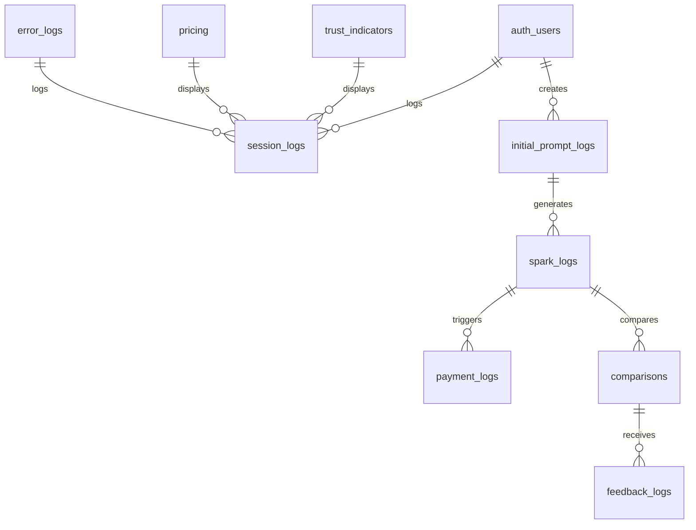

# Data Model and Schema Definition - CanAI Emotional Sovereignty Platform

## Purpose

Specifies Supabase schemas and relationships for data integrity. Prevents data inconsistencies by
enforcing strict constraints and Row-Level Security (RLS).

## Structure

- **ER Diagram**: Visual of all tables and relationships.
- **Table Definitions**: Columns, constraints, RLS policies.
- **Indexes**: Query performance optimizations.
- **Purging**: GDPR/CCPA compliance.
- **Seed Data**: Initial data for testing.

## ER Diagram



## Table Definitions

### trust_indicators

```sql
CREATE TABLE trust_indicators (
  id UUID PRIMARY KEY DEFAULT gen_random_uuid(),
  text TEXT NOT NULL,
  created_at TIMESTAMPTZ DEFAULT now(),
  INDEX idx_trust_indicators_text (text)
);
```

### pricing

```sql
CREATE TABLE pricing (
  id UUID PRIMARY KEY DEFAULT gen_random_uuid(),
  product_track TEXT CHECK (product_track IN ('business_builder', 'social_email', 'site_audit')),
  price NUMERIC NOT NULL,
  description TEXT NOT NULL,
  created_at TIMESTAMPTZ DEFAULT now(),
  INDEX idx_pricing_product_track (product_track)
);
```

### session_logs

```sql
CREATE TABLE session_logs (
  id UUID PRIMARY KEY DEFAULT gen_random_uuid(),
  user_id UUID REFERENCES auth.users(id) ON DELETE SET NULL,
  interaction_type TEXT CHECK (interaction_type IN ('pricing_modal_open', 'card_click', 'sample_view', 'preview_view', 'reset_click')),
  interaction_details JSONB,
  created_at TIMESTAMPTZ DEFAULT now(),
  INDEX idx_session_logs_interaction_type (interaction_type)
);
CREATE POLICY session_logs_rls ON session_logs FOR ALL TO authenticated USING (auth.uid() = user_id);
```

### initial_prompt_logs

```sql
CREATE TABLE initial_prompt_logs (
  id UUID PRIMARY KEY DEFAULT gen_random_uuid(),
  user_id UUID REFERENCES auth.users(id) ON DELETE SET NULL,
  payload JSONB NOT NULL,
  trust_score NUMERIC CHECK (trust_score BETWEEN 0 AND 100),
  other_type TEXT CHECK (other_type ~ '^[a-zA-Z0-9\s,.]{1,100}$'),
  custom_tone TEXT CHECK (custom_tone ~ '^[a-zA-Z0-9\s]{1,50}$'),
  created_at TIMESTAMPTZ DEFAULT now(),
  INDEX idx_initial_prompt_logs_user_id (user_id),
  INDEX idx_initial_prompt_logs_trust_score (trust_score)
);
CREATE POLICY initial_prompt_logs_rls ON initial_prompt_logs FOR ALL TO authenticated USING (auth.uid() = user_id);
```

### spark_logs

```sql
CREATE TABLE spark_logs (
  id UUID PRIMARY KEY DEFAULT gen_random_uuid(),
  initial_prompt_id UUID REFERENCES initial_prompt_logs(id) ON DELETE CASCADE,
  user_id UUID REFERENCES auth.users(id) ON DELETE SET NULL,
  selected_spark JSONB NOT NULL,
  product_track TEXT CHECK (product_track IN ('business_builder', 'social_email', 'site_audit')),
  feedback TEXT,
  attempt_count INTEGER CHECK (attempt_count BETWEEN 1 AND 4),
  trust_score NUMERIC CHECK (trust_score BETWEEN 0 AND 100),
  created_at TIMESTAMPTZ DEFAULT now(),
  INDEX idx_spark_logs_initial_prompt_id (initial_prompt_id),
  INDEX idx_spark_logs_product_track (product_track),
  INDEX idx_spark_logs_feedback (feedback)
);
CREATE POLICY spark_logs_rls ON spark_logs FOR ALL TO authenticated USING (auth.uid() = user_id);
```

### payment_logs

```sql
CREATE TABLE payment_logs (
  id UUID PRIMARY KEY DEFAULT gen_random_uuid(),
  spark_log_id UUID REFERENCES spark_logs(id) ON DELETE CASCADE,
  user_id UUID REFERENCES auth.users(id) ON DELETE SET NULL,
  session_id TEXT NOT NULL,
  amount NUMERIC NOT NULL,
  status TEXT CHECK (status IN ('success', 'failed', 'refunded')),
  created_at TIMESTAMPTZ DEFAULT now(),
  INDEX idx_payment_logs_spark_log_id (spark_log_id)
);
CREATE POLICY payment_logs_rls ON payment_logs FOR ALL TO authenticated USING (auth.uid() = user_id);
```

### comparisons

```sql
CREATE TABLE comparisons (
  id UUID PRIMARY KEY DEFAULT gen_random_uuid(),
  spark_log_id UUID REFERENCES spark_logs(id) ON DELETE CASCADE,
  user_id UUID REFERENCES auth.users(id) ON DELETE SET NULL,
  canai_output TEXT NOT NULL,
  generic_output TEXT NOT NULL,
  trust_delta NUMERIC CHECK (trust_delta BETWEEN 0 AND 5),
  emotional_resonance JSONB,
  created_at TIMESTAMPTZ DEFAULT now(),
  INDEX idx_comparisons_spark_log_id (spark_log_id)
);
CREATE POLICY comparisons_rls ON comparisons FOR ALL TO authenticated USING (auth.uid() = user_id);
```

### feedback_logs

```sql
CREATE TABLE feedback_logs (
  id UUID PRIMARY KEY DEFAULT gen_random_uuid(),
  comparison_id UUID REFERENCES comparisons(id) ON DELETE CASCADE,
  user_id UUID REFERENCES auth.users(id) ON DELETE SET NULL,
  rating INTEGER CHECK (rating BETWEEN 1 AND 5),
  comments TEXT,
  share_consent BOOLEAN DEFAULT false,
  created_at TIMESTAMPTZ DEFAULT now(),
  INDEX idx_feedback_logs_comparison_id (comparison_id)
);
CREATE POLICY feedback_logs_rls ON feedback_logs FOR ALL TO authenticated USING (auth.uid() = user_id);
```

### error_logs

```sql
CREATE TABLE error_logs (
  id UUID PRIMARY KEY DEFAULT gen_random_uuid(),
  user_id UUID REFERENCES auth.users(id) ON DELETE SET NULL,
  error_type TEXT CHECK (error_type IN ('token_limit', 'hume_fallback', 'stripe_failure', 'low_confidence')),
  details JSONB,
  created_at TIMESTAMPTZ DEFAULT now(),
  INDEX idx_error_logs_error_type (error_type)
);
CREATE POLICY error_logs_rls ON error_logs FOR ALL TO authenticated USING (auth.uid() = user_id);
```

## Indexes

- `idx_trust_indicators_text`: Optimizes trust indicator queries.
- `idx_pricing_product_track`: Speeds up pricing lookups.
- `idx_session_logs_interaction_type`: Enhances interaction log queries.
- `idx_initial_prompt_logs_trust_score`: Optimizes trust score filtering.
- `idx_spark_logs_attempt_count`: Improves spark regeneration queries.
- `idx_payment_logs_spark_log_id`: Speeds up payment lookups.
- `idx_comparisons_spark_log_id`: Enhances comparison queries.
- `idx_feedback_logs_comparison_id`: Optimizes feedback retrieval.

## Purging

- Data purged after 24 months of inactivity via Supabase `pg_cron` (`databases/cron/purge.sql`).
- Purge job: `DELETE FROM {table} WHERE created_at < now() - interval '24 months'` for all
  user-related tables.

## Seed Data

- **trust_indicators**: `{ "text": "500+ plans created" }`
- **pricing**:
  `{ "product_track": "business_builder", "price": 99, "description": "700–800-word plan" }`
- Used for testing via `databases/seed/`.
