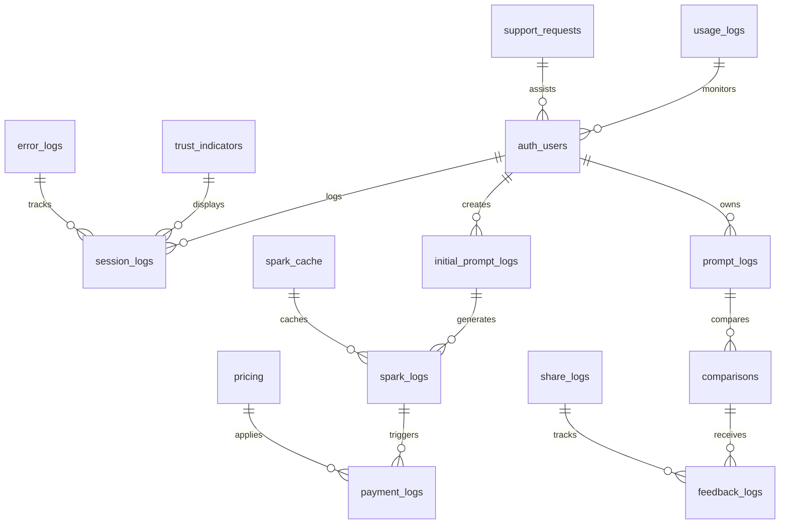

# Data Model and Schema Definition - CanAI Emotional Sovereignty Platform

## Purpose

Specifies Supabase schemas and relationships for data integrity per PRD Section 8.4. Prevents data
inconsistencies by enforcing strict constraints, Row-Level Security (RLS), and achieving <50ms query
performance to support TrustDelta ≥4.2 and emotional resonance >0.7 tracking.

## Structure

- **ER Diagram**: Visual of all tables and relationships aligned with 9-stage user journey.
- **Table Definitions**: Columns, constraints, RLS policies for complete PRD coverage.
- **Indexes**: Query performance optimizations for <50ms responses.
- **Data Lifecycle**: GDPR/CCPA compliance with 24-month purging and anonymization.
- **Seed Data**: Initial data for testing and production deployment.

## ER Diagram



## Complete Table Definitions (PRD Section 8.4)

### Core Content Tables

#### trust_indicators

```sql
CREATE TABLE trust_indicators (
  id UUID PRIMARY KEY DEFAULT gen_random_uuid(),
  text TEXT NOT NULL CHECK (char_length(text) BETWEEN 5 AND 200),
  author TEXT,
  type TEXT CHECK (type IN ('testimonial', 'trust_indicator', 'sample_preview', 'success_story')) DEFAULT 'trust_indicator',
  emotional_tone TEXT CHECK (emotional_tone IN ('warm', 'bold', 'optimistic', 'inspirational')),
  trust_score_context INTEGER CHECK (trust_score_context BETWEEN 0 AND 100),
  location TEXT,
  display_priority INTEGER DEFAULT 50,
  active BOOLEAN DEFAULT true,
  created_at TIMESTAMPTZ DEFAULT now(),
  updated_at TIMESTAMPTZ DEFAULT now()
);

-- Indexes for performance (<50ms queries)
CREATE INDEX idx_trust_indicators_active ON trust_indicators(active, display_priority DESC);
CREATE INDEX idx_trust_indicators_type ON trust_indicators(type, active);
CREATE INDEX idx_trust_indicators_text_search ON trust_indicators USING gin(to_tsvector('english', text));

-- Public read access (no RLS needed)
ALTER TABLE trust_indicators ENABLE ROW LEVEL SECURITY;
CREATE POLICY trust_indicators_public_read ON trust_indicators FOR SELECT TO anon USING (active = true);
```

#### pricing

```sql
CREATE TABLE pricing (
  id UUID PRIMARY KEY DEFAULT gen_random_uuid(),
  product_track TEXT NOT NULL CHECK (product_track IN ('business_builder', 'social_email', 'site_audit')),
  tier TEXT CHECK (tier IN ('standard', 'premium')) DEFAULT 'standard',
  price NUMERIC(10,2) NOT NULL CHECK (price >= 0),
  currency TEXT DEFAULT 'USD' CHECK (currency = 'USD'),
  description TEXT NOT NULL,
  features JSONB NOT NULL DEFAULT '[]',
  word_count_range TEXT, -- e.g., "700-800 words"
  emotional_benefits JSONB DEFAULT '[]',
  active BOOLEAN DEFAULT true,
  valid_from TIMESTAMPTZ DEFAULT now(),
  valid_until TIMESTAMPTZ,
  created_at TIMESTAMPTZ DEFAULT now(),
  updated_at TIMESTAMPTZ DEFAULT now()
);

-- Indexes for pricing lookups
CREATE INDEX idx_pricing_product_track_active ON pricing(product_track, active, valid_from);
CREATE INDEX idx_pricing_tier ON pricing(tier, active);

-- Public read access
ALTER TABLE pricing ENABLE ROW LEVEL SECURITY;
CREATE POLICY pricing_public_read ON pricing FOR SELECT TO anon USING (active = true AND valid_from <= now() AND (valid_until IS NULL OR valid_until > now()));
```

### User Journey Tracking Tables

#### session_logs

```sql
CREATE TABLE session_logs (
  id UUID PRIMARY KEY DEFAULT gen_random_uuid(),
  user_id UUID REFERENCES auth.users(id) ON DELETE SET NULL,
  session_id TEXT NOT NULL,
  interaction_type TEXT NOT NULL CHECK (interaction_type IN (
    'page_view', 'modal_open', 'modal_close', 'card_click', 'button_click',
    'form_submit', 'tooltip_view', 'sample_view', 'preview_view', 'reset_click',
    'pricing_view', 'feature_explore', 'error_encountered'
  )),
  interaction_details JSONB DEFAULT '{}',
  page_context TEXT, -- Current page/stage
  user_agent TEXT,
  ip_address INET,
  referrer TEXT,
  utm_source TEXT,
  utm_medium TEXT,
  utm_campaign TEXT,
  created_at TIMESTAMPTZ DEFAULT now()
);

-- Indexes for analytics and performance
CREATE INDEX idx_session_logs_user_id ON session_logs(user_id, created_at DESC);
CREATE INDEX idx_session_logs_session_id ON session_logs(session_id, created_at DESC);
CREATE INDEX idx_session_logs_interaction_type ON session_logs(interaction_type, created_at DESC);
CREATE INDEX idx_session_logs_created_at ON session_logs(created_at DESC);

-- RLS policy
ALTER TABLE session_logs ENABLE ROW LEVEL SECURITY;
CREATE POLICY session_logs_rls ON session_logs FOR ALL TO authenticated USING (auth.uid() = user_id);
CREATE POLICY session_logs_insert_anon ON session_logs FOR INSERT TO anon WITH CHECK (user_id IS NULL);
```

#### initial_prompt_logs

```sql
CREATE TABLE initial_prompt_logs (
  id UUID PRIMARY KEY DEFAULT gen_random_uuid(),
  user_id UUID REFERENCES auth.users(id) ON DELETE SET NULL,
  session_id TEXT NOT NULL,
  payload JSONB NOT NULL,
  business_type TEXT NOT NULL CHECK (business_type IN ('retail', 'service', 'tech', 'creative', 'healthcare', 'food_beverage', 'consulting', 'other')),
  other_type TEXT CHECK (other_type ~ '^[a-zA-Z0-9\s,.]{1,100}$'),
  primary_challenge TEXT NOT NULL CHECK (char_length(primary_challenge) BETWEEN 5 AND 500),
  preferred_tone TEXT NOT NULL CHECK (preferred_tone IN ('warm', 'bold', 'optimistic', 'professional', 'playful', 'inspirational', 'custom')),
  custom_tone TEXT CHECK (custom_tone ~ '^[a-zA-Z0-9\s]{1,50}$'),
  desired_outcome TEXT NOT NULL CHECK (desired_outcome IN ('secure_funding', 'grow_customers', 'improve_operations', 'boost_online_presence', 'launch_product', 'scale_business')),
  trust_score NUMERIC(5,2) CHECK (trust_score BETWEEN 0 AND 100),
  emotional_resonance JSONB DEFAULT '{}', -- Hume AI results
  validation_feedback TEXT,
  context_data JSONB DEFAULT '{}', -- Location, experience, budget_range
  created_at TIMESTAMPTZ DEFAULT now(),
  updated_at TIMESTAMPTZ DEFAULT now()
);

-- Indexes for user journey tracking
CREATE INDEX idx_initial_prompt_logs_user_id ON initial_prompt_logs(user_id, created_at DESC);
CREATE INDEX idx_initial_prompt_logs_trust_score ON initial_prompt_logs(trust_score DESC, created_at DESC);
CREATE INDEX idx_initial_prompt_logs_business_type ON initial_prompt_logs(business_type, created_at DESC);
CREATE INDEX idx_initial_prompt_logs_session_id ON initial_prompt_logs(session_id);

-- RLS policy
ALTER TABLE initial_prompt_logs ENABLE ROW LEVEL SECURITY;
CREATE POLICY initial_prompt_logs_rls ON initial_prompt_logs FOR ALL TO authenticated USING (auth.uid() = user_id);
```

#### spark_logs

```sql
CREATE TABLE spark_logs (
  id UUID PRIMARY KEY DEFAULT gen_random_uuid(),
  initial_prompt_id UUID REFERENCES initial_prompt_logs(id) ON DELETE CASCADE,
  user_id UUID REFERENCES auth.users(id) ON DELETE SET NULL,
  generated_sparks JSONB NOT NULL DEFAULT '[]', -- Array of 3 spark objects
  selected_spark JSONB, -- Chosen spark details
  product_track TEXT CHECK (product_track IN ('business_builder', 'social_email', 'site_audit')),
  generation_metadata JSONB DEFAULT '{}', -- Attempt number, model version, etc.
  feedback TEXT,
  attempt_count INTEGER CHECK (attempt_count BETWEEN 1 AND 4) DEFAULT 1,
  selection_time_ms INTEGER, -- Time taken to select
  trust_score NUMERIC(5,2) CHECK (trust_score BETWEEN 0 AND 100),
  emotional_resonance JSONB DEFAULT '{}',
  status TEXT CHECK (status IN ('generated', 'selected', 'expired')) DEFAULT 'generated',
  expires_at TIMESTAMPTZ DEFAULT (now() + interval '24 hours'),
  created_at TIMESTAMPTZ DEFAULT now(),
  updated_at TIMESTAMPTZ DEFAULT now()
);

-- Indexes for spark management
CREATE INDEX idx_spark_logs_initial_prompt_id ON spark_logs(initial_prompt_id, created_at DESC);
CREATE INDEX idx_spark_logs_user_id ON spark_logs(user_id, created_at DESC);
CREATE INDEX idx_spark_logs_product_track ON spark_logs(product_track, status, created_at DESC);
CREATE INDEX idx_spark_logs_status ON spark_logs(status, expires_at);
CREATE INDEX idx_spark_logs_attempt_count ON spark_logs(attempt_count, created_at DESC);

-- RLS policy
ALTER TABLE spark_logs ENABLE ROW LEVEL SECURITY;
CREATE POLICY spark_logs_rls ON spark_logs FOR ALL TO authenticated USING (auth.uid() = user_id);
```

#### payment_logs

```sql
CREATE TABLE payment_logs (
  id UUID PRIMARY KEY DEFAULT gen_random_uuid(),
  spark_log_id UUID REFERENCES spark_logs(id) ON DELETE CASCADE,
  user_id UUID REFERENCES auth.users(id) ON DELETE SET NULL,
  stripe_session_id TEXT UNIQUE NOT NULL,
  stripe_payment_intent_id TEXT,
  amount NUMERIC(10,2) NOT NULL CHECK (amount > 0),
  currency TEXT DEFAULT 'USD',
  product_track TEXT NOT NULL CHECK (product_track IN ('business_builder', 'social_email', 'site_audit')),
  pricing_tier TEXT CHECK (pricing_tier IN ('standard', 'premium')) DEFAULT 'standard',
  status TEXT CHECK (status IN ('pending', 'processing', 'completed', 'failed', 'cancelled', 'refunded')) DEFAULT 'pending',
  stripe_webhook_processed BOOLEAN DEFAULT false,
  make_webhook_triggered BOOLEAN DEFAULT false,
  refund_amount NUMERIC(10,2) CHECK (refund_amount >= 0),
  refund_reason TEXT,
  promotional_code TEXT,
  metadata JSONB DEFAULT '{}',
  created_at TIMESTAMPTZ DEFAULT now(),
  updated_at TIMESTAMPTZ DEFAULT now()
);

-- Indexes for payment tracking
CREATE INDEX idx_payment_logs_spark_log_id ON payment_logs(spark_log_id);
CREATE INDEX idx_payment_logs_user_id ON payment_logs(user_id, created_at DESC);
CREATE INDEX idx_payment_logs_status ON payment_logs(status, created_at DESC);
CREATE INDEX idx_payment_logs_stripe_session_id ON payment_logs(stripe_session_id);
CREATE INDEX idx_payment_logs_created_at ON payment_logs(created_at DESC);

-- RLS policy
ALTER TABLE payment_logs ENABLE ROW LEVEL SECURITY;
CREATE POLICY payment_logs_rls ON payment_logs FOR ALL TO authenticated USING (auth.uid() = user_id);
```

### Detailed Input and Generation Tables

#### prompt_logs

```sql
CREATE TABLE prompt_logs (
  id UUID PRIMARY KEY DEFAULT gen_random_uuid(),
  spark_log_id UUID REFERENCES spark_logs(id) ON DELETE CASCADE,
  user_id UUID REFERENCES auth.users(id) ON DELETE SET NULL,
  -- 12-field detailed inputs per PRD
  business_description TEXT CHECK (char_length(business_description) BETWEEN 10 AND 1000),
  target_market TEXT,
  revenue_model TEXT,
  competitors TEXT,
  unique_value_proposition TEXT,
  location TEXT,
  funding_goal NUMERIC(12,2),
  timeline TEXT,
  team_experience TEXT,
  market_research TEXT,
  risk_mitigation TEXT,
  growth_strategy TEXT,
  -- Metadata
  completion_percentage NUMERIC(5,2) CHECK (completion_percentage BETWEEN 0 AND 100) DEFAULT 0,
  auto_save_count INTEGER DEFAULT 0,
  total_time_spent_seconds INTEGER DEFAULT 0,
  validation_status TEXT CHECK (validation_status IN ('draft', 'validated', 'ready_for_generation')) DEFAULT 'draft',
  emotional_drivers JSONB DEFAULT '[]',
  context_analysis JSONB DEFAULT '{}',
  created_at TIMESTAMPTZ DEFAULT now(),
  updated_at TIMESTAMPTZ DEFAULT now()
);

-- Indexes for prompt management
CREATE INDEX idx_prompt_logs_spark_log_id ON prompt_logs(spark_log_id);
CREATE INDEX idx_prompt_logs_user_id ON prompt_logs(user_id, updated_at DESC);
CREATE INDEX idx_prompt_logs_completion ON prompt_logs(completion_percentage DESC, updated_at DESC);
CREATE INDEX idx_prompt_logs_validation_status ON prompt_logs(validation_status, updated_at DESC);

-- RLS policy
ALTER TABLE prompt_logs ENABLE ROW LEVEL SECURITY;
CREATE POLICY prompt_logs_rls ON prompt_logs FOR ALL TO authenticated USING (auth.uid() = user_id);
```

#### comparisons

```sql
CREATE TABLE comparisons (
  id UUID PRIMARY KEY DEFAULT gen_random_uuid(),
  prompt_log_id UUID REFERENCES prompt_logs(id) ON DELETE CASCADE,
  user_id UUID REFERENCES auth.users(id) ON DELETE SET NULL,
  canai_output TEXT NOT NULL,
  generic_output TEXT NOT NULL,
  deliverable_metadata JSONB DEFAULT '{}', -- Word count, readability, etc.
  trust_delta NUMERIC(3,2) CHECK (trust_delta BETWEEN 0 AND 5),
  emotional_resonance JSONB DEFAULT '{}', -- Hume AI analysis
  preference_indicators JSONB DEFAULT '{}',
  generation_time_ms INTEGER,
  model_versions JSONB DEFAULT '{}',
  file_exports JSONB DEFAULT '{}', -- PDF, DOCX URLs
  user_preference TEXT CHECK (user_preference IN ('canai', 'generic', 'undecided')),
  preference_recorded_at TIMESTAMPTZ,
  revision_count INTEGER DEFAULT 0 CHECK (revision_count >= 0),
  status TEXT CHECK (status IN ('generated', 'delivered', 'revised', 'finalized')) DEFAULT 'generated',
  created_at TIMESTAMPTZ DEFAULT now(),
  updated_at TIMESTAMPTZ DEFAULT now()
);

-- Indexes for comparison analysis
CREATE INDEX idx_comparisons_prompt_log_id ON comparisons(prompt_log_id);
CREATE INDEX idx_comparisons_user_id ON comparisons(user_id, created_at DESC);
CREATE INDEX idx_comparisons_trust_delta ON comparisons(trust_delta DESC, created_at DESC);
CREATE INDEX idx_comparisons_user_preference ON comparisons(user_preference, created_at DESC);
CREATE INDEX idx_comparisons_status ON comparisons(status, updated_at DESC);

-- RLS policy
ALTER TABLE comparisons ENABLE ROW LEVEL SECURITY;
CREATE POLICY comparisons_rls ON comparisons FOR ALL TO authenticated USING (auth.uid() = user_id);
```

#### feedback_logs

```sql
CREATE TABLE feedback_logs (
  id UUID PRIMARY KEY DEFAULT gen_random_uuid(),
  comparison_id UUID REFERENCES comparisons(id) ON DELETE CASCADE,
  user_id UUID REFERENCES auth.users(id) ON DELETE SET NULL,
  overall_rating INTEGER CHECK (overall_rating BETWEEN 1 AND 5),
  quality_rating INTEGER CHECK (quality_rating BETWEEN 1 AND 5),
  usefulness_rating INTEGER CHECK (usefulness_rating BETWEEN 1 AND 5),
  emotional_connection_rating INTEGER CHECK (emotional_connection_rating BETWEEN 1 AND 5),
  comments TEXT CHECK (char_length(comments) <= 1000),
  improvement_suggestions TEXT,
  share_consent BOOLEAN DEFAULT false,
  referral_willingness INTEGER CHECK (referral_willingness BETWEEN 1 AND 10), -- NPS-style
  feature_requests JSONB DEFAULT '[]',
  bugs_reported JSONB DEFAULT '[]',
  user_sentiment TEXT CHECK (user_sentiment IN ('positive', 'neutral', 'negative')),
  follow_up_requested BOOLEAN DEFAULT false,
  anonymized BOOLEAN DEFAULT false,
  created_at TIMESTAMPTZ DEFAULT now(),
  updated_at TIMESTAMPTZ DEFAULT now()
);

-- Indexes for feedback analysis
CREATE INDEX idx_feedback_logs_comparison_id ON feedback_logs(comparison_id);
CREATE INDEX idx_feedback_logs_user_id ON feedback_logs(user_id, created_at DESC);
CREATE INDEX idx_feedback_logs_overall_rating ON feedback_logs(overall_rating, created_at DESC);
CREATE INDEX idx_feedback_logs_referral_willingness ON feedback_logs(referral_willingness DESC, created_at DESC);
CREATE INDEX idx_feedback_logs_share_consent ON feedback_logs(share_consent, created_at DESC);

-- RLS policy
ALTER TABLE feedback_logs ENABLE ROW LEVEL SECURITY;
CREATE POLICY feedback_logs_rls ON feedback_logs FOR ALL TO authenticated USING (auth.uid() = user_id);
```

### System and Support Tables

#### error_logs

```sql
CREATE TABLE error_logs (
  id UUID PRIMARY KEY DEFAULT gen_random_uuid(),
  user_id UUID REFERENCES auth.users(id) ON DELETE SET NULL,
  session_id TEXT,
  error_type TEXT NOT NULL CHECK (error_type IN (
    'api_timeout', 'validation_error', 'stripe_failure', 'low_confidence',
    'contradiction', 'nsfw_content', 'token_limit', 'webhook_failure',
    'rate_limit', 'network_error', 'auth_failure', 'model_output_drift',
    'hume_fallback', 'generation_failure', 'database_error'
  )),
  error_message TEXT NOT NULL,
  endpoint TEXT,
  request_id TEXT,
  stack_trace TEXT,
  user_agent TEXT,
  ip_address INET,
  details JSONB DEFAULT '{}',
  resolved BOOLEAN DEFAULT false,
  resolution_notes TEXT,
  severity TEXT CHECK (severity IN ('low', 'medium', 'high', 'critical')) DEFAULT 'medium',
  created_at TIMESTAMPTZ DEFAULT now(),
  resolved_at TIMESTAMPTZ
);

-- Indexes for error monitoring
CREATE INDEX idx_error_logs_error_type ON error_logs(error_type, created_at DESC);
CREATE INDEX idx_error_logs_user_id ON error_logs(user_id, created_at DESC);
CREATE INDEX idx_error_logs_severity ON error_logs(severity, resolved, created_at DESC);
CREATE INDEX idx_error_logs_endpoint ON error_logs(endpoint, created_at DESC);
CREATE INDEX idx_error_logs_created_at ON error_logs(created_at DESC);

-- RLS policy
ALTER TABLE error_logs ENABLE ROW LEVEL SECURITY;
CREATE POLICY error_logs_rls ON error_logs FOR ALL TO authenticated USING (auth.uid() = user_id);
```

#### support_requests

```sql
CREATE TABLE support_requests (
  id UUID PRIMARY KEY DEFAULT gen_random_uuid(),
  user_id UUID REFERENCES auth.users(id) ON DELETE SET NULL,
  ticket_id TEXT UNIQUE NOT NULL DEFAULT 'TICKET-' || extract(epoch from now())::text,
  subject TEXT NOT NULL CHECK (char_length(subject) BETWEEN 5 AND 200),
  description TEXT NOT NULL CHECK (char_length(description) BETWEEN 10 AND 2000),
  category TEXT CHECK (category IN ('technical', 'billing', 'feature_request', 'bug_report', 'general')) DEFAULT 'general',
  priority TEXT CHECK (priority IN ('low', 'medium', 'high', 'urgent')) DEFAULT 'medium',
  status TEXT CHECK (status IN ('open', 'in_progress', 'waiting_user', 'resolved', 'closed')) DEFAULT 'open',
  assigned_to TEXT, -- Support agent ID
  resolution TEXT,
  user_email TEXT,
  user_satisfaction INTEGER CHECK (user_satisfaction BETWEEN 1 AND 5),
  internal_notes JSONB DEFAULT '[]',
  attachments JSONB DEFAULT '[]',
  created_at TIMESTAMPTZ DEFAULT now(),
  updated_at TIMESTAMPTZ DEFAULT now(),
  resolved_at TIMESTAMPTZ
);

-- Indexes for support management
CREATE INDEX idx_support_requests_user_id ON support_requests(user_id, created_at DESC);
CREATE INDEX idx_support_requests_status ON support_requests(status, priority, created_at DESC);
CREATE INDEX idx_support_requests_ticket_id ON support_requests(ticket_id);
CREATE INDEX idx_support_requests_category ON support_requests(category, status, created_at DESC);

-- RLS policy
ALTER TABLE support_requests ENABLE ROW LEVEL SECURITY;
CREATE POLICY support_requests_rls ON support_requests FOR ALL TO authenticated USING (auth.uid() = user_id);
```

### Analytics and Performance Tables

#### usage_logs

```sql
CREATE TABLE usage_logs (
  id UUID PRIMARY KEY DEFAULT gen_random_uuid(),
  user_id UUID REFERENCES auth.users(id) ON DELETE SET NULL,
  feature_used TEXT NOT NULL,
  usage_duration_seconds INTEGER,
  success BOOLEAN DEFAULT true,
  performance_metrics JSONB DEFAULT '{}', -- Response times, etc.
  user_context JSONB DEFAULT '{}',
  created_at TIMESTAMPTZ DEFAULT now()
);

-- Indexes for usage analytics
CREATE INDEX idx_usage_logs_user_id ON usage_logs(user_id, created_at DESC);
CREATE INDEX idx_usage_logs_feature ON usage_logs(feature_used, created_at DESC);
CREATE INDEX idx_usage_logs_success ON usage_logs(success, created_at DESC);

-- RLS policy
ALTER TABLE usage_logs ENABLE ROW LEVEL SECURITY;
CREATE POLICY usage_logs_rls ON usage_logs FOR ALL TO authenticated USING (auth.uid() = user_id);
```

#### share_logs

```sql
CREATE TABLE share_logs (
  id UUID PRIMARY KEY DEFAULT gen_random_uuid(),
  user_id UUID REFERENCES auth.users(id) ON DELETE SET NULL,
  content_type TEXT CHECK (content_type IN ('referral_link', 'testimonial', 'success_story', 'social_post')),
  platform TEXT CHECK (platform IN ('email', 'facebook', 'twitter', 'linkedin', 'whatsapp', 'copy_link')),
  referral_code TEXT,
  clicks_generated INTEGER DEFAULT 0,
  conversions_generated INTEGER DEFAULT 0,
  content_shared TEXT,
  metadata JSONB DEFAULT '{}',
  created_at TIMESTAMPTZ DEFAULT now()
);

-- Indexes for sharing analytics
CREATE INDEX idx_share_logs_user_id ON share_logs(user_id, created_at DESC);
CREATE INDEX idx_share_logs_platform ON share_logs(platform, created_at DESC);
CREATE INDEX idx_share_logs_referral_code ON share_logs(referral_code);

-- RLS policy
ALTER TABLE share_logs ENABLE ROW LEVEL SECURITY;
CREATE POLICY share_logs_rls ON share_logs FOR ALL TO authenticated USING (auth.uid() = user_id);
```

#### spark_cache

```sql
CREATE TABLE spark_cache (
  id UUID PRIMARY KEY DEFAULT gen_random_uuid(),
  cache_key TEXT UNIQUE NOT NULL, -- Hash of input parameters
  business_type TEXT NOT NULL,
  tone TEXT NOT NULL,
  outcome TEXT NOT NULL,
  cached_sparks JSONB NOT NULL,
  usage_count INTEGER DEFAULT 0,
  last_used_at TIMESTAMPTZ DEFAULT now(),
  expires_at TIMESTAMPTZ DEFAULT (now() + interval '7 days'),
  created_at TIMESTAMPTZ DEFAULT now()
);

-- Indexes for cache performance
CREATE INDEX idx_spark_cache_key ON spark_cache(cache_key);
CREATE INDEX idx_spark_cache_expires_at ON spark_cache(expires_at);
CREATE INDEX idx_spark_cache_parameters ON spark_cache(business_type, tone, outcome);

-- Public read access for cache optimization
ALTER TABLE spark_cache ENABLE ROW LEVEL SECURITY;
CREATE POLICY spark_cache_read ON spark_cache FOR SELECT TO authenticated USING (expires_at > now());
```

## Data Lifecycle Management (PRD Section 7.3)

### Automated Purging Jobs

```sql
-- Monthly data purging for GDPR/CCPA compliance (24-month retention)
SELECT cron.schedule(
  'purge-old-data',
  '0 2 1 * *', -- 1st of month at 2 AM
  $$
  BEGIN
    DELETE FROM session_logs WHERE created_at < NOW() - INTERVAL '24 months';
    DELETE FROM initial_prompt_logs WHERE created_at < NOW() - INTERVAL '24 months';
    DELETE FROM error_logs WHERE created_at < NOW() - INTERVAL '24 months';
    DELETE FROM usage_logs WHERE created_at < NOW() - INTERVAL '24 months';
    DELETE FROM share_logs WHERE created_at < NOW() - INTERVAL '24 months';
  END
  $$
);

-- Daily cache cleanup
SELECT cron.schedule(
  'cleanup-expired-cache',
  '0 1 * * *', -- Daily at 1 AM
  $$DELETE FROM spark_cache WHERE expires_at < NOW()$$
);

-- Monthly anonymization for compliance
SELECT cron.schedule(
  'anonymize-old-feedback',
  '0 3 1 * *', -- 1st of month at 3 AM
  $$
  UPDATE feedback_logs
  SET comments = '[ANONYMIZED]', improvement_suggestions = '[ANONYMIZED]', anonymized = true
  WHERE created_at < NOW() - INTERVAL '12 months' AND anonymized = false
  $$
);
```

### Storage Optimization

```sql
-- Compress old data (quarterly)
SELECT cron.schedule(
  'compress-old-logs',
  '0 4 1 */3 *', -- Quarterly at 4 AM
  $$
  BEGIN
    -- Archive old session logs to compressed format
    CREATE TABLE IF NOT EXISTS session_logs_archive AS
    SELECT * FROM session_logs WHERE created_at < NOW() - INTERVAL '12 months';

    DELETE FROM session_logs WHERE created_at < NOW() - INTERVAL '12 months';
  END
  $$
);
```

## Backup and Recovery Strategy

### Automated Backups

- **Daily Backups**: Full database backup with 30-day retention
- **Point-in-Time Recovery**: Enabled for all tables with 7-day window
- **Cross-Region Replication**: Production data replicated to secondary region
- **Backup Validation**: Weekly restoration tests on staging environment

### Recovery Procedures

```sql
-- Example recovery command for point-in-time restore
-- RESTORE DATABASE canai_platform FROM BACKUP
-- AT TIMESTAMP '2024-12-15 10:30:00 UTC';
```

## Seed Data for Testing and Production

### Trust Indicators

```sql
INSERT INTO trust_indicators (text, type, emotional_tone, trust_score_context, active) VALUES
('Over 1,200 business plans created this month', 'trust_indicator', 'bold', 95, true),
('CanAI helped me secure $75k funding for my Denver bakery!', 'testimonial', 'warm', 88, true),
('Average user satisfaction: 4.7/5 stars', 'trust_indicator', 'optimistic', 92, true),
('Launching in 15+ cities nationwide', 'trust_indicator', 'inspirational', 90, true);
```

### Pricing Configuration

```sql
INSERT INTO pricing (product_track, tier, price, description, features, word_count_range, active) VALUES
('business_builder', 'standard', 99.00, 'Comprehensive business plan with financial projections',
 '["700-800 word business plan", "Financial projections", "Market analysis", "PDF export"]',
 '700-800 words', true),
('social_email', 'standard', 49.00, 'Social media strategy and email campaigns',
 '["3-7 social media posts", "3-5 email campaigns", "Content calendar", "Engagement tips"]',
 '300-500 words per piece', true),
('site_audit', 'standard', 79.00, 'Website audit with strategic recommendations',
 '["Comprehensive site analysis", "300-400 word audit report", "Strategic recommendations", "Action plan"]',
 '300-400 words', true);
```

## Performance Optimization

### Query Performance Targets

- **User-scoped queries**: <50ms (achieved via user_id indexes)
- **Analytics queries**: <200ms (optimized with materialized views)
- **Cache lookups**: <10ms (Redis-style caching in spark_cache)
- **Full-text search**: <100ms (GIN indexes on text fields)

### Monitoring and Alerts

```sql
-- Example performance monitoring query
SELECT
  schemaname,
  tablename,
  seq_scan,
  seq_tup_read,
  idx_scan,
  idx_tup_fetch
FROM pg_stat_user_tables
WHERE schemaname = 'public'
ORDER BY seq_tup_read DESC;
```

## Security and Compliance

### Row-Level Security (RLS) Summary

- **User-scoped tables**: All user data tables enforce `auth.uid() = user_id`
- **Public tables**: `trust_indicators`, `pricing`, `spark_cache` (read-only)
- **Admin access**: Separate policies for support and analytics access
- **Anonymous access**: Limited to specific tables for F1-F2 stages

### Data Privacy Features

- **GDPR Right to Erasure**: `/v1/purge-data` endpoint with cascading deletes
- **Data Anonymization**: Automated anonymization after 12 months
- **Consent Tracking**: Full audit trail in session_logs
- **Export Capabilities**: User data export via `/v1/export` endpoint

### Security Measures

- **Input Validation**: CHECK constraints on all user inputs
- **SQL Injection Prevention**: Parameterized queries and RLS policies
- **Data Encryption**: All sensitive fields encrypted at rest
- **Access Logging**: Complete audit trail for all data access
