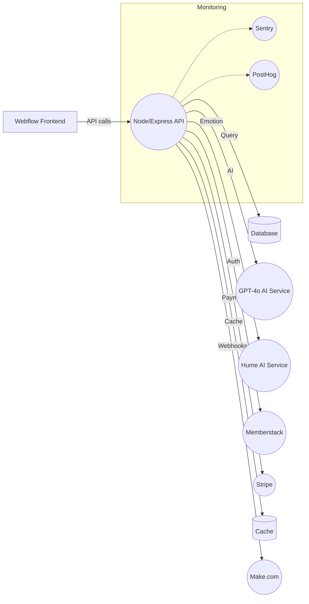

# Technical Architecture Document (TAD) - CanAI Emotional Sovereignty Platform

## Purpose

Defines the CanAI platform’s architecture, components, and integration flows to guide Cursor AI in
building a cohesive, scalable system. Prevents misaligned implementations by providing a
comprehensive blueprint.

## Structure

- **System Overview**: Architecture diagram mapping frontend, backend, and integrations.
- **Tech Stack**: Detailed versions and costs of tools/services.
- **Component Interactions**: API, webhook, and data flows for all 9 user journey stages.
- **Deployment**: Render, Heroku fallback, CI/CD, and monitoring specifics.
- **Performance and Security**: PRD-aligned targets and measures.

## System Overview

The CanAI Emotional Sovereignty Platform is a SaaS solution delivering AI-driven, emotionally
intelligent outputs (e.g., business plans, social media strategies, website audits) via a 9-stage
user journey. Hosted on Webflow (frontend) and Render (backend), it integrates Memberstack,
Supabase, Make.com, Stripe, GPT-4o, and Hume AI to ensure scalability, security, and emotional
resonance.

- **Frontend**: Webflow-based UI (`frontend/public/`), WCAG 2.2 AA compliant, serves dynamic content
  via CMS (`frontend/src/cms/`).
- **Backend**: Node.js/Express server (`backend/server.js`) orchestrates APIs (`backend/routes/`),
  webhooks (`backend/webhooks/`), and AI prompts (`backend/prompts/`).
- **Supabase**: Stores data with Row-Level Security (RLS) (`databases/`), ensuring user ownership
  and GDPR/CCPA compliance.
- **Integrations**: Stripe for payments, GPT-4o for content generation, Hume AI for emotional
  resonance, Make.com for automation, PostHog/Sentry for analytics/monitoring.

## Tech Stack

### Frontend

- **Webflow 2025**: UI hosting, CMS for pricing/samples.
- **Vite 3.0**: Build tool for responsive design.
- **TypeScript 4.9**: Frontend logic (`frontend/src/`).
- **Memberstack 2.0**: Authentication (`backend/services/memberstack.js`).

### Backend

- **Node.js 18.0, Express 4.18**: API server (`backend/server.js`).
- **TypeScript 4.9**: Type safety (`backend/`).
- **Docker 20.10**: Containerization (`docker-compose.yml`).

### Database

- **Supabase v2, PostgreSQL 14**: Data storage (`databases/`).
- **pg_cron**: Data purging after 24 months (`databases/cron/purge.sql`).

### Integrations

- **GPT-4o (OpenAI API v1)**: Content generation, $5/1M tokens, 128K tokens/req.
- **Hume AI v1**: Emotional resonance validation, $0.01/req, <500ms latency, 1000 req/day.
- **Stripe API v1**: Payment processing (`backend/services/stripe.js`).
- **Make.com v3**: Automation with scenarios (`add_project.json`, `add_client.json`).
- **PostHog v2**: Analytics (`backend/services/posthog.js`).
- **Sentry v10**: Error tracking (`backend/services/sentry.js`).

### CI/CD

- **GitHub Actions**: Build/test/deploy pipelines (`.github/workflows/`).
- **OWASP ZAP, Semgrep**: Security scans.

## Component Interactions

The platform supports a 9-stage user journey, with each stage driven by specific APIs, services, and
data flows:

1. **F1 (Discovery Hook)**: `/v1/messages` fetches trust indicators from `trust_indicators`, logged
   to `session_logs` via `/v1/log-interaction`. `/v1/generate-preview-spark` generates a free spark
   using GPT-4o.
2. **F2 (Discovery Funnel)**: `/v1/validate-input` validates inputs (e.g., `businessType`), stores
   to `initial_prompt_logs`, and uses GPT-4o/Hume AI for trust score/resonance.
   `/v1/generate-tooltip` and `/v1/detect-contradiction` enhance UX.
3. **F3 (Spark Layer)**: `/v1/generate-sparks` creates three sparks with GPT-4o, logged to
   `spark_logs`. `/v1/regenerate-sparks` allows regeneration (max 3/4 attempts).
4. **F4 (Purchase Flow)**: `/v1/stripe-session` initiates Stripe checkout, triggers
   `add_project.json` webhook, and logs to `payment_logs`. `/v1/refund` and `/v1/switch-product`
   handle post-purchase actions.
5. **F5 (Detailed Input Collection)**: `/v1/save-progress` auto-saves 12-field inputs to
   `prompt_logs`. `/v1/resume` allows resuming input collection.
6. **F6 (Intent Mirror)**: `/v1/intent-mirror` generates a summary with GPT-4o, stored in
   `prompt_logs`, achieving >85% confirmation rate.
7. **F7 (Deliverable Generation)**: `/v1/deliverable` generates outputs (e.g., 700–800-word plans)
   with GPT-4o, validated by Hume AI. `/v1/request-revision`, `/v1/regenerate-deliverable`, and
   `/v1/generation-status` manage revisions/status.
8. **F8 (SparkSplit)**: `/v1/spark-split` compares CanAI vs. generic outputs, computes TrustDelta
   (≥4.0), and logs to `comparisons`.
9. **F9 (Feedback Capture)**: `/v1/feedback` captures ratings, stored in `feedback_logs`.
   `/v1/refer` generates referral links, driving >25% social shares.

- **Security**: `/v1/consent` logs GDPR/CCPA consent, `/v1/purge-data` deletes data.
- **Admin**: `/v1/admin-metrics` provides metrics (e.g., TrustDelta trends) from `session_logs`.
- **Middleware**: Rate limiting (100 req/min, `middleware/rateLimit.js`), retries (3 attempts,
  500ms, `middleware/retry.js`), input sanitization (DOMPurify, `middleware/validation.js`).

## Deployment

### Render

- **Backend**: `canai-router.onrender.com:10000` (IPs: 52.41.36.82, 54.191.253.12, 44.226.122.3).
- **Frontend**: `canai-frontend.onrender.com`, integrated with Webflow CMS.
- **Admin Dashboard**: `canai-admin.onrender.com`, secured with Memberstack.
- Auto-scaling enabled for 10,000 concurrent users.

### Heroku

- Fallback configured in `package.json` for backend resilience.

### Health Checks

- `GET /health` (`backend/health.js`) ensures 99.9% uptime, validated by Sentry.

### CI/CD

- GitHub Actions pipelines (`.github/workflows/{build,deploy}.yml`) for build, test, and deploy.
- Rollback via tagged releases (e.g., `v1.0.0`) if deployment fails.

### Data Purging

- 24-month data retention via Supabase `pg_cron` (`databases/cron/purge.sql`).

### Monitoring

- **Sentry**: Tracks errors (e.g., API timeouts, Stripe failures) (`backend/services/sentry.js`).
- **PostHog**: Captures analytics (e.g., `funnel_step`, TrustDelta) (`backend/services/posthog.js`).
- Logs stored in `databases/error_logs` and `databases/session_logs`.

## Performance Targets

- **Page load**: <1.5s (Webflow, `frontend/public/`).
- **API response**: <200ms, optimized with Supabase indexes.
- **Spark generation**: <1.5s (`/v1/generate-sparks`).
- **Deliverable generation**: <2s (`/v1/deliverable`).
- **Error handling**: <100ms (`middleware/error.js`).
- **Uptime**: 99.9%.

## Security Measures

- **Supabase RLS**: Restricts data access to `auth.uid() = user_id` (`databases/migrations/`).
- **Encryption**: API keys stored in `supabase/vault`, rotated in `.env`.
- **Rate Limiting**: 100 req/min/IP (`middleware/rateLimit.js`).
- **Input Sanitization**: DOMPurify (`middleware/validation.js`) prevents XSS/injection.
- **CSP Headers**: `default-src 'self'` in `backend/server.js`.
- **Security Scans**: OWASP ZAP, Semgrep in CI/CD (`.github/workflows/security.yml`).
